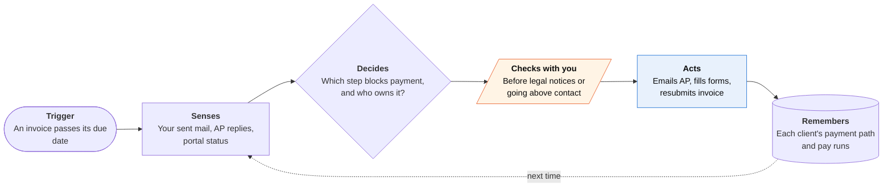

<!-- Generated by scripts/build.py from data/ideas.json. Edit the JSON, then run the script. -->

[← All ideas](../README.md) · **Whitespace** · Work & business

# W-33 · Stuck Invoice Detective

> Finds out why a big client hasn't paid (no PO, vendor not set up, wrong portal) and fixes that step.

| Difficulty | Novelty | Buildable on iOS today | Impact if it works | Horizon | Autonomy |
|---|---|---|---|---|---|
| `●●●○○` 3/5 | `●●●●○` 4/5 | `●●●○○` 3/5 | `●●●●○` 4/5 | Buildable now | L2 · Drafts, you approve |

## The moment

Your invoice to a big media company is 47 days old, and your reminders go to a producer who has left. The agent emails accounts payable and learns that the company pays only through a supplier portal, your vendor profile was never approved because the W-9 was unsigned, and the invoice needs a PO number only the budget owner can issue. It asks you to sign the W-9 on your phone and sends the rest.

## The problem

Large companies pay through accounts-payable systems that reject invoices without a PO number, an approved vendor record or the right portal. A freelancer usually knows only the creative contact, who has no idea why payment stalled. Invoicing apps send polite reminders to that same person, which doesn't fix a missing form.

## How the agent works

## iOS building blocks

- **AuthenticationServices (ASWebAuthenticationSession)** — connects Gmail or Outlook by OAuth, since iOS apps can't read the Mail app
- **Foundation Models (PrivateCloudComputeLanguageModel)** — reads long AP threads and invoice PDFs with a 32K-token context
- **PDFKit** — fills vendor forms and the W-9
- **PencilKit** — captures your signature on the phone
- **WebKit (WKWebView)** — opens the client's supplier portal in the app so you sign in yourself while the agent guides each step
- **App Intents (SnippetIntent)** — approve a drafted email from a Siri or Spotlight snippet without opening the app
- **UserNotifications** — asks for a signature or an approval when a step needs you

## What makes it hard

- Supplier portals (Coupa, SAP Ariba and many in-house ones) offer no API to one-person vendors, and signing in for the user raises terms-of-service and trust problems. The design keeps the human on portal steps; the agent writes the checklist and checks the result.
- Finding the real AP contact. Many companies use a shared inbox, a web form or a ticketing system that replies from no-reply addresses. The agent must track ticket numbers and keep threads straight.
- Tax and bank forms are sensitive: a W-9 carries a tax ID, and banking forms carry account numbers. The agent must confirm it is talking to the client's real domain before sending either.
- The mail loop runs on a server with Gmail or Microsoft Graph access. If a third-party model reads that mail, App Review guideline 5.1.2(i) requires naming the provider and getting consent first.

## Risks and failure modes

- Fake 'accounts payable' requests for bank details are a common fraud. Verify domains, and confirm any request to change payment details by a second channel.
- Emailing over your contact's head, or citing the law too early, can cost the client. The app asks first and suggests the mildest step likely to work.
- Legal notices must be accurate. The app drafts under the freelancer's name, cites only laws that apply to that client, and says when a lawyer or the city agency is the better route.

## Unsaid assumptions

_What this idea quietly depends on being true. Check these before you build._

- Most late invoices at large clients are stuck on a fixable process step, not held back on purpose.
- AP teams answer vendor emails that carry the right invoice and vendor numbers.
- Freelancers will give an agent access to their mailbox.

## Unknown unknowns

_Open questions nobody has good answers to yet._

- What share of late invoices are process failures rather than deliberate cash-flow delays?
- As AP teams deploy their own AI agents, does this become agent-to-agent, and will their agents answer ours?
- Can portal checklists stay current as clients switch systems?

## Prior art and who's building

- [ChaseAI](https://chaseai.app/) — Automated invoice reminders. It chases, often the original contact, but doesn't find out why the invoice is stuck or fix the blocking step.
- [Tipalti supplier self-onboarding](https://tipalti.com/mass-payments/self-service-onboarding/) — Payer-side portal where vendors upload W-9s and bank details. Built for the company paying, so it can't help a freelancer whose invoice sits unnoticed in someone else's system.
- [PaymentWorks](https://www.paymentworks.com/) — Vendor onboarding and identity checks sold to large payers. On AP's side of the table, not the vendor's.
- [NYC DCWP settlement with BuzzFeed over late freelancer pay](https://www.nyc.gov/site/dca/news/017-25/dcwp-settlement-buzzfeed-late-payments-freelancers) — New York City enforces its Freelance Isn't Free Act against late payers. The law has teeth, but the freelancer has to know it applies and act on it.
- [Bonsai late-fee guidance](https://www.hellobonsai.com/blog/discover-how-to-charge-late-fees-as-a-freelancer) — Invoicing tool with advice on charging late fees. A late fee doesn't help when the invoice never entered the client's AP system.

## Smallest useful first version

Connect Gmail or Outlook and pick one overdue invoice. The agent drafts a single email to the client's AP address with a short checklist (PO, vendor ID, portal, pay-run date), reads the reply, and turns it into a to-do list with the W-9 ready to sign. Nothing goes out until you tap Send.

Research notes: what we could and couldn't verify

Dropped the candidate's CarPlay Voice Control approvals: approving payment or legal emails while driving is a poor fit. Tipalti and PaymentWorks URLs come from a search this pass; ChaseAI, NYC DCWP and Bonsai URLs come from the candidate and were not opened. Freelance Isn't Free Act specifics (payment deadline, double damages) are general knowledge and are kept out of the card text. No product was found that investigates a client's AP process for a one-person vendor.

## Related ideas

- [B-03 · Inbox triage-and-draft agents](../building-now/B-03-inbox-triage-drafts.md)
- [B-01 · Cloud-computer errand agents](../building-now/B-01-cloud-errand-agents.md)
- [M-26 · Scope Creep Catcher](../moonshot/M-26-scope-creep-catcher.md)
