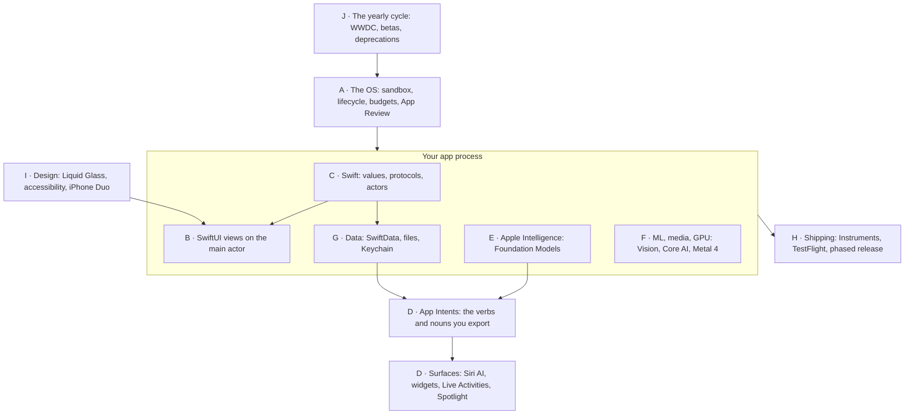
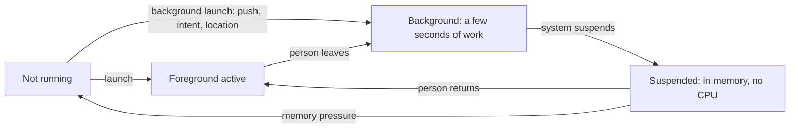
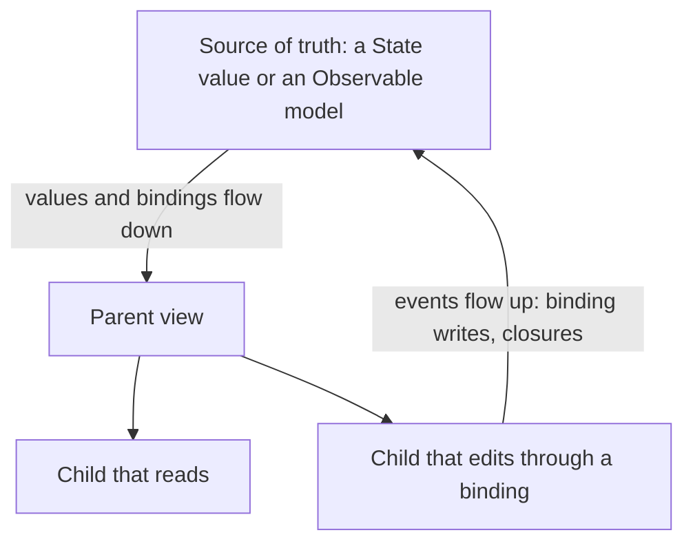
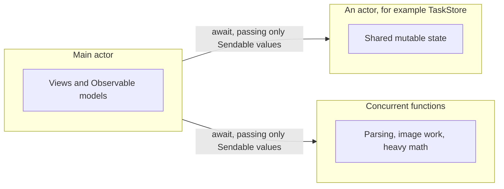
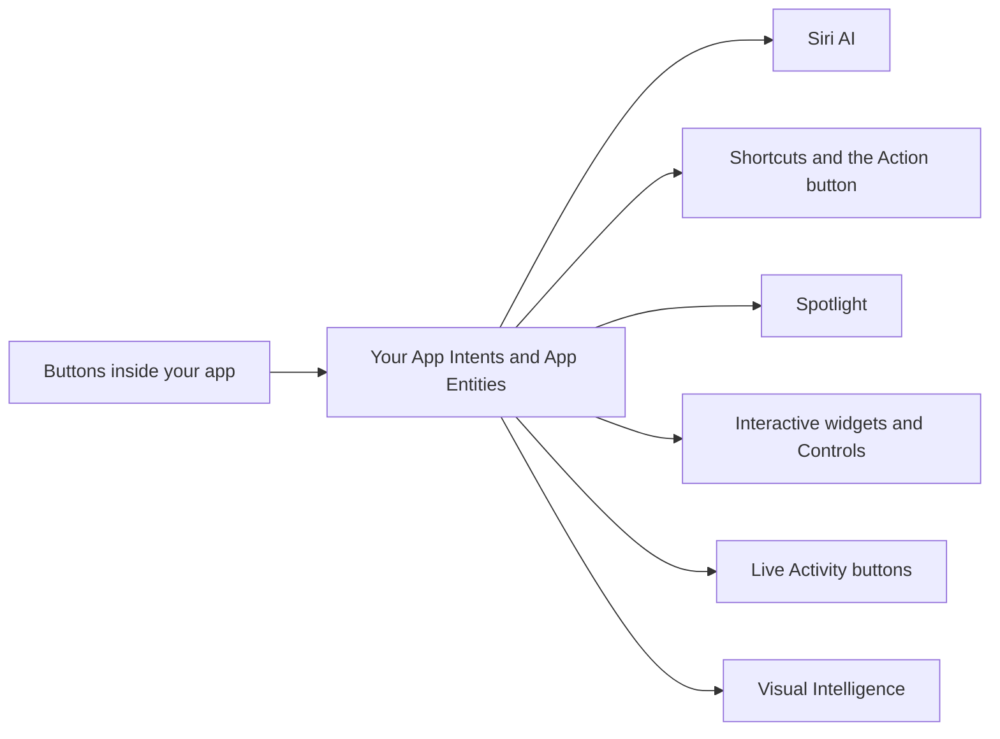
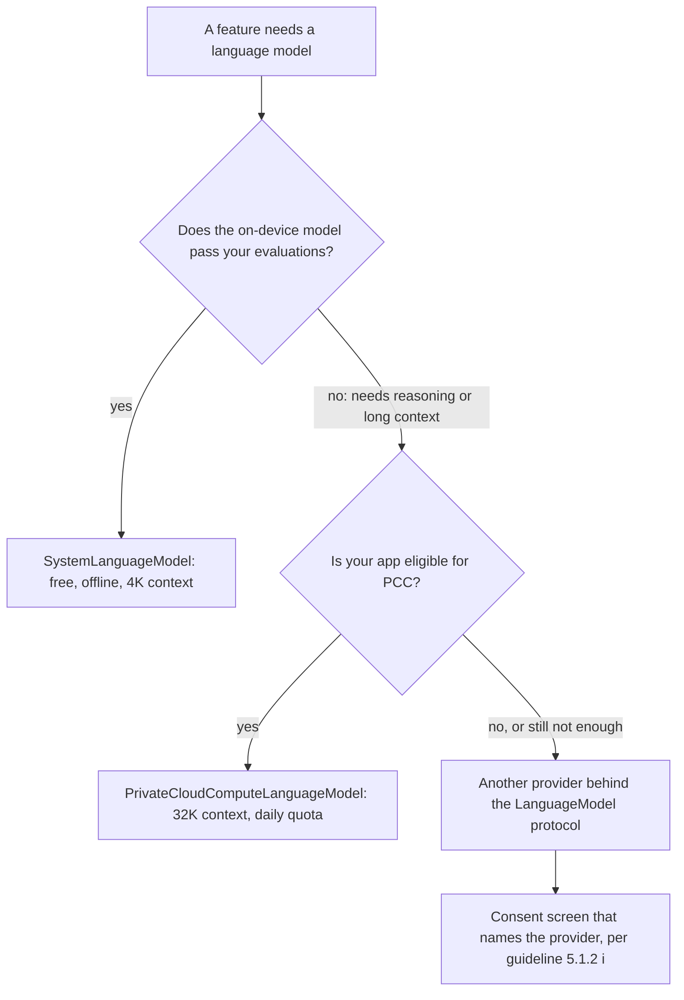
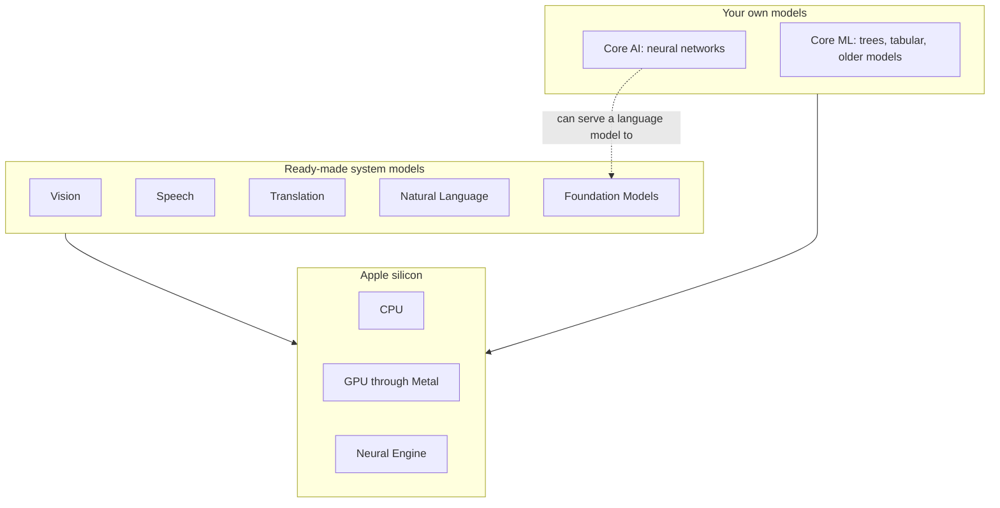
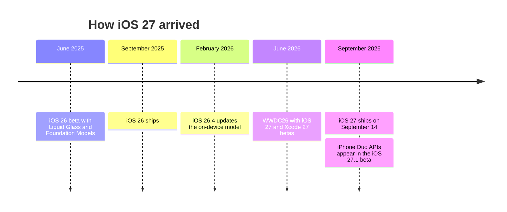
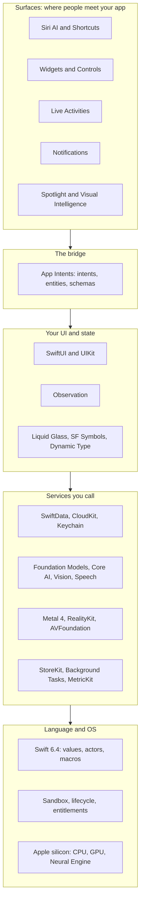

[← Learning hub](README.md)

# Day 0 · The iOS mental model in one sitting

> By tonight you'll carry the map a five-year iOS developer carries in their head: who owns what on the phone, why the rules exist, and where Apple is taking the platform. **Time:** ~3 hours.

Read this once before Day 1, then again after Day 7. The first time, it's a map of places you haven't been. The second time, each model should call up code you wrote.

The chapter has 35 mental models in 10 parts. Each one is a bold sentence you could say out loud, the reason behind it, and a **senior tell**: how experienced developers act on it. If you're short on time, read only the bold lines first (about 10 minutes), then come back for the rest.

## Today's map



Where each part goes deeper this week:

| Part | Deeper in |
|---|---|
| A · The app is a guest | [Day 3](day3-data-lifecycle-system.md), [Day 7](day7-ship-like-a-senior.md) |
| B · Declarative UI | [Day 2](day2-swiftui-liquid-glass-design.md) |
| C · Swift | [Day 1](day1-swift-and-concurrency.md) |
| D · System surfaces | [Day 4](day4-app-intents-siri-system-surfaces.md) |
| E · Apple Intelligence, F · ML | [Day 5](day5-apple-intelligence-and-ml.md), [Day 6](day6-metal4-graphics-and-compute.md) |
| G · Data | [Day 3](day3-data-lifecycle-system.md) |
| H · Shipping | [Day 7](day7-ship-like-a-senior.md) |
| I · Design | [Day 2](day2-swiftui-liquid-glass-design.md) |
| J · How Apple evolves the platform | every day |

## Mental models

### A · The app is a guest

**1. Your app lives in a sandbox, and every door out is an API guarded by an entitlement, a permission, or both.**

Each app gets its own container on disk. It can't read other apps' files or see their screens. App Review guideline 2.5.2 says apps "may not read or write data outside the designated container area." To reach anything else (photos, contacts, location, the camera, iCloud, push) you go through a framework, and three kinds of keys open those doors:

- **Entitlements** are signed claims in your app's code signature, for capabilities like iCloud or App Groups. Some are *managed*: Apple has to approve you first. The Private Cloud Compute entitlement, `com.apple.developer.private-cloud-compute` (iOS 27), is one.
- **Permissions** are the prompts people see. Each needs a purpose string in `Info.plist`, such as `NSCameraUsageDescription`. Without it, the app stops the moment it touches the resource.
- **Privacy manifests** are a `PrivacyInfo.xcprivacy` file listing the data you collect and why you call certain "required reason" APIs. Third-party SDKs ship their own.

People can also grant partial access, like a few selected photos. Guideline 5.1.1(iv) says to respect a "no" and offer another way where you can, such as typing an address when location is denied.

**Senior tell:** they ask for a permission at the moment a feature needs it, and they build the "denied" path first.

**2. App Review is part of the platform, not a gate at the end.**

The [App Review Guidelines](https://developer.apple.com/app-store/review/guidelines/) (last updated June 8, 2026) shape architecture, not only screenshots. These rules change designs most often:

| Guideline | What it means for your design |
|---|---|
| 2.5.2 | No downloading code that adds or changes features. A model can fill in parameters for tools you compiled in. It can't ship new logic. |
| 2.5.4 | Background modes only for their stated purpose (audio, VoIP, location…). No silent audio to stay awake. |
| 2.3.1 | No hidden or undocumented features. Describe new features in the review notes. |
| 4.5.3 | No spam through push notifications or Live Activities. |
| 5.1.1(v) | If people can create an account, they must be able to delete it in the app. |
| 5.1.2(i) | Disclose where personal data goes and get explicit permission before sharing it with third parties, "including with third-party AI." |

**Senior tell:** they read the relevant guideline before designing a feature, and they write the review notes while they build it.

**3. The OS owns your lifecycle: it launches, suspends and ends your app, one scene at a time.**

You don't decide when your code runs. The system launches your process, sometimes straight into the background to handle a push, a location event or an App Intent. When people leave, it moves you to the background and soon *suspends* you: still in memory, but getting no CPU time. When memory runs short, it can end a suspended app. Apple's lifecycle docs say UIKit "can disconnect a background or suspended scene at any time to reclaim its resources."



The *process* and the *UI* have separate lifecycles. The process launches once. Each **scene**, one instance of your UI such as a window, has its own state. An iPad or an iPhone Duo can show two scenes of your app at once, one active and one in the background. In iOS 27 this stopped being optional: apps built with the latest SDK "must adopt the scene-based life cycle or they fail to launch." In SwiftUI, `WindowGroup` gives you scenes, and the `scenePhase` environment value tells a view whether its scene is active, inactive or in the background.

**Senior tell:** they save work whenever a scene leaves the foreground, never "on quit", and they test by stopping the app from Xcode while it's in the background.

**4. The main thread owns the UI, and anything slow on it is a bug people can feel.**

All UI work happens on the main thread, which Swift models as the **main actor**. SwiftUI's `View` protocol and UIKit's `UIView` are both marked `@MainActor`. For every touch, the main thread runs your handler, updates state, and sends the changes to the render server. Apple's guidance: under 100 ms is rarely noticeable, but "even a few hundred milliseconds can make people feel that an app is unresponsive." That pause is a **hang**. Block the main thread long enough, especially at launch, and the system's watchdog ends the app. The crash report shows the code `0x8badf00d`.

**Senior tell:** nothing that touches disk, network or a model runs synchronously on the main actor, and they check with Instruments instead of by feel.

**5. Background time, energy and heat are budgets the system enforces.**

Third-party apps get no always-on loop. Each kind of background work has its own tool and its own limits:

| You need to | Use | The deal |
|---|---|---|
| Refresh content now and then | `BGAppRefreshTask` | The system picks the time and gives you up to 30 seconds. |
| Do heavy work later (cleanup, indexing) | `BGProcessingTask` | Runs when the system chooses, often overnight on the charger. |
| Finish a job the person started | `BGContinuedProcessingTask` (iOS 26) | Shows progress; the system can cancel it. |
| Keep an App Intent running | `LongRunningIntent` (iOS 27) | Reports progress while it runs. |
| React to new server data | A background push | The system decides when to wake you. |

Energy sits behind all of these. The CPU, GPU, Neural Engine, radios and GPS drain the battery and heat the phone. Read `ProcessInfo.thermalState` and `isLowPowerModeEnabled`, and do less when they tell you to. In iOS 27, running inference on the Neural Engine from a background task even needs its own entitlement.

**Senior tell:** they split background work into small steps that can resume, and they put truly long loops on a server that pushes to the phone.

### B · Declarative UI

**6. A view is a cheap value that describes the UI for the current state. SwiftUI owns the real screen.**

A SwiftUI `View` is a struct with a `body`. When state that `body` depends on changes, SwiftUI calls `body` again, compares the result with the last one, and updates only what changed on screen. View structs are created and thrown away constantly. That's cheap because they're values, not long-lived objects. It's also why you don't do real work in a view's `init` or `body`: they can run many times a second.

**Senior tell:** `body` only reads state and builds views. Loading, parsing and saving go in `.task`, in actions, or in the model.

**7. Identity decides lifetime.**

SwiftUI needs to know whether the view it sees now is the same view as last time. It uses *structural identity* (the view's position in the tree: this branch of an `if`, that slot in a `VStack`) and *explicit identity* (the IDs you give `ForEach` or the `id(_:)` modifier). Same identity: state and running tasks survive. New identity: they're discarded. Apple's docs for `id(_:)` put it plainly: when the value changes, "the identity of the view — for example, its state — is reset." Likewise, a `.task(id:)` is cancelled and restarted when its id changes.

**Senior tell:** IDs come from the model, as a stored `id`, never from array positions or a `UUID()` created inside `body`.

**8. Data flows down, events flow up, and each piece of state has exactly one owner.**

For each piece of mutable state, one view or model is the owner, the **source of truth**. It passes plain values down to children that only read, and a `Binding` to children that write. Children report events back up, through closures or by writing to a binding. Shared services live in the environment.



Here is the whole idea in one small view:

```swift
import SwiftUI

struct Errand: Identifiable {
    let id = UUID()          // created once, stored in the model
    var title: String
}

@Observable
final class ErrandStore {
    var errands: [Errand] = []
    func add(_ title: String) { errands.append(Errand(title: title)) }
}

struct ErrandList: View {
    @State private var store = ErrandStore()   // this view owns the store
    @State private var draft = ""

    var body: some View {
        List {
            TextField("New errand", text: $draft)  // a binding flows down
                .onSubmit {                          // an event flows up
                    store.add(draft)
                    draft = ""
                }
            ForEach(store.errands) { errand in       // identity = errand.id
                Text(errand.title)
            }
        }
    }
}
```

- `@State` makes `ErrandList` the owner. In Xcode 27, `@State` is a macro, and an object stored in it is created once, "the first time SwiftUI instantiates the view."
- `TextField` gets a binding (`$draft`). `onSubmit` sends the event back to the owner.
- `ForEach` uses `errand.id`, a stable ID that lives in the model.

**Senior tell:** when two screens show different values for the same thing, they look for the second source of truth and delete it.

**9. `@Observable` tracks exactly what each `body` reads.**

Mark a class `@Observable` (the Observation framework, iOS 17). The macro rewrites its stored properties so that reading one inside `body` records a dependency. When that property changes, only the views that read it update. In Apple's example, a subview that reads `book.title` updates when the title changes "but not when `isAvailable` changes." There's no `@Published` and no manual notifications. Pass the object to subviews as a plain property. Use `@Bindable` when a child needs bindings to its properties, and `@Environment(Store.self)` to share it across many screens. UIKit understands it too: since iOS 26, reading an observable object in `layoutSubviews()` makes UIKit update the view when the object changes.

**Senior tell:** they give each subview only the data it renders, so a change updates as few views as possible.

**10. SwiftUI by default. UIKit where SwiftUI runs out, joined at the leaves.**

SwiftUI is where Apple ships new UI first: Liquid Glass modifiers, interactive snippets, and all of widgets, Live Activities and Controls, which you can only build in SwiftUI. UIKit is still underneath, still maintained, and still home to some mature pieces, such as advanced text editing and very large collection layouts, plus years of existing code. The two work in both directions. `UIViewRepresentable` and `UIViewControllerRepresentable` put UIKit inside SwiftUI. `UIHostingController`, and since iOS 26 `UIHostingSceneDelegate`, put SwiftUI inside UIKit.

**Senior tell:** they wrap UIKit in small representables at the edges of the view tree and keep state ownership on the SwiftUI side.

### C · Swift

**11. Prefer values and protocols. Use classes when you need shared identity.**

Structs and enums are *value types*: assigning one makes a copy, so nobody can change your copy behind your back. Arrays, dictionaries and strings are values too, and they only copy when written. Classes are *reference types*: every variable points at the same object. Use a class when identity matters, such as an `@Observable` model that several screens watch, a UIKit view, or a resource with a lifetime. Swift replaces most inheritance with **protocols**. `View`, `AppIntent`, `Tool` and `LanguageModel` are all protocols your types conform to, and generics let you write code against a protocol without a base class.

**Senior tell:** they put a protocol at each seam they actually swap, like a real model versus a stub in tests, and nowhere else.

**12. Optionals make absence honest. `throws` makes failure part of the signature.**

A `String?` might be `nil`. A `String` never is. The compiler makes you unwrap with `if let`, `guard let` or `??`. Errors work the same way: a function marked `throws` (or `async throws`) has to be called with `try`, and the caller must handle the error or pass it on. Task cancellation, an unavailable model and a full context window all reach you as thrown errors, not as silent failures.

**Senior tell:** to them, a `!` force-unwrap in shipping code is a scheduled crash. They allow it only where `nil` would mean a programmer error.

**13. Macros are code generation at compile time, and you can read what they write.**

`@Observable`, `@Model` (SwiftData), `@Generable` (Foundation Models), `#Preview`, `@Test` and `#expect` (Swift Testing), and in Xcode 27 `@State`, are all macros. A macro only *adds* code next to yours. It never modifies or deletes what you wrote. In Xcode, click a macro and choose **Editor > Expand Macro** to see the generated code. You can even set breakpoints in it.

**Senior tell:** when a macro-based type misbehaves, they expand the macro before they search the web.

**14. Swift 6 turns data races into compile errors.**

A data race is two threads touching the same mutable memory at the same time, with at least one of them writing. It causes crashes and corrupted data that are almost impossible to reproduce. The Swift 6 language mode checks for data races when you compile, using three ideas:

- An **isolation domain** runs one piece of work at a time. The main actor is one. Each `actor` instance is another. `nonisolated` code belongs to neither.
- An **actor** is a reference type that protects its own mutable state. Other code reaches it with `await`.
- **`Sendable`** marks a type whose values are safe to hand to another isolation domain.



In Swift 6 mode, strict concurrency checking is always complete and every problem is an error, not a warning.

**Senior tell:** when the compiler complains, they fix who owns the state. They don't silence it with `@unchecked Sendable`.

**15. In an app target, start on the main actor and leave it on purpose.**

Most app code touches UI state, so Xcode has a build setting, **Default Actor Isolation** (`SWIFT_DEFAULT_ACTOR_ISOLATION`). Set it to `MainActor` and code without annotations is main-actor code, which removes most false alarms in ordinary sequential code. **Approachable Concurrency** (`SWIFT_APPROACHABLE_CONCURRENCY`) turns on related features. One of them makes a `nonisolated async` function run on its caller's actor "unless the function is explicitly marked `@concurrent`." Together they give you a simple rule: code runs on the main actor unless you say otherwise. Shared state that must live off the main actor goes in an `actor`. CPU-heavy work goes in a `@concurrent` function.

**Senior tell:** every hop off the main actor in their code has a name (an `actor` or a `@concurrent` function) so a reviewer can see it.

### D · System surfaces

**16. Your app is more than its window.**

People meet your app in many places where its main UI never runs:

| Surface | What people see | Built with |
|---|---|---|
| Widgets | Glanceable views on the Home Screen, Lock Screen and StandBy | WidgetKit and SwiftUI |
| Live Activities | Live status on the Lock Screen and in the Dynamic Island | ActivityKit and SwiftUI |
| Controls | Buttons and toggles in Control Center, on the Lock Screen, on the Action button | `ControlWidget` and App Intents |
| Notifications | Alerts, local or pushed | User Notifications |
| Siri and Shortcuts | Actions run by voice or automation | App Intents |
| Spotlight | Your content in system search | Core Spotlight, `IndexedEntity` |
| Visual Intelligence | Your results when people search with the camera | App Intents, `IntentValueQuery` |
| Share extensions | Your app inside other apps' share sheet | App extensions |

Most of these run as **extensions**: separate processes with tight memory and time limits that share data with your app through an App Group. A Live Activity, for example, can stay active for at most 8 hours (12 on the Lock Screen), and its data can't exceed 4 KB.

**Senior tell:** they design the glance first (what fits in a widget or a Live Activity) and the full screen second.

**17. App Intents are the verbs and nouns your app exports to the OS.**

An **app intent** is a verb: one action, with typed parameters and a `perform()` method. An **app entity** is a noun: a lightweight, identifiable version of one of your data objects that the system can find, show and pass around. An **app enum** is a fixed set of choices. Apple's docs call intents "the gateway to your app's features" and entities "a gateway to your app's data." Write an intent once, and Siri, Shortcuts, Spotlight, interactive widgets, Controls, the Action button and your own buttons can all run it.



**Senior tell:** they write the intent first and make the in-app button call it, so every feature is reachable from the system at no extra cost.

**18. In iOS 27, Siri AI is the orchestrator, and your app is one tool in its toolbox.**

Siri AI, new in iOS 27, handles requests that span several apps. It reaches third-party apps only through App Intents. **App schemas** are Apple-defined shapes for common actions and content, grouped in domains such as Mail, Calendar, Photos, Notes and Reminders. When you conform an intent to one with `@AppIntent(schema:)`, you make it available, in Apple's words, "to the app toolbox, which Apple Intelligence draws on to service requests." Your app can't call other apps' intents. Only the system orchestrates. At launch, Siri AI is an opt-in beta in a limited set of regions and languages (see [the landscape](../docs/landscape-2026.md)).

**Senior tell:** they adopt the schemas that match their domain and name entities the way people talk ("my library books", not "LoanRecord").

### E · Apple Intelligence

**19. On-device first, Private Cloud Compute second, a third-party cloud third, and that last one only with consent.**

The Foundation Models framework puts one API over several models. Apple's own comparison of the first two:

| | `SystemLanguageModel` (on device) | `PrivateCloudComputeLanguageModel` (iOS 27) |
|---|---|---|
| Works offline | Yes | No |
| Usage limits | Unlimited | A daily limit per person |
| Reasoning | Not supported | Multiple levels |
| Context size | 4K tokens | 32K tokens |

Both preserve privacy, and switching between them is "a single line of code" when you create the session. PCC needs a managed entitlement with eligibility requirements. Past those two, any server model can sit behind the same API (model 23), but then guideline 5.1.2(i) applies: tell people which provider will get their data, and get explicit permission first.



**Senior tell:** they start every AI feature on the on-device model, measure it, and move up a rung only when an evaluation shows they must.

**20. The model is part of the OS, and it changes when the OS updates.**

The on-device model ships inside iOS. Apple updated it in iOS 26.4 and again in iOS 27, and both times told developers to "test your prompts with the new model to verify your app's behavior." It can also be missing: `SystemLanguageModel.default.availability` reports `deviceNotEligible`, `appleIntelligenceNotEnabled` or `modelNotReady`. So every AI feature needs a path that works without it. The Evaluations framework (iOS 27) scores a feature against a fixed set of samples, so a model change shows up as a number in your tests instead of a bug report.

**Senior tell:** they keep prompts under version control with an evaluation set and rerun it on every OS beta.

**21. 4,096 tokens is a small room.**

The on-device model has a context window of 4,096 tokens per session. In English a token is roughly three to four characters. *Everything* counts against it: instructions, every prompt, tool definitions, the schema of each `@Generable` type, tool outputs, and every response. When the session is full, it throws `LanguageModelError.contextSizeExceeded` and stops responding. `tokenCount(for:)` (iOS 26.4) and the Foundation Models instrument in Xcode show where the tokens go.

**Senior tell:** they give each task its own short session and pass in only the few facts it needs, instead of piling history into one long chat.

**22. Ask the model for types, not text.**

With the `@Generable` macro, you describe the output you want as a Swift type. The framework then uses *constrained sampling*, so the model can only produce valid instances of that type. `@Guide` adds a short description or a constraint, like a range or a count. There's no JSON to parse and no "please answer in this format."

```swift
import FoundationModels

@Generable
struct ErrandPlan {
    @Guide(description: "Short imperative steps, in order")
    var steps: [String]
    @Guide(description: "True if any step spends money or contacts someone")
    var needsApproval: Bool
}

func plan(_ errand: String) async throws -> ErrandPlan? {
    guard case .available = SystemLanguageModel.default.availability else {
        return nil                                   // show the non-AI path
    }
    let session = LanguageModelSession(instructions: "You plan small personal errands.")
    let response = try await session.respond(to: errand, generating: ErrandPlan.self)
    return response.content
}
```

- Check availability before you show any AI UI.
- The model fills properties in the order you declare them, so declare first what it should work out first.
- Guide descriptions become part of the schema and cost tokens. Keep them short.

**Senior tell:** they treat the generated struct as untrusted input and validate it before acting on it.

**23. Tools let the model call your code. The `LanguageModel` protocol lets any model sit behind the same session.**

A **tool** is a type that conforms to `Tool`: a name, a description, typed arguments, and a `call(arguments:)` method. The model decides when to call it, and your code does the real work, such as searching your store or reading a calendar. `GenerationOptions.ToolCallingMode` (iOS 27) lets a request allow, require or forbid tool calls. The `LanguageModel` protocol (iOS 27) is the other half. `SystemLanguageModel` and `PrivateCloudComputeLanguageModel` both conform, and so can a model you run with Core AI or a server model from another company. Your session code, tools and `@Generable` types stay the same when the model changes.

**Senior tell:** tools with side effects (send, pay, delete) never act on model output alone. They ask the person to approve.

### F · ML, media and the GPU

**24. Use the system's models before you ship your own.**

Apple ships tuned models behind plain APIs, updated with the OS and with nothing to download: Vision (`RecognizeTextRequest`, `RecognizeDocumentsRequest`), Speech (`SpeechAnalyzer`, iOS 26), Translation (`TranslationSession`), Natural Language (`NLTagger`), and Foundation Models for language. Train your own only when the task is specific to your domain. For that, iOS 27 adds **Core AI**. It runs neural networks you convert to its `.aimodel` format across the CPU, GPU and Neural Engine, and it can serve a language model to Foundation Models. **Core ML** remains for other model types, like decision trees and tabular pipelines. Metal sits under everything, and Metal 4 can even run inference inside a GPU frame with `MTL4MachineLearningCommandEncoder`.



**Senior tell:** before a custom model's accuracy, they check its download size, its memory use and how long it takes to get ready on first launch.

**25. Apple GPUs render in tiles and share memory with the CPU. Metal 4 gives you explicit control over both.**

Apple GPUs use **tile-based deferred rendering**. The GPU splits the render target into small tiles, works out what's visible in each tile first, and shades only that, in fast on-chip *tile memory*. Writing results out to main memory is the expensive part, so a texture you need only during one pass can be `memoryless` and never leave the tile. Apple GPUs also have **unified memory**: the CPU and GPU share system memory, so data in shared storage needs no upload. Metal 4 (the `MTL4` types, iOS 26) hands you more of the bookkeeping: command buffers you reuse, command allocators you reset each frame, argument tables for resource bindings, and explicit barriers. Metal 4 command buffers also no longer keep your resources alive for you.

**Senior tell:** they think in memory bandwidth. The cheapest pixel is one that never leaves tile memory.

**26. Pick the highest layer that does the job: SwiftUI shaders, then RealityKit, then Metal.**

| You want | Use |
|---|---|
| A 2D effect on a view: a glow, a ripple, an animated gradient | A SwiftUI `Shader` with `colorEffect` or `layerEffect` |
| 3D objects, physics, AR | RealityKit and `RealityView` |
| Your own render loop, a game, GPU compute, ML in the frame | Metal 4 |

A SwiftUI shader is a Metal shader function that SwiftUI runs for you, so you get GPU speed without owning a render loop.

**Senior tell:** they prototype an effect as a SwiftUI shader and move to a full Metal pipeline only when they need their own frames.

### G · Data

**27. The device holds the truth. The network is for sync.**

Mobile networks drop. An app that stores data on the device first and syncs later keeps working in a subway tunnel. Where things go:

| Data | Store |
|---|---|
| Your model graph (errands, steps) | SwiftData: `@Model`, `ModelContainer`, `@Query` |
| The same data on a person's other devices | CloudKit, which SwiftData can sync for you |
| Large files, documents, caches | Files in your container, through `FileManager` |
| Tokens, passwords, keys | The Keychain |
| Small preferences | `UserDefaults` |

SwiftData syncs to iCloud through Core Data's `NSPersistentCloudKitContainer` and inherits CloudKit's rules: relationships must be optional, and unique constraints aren't enforced.

**Senior tell:** secrets go in the Keychain, never in `UserDefaults` or a file, and every screen has an offline state.

**28. Every schema you ship is a promise you keep forever.**

Once your app has saved data on people's phones, every change to its shape needs a migration. People also skip versions: someone may jump from your v1 to your v5 in one update. SwiftData handles this with `VersionedSchema` and `SchemaMigrationPlan`. CloudKit is stricter: once you promote a schema to production, it's additive only, and you can't delete model types or change existing attributes.

**Senior tell:** they version the schema from the first release and test migrations with real old data, not fresh installs.

### H · Shipping

**29. Hangs, hitches and memory spikes are bugs, even when nothing crashes.**

People feel a hang or a stuttering scroll long before they report it. The system also ends apps that use too much memory. You get an `EXC_RESOURCE` report as you approach the limit, and past it the app is terminated; if it's in the foreground, it simply disappears. Your tools:

- **Instruments**, on a real device: Time Profiler, the SwiftUI instrument, Allocations, Power Profiler, and in Xcode 27 an instrument for Foundation Models.
- **Xcode Organizer**: crashes, hangs, and in Xcode 27 a Hitches metric covering all animations (not just scrolling) plus an Insights overview of regressions.
- **MetricKit**: daily metrics and diagnostics from real devices. iOS 27 adds `MetricManager`, which delivers reports as async sequences and replaces `MXMetricManager`.

**Senior tell:** they profile Release builds on the oldest device they support, and they watch hang rate as closely as crash rate.

**30. Ship in rings: yourself, then TestFlight, then a phased release.**

TestFlight lets up to 100 internal testers from your team and up to 10,000 external testers install a build, each build for up to 90 days. The first build you give external testers goes through App Review. On the App Store, a **phased release** gives an update to people with automatic updates over 7 days: 1%, 2%, 5%, 10%, 20%, 50%, then 100%. You can pause it for up to 30 days in total. Anyone can still download the update by hand.

**Senior tell:** during a phased release they check Organizer and crash reports every day and pause at the first unusual spike.

### I · Design

**31. Content comes first. Controls float on glass.**

**Liquid Glass** is the design material of iOS 26 and later. It forms "a distinct functional layer for controls and navigation elements" that floats above your content and lets it show through. Apple describes the goal as interfaces that "establish hierarchy, create harmony, and maintain consistency." Standard SwiftUI and UIKit components pick it up automatically when you build with the current Xcode. For custom controls there's `glassEffect(_:in:)`, `GlassEffectContainer` and the `.glass` button style. The HIG's rules: don't use glass in the content layer, use it sparingly, and remove custom backgrounds from bars so they don't fight the system effect. In June 2026 the HIG also reintroduced its design principles: purpose, agency, responsibility, familiarity, flexibility, simplicity, craft and delight.

**Senior tell:** their first Liquid Glass change is deleting custom bar backgrounds, not adding glass.

**32. Accessibility is a requirement, and the system does most of the work if you let it.**

Use the built-in text styles and **Dynamic Type** comes with them, including the larger accessibility sizes. Use **SF Symbols** for icons: they line up with text and come in several rendering modes. Give every icon-only button an accessibility label so VoiceOver and Voice Control can use it. People can also reduce transparency, increase contrast or reduce motion, and Liquid Glass adapts to those settings. On the App Store, **Accessibility Nutrition Labels** tell people which features your app supports, such as VoiceOver, Voice Control, Larger Text, Sufficient Contrast and Reduced Motion.

**Senior tell:** they test every new screen at the largest accessibility text size and with VoiceOver before they call it done.

**33. Design for any size. iPhone Duo made adaptive layout mandatory.**

iPhone Duo is a foldable iPhone with a compact outer display and a large inner one. On the outer display, the system moves toolbars and tab bars to the side of the screen. When the phone is partly folded, the fold divides the inner display. Apple's advice: use size classes, safe areas and system containers; size views relative to their container, never the screen; don't branch on device type. Build with Xcode 27, or your app won't extend under the status bar and camera. APIs made for the fold (`ArrangementView`, `ReservedRegion`, hinge state) are in the iOS 27.1 beta as of this writing, so don't depend on them yet.

**Senior tell:** they check each screen in every iPhone Duo pose in Device Hub before shipping a layout.

### J · How Apple evolves the platform

**34. The platform moves once a year, on a schedule, and removals come with years of warning.**



Every June at WWDC, Apple releases the first betas of the next OS and Xcode. Betas continue through the summer while APIs can still change, and the release comes in September. Point releases add features too. Removals are slow and loud. The UIKit scene lifecycle is the textbook case: iOS 18.4 logged a message, iOS 26 warned it "will soon be required," and iOS 27 won't launch apps without it. Xcode 27 also runs only on Apple silicon Macs, and it deprecates On Demand Resources in favor of Background Assets.

**Senior tell:** they build their app with the new Xcode beta in June and clear every new warning before September.

**35. Apple's docs and sample code are the spec. The Updates pages are the changelog.**

When a blog post and Apple's documentation disagree, the documentation wins. When the documentation is thin, Apple's sample code shows the intended pattern: Landmarks for Liquid Glass, Origami for Foundation Models with Private Cloud Compute. The [Updates](https://developer.apple.com/documentation/updates) pages list every framework's changes by release. Read them together and the direction is clear. The system is becoming an agent (Siri AI) that calls apps as typed tools (App Intents and schemas). Models run on device first and in Apple's private cloud second (Foundation Models, Core AI, PCC). Design keeps moving toward content-first, adaptive layouts (Liquid Glass, iPhone Duo). And spatial computing shares the same SwiftUI and RealityKit you use on iPhone.

**Senior tell:** each June they read the Updates page for every framework they use and pick one change to adopt.

## The platform on one page



The frameworks that matter in 2026, and when you reach for each. "Since" is the iOS version that introduced the framework.

| Framework | What it's for | Reach for it when | Since |
|---|---|---|---|
| **UI and state** | | | |
| [SwiftUI](https://developer.apple.com/documentation/swiftui) | Declarative UI for screens, widgets, Live Activities | Every new screen | iOS 13 |
| [UIKit](https://developer.apple.com/documentation/uikit) | Imperative UI; the layer under SwiftUI | A control SwiftUI lacks, very large lists, existing code | iOS 2 |
| [Observation](https://developer.apple.com/documentation/observation) | `@Observable` change tracking | Every model type your UI reads | iOS 17 |
| [Swift Charts](https://developer.apple.com/documentation/charts) | Charts from data | Any chart | iOS 16 |
| [Foundation](https://developer.apple.com/documentation/foundation) | `URLSession`, files, dates, formatting | Everywhere | iOS 2 |
| **Data and accounts** | | | |
| [SwiftData](https://developer.apple.com/documentation/swiftdata) | Persist your model graph | Storing data on the device | iOS 17 |
| [CloudKit](https://developer.apple.com/documentation/cloudkit) | iCloud databases and sync | Sync across a person's devices, sharing | iOS 8 |
| [Security](https://developer.apple.com/documentation/security) (Keychain) | Encrypted storage for secrets | Tokens, passwords, keys | iOS 2 |
| [AuthenticationServices](https://developer.apple.com/documentation/authenticationservices) | Passkeys, Sign in with Apple | Any account system | iOS 12 |
| [StoreKit](https://developer.apple.com/documentation/storekit) | In-app purchases, subscriptions | Charging for digital goods | iOS 3 |
| **System surfaces** | | | |
| [App Intents](https://developer.apple.com/documentation/appintents) | Actions and content for Siri, Shortcuts, Spotlight, widgets, Controls | Anything people might do from outside your app | iOS 16 |
| [WidgetKit](https://developer.apple.com/documentation/widgetkit) | Widgets and Controls | Glanceable info, one-tap actions | iOS 14 |
| [ActivityKit](https://developer.apple.com/documentation/activitykit) | Live Activities | A task happening now, with a clear end | iOS 16.1 |
| [User Notifications](https://developer.apple.com/documentation/usernotifications) | Local and push notifications | Time-sensitive information | iOS 10 |
| [Background Tasks](https://developer.apple.com/documentation/backgroundtasks) | Scheduled and continued background work | Refresh, cleanup, finishing a job the person started | iOS 13 |
| [Core Spotlight](https://developer.apple.com/documentation/corespotlight) | Index content; `SpotlightSearchTool` gives it to a model | People should find your content from system search | iOS 9 |
| **Intelligence and ML** | | | |
| [Foundation Models](https://developer.apple.com/documentation/foundationmodels) | One session API for on-device, PCC and other language models | Understanding text, typed generation, tool calling | iOS 26 |
| [Core AI](https://developer.apple.com/documentation/coreai) | Run your own neural networks on Apple silicon | A domain model no system API covers | iOS 27 |
| [Core ML](https://developer.apple.com/documentation/coreml) | Run other model types, existing `.mlmodel` files | Trees, tabular models, older pipelines | iOS 11 |
| [Vision](https://developer.apple.com/documentation/vision) | Text, documents, barcodes, faces, body pose | Anything you'd ask of an image | iOS 11 |
| [Speech](https://developer.apple.com/documentation/speech) | Transcription; `SpeechAnalyzer` since iOS 26 | Voice input, captions | iOS 10 |
| [Translation](https://developer.apple.com/documentation/translation), [Natural Language](https://developer.apple.com/documentation/naturallanguage) | On-device translation; language detection and tagging | Multilingual content | iOS 17.4, iOS 12 |
| [Evaluations](https://developer.apple.com/documentation/evaluations) | Score AI features against sample sets | Before shipping, and on every OS beta | iOS 27 |
| **Graphics and media** | | | |
| [Metal](https://developer.apple.com/documentation/metal) | GPU rendering and compute; `MTL4` types since iOS 26 | Custom renderers, GPU compute, ML in the frame | iOS 8 |
| [RealityKit](https://developer.apple.com/documentation/realitykit) | 3D and AR | 3D objects, physics, AR | iOS 13 |
| [AVFoundation](https://developer.apple.com/documentation/avfoundation) | Camera, audio and video capture and playback | Media features | iOS 2.2 |
| **Quality** | | | |
| [Swift Testing](https://developer.apple.com/documentation/testing) | `@Test`, `#expect`, parameterized tests | Every new unit test | Xcode 16 |
| [MetricKit](https://developer.apple.com/documentation/metrickit) | Performance and diagnostics from people's devices | Every app you ship | iOS 13 |

## What a 5-year developer knows that tutorials don't

- **The simulator lies about performance.** It runs on your Mac's CPU and memory. Profile, and judge speed, only on a real device, ideally the oldest one you support.
- **Most field crashes aren't in your clever code.** They're force-unwraps, main-thread stalls during launch, memory terminations, and crashes in code you didn't write.
- **Launch time is a feature.** Do nothing before the first frame that could wait until after it.
- **A denied permission usually stays denied.** You can't ask again with the system prompt. Design the "no" path and link to Settings.
- **Old versions of your app live for years.** Your server API has to keep serving them, so version your endpoints from day one.
- **Your users will skip versions.** Migrations must work from any old schema, not just the previous one.
- **Longer text and larger type break more layouts than new screen sizes.** Test in a language with long words and at the largest accessibility size.
- **Every third-party SDK costs you.** It adds launch time, a privacy manifest, review risk and another team's bugs.
- **Pushes can be late, duplicated or never arrive.** Design so each of those is harmless.
- **What works on your phone on the charger fails on theirs in Low Power Mode.** Background work in particular.
- **Most "SwiftUI is slow" is identity churn or work in `body`.** The SwiftUI instrument shows which views update and why.
- **Keep logic out of views and out of the app target.** A separate module (a Swift package) builds and tests faster and can't reach UI by accident.
- **System components pay you back every June.** Standard bars, text styles and SF Symbols got Liquid Glass, Dynamic Type and iPhone Duo layouts for free. Every custom control is a tax you pay again each year.
- **Signing breaks at the worst time.** Use automatic signing, and have more than one person able to manage the team account.
- **Model output is untrusted input.** Validate it, confirm before side effects, and log what the model saw and did.
- **Crash-free rate isn't the whole story.** Hang rate, hitches and battery use decide reviews just as much.
- **Write the App Review notes like documentation.** Include a demo account, explain AI features, and say where data goes.
- **June's first beta is when you find out what breaks.** Waiting until September means shipping broken on the day iOS updates.

## What's new in iOS 27 (and what old tutorials get wrong)

- **Scenes are mandatory.** Apps built with the iOS 27 SDK must use the scene-based lifecycle or they fail to launch. Tutorials that put the window in the app delegate are out of date.
- **`@State` is a macro in Xcode 27.** An object stored in it is created once, instead of being re-created with each new view value.
- **Foundation Models opened up.** The `LanguageModel` protocol puts any model behind the same session API. `PrivateCloudComputeLanguageModel` offers 32K tokens and reasoning. `LanguageModelSession.DynamicProfile` builds agent-style sessions. Prompts can include images. And the on-device model changed again, so retest your prompts.
- **New frameworks for AI quality and custom models:** Core AI runs your own neural networks; Evaluations measures AI features.
- **App Intents got more agentic.** `LongRunningIntent` extends background runtime, schemas connect intents to Apple Intelligence and Siri AI, `SyncableEntity` keeps entity IDs stable across devices, and the new App Intents Testing framework tests intents.
- **Core Spotlight can feed a model.** `SpotlightSearchTool` gives Foundation Models access to your Spotlight index.
- **SwiftData can observe.** `ResultsObserver` delivers live results for a fetch, and `HistoryObserver` watches remote changes.
- **MetricKit was rebuilt around Swift concurrency.** `MetricManager` replaces `MXMetricManager`.
- **Xcode 27** needs an Apple silicon Mac with macOS Tahoe 26.6 or later. Its Device Hub replaces the separate Simulator and device windows and can pair an iPhone over Wi-Fi. Agents in Xcode can build, run and test your app.
- **iPhone Duo** (September 2026) makes resizable layouts non-negotiable. Its dedicated APIs are in the iOS 27.1 beta.
- **What old tutorials get wrong:** `ObservableObject` and `@Published`, `NavigationView`, completion handlers, SiriKit intents, and running your own LLM runtime with custom glue. Each has a modern replacement (see the legacy table below).

## Pitfalls you only learn by shipping

- **The app freezes at launch, then disappears; the crash report says `0x8badf00d`.** Cause: synchronous work on the main thread at launch, such as a database migration, network call or model load. Fix: show the first frame, then do the work asynchronously, and measure launch in Instruments.
- **The app vanishes when people come back to it.** Cause: it exceeded its memory limit, often from full-size images or a model loaded twice. Fix: downsample images, keep one model instance, and free caches when you go to the background.
- **A text field loses focus or row state resets whenever the list refreshes.** Cause: view identity changes, for example from IDs generated in `body`. Fix: stable IDs stored in the model.
- **The AI feature works for you but is blank for many users.** Cause: their device isn't eligible, Apple Intelligence is off, or the model isn't downloaded yet. Fix: check `availability` and ship a path that works without the model.
- **The assistant stops answering after a few turns.** Cause: the 4,096-token context filled up and the session threw `contextSizeExceeded`. Fix: short sessions per task, fewer tools per session, and summaries instead of full history.
- **Rejected under guideline 5.1.2(i).** Cause: data went to a third-party AI service without explicit permission. Fix: a consent screen that names the provider and appears before the first request.
- **Background sync "never runs" for users.** Cause: relying on `BGAppRefreshTask` timing, which the system controls. Fix: a server push when data changes, or a user-started `BGContinuedProcessingTask` with visible progress.
- **Migrating to Swift 6 produces hundreds of `Sendable` errors.** Cause: shared mutable state reached from many places. Fix: default to main-actor isolation, move shared state into an `actor`, and pass values across.
- **After an update, synced data is missing on some devices.** Cause: a schema change without a migration, or a CloudKit change that production doesn't allow. Fix: `VersionedSchema` from v1, and only additive CloudKit changes.
- **Bars look muddy under Liquid Glass.** Cause: custom bar backgrounds or glass in the content layer. Fix: remove custom backgrounds, use standard bars, and keep glass for controls.

## Legacy you'll still meet

| Old | New |
|---|---|
| `ObservableObject`, `@Published`, `@StateObject`, `@EnvironmentObject` | `@Observable`, `@State`, `@Environment(Type.self)` |
| `NavigationView` | `NavigationStack`, `NavigationSplitView` |
| Completion handlers, `DispatchQueue.main.async` | `async`/`await`, `@MainActor` |
| App-delegate-only lifecycle | Scene-based lifecycle (required in iOS 27) |
| SiriKit `INIntent` | App Intents |
| `XCTestCase` for unit tests | Swift Testing (`@Test`, `#expect`); XCTest remains for UI tests |
| Core Data in new projects | SwiftData |
| `SFSpeechRecognizer` | `SpeechAnalyzer` |
| `VNRecognizeTextRequest` | `RecognizeTextRequest` |
| `MXMetricManager` | `MetricManager` |
| On Demand Resources (`NSBundleResourceRequest`) | Background Assets |
| `MTLCommandQueue` in new Metal code | `MTL4CommandQueue` |
| Custom blur views behind bars (`UIVisualEffectView`) | Standard bars with Liquid Glass |

## iOS 27 vocabulary

| Term | One-line meaning |
|---|---|
| Sandbox | The private container and limits every app runs inside. |
| Entitlement | A signed claim in your code signature that unlocks a capability, like iCloud or PCC. |
| Purpose string | The `Info.plist` text shown in a permission prompt, such as `NSCameraUsageDescription`. |
| Privacy manifest | `PrivacyInfo.xcprivacy`: the data you collect and the required-reason APIs you call. |
| Scene | One instance of your app's UI, such as a window, with its own lifecycle. |
| Scene phase | Whether a scene is active, inactive or in the background. |
| Main actor | The isolation domain for UI work; in practice, the main thread. |
| Actor | A reference type that runs one task at a time on its own mutable state. |
| `Sendable` | A type whose values are safe to pass between isolation domains. |
| Default actor isolation | A build setting that makes unannotated code `@MainActor`. |
| `@concurrent` | Marks an async function that should run off its caller's actor. |
| Hang | A noticeable delay after a tap or keypress, almost always from main-thread work. |
| Hitch | A frame that arrives late during an animation or scroll. |
| Watchdog | The system monitor that ends unresponsive apps (code `0x8badf00d`). |
| View identity | How SwiftUI decides a view is "the same" across updates; it controls state lifetime. |
| Source of truth | The single owner of a piece of state. |
| `@Observable` | A macro that makes a class report which properties were read and changed. |
| Binding | Read-write access to state that someone else owns. |
| Liquid Glass | The iOS 26+ material for controls and navigation that floats above content. |
| SF Symbols | Apple's icon set, designed to line up with text. |
| Dynamic Type | The system text-size setting your text styles follow. |
| Size class | Compact or regular width and height; the basis of adaptive layout. |
| iPhone Duo | The foldable iPhone with an outer and an inner display (September 2026). |
| App intent | One action your app exposes to the system. |
| App entity | A lightweight, identifiable version of your data that the system can use. |
| App Shortcut | An app intent with spoken phrases that works as soon as the app is installed. |
| App schema | An Apple-defined shape for a common action or content type that Apple Intelligence understands. |
| Live Activity | A live status view on the Lock Screen and in the Dynamic Island. |
| Control | A button or toggle your app provides for Control Center, the Lock Screen or the Action button. |
| Siri AI | iOS 27's assistant that handles requests across apps, reaching yours through App Intents. |
| Foundation Models | The framework for language models, with one session API for every model. |
| Guided generation | Getting output as your own `@Generable` Swift type. |
| Tool calling | The model asking your code, through a `Tool`, to fetch data or act. |
| Private Cloud Compute (PCC) | Apple's server model with privacy guarantees, a 32K context and a daily quota. |
| Core AI | The iOS 27 framework for running your own neural networks (`.aimodel`). |
| Metal 4 | The `MTL4` generation of Metal, with explicit command and memory management. |
| TBDR | Tile-based deferred rendering, how Apple GPUs draw. |
| Device Hub | Xcode 27's app for simulators and physical devices. |
| Phased release | An App Store update rolled out to automatic-update users over 7 days. |

## Practice

**1. Draw the map from memory.** On paper, without looking, draw today's map with its 10 parts and the arrows between them. Then compare.
*Done when:* you can explain every arrow in one sentence, and you've fixed the ones you got wrong.

**2. Read an app like a platform engineer.** Pick an app you use daily (weather, transit, a to-do list). List every place it appears outside its main screen: widgets, Live Activities, notifications, Controls, its actions in the Shortcuts app, Spotlight results, share sheet. Then open Settings > Privacy & Security and list the permissions it holds.
*Done when:* you have a table of at least 8 rows, each naming the framework behind it (use the platform table above).

**3. Route three AI features.** For each feature, choose the model and write the one-line reason: (a) suggest a title for a note, (b) plan a two-week trip with 20 constraints, (c) read a restaurant menu from a photo. Include the fallback when the model is unavailable, and the consent line if data leaves Apple's models.
*Done when:* each feature has a model, a reason, a fallback, and, where needed, a consent sentence that names the provider.

**4. Read the changelog.** Open [Updates](https://developer.apple.com/documentation/updates) and the SwiftUI and Foundation Models update pages. Write down three changes that the Errand capstone should use.
*Done when:* you have three bullets, each with the API name and the day of this week where it fits.

**5. Set up your machine: Xcode 27, a new iOS 27 project, running on your iPhone.** Each step follows Apple's documentation, linked at the end of each line.

1. Use an Apple silicon Mac with macOS Tahoe 26.6 or later, and install Xcode 27 ([Xcode 27 Release Notes](https://developer.apple.com/documentation/xcode-release-notes/xcode-27-release-notes)). If Xcode offers to download the iOS platform, accept; you can also manage this in Settings > Components ([components](https://developer.apple.com/documentation/xcode/downloading-and-installing-additional-xcode-components)).
2. Sign in under **Xcode > Settings > Apple Accounts**. A personal Apple Account is enough to run on your own device ([running on devices](https://developer.apple.com/documentation/xcode/running-your-app-on-simulated-or-physical-devices)).
3. Choose **File > New > Project**, pick the iOS **App** template, name it `Errand`, choose your team, enter an organization identifier, and pick SwiftUI for the interface and Swift for the language ([creating a project](https://developer.apple.com/documentation/xcode/creating-an-xcode-project-for-an-app)).
4. Select the target. Set the minimum deployment to iOS 27.0 in the General pane. Then in **Build Settings**, check four settings: Swift Language Version is Swift 6, Default Actor Isolation is MainActor, Approachable Concurrency is Yes, and Strict Concurrency Checking is Complete ([build settings reference](https://developer.apple.com/documentation/xcode/build-settings-reference)).
5. On the iPhone, turn on **Settings > Privacy & Security > Developer Mode**, restart, then tap Enable and enter your passcode ([Developer Mode](https://developer.apple.com/documentation/xcode/enabling-developer-mode-on-a-device)). The switch may appear only after you start pairing in the next step.
6. Pair the phone in Device Hub: choose **Manage Devices…** from the run destination menu, click **+**, choose **Pair Nearby Device…** (iPhone on iOS 27 and on the same Wi-Fi), or connect a cable. Tap **Trust** on the phone ([Device Hub](https://developer.apple.com/documentation/xcode/managing-your-simulated-and-physical-devices-in-device-hub)).
7. In **Signing & Capabilities**, turn on **Automatically manage signing**, pick your team, and make sure the bundle ID is unique. Click **Register** if it appears ([running on devices](https://developer.apple.com/documentation/xcode/running-your-app-on-simulated-or-physical-devices)).
8. Choose your iPhone as the run destination and click **Run** (Product > Run).

*Done when:* the template's starter view appears on your iPhone, you can see the phone's screen in Device Hub with **View Screen**, and the project builds with zero warnings in Swift 6 mode.

## Check yourself

**1.** Rows in your list lose their state every time the list refreshes. What's the most likely cause?
<details><summary>Answer</summary>

Their identity changes on each update. Typical causes: IDs generated inside `body` (like `UUID()`), or IDs derived from values that change. Store a stable `id` in the model and use it in `ForEach` (model 7).
</details>

**2.** Why can't an agent app keep a loop running in the background for an hour, and what do you do instead?
<details><summary>Answer</summary>

The system suspends background apps and grants time only through specific tools, each with limits (model 5). Guideline 2.5.4 also bans abusing background modes. Put the long loop on a server that pushes updates, and use `BGContinuedProcessingTask` or `LongRunningIntent` for jobs the person starts, with visible progress.
</details>

**3.** A feature worked well on iOS 26 and got worse on iOS 27 without any code change. Why, and what would have caught it?
<details><summary>Answer</summary>

The on-device model is part of the OS, and Apple updated it in iOS 27 (model 20). An evaluation set run with the Evaluations framework on each OS beta would have shown the drop in June.
</details>

**4.** Why use `@Generable` instead of asking the model for JSON, and what does it cost?
<details><summary>Answer</summary>

Constrained sampling guarantees a valid instance of your type, so there's nothing to parse or repair (model 22). The cost is tokens: the type's schema and every `@Guide` description go into the 4,096-token context.
</details>

**5.** When may your app send someone's data to a third-party AI model?
<details><summary>Answer</summary>

Only after clearly disclosing where the data goes and getting explicit permission, per guideline 5.1.2(i) (models 2 and 19). In practice: a consent screen that names the provider, shown before the first request.
</details>

**6.** Where should an app store a login token, and why not `UserDefaults`?
<details><summary>Answer</summary>

In the Keychain, which is designed and encrypted for secrets (model 27). `UserDefaults` is a plain preferences file in your container, meant for small settings.
</details>

**7.** In an app target with Default Actor Isolation set to MainActor, where does an unannotated function run, and how do you move CPU-heavy work off the main actor?
<details><summary>Answer</summary>

On the main actor (model 15). Put the heavy work in a function marked `@concurrent`, or put shared mutable state in an `actor`, and `await` it, passing only `Sendable` values.
</details>

**8.** Name four places your app can appear without its main UI running, and the one framework that connects most of them.
<details><summary>Answer</summary>

Any four of: widgets, Controls, Live Activities, notifications, Siri, Shortcuts, Spotlight, Visual Intelligence, share extensions (model 16). App Intents connects most of them (model 17).
</details>

## Go deeper

- [Managing your app's life cycle](https://developer.apple.com/documentation/uikit/managing-your-app-s-life-cycle) and [Transitioning to the UIKit scene-based life cycle](https://developer.apple.com/documentation/uikit/transitioning-to-the-uikit-scene-based-life-cycle)
- [Understanding hangs in your app](https://developer.apple.com/documentation/xcode/understanding-hangs-in-your-app)
- [Adopting strict concurrency in Swift 6 apps](https://developer.apple.com/documentation/swift/adoptingswift6)
- [Managing model data in your app](https://developer.apple.com/documentation/swiftui/managing-model-data-in-your-app)
- [Getting started with the App Intents framework](https://developer.apple.com/documentation/appintents/getting-started-with-the-app-intents-framework)
- [Adding server-side intelligence with Private Cloud Compute](https://developer.apple.com/documentation/foundationmodels/adding-server-side-intelligence-with-private-cloud-compute) and [Managing the context window](https://developer.apple.com/documentation/foundationmodels/managing-the-context-window)
- [Tailor your apps for Apple GPUs and tile-based deferred rendering](https://developer.apple.com/documentation/metal/tailor-your-apps-for-apple-gpus-and-tile-based-deferred-rendering)
- [Adopting Liquid Glass](https://developer.apple.com/documentation/technologyoverviews/adopting-liquid-glass) and the HIG's [Design principles](https://developer.apple.com/design/human-interface-guidelines/design-principles)
- [Designing for iPhone Duo](https://developer.apple.com/design/human-interface-guidelines/designing-for-iphone-duo) and [Preparing your app for iPhone Duo](https://developer.apple.com/documentation/technologyoverviews/preparing-your-app-for-iphone-duo)
- [App Review Guidelines](https://developer.apple.com/app-store/review/guidelines/)

<details><summary>Verified APIs</summary>

Checked with `scripts/appledoc.py` against Apple's documentation on 2026-09-24. Version = the iOS version where the symbol was introduced.

- `View` — iOS 13.0 (`@MainActor`)
- `State` / `State()` macro — iOS 13.0 (macro form when building with Xcode 27)
- `Bindable` — iOS 17.0
- `Environment` — iOS 13.0; `Environment.init(_:)` for `Observable` types — iOS 17.0
- `Observable()` macro — iOS 17.0
- `Observations` — iOS 26.0
- `ScenePhase`, `EnvironmentValues.scenePhase` — iOS 14.0
- `App`, `WindowGroup` — iOS 14.0
- `List`, `Text`, `TextField`, `Button`, `ForEach`, `NavigationLink` — iOS 13.0
- `onSubmit(of:_:)` — iOS 15.0
- `id(_:)` — iOS 13.0
- `task(id:name:priority:file:line:_:)`, `task(name:priority:file:line:_:)` — iOS 15.0
- `NavigationStack`, `NavigationSplitView` — iOS 16.0
- `UIViewRepresentable`, `UIViewControllerRepresentable`, `UIHostingController` — iOS 13.0
- `UIHostingSceneDelegate` — iOS 26.0
- `UIView`, `UIViewController` — iOS 2.0 (`@MainActor`)
- `UIScene`, `UIWindowSceneDelegate` — iOS 13.0
- `glassEffect(_:in:)`, `GlassEffectContainer`, `PrimitiveButtonStyle.glass` — iOS 26.0
- `scrollEdgeEffectStyle(_:for:)`, `backgroundExtensionEffect()` — iOS 26.0
- `Shader`, `ShaderLibrary`, `colorEffect(_:isEnabled:)`, `layerEffect(_:maxSampleOffset:isEnabled:)` — iOS 17.0
- `Image(systemName:)` — iOS 13.0
- `DynamicTypeSize` — iOS 15.0; `dynamicTypeSize(_:)` — iOS 15.0; `ScaledMetric` — iOS 14.0
- `accessibilityLabel(_:)` — iOS 16.0
- `UserInterfaceSizeClass` — iOS 13.0; `ViewThatFits`, `Layout` — iOS 16.0
- `ArrangementView`, `DeviceHinge`, `onHingeChange(isEnabled:_:)`, `ReservedRegion` — iOS 27.1 (beta; mentioned, not used)
- `MainActor`, `Actor`, `Task` — iOS 13.0
- `Sendable`, `Optional`, `Error`, `Codable` — iOS 8.0
- `Identifiable` — iOS 13.0; `UUID` — iOS 6.0
- Build settings `SWIFT_DEFAULT_ACTOR_ISOLATION`, `SWIFT_APPROACHABLE_CONCURRENCY`, `SWIFT_STRICT_CONCURRENCY`, `SWIFT_VERSION` — Xcode build settings reference
- `Test(_:_:)`, `expect(_:_:sourceLocation:)` — Swift Testing (Xcode 16)
- `ProcessInfo.thermalState` — iOS 11.0; `isLowPowerModeEnabled` — iOS 9.0
- `BGAppRefreshTask`, `BGProcessingTask` — iOS 13.0
- `BGContinuedProcessingTask` — iOS 26.0
- Background Inference entitlement (`com.apple.developer.background-tasks.continued-processing.inference`) — iOS 27.0
- `com.apple.developer.private-cloud-compute` entitlement — iOS 27.0
- App Groups entitlement — iOS 3.0
- `NSCameraUsageDescription` — iOS 7.0
- `AppIntent`, `AppEntity`, `AppEnum`, `EntityQuery`, `AppShortcutsProvider`, `AppShortcut` — iOS 16.0
- `AppIntent.perform()` — iOS 16.0
- `IndexedEntity` — iOS 18.0
- `SnippetIntent`, `IntentValueQuery`, `UndoableIntent`, `IntentModes` — iOS 26.0
- `CancellableIntent` — iOS 26.4
- `LongRunningIntent`, `SyncableEntity` — iOS 27.0
- App Intents Testing framework, Suggested Actions framework — iOS 27.0
- `Widget` — iOS 14.0; `ControlWidget` — iOS 18.0; `WidgetCenter` — iOS 14.0
- `ActivityAttributes`, `Activity` — iOS 16.1
- `UNUserNotificationCenter` — iOS 10.0
- `CSSearchableIndex` — iOS 9.0; `SpotlightSearchTool` — iOS 27.0
- `SemanticContentDescriptor` — iOS 26.0
- `Transferable` — iOS 16.0; `NSUserActivity` — iOS 8.0
- `LanguageModelSession`, `SystemLanguageModel`, `SystemLanguageModel.default`, `SystemLanguageModel.availability` — iOS 26.0
- `respond(to:generating:includeSchemaInPrompt:options:)`, `LanguageModelSession.Response.content` — iOS 26.0
- `Instructions`, `Prompt` — iOS 26.0
- `Generable`, `Generable(description:)`, `Guide(description:)` — iOS 26.0
- `Tool`, `Tool.call(arguments:)` — iOS 26.0
- `SystemLanguageModel.contextSize` — iOS 26.0 (back-deployed); `SystemLanguageModel.tokenCount(for:)` — iOS 26.4
- `LanguageModel`, `PrivateCloudComputeLanguageModel`, `LanguageModelError`, `LanguageModelError.contextSizeExceeded(_:)` — iOS 27.0
- `LanguageModelSession.DynamicProfile`, `GenerationOptions.ToolCallingMode` — iOS 27.0
- Evaluations framework — iOS 27.0
- Core AI framework, `AIModel` — iOS 27.0
- `MLModel` — iOS 11.0; `MLModelConfiguration` — iOS 12.0
- `VNRequest` — iOS 11.0; `RecognizeTextRequest` — iOS 18.0; `RecognizeDocumentsRequest` — iOS 26.0
- `SpeechAnalyzer`, `SpeechTranscriber` — iOS 26.0; `AssetInputSequenceProvider` — iOS 27.0
- `TranslationSession` — iOS 18.0
- `NLTagger` — iOS 12.0
- `MTLDevice` — iOS 8.0; `MTLStorageMode.memoryless` — iOS 10.0; `MTLResidencySet` — iOS 18.0
- `MTL4CommandQueue`, `MTL4CommandBuffer`, `MTL4CommandAllocator`, `MTL4ArgumentTable`, `MTL4MachineLearningCommandEncoder` — iOS 26.0
- `MTKView` — iOS 9.0; `RealityView` — iOS 18.0
- `Model()` macro, `ModelContainer`, `ModelContext`, `Query`, `VersionedSchema`, `SchemaMigrationPlan`, `ModelConfiguration` — iOS 17.0
- `ResultsObserver`, `HistoryObserver` — iOS 27.0
- `NSPersistentContainer` — iOS 10.0; `NSPersistentCloudKitContainer` — iOS 13.0
- `CKContainer` — iOS 8.0; `CKSyncEngine` — iOS 17.0
- `SecItemAdd(_:_:)` — iOS 2.0; `FileManager`, `UserDefaults` — iOS 2.0
- `URLSession` — iOS 7.0
- `ASAuthorizationController` — iOS 13.0
- `Product`, `Transaction` (StoreKit) — iOS 15.0
- `MetricManager` — iOS 27.0; `MXMetricManager` — iOS 13.0 (marked deprecated in 27.2)
- `Logger` — iOS 14.0
- Legacy, for recognition only: `ObservableObject`, `ObservedObject`, `EnvironmentObject` — iOS 13.0; `StateObject` — iOS 14.0; `NavigationView` — iOS 13.0 (marked deprecated in 27.2); `SFSpeechRecognizer` — iOS 10.0; `VNRecognizeTextRequest` — iOS 13.0; `INIntent` — iOS 10.0; `NSBundleResourceRequest` — iOS 9.0 (deprecated in 27.0); `MTLCommandQueue` — iOS 8.0; `UIVisualEffectView` — iOS 8.0

</details>
