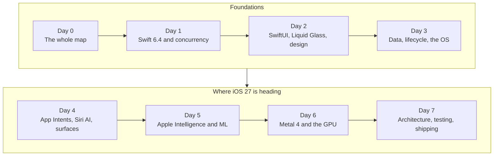

[← Back to the atlas](../README.md)

# iOS 27 in 7 days

A learning hub for one goal: in seven days, build the **mental model** an iOS developer usually picks up over about five years. That means knowing how the platform thinks, which APIs matter and why they're shaped the way they are, what goes wrong in production, and where Apple is heading.

It covers what matters in September 2026: Swift 6.4, SwiftUI with Liquid Glass, App Intents and Siri AI, Foundation Models and on-device machine learning, Metal 4, and shipping to the App Store.

**iOS 27 only.** Every API here was checked against Apple's documentation for iOS 27, Xcode 27 and Swift 6.4. Older ways of doing things appear only in short "Legacy you'll still meet" boxes, so you can recognize them in existing code.

**Prefer a single file?** Download the whole hub as a PDF: [`ios27-in-7-days.pdf`](ios27-in-7-days.pdf).

## Is this realistic?

Partly. Five years of shipping gives you scar tissue that a week can't. What a week *can* give you is the map: the concepts that everything else hangs on, the vocabulary, the instincts about what's cheap and what's expensive, and a small app you built yourself that touches every layer. After that, each new API is a detail to look up, not a mystery.

The hub is built for that. Every chapter starts with **mental models**, then the **APIs that matter** (sorted into everyday, intermediate and advanced), then short **verified code**, then the **pitfalls people learn by shipping**.

## The platform on one page

<p align="center"></p>

## The plan



| Day | Chapter | You'll understand | Cheat sheet |
|---|---|---|---|
| 0 | [The iOS mental model in one sitting](00-mental-models.md) | How the whole platform fits together, before any details | |
| 1 | [Swift 6.4 and concurrency](day1-swift-and-concurrency.md) | Value types, protocols, generics, actors, and why the compiler rejects data races | [Swift concurrency](cheatsheets/swift-concurrency.md) |
| 2 | [SwiftUI, Liquid Glass, and designing like Apple](day2-swiftui-liquid-glass-design.md) | How SwiftUI decides what to redraw, how state flows, and what makes an app feel native in iOS 27 | [SwiftUI and design](cheatsheets/swiftui-and-design.md) |
| 3 | [Data, networking, lifecycle, and living inside the OS](day3-data-lifecycle-system.md) | SwiftData, networking, background work, notifications, permissions: the rules of being a guest on the phone | |
| 4 | [App Intents, Siri AI, and the system surfaces](day4-app-intents-siri-system-surfaces.md) | How your app exports verbs and nouns to Siri, Shortcuts, Spotlight, widgets and Live Activities | [App Intents and Siri](cheatsheets/app-intents-and-siri.md) |
| 5 | [Apple Intelligence, Foundation Models, and on-device ML](day5-apple-intelligence-and-ml.md) | The on-device model, Private Cloud Compute, guided generation, tool calling, and the rest of the ML stack | [AI and ML](cheatsheets/ai-and-ml.md) |
| 6 | [Metal 4: how the GPU really works](day6-metal4-graphics-and-compute.md) | The GPU's timeline, Apple's tile-based GPUs, and the Metal 4 core API from triangle to compute to ML passes | [Metal 4](cheatsheets/metal4.md) |
| 7 | [Architecture, testing, performance, and shipping](day7-ship-like-a-senior.md) | How experienced teams structure, test, profile and ship, plus the App Review rules that trip people up | |

Plus: the [capstone app](capstone-errand.md) you build across the week, and a [glossary](glossary.md).

## A day in this plan

About 7 hours. Adjust to taste, but keep the order: models first, code second.

| Block | Time | What to do |
|---|---|---|
| Read the mental models | 1.5 h | Read slowly. Redraw the diagrams from memory on paper. |
| Skim the API tables | 0.5 h | Don't memorize. Notice what exists and which tier it's in. |
| Type the code | 1.5 h | Type the code patterns into a playground or project. Don't paste. |
| Build the capstone step | 2 h | Each chapter's last exercise adds one layer to the same app. |
| Pitfalls and quiz | 1 h | Read the pitfalls, answer the "Check yourself" questions without peeking. |
| Write it down | 0.5 h | In your own words, write the 5 most important ideas of the day. |

## What you need

- A Mac with **Xcode 27**. iOS 27 SDK, Swift 6.4.
- For Apple Intelligence features (Day 5): an **iPhone 15 Pro or later** with Apple Intelligence turned on, or a Mac with Apple silicon that supports it. The on-device model isn't available on older devices.
- A free Apple developer account runs apps on your own device. TestFlight and the App Store (Day 7) need a paid Apple Developer Program membership.

## The capstone: "Errand"

Across the week you build one small agentic app. You describe an errand ("renew my library books before Friday"). The app breaks it into steps with the on-device model, tracks them, exposes them to Siri and Shortcuts, shows progress in a Live Activity, asks before doing anything with side effects, and draws one custom visual on the GPU.

| Day | What you add |
|---|---|
| 1 | Model types, an actor-isolated store, first tests |
| 2 | SwiftUI screens with Liquid Glass, navigation, accessibility |
| 3 | SwiftData persistence, notifications, a user-started background task |
| 4 | App Intents, entities, an interactive snippet, a Live Activity, a Control |
| 5 | An on-device planner with typed output, a calendar tool, a Private Cloud Compute fallback, a consent screen |
| 6 | A progress visual as a SwiftUI shader, then as a Metal 4 render pass |
| 7 | A test suite, an Instruments pass, the App Review checklist, a TestFlight build |

It's the same shape as the ideas in the [atlas](../README.md), in miniature.

## How the content stays correct

Apple changes the platform every June. To keep this hub honest:

- Every API symbol in the chapters was looked up in Apple's documentation with [`scripts/appledoc.py`](../scripts/appledoc.py). Each chapter ends with a "Verified APIs" list showing the iOS version that introduced each symbol.
- Apple's own "what's new" notes for each framework were the primary source for iOS 27 changes.
- Where something couldn't be verified, it isn't in the text.

You can check any API yourself:

```bash
python3 scripts/appledoc.py foundationmodels/languagemodelsession
python3 scripts/appledoc.py --search swiftui glass
```

Found an error? Please open an issue. Rebuild the PDF with `cd scripts/pdf && npm install && node build.mjs`.
