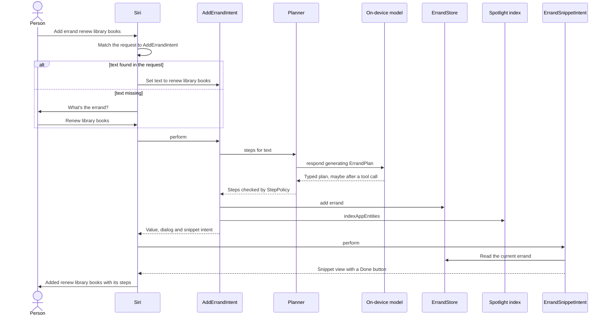

[← Learning hub](README.md)

# Capstone · Build Errand, a small agentic app, in seven steps

> By Day 7 you'll have one app that touches every layer in this hub: Swift concurrency, SwiftUI and Liquid Glass, SwiftData, the system surfaces, the on-device model and the GPU. **Time:** ~1.5 hours per step.

Each day's chapter ends with one step of this build. This page is the whole plan: what you're building, how the parts connect, where each file lives, and the key code for each step. It teaches structure. It isn't a complete listing, so you'll write small pieces (a row, a sheet) yourself. Type the code instead of pasting it.

## The pitch

You tell Errand what needs doing: "renew my library books before Friday", "find a plumber for Saturday". The on-device model breaks it into a few concrete steps. Errand tracks them, reminds you before the deadline, and shows progress on the Lock Screen. Siri, Shortcuts, Spotlight and Control Center can add errands and tick off steps. One rule never bends: a step that spends money, signs you up for something, or contacts someone waits for your explicit OK. That is the shape of most ideas in the [atlas](../ideas/README.md), in miniature: a planner, a tracker, system surfaces, and a person in the loop.

## What the finished app looks like

| Where | What the person sees | Step |
|---|---|---|
| Errand list | Errands, newest first, each with a title and "2/5". At the bottom, a Liquid Glass bar: a text field ("Describe an errand") and a sparkle button. | 2, 3 |
| Plan review sheet | The proposed steps. Steps that need approval show a raised-hand icon. One line says where the plan was made: "on this iPhone" or "with Private Cloud Compute". Save, edit or discard. | 5 |
| Errand detail | A GPU-drawn progress ring, the steps in order with the next one highlighted, an **Approve** button on steps that need it, and **Track on Lock Screen**. | 2, 4, 6 |
| Consent sheet (first run) | What runs on the device, when text may go to Private Cloud Compute (off by default), and a button to allow calendar access. | 5 |
| Import sheet | Paste a list, one errand per line. If you leave the app, the system shows the import's progress and a Cancel button. | 3 |
| Siri | "Add an errand in Errand." Siri asks what the errand is, then shows a snippet with the planned steps and a Done button for the next one. | 4, 5 |
| Shortcuts app | **Add Errand** and **Complete Next Step** actions, plus App Shortcut tiles. | 4 |
| Spotlight | Search "library" and the errand appears. Tapping it opens that errand. | 4 |
| Lock Screen and Dynamic Island | A Live Activity: title, progress bar, next step and a Done button. If the next step needs approval, the button becomes "Open Errand to approve". | 4 |
| Control Center, Lock Screen, Action button | A **Next Step Done** control. | 4 |
| Notifications | An hour before an errand is due: its title and the next step. | 3 |

## Architecture

Three rules shape the design:

1. **One writer.** Every write goes through `ErrandStore`, an actor over SwiftData. Views read with `@Query`. Intents, the import job and the UI all call the same actor, so there's one place where the approval rule is enforced.
2. **Values cross boundaries, models don't.** The actor returns `Errand` structs. Its `@Model` objects never leave it. Views get their own from `@Query`, on the main context.
3. **Model output is untrusted.** The planner's typed output passes through `StepPolicy`, which can add approvals but never remove them.

```mermaid
flowchart LR
  subgraph APP["App process"]
    V["SwiftUI views<br/>list, detail, compose bar, consent"] -->|"commands"| OM["ErrandsModel<br/>Observable, main actor"]
    V -->|"reads with Query"| DB[("SwiftData store")]
    OM -->|"await"| ST["ErrandStore<br/>ModelActor"]
    ST --> DB
    OM --> PL["Planner"]
    PL --> FM["LanguageModelSession<br/>Generable ErrandPlan"]
    FM --> TL["BusyTimesTool"]
    TL --> EK["EventKit"]
    FM -.->|"opt-in fallback"| PCC["Private Cloud Compute"]
    PL --> SP["StepPolicy<br/>validates model output"]
    AI["App Intents<br/>Add, Complete Next Step, Snippet, Open"] --> ST
    AI --> PL
    AI --> LA["ActivityKit<br/>request, update, end"]
    BG["ImportJob<br/>BGContinuedProcessingTask"] --> ST
    OM --> UN["UserNotifications"]
    V --> SH["ProgressRing<br/>SwiftUI shader"]
  end
  subgraph EXT["Widget extension process"]
    LAV["Live Activity views"]
    CW["NextStepControl"]
  end
  SYS["Siri, Shortcuts, Spotlight"] --> AI
  LA --> LAV
  LAV -->|"Done button"| AI
  CW -->|"button"| AI
```



Here is "Add errand renew library books" said to Siri, end to end. The system resolves an intent's parameters before it calls `perform()`: from what the person said, or by asking.



## Project layout

```text
Errand/                           Xcode project, deployment target iOS 27.0
├─ Errand/                        App target
│  ├─ ErrandApp.swift             @main, opens the database, registers dependencies
│  ├─ Models/ErrandsModel.swift   @Observable commands and UI state
│  ├─ Views/                      ErrandListView, ComposeBar, ErrandDetailView, PlanReviewSheet, AIConsentView
│  ├─ Intents/OpenErrandIntent.swift   needs the app's navigation, so it lives here
│  ├─ System/                     Reminders.swift, ImportJob.swift
│  ├─ Graphics/                   ProgressRing.swift, ProgressRing.metal
│  └─ PrivacyInfo.xcprivacy
├─ ErrandWidgets/                 Widget extension target
│  ├─ ErrandWidgets.swift         @main WidgetBundle
│  ├─ ErrandLiveActivity.swift    ActivityConfiguration and Dynamic Island
│  └─ NextStepControl.swift       ControlWidget
└─ ErrandKit/                     Local Swift package, linked by both targets
   ├─ Sources/ErrandKit/
   │  ├─ Domain/                  Errand, ErrandStep, StepStatus, StepPolicy
   │  ├─ Persistence/             ErrandRecord, StepRecord, ErrandStore, ErrandDatabase
   │  ├─ Planning/                ErrandPlan, Planner, BusyTimesTool
   │  ├─ Intents/                 ErrandEntity, ErrandQuery, AddErrandIntent, CompleteNextStepIntent,
   │  │                           ErrandSnippetIntent, ErrandShortcuts, ErrandKitPackage
   │  └─ LiveActivity/            ErrandActivityAttributes, ErrandActivity
   └─ Tests/ErrandKitTests/       Swift Testing suites
```

**Why a package?** The widget extension needs `ErrandActivityAttributes` and `CompleteNextStepIntent`, and the intent needs the store. A package lets both targets share that code without ticking target-membership boxes file by file. It also helps with isolation. The Day 0 setup gives the app target main-actor default isolation, while a package target defaults to `nonisolated` unless its manifest says otherwise ([SE-0466](https://github.com/swiftlang/swift-evolution/blob/main/proposals/0466-control-default-actor-isolation.md)). That is the right default for domain code that actors and intents call from anywhere. App intents can live in a Swift package. Declare `public struct ErrandKitPackage: AppIntentsPackage {}` in the package, then list it in `includedPackages` of an `AppIntentsPackage` in the app and in the widget extension.

| Target | Setting | Value | Why |
|---|---|---|---|
| App | Info.plist `NSSupportsLiveActivities` | `YES` | Lets the app start Live Activities |
| App | Info.plist `BGTaskSchedulerPermittedIdentifiers` | `com.example.errand.import` | `register(forTaskWithIdentifier:using:launchHandler:)` returns `false` for identifiers missing from this list |
| App | Info.plist `NSCalendarsFullAccessUsageDescription` | "Errand checks when you're busy so it can schedule steps." | Required before you read calendar events |
| App | Entitlement `com.apple.developer.private-cloud-compute` | `true` | Only for the optional Private Cloud Compute fallback. It's a managed entitlement you request from Apple. |
| Widget extension | Created from the Widget Extension template with **Include Live Activity** and **Include Control** checked | — | The template creates the extension and its widget bundle |
| Neither | App Groups (`com.apple.security.application-groups`) | Not needed | The extension never opens the store. It draws the state it's handed, and its buttons run a `LiveActivityIntent`, which the system runs in the app's process. Add a group only if you later add a Home Screen widget that reads errands. |
| Neither | Background GPU Access | Not needed | The import job doesn't use the GPU |

Local notifications need no capability. You ask for permission at runtime.

---

## Step 1 · Day 1: model types and an actor-isolated store

**Goal:** domain types as values, one actor that owns every change, and the approval rule enforced in code and in tests. Chapter: [Swift 6.4 and concurrency](day1-swift-and-concurrency.md).

**Files:** create the Xcode project (Day 0, Practice 5). Then **File > New > Package**, name it `ErrandKit`, add it to the project, set its platform to iOS 27, and link it to the app target. Create `Domain/Errand.swift`, `Domain/ErrandStore.swift` and `Tests/ErrandKitTests/ErrandStoreTests.swift`.

The types are structs and enums of `Sendable` parts, so they can cross into and out of actors freely:

```swift
import Foundation

public enum StepStatus: String, Codable, Sendable {
    case todo, needsApproval, approved, done
}

public struct ErrandStep: Identifiable, Hashable, Codable, Sendable {
    public let id: UUID
    public var title: String
    public var status: StepStatus

    public init(id: UUID = UUID(), title: String, status: StepStatus = .todo) {
        self.id = id; self.title = title; self.status = status
    }
}

public struct Errand: Identifiable, Hashable, Codable, Sendable {
    public let id: UUID
    public var title: String
    public var due: Date?
    public var steps: [ErrandStep]

    public init(id: UUID = UUID(), title: String, due: Date? = nil, steps: [ErrandStep] = []) {
        self.id = id; self.title = title; self.due = due; self.steps = steps
    }

    public var doneCount: Int { steps.count(where: { $0.status == .done }) }
    public var nextStep: ErrandStep? { steps.first { $0.status != .done } }
}

public enum ErrandError: Error, Equatable { case notFound, needsApproval }
```

The store is an actor. Day 3 swaps its dictionary for SwiftData and keeps the same method names:

```swift
public actor ErrandStore {
    private var errands: [UUID: Errand] = [:]
    public init() {}

    public func add(_ errand: Errand) { errands[errand.id] = errand }
    public func all() -> [Errand] { errands.values.sorted { $0.title < $1.title } }

    @discardableResult
    public func approve(stepID: UUID, in errandID: UUID) throws -> Errand {
        try update(stepID, in: errandID) { $0.status = .approved }
    }

    @discardableResult
    public func complete(stepID: UUID, in errandID: UUID) throws -> Errand {
        try update(stepID, in: errandID) { step in
            guard step.status != .needsApproval else { throw ErrandError.needsApproval }
            step.status = .done
        }
    }

    private func update(_ stepID: UUID, in errandID: UUID,
                        _ change: (inout ErrandStep) throws -> Void) throws -> Errand {
        guard var errand = errands[errandID],
              let index = errand.steps.firstIndex(where: { $0.id == stepID })
        else { throw ErrandError.notFound }
        try change(&errand.steps[index])
        errands[errandID] = errand
        return errand
    }
}
```

- `update` reads, changes and writes with no `await` in between. An `await` inside an actor method is a point where other callers can run (reentrancy), so a read-then-write that spans one can lose updates.
- The approval rule lives in the store, not in a view. Every caller, including Siri, goes through it.

Two tests pin down the rules:

```swift
import Testing
@testable import ErrandKit

struct ErrandStoreTests {
    let store = ErrandStore()   // Swift Testing creates a new instance for each test

    @Test func completingAStepCountsIt() async throws {
        let step = ErrandStep(title: "Find library card")
        let errand = Errand(title: "Renew books", steps: [step])
        await store.add(errand)
        let updated = try await store.complete(stepID: step.id, in: errand.id)
        #expect(updated.doneCount == 1)
        #expect(updated.nextStep == nil)
    }

    @Test func approvalComesBeforeCompletion() async throws {
        let step = ErrandStep(title: "Pay the late fee", status: .needsApproval)
        let errand = Errand(title: "Renew books", steps: [step])
        await store.add(errand)
        await #expect(throws: ErrandError.needsApproval) {
            try await store.complete(stepID: step.id, in: errand.id)
        }
        try await store.approve(stepID: step.id, in: errand.id)
        let done = try await store.complete(stepID: step.id, in: errand.id)
        #expect(done.doneCount == 1)
    }
}
```

**Done when:**
- [ ] `ErrandKit` builds in the Swift 6 language mode with zero warnings.
- [ ] Both tests pass with **Product > Test** on an iOS 27 simulator.
- [ ] You can say why `update` must not contain an `await`.

**If you're stuck:**
- *"Main actor-isolated conformance … cannot be used in actor-isolated context."* The types ended up in the app target, where everything defaults to the main actor. Move them to the package, or mark the type `nonisolated struct` ([SE-0449](https://github.com/swiftlang/swift-evolution/blob/main/proposals/0449-nonisolated-for-global-actor-cutoff.md)).
- *"Non-sendable type … cannot cross actor boundary."* Something in your model is a class. Keep domain types made of values.
- Tests don't show up in the Test navigator: the test file must `import Testing`, and the test target must be in the scheme.

---

## Step 2 · Day 2: SwiftUI screens, Liquid Glass, navigation, accessibility

**Goal:** a list, a compose bar and a detail screen, driven by one `@Observable` model, with glass only on controls. Chapter: [SwiftUI, Liquid Glass, and designing like Apple](day2-swiftui-liquid-glass-design.md).

**Files:** `Models/ErrandsModel.swift`, `Views/ErrandListView.swift`, `Views/ComposeBar.swift`, `Views/ErrandDetailView.swift`. In `ErrandApp`, create one `ErrandsModel(store: ErrandStore())` and pass it down with `.environment(model)`.

The model holds UI state and turns taps into calls on the actor. In the app target it's main-actor isolated by default:

```swift
import Foundation
import Observation
import ErrandKit

@Observable
final class ErrandsModel {
    private(set) var errands: [Errand] = []   // Day 3 replaces this with @Query
    var draft = ""
    let store: ErrandStore

    init(store: ErrandStore) { self.store = store }

    func load() async { errands = await store.all() }

    func submitDraft() async {
        let title = draft.trimmingCharacters(in: .whitespacesAndNewlines)
        guard !title.isEmpty else { return }
        draft = ""
        await store.add(Errand(title: title, steps: [ErrandStep(title: "Break this into steps")]))
        await load()
    }
}
```

The list pushes by value. The destination modifier sits outside the `List`, because Apple's docs say not to put it inside a lazy container:

```swift
import SwiftUI
import ErrandKit

struct ErrandListView: View {
    @Environment(ErrandsModel.self) private var model

    var body: some View {
        NavigationStack {
            List(model.errands) { errand in
                NavigationLink(value: errand.id) { ErrandRow(errand: errand) }
            }
            .navigationTitle("Errands")
            .navigationDestination(for: UUID.self) { id in ErrandDetailView(errandID: id) }
            .safeAreaInset(edge: .bottom) { ComposeBar(model: model) }
            .task { await model.load() }
        }
    }
}

struct ErrandRow: View {
    let errand: Errand

    var body: some View {
        HStack {
            Text(errand.title)
            Spacer()
            Text("\(errand.doneCount)/\(errand.steps.count)").foregroundStyle(.secondary)
        }
        .accessibilityElement(children: .ignore)
        .accessibilityLabel(errand.title)
        .accessibilityValue("\(errand.doneCount) of \(errand.steps.count) steps done")
    }
}
```

The compose bar is the one place with custom glass. `GlassEffectContainer` groups nearby glass shapes so they render and morph together:

```swift
struct ComposeBar: View {
    @Bindable var model: ErrandsModel

    var body: some View {
        GlassEffectContainer(spacing: 12) {
            HStack(spacing: 12) {
                TextField("Describe an errand", text: $model.draft)
                    .padding(.horizontal, 16)
                    .padding(.vertical, 12)
                    .glassEffect(.regular.interactive(), in: .capsule)
                    .onSubmit { Task { await model.submitDraft() } }
                Button("Plan errand", systemImage: "sparkles") {
                    Task { await model.submitDraft() }
                }
                .labelStyle(.iconOnly)
                .buttonStyle(.glassProminent)
            }
        }
        .padding(.horizontal)
    }
}
```

- `.labelStyle(.iconOnly)` hides the text but keeps "Plan errand" as the VoiceOver label. Apple's Liquid Glass guidance: "Provide an accessibility label for every icon."
- The same guidance says "Avoid overusing Liquid Glass effects." Rows and backgrounds stay plain. The navigation bar gets glass from the system.
- `ErrandDetailView` shows the steps with a `ProgressView` for now (Day 6 replaces it). A step with `.needsApproval` gets an **Approve** button with `.buttonStyle(.glass)`.

**Done when:**
- [ ] You can add an errand, open it, and go back.
- [ ] VoiceOver reads a row as one element: "Renew books, 0 of 1 steps done".
- [ ] At the largest accessibility text size, nothing is clipped and the compose bar still works.
- [ ] With Reduce Transparency turned on in Accessibility settings, the bar is still readable.

**If you're stuck:**
- Tapping a row does nothing: check that the `navigationDestination` type (`UUID`) matches the `NavigationLink` value type.
- The glass looks flat: glass needs content behind it. Add a few errands and scroll them under the bar.
- The list doesn't refresh: make sure you assign `errands` on the model, not on a copy.

---

## Step 3 · Day 3: SwiftData, notifications, a user-started background task

**Goal:** errands survive relaunch, the person gets a reminder before a deadline, and a long import keeps going when they leave the app. Chapter: [Data, networking, lifecycle, and living inside the OS](day3-data-lifecycle-system.md).

**Files:** `Persistence/Records.swift`, `Persistence/ErrandStore.swift` (replaces Day 1's), `Persistence/ErrandDatabase.swift`, `System/Reminders.swift`, `System/ImportJob.swift`.

The stored models are classes managed by SwiftData. The domain structs stay as they are:

```swift
import Foundation
import SwiftData

@Model
public final class ErrandRecord {
    @Attribute(.unique) public var id: UUID
    public var title: String
    public var due: Date?
    public var createdAt = Date.now
    @Relationship(deleteRule: .cascade, inverse: \StepRecord.errand)
    public var steps: [StepRecord] = []

    init(id: UUID, title: String, due: Date?) { self.id = id; self.title = title; self.due = due }
}

@Model
public final class StepRecord {
    public var id: UUID
    public var title: String
    public var order: Int            // an explicit sort key, so step order never depends on storage
    public var status: StepStatus
    public var errand: ErrandRecord?

    init(_ step: ErrandStep, order: Int) {
        id = step.id; title = step.title; status = step.status; self.order = order
    }
}

extension Errand {
    public init(_ record: ErrandRecord) {
        self.init(id: record.id, title: record.title, due: record.due,
                  steps: record.steps.sorted { $0.order < $1.order }
                      .map { ErrandStep(id: $0.id, title: $0.title, status: $0.status) })
    }
}
```

The store becomes a model actor: an actor with its own `ModelContext` and an executor that serializes all code running on it. It keeps its method names and still takes and returns `Errand` values. The step is now a class instance, so `update` changes it in place and saves:

```swift
@ModelActor
public actor ErrandStore {
    public func add(_ errand: Errand) throws {
        let record = ErrandRecord(id: errand.id, title: errand.title, due: errand.due)
        modelContext.insert(record)
        record.steps = errand.steps.enumerated().map { StepRecord($1, order: $0) }
        try modelContext.save()
    }

    public func errand(id: UUID) throws -> Errand? { try record(id).map(Errand.init) }

    // approve(stepID:in:) and complete(stepID:in:) keep their Day 1 bodies unchanged.

    private func update(_ stepID: UUID, in errandID: UUID,
                        _ change: (StepRecord) throws -> Void) throws -> Errand {
        guard let record = try record(errandID),
              let step = record.steps.first(where: { $0.id == stepID })
        else { throw ErrandError.notFound }
        try change(step)
        try modelContext.save()
        return Errand(record)
    }

    private func record(_ id: UUID) throws -> ErrandRecord? {
        var descriptor = FetchDescriptor<ErrandRecord>(predicate: #Predicate { $0.id == id })
        descriptor.fetchLimit = 1
        return try modelContext.fetch(descriptor).first
    }
}
```

Add a small `public enum ErrandDatabase` with `open(inMemory: Bool = false) throws -> (container: ModelContainer, store: ErrandStore)`. It builds a `ModelContainer(for: ErrandRecord.self, StepRecord.self, configurations: ModelConfiguration(isStoredInMemoryOnly: inMemory))` and an `ErrandStore(modelContainer:)` on it. Then the app never needs to know the schema, and tests get a fresh in-memory database with one call. Wire it up in the app:

```swift
import AppIntents
import SwiftData
import SwiftUI
import ErrandKit

@main
struct ErrandApp: App {
    private let container: ModelContainer
    private let model: ErrandsModel

    init() {
        let database: (container: ModelContainer, store: ErrandStore)
        do { database = try ErrandDatabase.open() }
        catch { fatalError("Could not open the errand store: \(error)") }
        let store = database.store
        AppDependencyManager.shared.add(dependency: store)   // for Day 4's intents
        container = database.container
        model = ErrandsModel(store: store)
    }

    var body: some Scene {
        WindowGroup { ErrandListView().environment(model) }
            .modelContainer(container)
    }
}
```

In `ErrandListView`, replace `model.errands` with `@Query(sort: \ErrandRecord.createdAt, order: .reverse) private var records: [ErrandRecord]` and show `Errand(record)` in each row. Delete `errands` and `load()` from `ErrandsModel`, and add `try` where `add` now throws. The model keeps the commands: add, approve, complete. Reads come from `@Query`, writes go through the actor.

Reminders. Ask for permission when the person first sets a due date, not at launch:

```swift
import UserNotifications
import ErrandKit

enum Reminders {
    static func requestPermission() async -> Bool {
        (try? await UNUserNotificationCenter.current()
            .requestAuthorization(options: [.alert, .sound])) ?? false
    }

    static func schedule(_ errand: Errand) async throws {
        guard let due = errand.due else { return }
        let content = UNMutableNotificationContent()
        content.title = errand.title
        content.body = "Next: \(errand.nextStep?.title ?? "review the plan")"
        let fireAt = Calendar.current.dateComponents(
            [.year, .month, .day, .hour, .minute], from: due.addingTimeInterval(-3600))
        let request = UNNotificationRequest(
            identifier: errand.id.uuidString,   // same id: the new request replaces the pending one
            content: content,
            trigger: UNCalendarNotificationTrigger(dateMatching: fireAt, repeats: false))
        try await UNUserNotificationCenter.current().add(request)
    }
}
```

The import runs as a `BGContinuedProcessingTask`: a task that starts in the foreground because the person tapped something, and may keep running in the background while the system shows its progress. Report progress honestly. The system is more likely to end tasks that show little progress.

```swift
import BackgroundTasks
import ErrandKit

@MainActor
final class ImportJob {
    static let id = "com.example.errand.import"   // also in BGTaskSchedulerPermittedIdentifiers
    private let store: ErrandStore
    private var lines: [String] = []
    private var isRegistered = false

    init(store: ErrandStore) { self.store = store }

    func start(_ lines: [String]) async throws {          // call only from a button action
        self.lines = lines
        if !isRegistered {
            isRegistered = BGTaskScheduler.shared.register(
                forTaskWithIdentifier: Self.id, using: .main) { [weak self] task in
                guard let task = task as? BGContinuedProcessingTask else { return }
                self?.run(task)
            }
        }
        try await Self.submit(BGContinuedProcessingTaskRequest(
            identifier: Self.id, title: "Importing errands", subtitle: "\(lines.count) to add"))
    }

    @concurrent private static func submit(_ request: BGTaskRequest) async throws {
        try await BGTaskScheduler.shared.submitTaskRequest(request)   // docs: not on the main thread
    }

    private func run(_ task: BGContinuedProcessingTask) {
        let lines = self.lines, store = self.store
        let work = Task {
            task.progress.totalUnitCount = Int64(lines.count)
            for line in lines {
                try Task.checkCancellation()
                try await store.add(Errand(title: line))
                task.progress.completedUnitCount += 1
            }
        }
        task.expirationHandler = { @Sendable in work.cancel() }   // the person tapped Cancel
        Task { task.setTaskCompleted(success: (try? await work.value) != nil) }
    }
}
```

- `submitTaskRequest(_:)` is new in iOS 27 and replaces the deprecated `submit(_:)`. Its docs say not to call it from the main thread, hence the `@concurrent` helper.
- `using: .main` runs the launch handler on the main queue, which matches the main-actor isolation the closure gets from its context.
- The expiration handler is marked `@Sendable` so it isn't treated as main-actor code. The system may call it from any queue.

**Done when:**
- [ ] Errands survive a force-quit and relaunch.
- [ ] An errand due in 61 minutes produces a notification about a minute later.
- [ ] Import 200 lines, go to the Home Screen, and watch the system's progress UI count up. Cancel works.
- [ ] Day 1's tests pass against the new store, created with `try ErrandDatabase.open(inMemory: true).store` in the suite's `init() throws`.

**If you're stuck:**
- `register` returns `false`: the identifier is missing from `BGTaskSchedulerPermittedIdentifiers`, or spelled differently.
- Import stops without calling your expiration handler: Apple's docs note the system cancels running tasks when the person closes the app in the app switcher, without telling the app. Make imports safe to rerun, for example by skipping titles that already exist.
- The list doesn't show new errands: check that the actor calls `save()`. `@Query` shows what's in the store, and unsaved changes in the actor's context aren't there yet.

---

## Step 4 · Day 4: App Intents, entities, a snippet, a Live Activity, a Control

**Goal:** Errand's verbs (add, complete next step) and nouns (errands) become available to Siri, Shortcuts, Spotlight, the Lock Screen and Control Center. Chapter: [App Intents, Siri AI, and the system surfaces](day4-app-intents-siri-system-surfaces.md).

**Files:** in `ErrandKit/Intents/`: `ErrandEntity.swift`, `AddErrandIntent.swift`, `ErrandSnippetIntent.swift`, `CompleteNextStepIntent.swift`, `ErrandShortcuts.swift`. In `ErrandKit/LiveActivity/`: `ErrandActivity.swift`. Add the widget extension target, then `ErrandLiveActivity.swift` and `NextStepControl.swift`. In the app: `OpenErrandIntent.swift`.

An **entity** is a noun the system can refer to. Its **query** is how the system finds entities by ID, by text, or as suggestions:

```swift
import AppIntents

public struct ErrandEntity: IndexedEntity {
    public static let typeDisplayRepresentation: TypeDisplayRepresentation = "Errand"
    public static let defaultQuery = ErrandQuery()

    public let id: UUID
    @Property(title: "Title") public var title: String
    public var progress: String

    public var displayRepresentation: DisplayRepresentation {
        DisplayRepresentation(title: "\(title)", subtitle: "\(progress)")
    }

    public init(_ errand: Errand) {
        id = errand.id
        progress = "\(errand.doneCount) of \(errand.steps.count) steps done"
        title = errand.title
    }
}

public struct ErrandQuery: EntityStringQuery {
    @Dependency private var store: ErrandStore
    public init() {}

    public func entities(for identifiers: [UUID]) async throws -> [ErrandEntity] {
        try await store.errands(ids: identifiers).map(ErrandEntity.init)
    }
    public func entities(matching string: String) async throws -> [ErrandEntity] {
        try await store.search(string).map(ErrandEntity.init)
    }
    public func suggestedEntities() async throws -> [ErrandEntity] {
        try await store.openErrands().map(ErrandEntity.init)
    }
}
```

`errands(ids:)`, `search(_:)` and `openErrands()` are three small fetches you add to the store. `@Dependency` gets the `ErrandStore` the app registered in `ErrandApp.init`, which runs even when the system launches the app in the background to perform an intent.

The **intent** is a verb. The **App Shortcut** gives it phrases that work as soon as the app is installed:

```swift
import AppIntents
import CoreSpotlight

public struct AddErrandIntent: AppIntent {
    public static let title: LocalizedStringResource = "Add Errand"
    public static let description = IntentDescription("Adds an errand and plans its steps.")

    @Parameter(title: "Errand", requestValueDialog: "What's the errand?")
    public var text: String
    @Dependency private var store: ErrandStore

    public init() {}

    public func perform() async throws
        -> some ReturnsValue<ErrandEntity> & ProvidesDialog & ShowsSnippetIntent {
        let errand = Errand(title: text, steps: [ErrandStep(title: "Break this into steps")]) // Day 5 plans here
        try await store.add(errand)
        let entity = ErrandEntity(errand)
        try await CSSearchableIndex.default().indexAppEntities([entity])
        return .result(value: entity, dialog: "Added \(text).",
                       snippetIntent: ErrandSnippetIntent(errand: entity))
    }
}

public struct ErrandShortcuts: AppShortcutsProvider {
    public static var appShortcuts: [AppShortcut] {
        AppShortcut(intent: AddErrandIntent(),
                    phrases: ["Add an errand in \(.applicationName)", "New \(.applicationName) errand"],
                    shortTitle: "Add Errand", systemImageName: "plus.circle")
        AppShortcut(intent: CompleteNextStepIntent(),
                    phrases: ["Next step done in \(.applicationName)"],
                    shortTitle: "Next Step Done", systemImageName: "checkmark.circle")
    }
}
```

The **snippet** is a view the system shows after the intent. Because it's a `SnippetIntent`, its buttons work, and the system calls `perform()` again after each tap:

```swift
public struct ErrandSnippetIntent: SnippetIntent {
    public static let title: LocalizedStringResource = "Errand Snippet"
    @Parameter public var errand: ErrandEntity
    @Dependency private var store: ErrandStore

    public init() {}
    public init(errand: ErrandEntity) { self.errand = errand }

    public func perform() async throws -> some IntentResult & ShowsSnippetView {
        let current = try await store.errand(id: errand.id)   // read fresh state, change nothing
        return .result(view: ErrandSnippetView(errand: current))
    }
}
```

`ErrandSnippetView` is a plain SwiftUI view in the package. It takes the optional `Errand`, lists its steps, and adds `Button(intent: CompleteNextStepIntent(errand: ErrandEntity(errand)))` for the next one.

One intent completes a step from Siri, Shortcuts, the snippet, the Live Activity and the Control. It adopts `LiveActivityIntent`, so the system runs it in the app's process, where the store and the Live Activity live. It still asks before an approval step, as a second line of defense:

```swift
public struct CompleteNextStepIntent: LiveActivityIntent {
    public static let title: LocalizedStringResource = "Complete Next Step"
    @Parameter(title: "Errand") public var errand: ErrandEntity?   // nil: the tracked errand
    @Dependency private var store: ErrandStore

    public init() {}
    public init(errand: ErrandEntity) { self.errand = errand }

    public func perform() async throws -> some IntentResult {
        guard let id = errand?.id ?? ErrandActivity.trackedErrandID,
              let step = try await store.errand(id: id)?.nextStep
        else { throw AppIntentError(description: "There's no errand with a next step.") }
        if step.status == .needsApproval {
            try await requestConfirmation(dialog: "\"\(step.title)\" needs your OK. Approve it?")
            try await store.approve(stepID: step.id, in: id)
        }
        let updated = try await store.complete(stepID: step.id, in: id)
        await ErrandActivity.update(updated)
        ErrandSnippetIntent.reload()
        return .result()
    }
}
```

`requestConfirmation` returns if the person confirms and throws if they cancel, so nothing after it runs without a yes.

The **Live Activity**: attributes are fixed for its lifetime, and `ContentState` is what you update:

```swift
import ActivityKit

public struct ErrandActivityAttributes: ActivityAttributes {
    public struct ContentState: Codable, Hashable, Sendable {
        public var done: Int, total: Int
        public var nextStep: String?
        public var nextNeedsApproval: Bool
    }
    public var errandID: UUID
    public var title: String
}

public enum ErrandActivity {
    public static var trackedErrandID: UUID? {
        Activity<ErrandActivityAttributes>.activities.first?.attributes.errandID
    }

    public static func start(_ errand: Errand) async throws {   // from a tap in the app
        guard ActivityAuthorizationInfo().areActivitiesEnabled else { return }
        for old in Activity<ErrandActivityAttributes>.activities {
            await old.end(nil, dismissalPolicy: .immediate)          // track one errand at a time
        }
        _ = try Activity.request(
            attributes: ErrandActivityAttributes(errandID: errand.id, title: errand.title),
            content: ActivityContent(state: state(errand), staleDate: nil))
    }

    public static func update(_ errand: Errand) async {
        for activity in Activity<ErrandActivityAttributes>.activities
        where activity.attributes.errandID == errand.id {
            let content = ActivityContent(state: state(errand), staleDate: nil)
            if errand.nextStep == nil { await activity.end(content) } else { await activity.update(content) }
        }
    }

    static func state(_ e: Errand) -> ErrandActivityAttributes.ContentState {
        .init(done: e.doneCount, total: e.steps.count, nextStep: e.nextStep?.title,
              nextNeedsApproval: e.nextStep?.status == .needsApproval)
    }
}
```

In the widget extension, the Live Activity and the Control share one widget bundle:

```swift
import SwiftUI
import WidgetKit
import ErrandKit

struct ErrandLiveActivity: Widget {
    var body: some WidgetConfiguration {
        ActivityConfiguration(for: ErrandActivityAttributes.self) { context in
            ErrandActivityView(title: context.attributes.title, state: context.state).padding()
        } dynamicIsland: { context in
            DynamicIsland {
                DynamicIslandExpandedRegion(.bottom) {
                    ErrandActivityView(title: context.attributes.title, state: context.state)
                }
            } compactLeading: {
                Image(systemName: "checklist")
            } compactTrailing: {
                Text("\(context.state.done)/\(context.state.total)")
            } minimal: {
                Text("\(context.state.done)")
            }
        }
    }
}

struct NextStepControl: ControlWidget {
    var body: some ControlWidgetConfiguration {
        StaticControlConfiguration(kind: "com.example.errand.next-step") {
            ControlWidgetButton(action: CompleteNextStepIntent()) {
                Label("Next Step Done", systemImage: "checkmark.circle")
            }
        }
        .displayName("Complete Next Step")
    }
}

@main
struct ErrandWidgets: WidgetBundle {
    var body: some Widget {
        ErrandLiveActivity()
        NextStepControl()
    }
}
```

`ErrandActivityView` shows the title, a `ProgressView(value:total:)`, and either `Button(intent: CompleteNextStepIntent())` or, when `nextNeedsApproval` is true, the text "Open Errand to approve". The confirmation prompt needs a place to appear, so approval happens in the app, not from the Lock Screen. Keep these views to standard SwiftUI. The system renders Live Activities from an archived view representation, not by running your code.

Last, add `OpenErrandIntent: OpenIntent` with `@Parameter(title: "Errand") var target: ErrandEntity` in the app target. Apple's Spotlight article uses this pattern so that tapping a search result opens that item. Its `perform()` pushes the errand's ID onto your navigation path.

**Done when:**
- [ ] "Add an errand in Errand" works with Siri, and the snippet's Done button ticks a step.
- [ ] Both actions appear in the Shortcuts app with no setup.
- [ ] Spotlight finds an errand by a word in its title, and tapping it opens that errand.
- [ ] **Track on Lock Screen** starts the Live Activity. Its Done button and the Control both advance it. On an approval step, the Live Activity shows "Open Errand to approve".

**If you're stuck:**
- The phrase does nothing: App Shortcuts are available once the app is installed, so first check that the Shortcuts app lists them. If it doesn't, `ErrandKitPackage` is probably missing from the app's `includedPackages`.
- A button in the Live Activity does nothing: the intent must be `LiveActivityIntent`, and `ErrandKit` must be linked to both targets.
- `@Dependency` crashes with a missing dependency: register it in `ErrandApp.init`, before any intent can run.
- The snippet or dialog doesn't appear with Siri AI: Apple notes that the system "might not display `IntentDialog` or `ShowsSnippetView`" there. Return a value too, as `AddErrandIntent` does.

---

## Step 5 · Day 5: the on-device planner, a tool, a PCC fallback, a consent screen

**Goal:** the model turns a sentence into typed steps, can look at the calendar, falls back to Private Cloud Compute (PCC, Apple's server-side model) only with consent, and never gets the last word on approvals. Chapter: [Apple Intelligence, Foundation Models, and on-device ML](day5-apple-intelligence-and-ml.md).

**Files:** in `ErrandKit/Planning/`: `ErrandPlan.swift`, `BusyTimesTool.swift`, `Planner.swift`. In `Domain/`: `StepPolicy.swift`. In the app: `Views/AIConsentView.swift`, `Views/PlanReviewSheet.swift`.

`@Generable` makes the model produce a Swift type through constrained sampling, so there's no JSON to parse. The tool gives the model busy times, not event titles. Send the model only what the task needs:

```swift
import EventKit
import FoundationModels

@Generable
struct PlannedStep {
    @Guide(description: "One short imperative step")
    var title: String
    @Guide(description: "True if the step spends money, signs up, or contacts someone")
    var needsApproval: Bool
}

@Generable
struct ErrandPlan {
    @Guide(description: "Steps in the order to do them", .maximumCount(6))
    var steps: [PlannedStep]
}

struct BusyTimesTool: Tool {
    let name = "findBusyTimes"
    let description = "Lists when the person is busy over the next few days."

    @Generable
    struct Arguments {
        @Guide(description: "Days ahead to check", .range(1...7))
        var days: Int
    }

    func call(arguments: Arguments) async throws -> String {
        guard EKEventStore.authorizationStatus(for: .event) == .fullAccess else {
            return "Calendar access is off. Plan without it."
        }
        let store = EKEventStore()
        let end = Calendar.current.date(byAdding: .day, value: arguments.days, to: .now) ?? .now
        let events = store.events(matching: store.predicateForEvents(withStart: .now, end: end, calendars: nil))
        let busy = events.prefix(15).map { "\($0.startDate.formatted()) to \($0.endDate.formatted())" }
        return busy.isEmpty ? "Nothing scheduled." : "Busy: " + busy.joined(separator: "; ")
    }
}
```

The planner uses one short session per request. Both models conform to the `LanguageModel` protocol (iOS 27), so the same code drives either:

```swift
import Foundation
import FoundationModels

public struct Planner: Sendable {
    public init() {}

    /// Returns nil when no model is available, so the caller shows the manual path.
    public func steps(for text: String, allowCloud: Bool) async throws -> [ErrandStep]? {
        if SystemLanguageModel.default.isAvailable {
            do { return try await steps(for: text, using: SystemLanguageModel.default) }
            catch LanguageModelError.contextSizeExceeded where allowCloud {
                // Too big for the on-device context window: try Private Cloud Compute below.
            }
        }
        let cloud = PrivateCloudComputeLanguageModel()
        guard allowCloud, cloud.isAvailable, !cloud.quotaUsage.isLimitReached else { return nil }
        return try await steps(for: text, using: cloud)
    }

    private func steps(for text: String, using model: some LanguageModel) async throws -> [ErrandStep] {
        let session = LanguageModelSession(model: model, tools: [BusyTimesTool()], instructions: """
            Turn a personal errand into at most six short, concrete steps, in order. \
            Set needsApproval for any step that spends money, signs up for something, \
            or contacts a person or business. Call findBusyTimes if there is a deadline.
            """)
        let prompt = "Today is \(Date.now.formatted(date: .complete, time: .omitted)). Errand: \(text)"
        let plan = try await session.respond(to: prompt, generating: ErrandPlan.self).content
        return StepPolicy.steps(from: plan.steps.map { (title: $0.title, needsApproval: $0.needsApproval) })
    }
}
```

`StepPolicy` treats model output as untrusted input. It doesn't know which model produced it, so the same check also covers steps a person types in:

```swift
public enum StepPolicy {
    static let maxSteps = 6
    static let riskyWords: Set<String> = ["pay", "buy", "order", "book", "call", "email",
                                          "text", "message", "send", "sign", "subscribe", "cancel"]

    /// Trims, caps, and adds approvals the model missed. It can add approvals, never remove one.
    public static func steps(from proposals: [(title: String, needsApproval: Bool)]) -> [ErrandStep] {
        proposals.prefix(maxSteps).compactMap { proposal in
            let title = proposal.title.trimmingCharacters(in: .whitespacesAndNewlines)
            guard !title.isEmpty else { return nil }
            let words = Set(title.lowercased().split(whereSeparator: { !$0.isLetter }).map(String.init))
            let risky = proposal.needsApproval || !words.isDisjoint(with: riskyWords)
            return ErrandStep(title: title, status: risky ? .needsApproval : .todo)
        }
    }
}
```

Now wire it in:

- **Compose flow.** `ErrandsModel.submitDraft()` now calls `Planner().steps(for:allowCloud:)` and opens `PlanReviewSheet` with the result. Nothing is saved until the person taps Save. If the result is `nil`, the sheet opens with one editable step, "Break this into steps".
- **Siri flow.** In `AddErrandIntent`, replace the Day 4 line with `let steps = try? await Planner().steps(for: text, allowCloud: UserDefaults.standard.bool(forKey: "allowCloudPlanning"))` and fall back to the manual step when it's `nil`.
- **Consent.** `AIConsentView` appears once before the first plan. It says plans are made on this iPhone. It says steps that spend money or contact someone always wait for your OK. It has a toggle, stored with `@AppStorage("allowCloudPlanning")` and off by default, that allows sending the errand text to Private Cloud Compute when the on-device model can't handle it. It has a button that calls `EKEventStore().requestFullAccessToEvents()`. Declining anything leaves the app fully usable.
- **Quota.** PCC has a daily per-person limit. In the plan sheet, catch `PrivateCloudComputeLanguageModel.Error` and match `.quotaLimitReached`. Show a status line, not an alert. If `quotaUsage.limitIncreaseSuggestion` isn't `nil`, add a button that calls its `show()`.

**Done when:**
- [ ] "Renew my library books before Friday, the fee is $3" gives 3 to 6 steps, and the fee step needs approval.
- [ ] With Apple Intelligence off, the app still works through the manual path.
- [ ] With the PCC toggle off, the PCC branch never runs. A breakpoint on it is enough to check.
- [ ] The scheme option **Simulated Apple Foundation Models Availability > Quota Usage Limit Reached** (Edit Scheme > Run > Options) shows your quota message.

**If you're stuck:**
- Every call fails on a new device: check `SystemLanguageModel.default.availability`. `.unavailable(.modelNotReady)` means the model isn't on the device yet. The system downloads it based on network, battery and load.
- `contextSizeExceeded`: the on-device window is 4,096 tokens, and instructions, the tool definition and the `@Generable` schema all count. Shorten `@Guide` descriptions before anything else.
- A Siri request times out: Apple's docs say a background task traditionally gets up to 30 seconds. Keep planning short, or adopt `LongRunningIntent` (iOS 27) and report progress.
- The first plan is slow: let `Planner` create its session when the person starts typing and call `prewarm(promptPrefix:)` on it. Apple suggests prewarming only when you have at least a second before the request.

---

## Step 6 · Day 6: a GPU progress visual

**Goal:** replace the detail screen's `ProgressView` with a ring drawn by your own Metal shader, animated smoothly, and quiet when Reduce Motion is on. Chapter: [Metal 4: how the GPU really works](day6-metal4-graphics-and-compute.md).

**Files:** `Graphics/ProgressRing.metal`, `Graphics/ProgressRing.swift`.

A SwiftUI color effect runs one small function per pixel. It gets the pixel's position and color, and returns a new premultiplied color (color values already multiplied by alpha):

```metal
#include <metal_stdlib>
using namespace metal;

[[ stitchable ]] half4 progressRing(float2 position, half4 color,
                                    float4 bounds, float progress, float time) {
    float2 p = position - (bounds.xy + bounds.zw * 0.5);   // origin at the center
    float r = length(p) / (0.5 * min(bounds.z, bounds.w)); // 0 at center, 1 at edge

    float band = smoothstep(0.78, 0.80, r) * (1.0 - smoothstep(0.96, 0.98, r));
    float angle = fract(atan2(p.x, -p.y) / (2.0 * M_PI_F) + 1.0); // 0 at 12 o'clock, clockwise
    float filled = step(angle, progress);
    float shimmer = 0.85 + 0.15 * sin(time * 2.0 - angle * 12.0);

    half3 track = half3(0.15h);
    half3 fill = color.rgb * half(shimmer);
    half3 rgb = mix(track, fill, half(filled));
    return half4(rgb * half(band), half(band));
}
```

On the Swift side, `@Animatable` makes SwiftUI interpolate `progress` frame by frame. `TimelineView` supplies time for the shimmer and pauses when Reduce Motion is on:

```swift
import SwiftUI

@Animatable
struct ProgressRing: View {
    var progress: Double
    @AnimatableIgnored var time: Double

    var body: some View {
        Rectangle()
            .fill(.tint)
            .colorEffect(ShaderLibrary.progressRing(.boundingRect, .float(progress), .float(time)))
            .aspectRatio(1, contentMode: .fit)
    }
}

struct ErrandProgress: View {
    let done: Int
    let total: Int
    @Environment(\.accessibilityReduceMotion) private var reduceMotion

    var body: some View {
        TimelineView(.animation(paused: reduceMotion)) { timeline in
            ProgressRing(progress: total == 0 ? 0 : Double(done) / Double(total),
                         time: timeline.date.timeIntervalSinceReferenceDate.truncatingRemainder(dividingBy: 1_000))
        }
        .animation(.smooth, value: done)
        .accessibilityElement()
        .accessibilityLabel("Progress")
        .accessibilityValue("\(done) of \(total) steps done")
    }
}
```

- `.boundingRect` passes the view's frame as `float4(x, y, width, height)`, so there's no `GeometryReader`.
- A shader compiles on first use, which can drop a frame. Call `compile(as: .colorEffect)` on the same `Shader` in a `.task` before the ring first appears.
- The ring is one accessibility element with a value, the same as the row on Day 2. A GPU drawing means nothing to VoiceOver on its own.

**Optional, for the Day 6 chapter:** port the ring to a Metal 4 render pass. Host an `MTKView` in a `UIViewRepresentable` and create an `MTL4CommandQueue` with `makeMTL4CommandQueue()`. Each frame, `reset()` an `MTL4CommandAllocator`, encode one full-screen triangle with an `MTL4RenderCommandEncoder` whose fragment function does the same math, and commit. Apple's [Drawing a triangle with Metal 4](https://developer.apple.com/documentation/metal/drawing-a-triangle-with-metal-4) sample has the setup. Then compare both versions in Instruments.

**Done when:**
- [ ] Completing a step sweeps the ring forward instead of jumping.
- [ ] With Reduce Motion on, the shimmer stops and the ring still updates.
- [ ] VoiceOver reads "Progress, 2 of 5 steps done".
- [ ] The ring looks right in light and dark mode and at any size.

**If you're stuck:**
- A blank view and a console message about a missing function: the name in `ShaderLibrary.progressRing` must match the Metal function, and the `.metal` file must be in the app target.
- The whole square is tinted: the shader must return alpha 0 outside the band. Check `band`.
- The ring starts at 3 o'clock: SwiftUI's y axis points down. The `atan2(p.x, -p.y)` order matters.

---

## Step 7 · Day 7: tests, an Instruments pass, App Review, TestFlight

**Goal:** prove the rules with tests, measure before you polish, and ship a build to testers. Chapter: [Architecture, testing, performance, and shipping](day7-ship-like-a-senior.md).

**Files:** `Tests/ErrandKitTests/StepPolicyTests.swift`, `Tests/ErrandKitTests/PersistenceTests.swift`, `PrivacyInfo.xcprivacy`.

Test the rules that protect people, and the storage details that are easy to break. Parameterized tests run once per argument, and each run is reported on its own:

```swift
import Testing
@testable import ErrandKit

struct StepPolicyTests {
    @Test(arguments: ["Pay the late fee", "Call the branch", "Order a new card"])
    func riskyStepsNeedApproval(_ title: String) {
        let steps = StepPolicy.steps(from: [(title: title, needsApproval: false)])
        #expect(steps.first?.status == .needsApproval)
    }

    @Test func proposalsAreTrimmedAndCapped() {
        let proposals = (1...10).map { (title: "  Step \($0) ", needsApproval: false) }
        let steps = StepPolicy.steps(from: proposals)
        #expect(steps.count == 6)
        #expect(steps.first?.title == "Step 1")
    }
}

struct PersistenceTests {
    @Test func stepsKeepTheirOrder() async throws {
        let (_, store) = try ErrandDatabase.open(inMemory: true)
        let titles = ["Find card", "Check due dates", "Renew online"]
        let errand = Errand(title: "Renew books", steps: titles.map { ErrandStep(title: $0) })
        try await store.add(errand)
        let saved = try await store.errand(id: errand.id)
        #expect(saved?.steps.map(\.title) == titles)
    }
}
```

Keep the model itself out of unit tests: its output varies, and it isn't available on every test machine. To measure planning quality, use the Evaluations framework (iOS 27). It runs a feature against a fixed set of samples and scores the answers, and `EvaluationTrait` plugs into Swift Testing.

**Instruments pass.** Profile a Release build on a device, not the simulator.

| Instrument | What to look for in Errand |
|---|---|
| SwiftUI | Long `body` updates while the list scrolls or the ring's timeline ticks |
| Time Profiler (Call Tree, Flame Graph, Top Functions) | Main-thread work while planning or saving |
| Hangs | Any hang after tapping the sparkle button |
| Foundation Models | Tokens per plan, tool calls, and latency, on device and PCC |
| Power Profiler | The energy cost of the shimmer's `TimelineView` |

**App Review checklist** (numbers from the [App Review Guidelines](https://developer.apple.com/app-store/review/guidelines/)):

- [ ] Purpose strings say clearly what you read and why (5.1.1(ii)). The calendar string names busy times, not event details.
- [ ] Declining calendar access or notifications leaves a working app (5.1.1(iv)), and planning works without Apple Intelligence.
- [ ] A privacy policy link is in the app and in App Store Connect (5.1.1(i)).
- [ ] Background work runs only for its purpose (2.5.4): the import starts from a tap and reports real progress.
- [ ] If you ever add a non-Apple model through the `LanguageModel` protocol, disclose it and get explicit permission first. 5.1.2(i) names "third-party AI".
- [ ] `PrivacyInfo.xcprivacy` lists the data you collect and any required-reason APIs you use.
- [ ] You tested on a device, with no placeholder text and no crashes (2.1).

**TestFlight.** Choose **Product > Archive**. In the Organizer, select the archive, click **Validate App**, then **Distribute App** and upload to App Store Connect. Add internal testers in TestFlight. This needs a paid Apple Developer Program membership.

**Done when:**
- [ ] All suites pass, and the planner has at least ten evaluation samples.
- [ ] You fixed one issue that Instruments found, and you can show the before and after.
- [ ] A tester installs the build from TestFlight and completes an errand from the Lock Screen.

**If you're stuck:**
- Tests interfere with each other: each test should open its own in-memory database. Don't share one at file scope.
- Validation fails on entitlements: the PCC entitlement is managed. Remove it from the build until Apple grants it. The on-device path works without it.

---

## Stretch goals

Each one comes from an idea in the [atlas](../ideas/README.md) and reuses what you built.

1. **Night-Before Check** ([W-02](../ideas/whitespace/W-02-night-before-check.md)). Each evening, a second, separate session re-reads tomorrow's steps against `BusyTimesTool` and flags conflicts in a notification. The checker is never the planner.
2. **Approval inbox** ([W-03 Agent Control Tower](../ideas/whitespace/W-03-agent-control-tower.md), [B-25](../ideas/building-now/B-25-pocket-agent-supervision.md)). One screen lists every step waiting for approval across errands, with Approve and Decline actions on the notification too (`UNNotificationCategory`, `UNNotificationAction`).
3. **Undo** ([W-12 Agent Janitor](../ideas/whitespace/W-12-agent-janitor.md)). Adopt `UndoableIntent` on `CompleteNextStepIntent` and register the reverse change with its `undoManager`.
4. **PCC fallback with quota handling** ([B-26](../ideas/building-now/B-26-offline-on-device-llm.md) is the offline side of the same trade-off). Show `quotaUsage.status` and `resetDate` in Settings. Route long errands to PCC with `ContextOptions(reasoningLevel: .moderate)`, and prove it's worth it with an evaluation.
5. **Speak Siri's language** ([B-21](../ideas/building-now/B-21-apple-built-in-agents.md)). Adopt the Reminders app schema (iOS 27) with the `@AppIntent(schema: .reminders.createReminder)` macro, so Siri AI can match everyday phrasing to your intent.
6. **Pause-and-ask by design** ([W-09](../ideas/whitespace/W-09-pause-and-ask-errands.md)). Run the whole app with VoiceOver and Voice Control only. Every approval must be reachable and announced.
7. **Brain-dump mode** ([B-23](../ideas/building-now/B-23-adhd-task-breakdown.md)). Feed the Day 3 import into the planner, one errand per line, with progress in the same background task. Apple's docs don't say whether the on-device model answers while your app is in the background, so test it on a device and plan each item on its own, keeping failures per item.

<details><summary>Verified APIs</summary>

Checked with `scripts/appledoc.py` on 2026-09-24. The version is the iOS release that introduced the symbol.

- `Observable()` macro, `Bindable`, `Environment` with `Observable` types — iOS 17.0
- `NavigationStack`, `navigationDestination(for:destination:)` — iOS 16.0
- `glassEffect(_:in:)`, `Glass.interactive(_:)`, `GlassEffectContainer`, `init(spacing:content:)`, `.glass` and `.glassProminent` button styles — iOS 26.0
- `safeAreaInset(edge:alignment:spacing:content:)` — iOS 15.0; `task(name:priority:file:line:_:)` — iOS 15.0
- `accessibilityLabel(_:)`, `accessibilityValue(_:)` — iOS 16.0; `accessibilityElement(children:)`, `accessibilityReduceMotion` — iOS 13.0
- `Button(_:systemImage:action:)`, `labelStyle(_:)`, `LabelStyle.iconOnly` — iOS 14.0; `Button(intent:label:)` — iOS 17.0; `ProgressView` — iOS 14.0
- `Animatable`, `Animatable()` macro, `AnimatableIgnored()` macro — iOS 13.0 (the macros were added to SwiftUI in June 2025)
- `ShaderLibrary`, `ShaderFunction.dynamicallyCall(withArguments:)`, `Shader.Argument.float(_:)`, `Shader.Argument.boundingRect`, `colorEffect(_:isEnabled:)` — iOS 17.0; `Shader.compile(as:)`, `Shader.UsageType.colorEffect` — iOS 18.0
- `TimelineView` — iOS 15.0; `TimelineSchedule.animation(minimumInterval:paused:)` — iOS 15.0; `animation(_:value:)` — iOS 13.0
- `Model()` macro, `Attribute(_:originalName:hashModifier:)`, `Schema.Attribute.Option.unique`, `Relationship(...)`, `Schema.Relationship.DeleteRule.cascade`, `ModelActor()` macro, `ModelActor`, `ModelContext.save()`, `insert(_:)`, `fetch(_:)`, `FetchDescriptor`, `fetchLimit`, `Query`, `modelContainer(_:)` — iOS 17.0
- `ModelContainer.init(for:configurations:)` — iOS 18.0; `ModelConfiguration(isStoredInMemoryOnly:)` — iOS 17.0; `Predicate(_:)` macro — iOS 17.0
- `UNUserNotificationCenter.current()`, `requestAuthorization(options:)`, `add(_:)`, `UNMutableNotificationContent`, `UNCalendarNotificationTrigger(dateMatching:repeats:)`, `UNNotificationRequest(identifier:content:trigger:)`, `UNNotificationCategory`, `UNNotificationAction` — iOS 10.0
- `BGContinuedProcessingTaskRequest(identifier:title:subtitle:)`, `BGContinuedProcessingTask` — iOS 26.0; `BGTaskScheduler.submitTaskRequest(_:)` — iOS 27.0 (replaces `submit(_:)`, deprecated in 27.0); `register(forTaskWithIdentifier:using:launchHandler:)`, `BGTask.setTaskCompleted(success:)`, `expirationHandler` — iOS 13.0
- Info.plist `BGTaskSchedulerPermittedIdentifiers` — iOS 13.0; `NSSupportsLiveActivities` — iOS 16.1; `NSCalendarsFullAccessUsageDescription` — iOS 17.0
- Entitlements: `com.apple.developer.private-cloud-compute` — iOS 27.0; App Groups — iOS 3.0
- `AppIntent`, `AppEntity`, `EntityQuery`, `EntityStringQuery.entities(matching:)`, `AppShortcutsProvider`, `AppShortcutPhraseToken.applicationName`, `IntentParameter` (`@Parameter`) with `requestValueDialog`, `IntentDialog`, `IntentDescription`, `TypeDisplayRepresentation`, `EntityProperty` (`@Property`), `AppDependency` (`@Dependency`), `AppDependencyManager.add(key:dependency:)`, `OpenIntent` — iOS 16.0
- `AppShortcut(intent:phrases:shortTitle:systemImageName:)`, `DisplayRepresentation(title:subtitle:image:synonyms:)`, `LiveActivityIntent`, `AppIntentsPackage` — iOS 17.0
- `IndexedEntity`, `CSSearchableIndex.indexAppEntities(_:priority:)`, `requestConfirmation(conditions:actionName:dialog:)` — iOS 18.0; `AppIntent(schema:)` macro — iOS 18.0
- `SnippetIntent`, `SnippetIntent.reload()`, `ShowsSnippetIntent`, `IntentResult.result(value:dialog:snippetIntent:)`, `UndoableIntent`, `UndoableIntent.undoManager` — iOS 26.0
- `AppIntentError(description:)`, `LongRunningIntent`, `AppSchema.RemindersIntent.createReminder` — iOS 27.0
- `ActivityAttributes`, `Activity.activities`, `ActivityAuthorizationInfo.areActivitiesEnabled`, `ActivityUIDismissalPolicy.immediate`, `ActivityConfiguration(for:content:dynamicIsland:)`, `DynamicIsland`, `DynamicIslandExpandedRegion` — iOS 16.1; `Activity.request(attributes:content:pushType:)`, `update(_:)`, `end(_:dismissalPolicy:)`, `ActivityContent(state:staleDate:relevanceScore:)` — iOS 16.2
- `ControlWidget`, `StaticControlConfiguration(kind:content:)`, `ControlWidgetButton(action:label:)`, `ControlWidgetConfiguration.displayName(_:)` — iOS 18.0; `WidgetBundle` — iOS 14.0
- `LanguageModelSession`, `respond(to:generating:includeSchemaInPrompt:options:)`, `Generable(description:)` macro, `Guide(description:)` and `Guide(description:_:)` macros, `GenerationGuide.maximumCount(_:)`, `range(_:)`, `Tool`, `Tool.call(arguments:)`, `SystemLanguageModel.isAvailable`, `availability`, `UnavailableReason.modelNotReady`, `prewarm(promptPrefix:)` — iOS 26.0
- `LanguageModelSession.init(model:tools:instructions:)` taking `some LanguageModel` and a `String` — iOS 27.0; `LanguageModel`, `PrivateCloudComputeLanguageModel`, `isAvailable`, `quotaUsage`, `QuotaUsage.isLimitReached`, `status`, `resetDate`, `limitIncreaseSuggestion`, `PrivateCloudComputeLanguageModel.Error.quotaLimitReached(_:)`, `LanguageModelError.contextSizeExceeded(_:)`, `ContextOptions`, `ContextOptions.ReasoningLevel` — iOS 27.0
- `EKEventStore.requestFullAccessToEvents()`, `EKAuthorizationStatus.fullAccess` — iOS 17.0; `predicateForEvents(withStart:end:calendars:)`, `events(matching:)` — iOS 4.0; `authorizationStatus(for:)` — iOS 6.0
- `MTL4CommandQueue`, `MTL4CommandAllocator.reset()`, `MTL4RenderCommandEncoder`, `MTLDevice.makeMTL4CommandQueue()` — iOS 26.0; `MTKView` — iOS 9.0; `UIViewRepresentable` — iOS 13.0
- Swift Testing `Test(_:_:)`, `Test(_:_:arguments:)`, `expect(_:_:sourceLocation:)`, `expect(throws:_:sourceLocation:performing:)` — Swift 6.0 / Xcode 16 (no iOS version listed)
- Evaluations framework — iOS 27.0, Xcode 27.0
- Language features: `@concurrent` ([SE-0461](https://github.com/swiftlang/swift-evolution/blob/main/proposals/0461-async-function-isolation.md)), `nonisolated` on types (SE-0449), default actor isolation (SE-0466)

</details>
