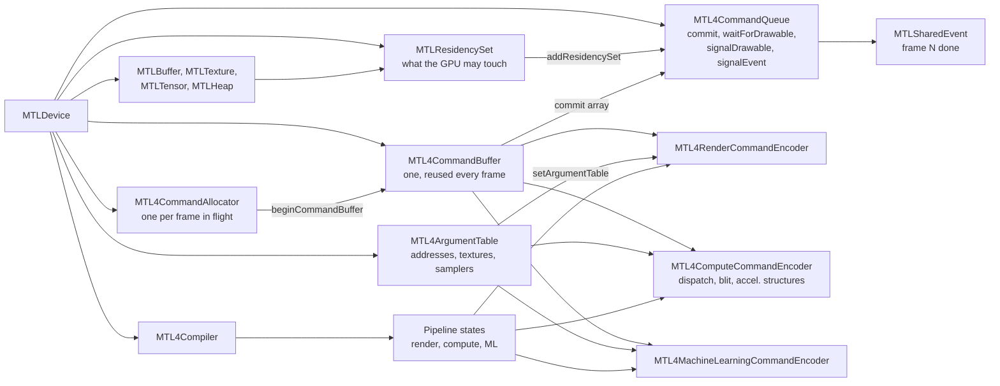

[← Learning hub](../README.md) · [Day 6: Metal 4](../day6-metal4-graphics-and-compute.md)

# Metal 4 cheat sheet

Target: iOS 27, Xcode 27, Swift 6.4, Metal Shading Language (MSL) 4.1. Gate every Metal 4 path with `device.supportsFamily(.metal4)` and keep a fallback.

## Object model map



## Create once vs. per frame

| Object | Made by | How many | Remember |
|---|---|---|---|
| `MTL4CommandQueue` | `device.makeMTL4CommandQueue()` | 1 (per independent stream of work) | `Sendable`; commit from any thread |
| `MTL4CommandBuffer` | `device.makeCommandBuffer()` | 1 per thread that encodes | Reusable right after commit; doesn't retain resources |
| `MTL4CommandAllocator` | `device.makeCommandAllocator()` | frames in flight × encoding threads | `reset()` only after the GPU finishes its work |
| `MTL4ArgumentTable` | `device.makeArgumentTable(descriptor:)` | 1 per kind of work | Set `maxBufferBindCount` etc. to what you use; snapshot taken at each draw or dispatch |
| `MTLResidencySet` | `device.makeResidencySet(descriptor:)` | A few, grouped by lifetime | `addAllocation(_:)` then `commit()`; optional `requestResidency()` at a quiet moment; up to 32 sets per queue or command buffer |
| `MTL4Compiler` | `device.makeCompiler(descriptor:)` | 1, shared | `Sendable`; sync and `async` factory methods |
| Pipeline states | compiler | 1 per shader and state combination | Compile at launch or ahead of time, never in `draw(in:)` |
| Per-frame buffers | `device.makeBuffer(length:options:)` | frames in flight | `.storageModeShared` for CPU-written data |
| `MTLSharedEvent` | `device.makeSharedEvent()` | 1 for frame pacing | Monotonic value = last finished frame |

## Frame loop skeleton

```swift
func draw(in view: MTKView) {
    guard let drawable = view.currentDrawable,
          let pass = view.currentMTL4RenderPassDescriptor else { return }
    let n = UInt64(framesInFlight)
    if frame + 1 > n, !frameDone.wait(untilSignaledValue: frame + 1 - n, timeoutMS: 10) { return }
    frame += 1
    let slot = Int(frame % n)

    writeUniforms(into: uniforms[slot])                        // CPU writes only this slot
    table.setAddress(uniforms[slot].gpuAddress, index: 0)

    allocators[slot].reset()
    commandBuffer.beginCommandBuffer(allocator: allocators[slot])
    if let encoder = commandBuffer.makeRenderCommandEncoder(descriptor: pass) {
        encoder.setRenderPipelineState(pipeline)
        encoder.setArgumentTable(table, stages: [.vertex, .fragment])
        encoder.drawPrimitives(primitiveType: .triangle, vertexStart: 0, vertexCount: 3)
        encoder.endEncoding()
    }
    commandBuffer.endCommandBuffer()

    queue.waitForDrawable(drawable)
    queue.commit([commandBuffer])
    queue.signalDrawable(drawable)
    drawable.present()
    queue.signalEvent(frameDone, value: frame)
}
```

Setup it assumes: buffers added to a residency set, `commit()`ed, and attached with `queue.addResidencySet(_:)`, plus `view.residencySet` and the `CAMetalLayer`'s `residencySet` for drawables. `writeUniforms(into:)` is your own function.

## Binding resources (argument tables)

| Resource | Swift side | MSL side |
|---|---|---|
| Buffer | `table.setAddress(buffer.gpuAddress, index: i)` | `constant T& x [[buffer(i)]]` or `device T* x [[buffer(i)]]` |
| Texture | `table.setTexture(texture.gpuResourceID, index: i)` | `texture2d<half, access::read> t [[texture(i)]]` |
| Sampler | `table.setSamplerState(sampler.gpuResourceID, index: i)` | `sampler s [[sampler(i)]]` |
| Tensor | `table.setResource(tensor.gpuResourceID, bufferIndex: i)` | `tensor<device half, dextents<int, 2>> t [[buffer(i)]]` (`#include <metal_tensor>`) |
| Attach to a pass | render: `setArgumentTable(_:stages:)`; compute and ML: `setArgumentTable(_:)` | |

Binding is not residency. Every buffer, texture, tensor or heap a pass touches must also be in a residency set.

## Synchronization rules

Metal 4 treats every resource as untracked; `hazardTrackingMode` has no effect on an `MTL4CommandQueue`. Pick the smallest scope that fixes the conflict.

| Situation | Tool | Call |
|---|---|---|
| Two stages inside one pass (blit then dispatch in one compute encoder) | Intra-pass barrier | `barrier(afterEncoderStages: .blit, beforeEncoderStages: .dispatch, visibilityOptions: .device)` |
| This pass reads what earlier passes on the same queue wrote | Consumer barrier (place late, right before the consumer) | `barrier(afterQueueStages: .dispatch, beforeStages: .fragment, visibilityOptions: .device)` |
| This pass writes what later passes on the same queue read | Producer barrier (place at the end of the producer) | `barrier(afterStages: .dispatch, beforeQueueStages: .fragment, visibilityOptions: .device)` |
| One specific pass waits for another specific pass | Fence | producer `updateFence(fence, afterEncoderStages: .dispatch)`, consumer `waitForFence(fence, beforeEncoderStages: .blit)` |
| Across queues, or with Metal 3 `MTLCommandQueue` work | `MTLEvent` | `queue.signalEvent(event, value:)` / `queue.waitForEvent(event, value:)` |
| CPU waits for GPU (frame pacing, readback) | `MTLSharedEvent` | `queue.signalEvent(shared, value: n)` then `shared.wait(untilSignaledValue: n, timeoutMS:)` |
| Fragment needs another pixel's result, or tile needs another tile | New render pass + barrier | TBDR GPUs don't support intra-pass barriers that wait on `.fragment` or `.tile` |
| Drawable | Queue operations | `waitForDrawable(_:)` before commit, `signalDrawable(_:)` after, then `present()` |

`MTLStages`: `.vertex`, `.fragment`, `.tile`, `.object`, `.mesh`, `.dispatch`, `.blit`, `.accelerationStructure`, `.machineLearning`, `.resourceState`, `.all`. Default `visibilityOptions` is `[.device]`.

## Memory on Apple GPUs (tile-based, unified memory)

| Choice | Use when | Cost |
|---|---|---|
| `MTLLoadAction.clear` | You overwrite the whole attachment | Fills tile memory; no read |
| `.load` | You draw on top of the previous contents | Reads the full image from system memory |
| `.dontCare` | Every pixel gets written anyway | Free |
| `MTLStoreAction.store` | Someone reads the result later (display, next pass) | Writes the full image |
| `.dontCare` | Scratch attachment (usually depth) | Free |
| `MTLStorageMode.shared` | CPU writes, GPU reads (uniforms, small buffers) | No copy; still needs frame pacing |
| `.private` | GPU-only data | Lets the GPU optimize layout |
| `.memoryless` | Depth, stencil, MSAA you never read after the pass (textures only) | No system memory at all. `MTKView.depthStencilStorageMode = .memoryless` |

Store-action *options* don't exist on `MTL4RenderCommandEncoder`; Apple says they don't apply to Apple silicon GPUs.

## Compute dispatch sizing

```swift
let w = pipeline.threadExecutionWidth                           // SIMD-group width
let h = pipeline.maxTotalThreadsPerThreadgroup / w
encoder.dispatchThreads(threadsPerGrid: MTLSize(width: texture.width, height: texture.height, depth: 1),
                        threadsPerThreadgroup: MTLSize(width: w, height: h, depth: 1))
```

`dispatchThreads` makes smaller threadgroups at the edges, so kernels need no bounds check. With `dispatchThreadgroups(threadgroupsPerGrid:threadsPerThreadgroup:)` you round up, and the kernel must return early for out-of-range positions.

## MSL snippets

**SwiftUI `[[stitchable]]` signatures** (in any `.metal` file; call as `ShaderLibrary.name(args...)`):

```metal
#include <metal_stdlib>
#include <SwiftUI/SwiftUI.h>    // needed for SwiftUI::Layer
using namespace metal;

// Shape fill:        Rectangle().fill(ShaderLibrary.fillName(...))
[[ stitchable ]] half4 fillName(float2 position, float4 bounds) { return half4(0, 0, 1, 1); }
// colorEffect:       view.colorEffect(ShaderLibrary.tintName(...))
[[ stitchable ]] half4 tintName(float2 position, half4 color, float amount) { return color * half(amount); }
// layerEffect:       view.layerEffect(ShaderLibrary.shiftName(...), maxSampleOffset: CGSize(width: 8, height: 0))
[[ stitchable ]] half4 shiftName(float2 position, SwiftUI::Layer layer) { return layer.sample(position + float2(8, 0)); }
// distortionEffect:  view.distortionEffect(ShaderLibrary.waveName(...), maxSampleOffset: CGSize(width: 0, height: 10))
[[ stitchable ]] float2 waveName(float2 position, float time) { return position + float2(0, 10 * sin(position.x / 20 + time)); }
```

Arguments (MSL parameter types must match: `.float` is a `float`, not a `half`): `.float(_:)`, `.float2(_:_:)`, `.float3(_:_:_:)`, `.float4(_:_:_:_:)`, `.color(_:)` (becomes premultiplied `half4`), `.image(_:)`, `.floatArray(_:)`, `.colorArray(_:)`, `.data(_:)`, `.boundingRect` (`float4(x, y, width, height)`). Return premultiplied colors. Precompile with `try await shader.compile(as: .colorEffect)`.

**Full-screen triangle** (no vertex buffer; draw 3 vertices):

```metal
struct VertexOut { float4 position [[position]]; float2 uv; };

vertex VertexOut fullScreenVertex(uint vid [[vertex_id]]) {
    float2 uv = float2(float((vid << 1) & 2), float(vid & 2));
    VertexOut out;
    out.position = float4(uv * 2.0 - 1.0, 0.0, 1.0);
    out.uv = float2(uv.x, 1.0 - uv.y);
    return out;
}

fragment half4 solidFragment(VertexOut in [[stage_in]],
                             constant float4& color [[buffer(0)]]) {
    return half4(color);
}
```

**Image kernel** (adapted from Apple's "Creating threads and threadgroups"):

```metal
constant half3 kRec709Luma = half3(0.2126h, 0.7152h, 0.0722h);

kernel void grayscale(texture2d<half, access::read>  inTexture  [[texture(0)]],
                      texture2d<half, access::write> outTexture [[texture(1)]],
                      uint2 gid [[thread_position_in_grid]]) {
    if (gid.x >= outTexture.get_width() || gid.y >= outTexture.get_height()) return;
    half4 c = inTexture.read(gid);
    half y = dot(c.rgb, kRec709Luma);
    outTexture.write(half4(y, y, y, c.a), gid);
}
```

**Thread identity and SIMD groups:**

```metal
kernel void sumAll(device const float* input  [[buffer(0)]],
                   device atomic_float* total [[buffer(1)]],
                   uint gid  [[thread_position_in_grid]],
                   uint lane [[thread_index_in_simdgroup]]) {
    float s = simd_sum(input[gid]);            // one add across the whole SIMD group
    if (lane == 0) atomic_fetch_add_explicit(total, s, memory_order_relaxed);
}
```

Other built-ins: `[[thread_position_in_threadgroup]]`, `[[threadgroup_position_in_grid]]`, `[[threads_per_threadgroup]]`, `[[simdgroup_index_in_threadgroup]]`, `[[threads_per_simdgroup]]`. Threadgroup memory: `threadgroup float tile[256];` then `threadgroup_barrier(mem_flags::mem_threadgroup);` before reading what other threads wrote. Avoid divergent branches inside a SIMD group: both sides run.

**Tensors in a kernel** (MSL 4, adapted from Apple's inline-ML sample and the MSL spec):

```metal
#include <metal_tensor>                                            // the tensor type
#include <MetalPerformancePrimitives/MetalPerformancePrimitives.h> // matmul2d and friends
using namespace metal;
using namespace mpp;

kernel void multiply(uint2 tg [[threadgroup_position_in_grid]],
                     tensor<device half, dextents<int, 2>> a       [[buffer(0)]],
                     tensor<device half, dextents<int, 2>> b       [[buffer(1)]],
                     tensor<device half, dextents<int, 2>> product [[buffer(2)]]) {
    // Slice per threadgroup with a.slice<...>(x, y), describe the tile with
    // tensor_ops::matmul2d_descriptor, then run
    // tensor_ops::matmul2d<descriptor, execution_simdgroups<4>>.
}
```

**Shader logging** (iOS 18+, compile with `-fmetal-enable-logging`; set `MTL_LOG_LEVEL`, `MTL_LOG_BUFFER_SIZE` in the scheme):

```metal
constant metal::os_log ringLog("com.example.errand", "ring");

kernel void debugKernel(uint gid [[thread_position_in_grid]]) {
    if (gid == 7) ringLog.log("thread %u reached here", gid);
}
```

## Compilation

- Name functions with `MTL4LibraryFunctionDescriptor` (`name`, `library`); specialize with `MTL4SpecializedFunctionDescriptor` + `MTLFunctionConstantValues`.
- `try await compiler.makeRenderPipelineState(descriptor:)` / `makeComputePipelineState(descriptor:)` from a background task; sync versions exist for prototypes.
- Unspecialized pipelines: set varying properties to `.unspecialized` (for example `MTLPixelFormat.unspecialized`), then `makeRenderPipelineStateBySpecialization(descriptor:pipeline:)`.
- Harvest with `MTL4PipelineDataSetSerializer`; ship and load archives with `device.makeArchive(url:)` (`MTL4Archive`), and hand them to the compiler through `MTL4CompilerTaskOptions.lookupArchives`.
- iOS limits background compilation threads. Start compiling early.

## Machine learning pass recipe

1. `xcrun metal-package-builder -ml Model.mlpackage -o Model.mtlpackage` and add the package to the project.
2. `MTL4LibraryFunctionDescriptor` named `"main"` → `MTL4MachineLearningPipelineDescriptor` → `compiler.makeMachineLearningPipelineState(descriptor:)`. One pipeline per set of concrete input shapes; fix dynamic input shapes with `setInputDimensions(_:bufferIndex:)` on the descriptor.
3. Tensors: `MTLTensorDescriptor` (`dimensions` via `MTLTensorExtents([...])`, innermost first; `dataType`; `usage = .machineLearning`) → `device.makeTensor(descriptor:)`. Fill with `replace(sliceOrigin:sliceDimensions:withBytes:strides:)`.
4. Bind: `table.setResource(tensor.gpuResourceID, bufferIndex: binding.index)`.
5. Scratch: `MTLHeapDescriptor` with `type = .placement`, `size = pipeline.intermediatesHeapSize` → `device.makeHeap(descriptor:)`.
6. Encode: `makeMachineLearningCommandEncoder()` → `setPipelineState` → `setArgumentTable` → `dispatchNetwork(intermediatesHeap:)` → `endEncoding()`. Barriers with `.machineLearning` order it against other passes. Put the tensors, the heap and the pipeline state (it's an `MTLAllocation` too) in a residency set.

iOS 27: multi-plane tensors (`MTLTensorAuxiliaryPlaneDescriptor`, `MTLTensorPlaneType.scales`, `makeTensor(descriptor:attachments:)`), FP8/FP4 tensor data types. Core AI's `ComputeStream(commandQueue:)` encodes inference onto your `MTLCommandQueue` (a Metal 3 queue, not an `MTL4CommandQueue`; order it against Metal 4 work with an event).

## Beyond the basics, one line each

- **MetalFX:** spatial scaler (color only), temporal scaler (color + depth + motion + jitter), temporal denoised scaler, frame interpolator (extra frame between two). Metal 4 versions come from `make...(device:compiler:)` and encode with `encode(commandBuffer:)`. Create them at launch; they're slow to initialize.
- **Ray tracing:** build `MTLAccelerationStructure`s from `MTL4PrimitiveAccelerationStructureDescriptor` (geometry) and `MTL4InstanceAccelerationStructureDescriptor` (instances) with `MTL4ComputeCommandEncoder.build(destinationAccelerationStructure:descriptor:scratchBuffer:)`; trace with intersectors or intersection queries in MSL. Check `device.supportsRaytracing`.
- **HDR (EDR):** render to `rgba16Float`, set `CAMetalLayer.wantsExtendedDynamicRangeContent = true`, read headroom from `UIScreen.currentEDRHeadroom` / `potentialEDRHeadroom`, optionally `edrMetadata` for system tone mapping.
- **Texture views:** `MTLTextureViewPool` gives cheap views with contiguous `MTLResourceID`s.
- **Parallel encoding:** one command buffer and allocator per thread, render encoders with `MTL4RenderEncoderOptions` `.suspending`/`.resuming`, commit all together.

## Debugging and profiling

| Tool | What it catches | How |
|---|---|---|
| API Validation | Wrong API use (mismatched pixel formats, missing `endEncoding`) | Scheme → Run → Diagnostics |
| API Validation: "Include load and store actions" | Code that relies on `.dontCare` contents: Metal fills those attachments with loud colors and patterns | Same panel |
| Shader Validation | Out-of-bounds access, non-resident resources, nil textures | Same panel; slower, use in debug |
| Metal debugger (GPU frame capture) | Pass structure, bindings, resources, per-line shader cost, dependencies | Metal Capture button in the debug bar, or `MTLCaptureManager.shared().startCapture(with:)` (`MetalCaptureEnabled` Info.plist key for programmatic capture) |
| Labels | Readable captures | `label` on encoders, pipelines, buffers; `pushDebugGroup(_:)` |
| Metal Performance HUD | Live FPS, GPU time, frame interval | Scheme diagnostics option |
| Instruments: Game Performance template | CPU vs GPU timeline (includes Metal System Trace), stutters | Product → Profile |
| Instruments: Game Memory template | GPU memory growth | Product → Profile |
| Shader logging | `os_log` from inside shaders | `-fmetal-enable-logging`, `MTLLogState`; in Metal 4, set `MTL4CommandBufferOptions.logState` and pass it to `beginCommandBuffer(allocator:options:)` |
| `gpudebug` | Scriptable trace inspection in Terminal; usable by AI agents | `gpudebug -t Scene.gputrace`, `man gpudebug` |

Debug order for a wrong frame: validation messages → residency → barriers → lifetimes → load/store actions.

## Which layer?

| Need | Reach for |
|---|---|
| Effect on SwiftUI content | `[[stitchable]]` + `colorEffect` / `layerEffect` / `distortionEffect` / `Shader` fill |
| Photo and video filters | Core Image (`CIFilter`, custom `CIKernel`) |
| 3D, AR, spatial | RealityKit (`RealityView`, `ShaderGraphMaterial`, `LowLevelMesh`, `LowLevelTexture`) |
| Standard GPU kernels, ML graphs | Metal Performance Shaders, MPS Graph |
| Own geometry, multi-pass, compute, ML on the GPU timeline | Metal 4 in `MTKView` / `CAMetalLayer` |

<details><summary>Verified APIs</summary>

Checked with `scripts/appledoc.py` on 2026-09-24; MSL items checked against the Metal Shading Language Specification 4.1 (2026-06-04).

- `MTL4CommandQueue`, `commit(_:options:)`, `waitForDrawable(_:)`, `signalDrawable(_:)`, `signalEvent(_:value:)`, `waitForEvent(_:value:)`, `addResidencySet(_:)` — iOS 26.0
- `MTL4CommandBuffer`, `beginCommandBuffer(allocator:)`, `beginCommandBuffer(allocator:options:)`, `endCommandBuffer()`, `makeRenderCommandEncoder(descriptor:options:)`, `makeComputeCommandEncoder()`, `makeMachineLearningCommandEncoder()`, `pushDebugGroup(_:)` — iOS 26.0
- `MTL4CommandAllocator`, `reset()` — iOS 26.0
- `MTL4ArgumentTable`, `setAddress(_:index:)`, `setTexture(_:index:)`, `setSamplerState(_:index:)`, `setResource(_:bufferIndex:)` — iOS 26.0
- `MTL4ArgumentTableDescriptor.maxBufferBindCount` — iOS 26.0
- `MTL4CommandEncoder.barrier(afterEncoderStages:beforeEncoderStages:visibilityOptions:)`, `barrier(afterQueueStages:beforeStages:visibilityOptions:)`, `barrier(afterStages:beforeQueueStages:visibilityOptions:)`, `updateFence(_:afterEncoderStages:)`, `waitForFence(_:beforeEncoderStages:)`, `label`, `endEncoding()` — iOS 26.0
- `MTL4RenderCommandEncoder.setRenderPipelineState(_:)`, `setArgumentTable(_:stages:)`, `drawPrimitives(primitiveType:vertexStart:vertexCount:)` — iOS 26.0
- `MTL4ComputeCommandEncoder.setComputePipelineState(_:)`, `setArgumentTable(_:)`, `dispatchThreads(threadsPerGrid:threadsPerThreadgroup:)`, `dispatchThreadgroups(threadgroupsPerGrid:threadsPerThreadgroup:)`, `build(destinationAccelerationStructure:descriptor:scratchBuffer:)` — iOS 26.0
- `MTL4MachineLearningCommandEncoder.setPipelineState(_:)`, `setArgumentTable(_:)`, `dispatchNetwork(intermediatesHeap:)` — iOS 26.0
- `MTL4MachineLearningPipelineState.intermediatesHeapSize`, `MTL4MachineLearningPipelineDescriptor`, `setInputDimensions(_:bufferIndex:)` — iOS 26.0
- `MTL4CommandBufferOptions.logState`, `MTL4CompilerTaskOptions.lookupArchives` — iOS 26.0
- `MTLAllocation` — iOS 18.0 (adopted by `MTL4MachineLearningPipelineState`)
- `MTL4Compiler`, `makeRenderPipelineState(descriptor:dynamicLinkingDescriptor:compilerTaskOptions:)`, `makeComputePipelineState(descriptor:dynamicLinkingDescriptor:compilerTaskOptions:)`, `makeMachineLearningPipelineState(descriptor:)`, `makeRenderPipelineStateBySpecialization(descriptor:pipeline:)` — iOS 26.0
- `MTL4LibraryFunctionDescriptor`, `MTL4SpecializedFunctionDescriptor`, `MTL4PipelineDataSetSerializer`, `MTL4Archive`, `MTLDevice.makeArchive(url:)` — iOS 26.0
- `MTLPixelFormat.unspecialized` — iOS 26.0
- `MTLFunctionConstantValues` — iOS 10.0
- `MTLDevice.makeMTL4CommandQueue()`, `makeCommandBuffer()`, `makeCommandAllocator()`, `makeArgumentTable(descriptor:)`, `makeCompiler(descriptor:)`, `makeTensor(descriptor:)` — iOS 26.0
- `MTLDevice.makeTensor(descriptor:attachments:)` — iOS 27.0
- `MTLDevice.makeResidencySet(descriptor:)` — iOS 18.0
- `MTLDevice.makeSharedEvent()` — iOS 12.0
- `MTLDevice.makeHeap(descriptor:)`, `makeFence()` — iOS 10.0
- `MTLDevice.supportsFamily(_:)` — iOS 13.0; `MTLGPUFamily.metal4` — iOS 26.0
- `MTLDevice.supportsRaytracing` — iOS 14.0
- `MTLResidencySet`, `addAllocation(_:)`, `commit()`, `requestResidency()` — iOS 18.0
- `MTLSharedEvent.wait(untilSignaledValue:timeoutMS:)` — iOS 15.0
- `MTLStages` — iOS 26.0; `MTL4VisibilityOptions.device` — iOS 26.0
- `MTLComputePipelineState.threadExecutionWidth`, `maxTotalThreadsPerThreadgroup` — iOS 8.0
- `MTLLoadAction` `.clear` `.load` `.dontCare`, `MTLStoreAction` `.store` `.dontCare` — iOS 8.0
- `MTLStorageMode.shared`, `.private` — iOS 9.0; `.memoryless` — iOS 10.0
- `MTLHeapType.placement` — iOS 13.0
- `MTLTensor`, `MTLTensor.gpuResourceID`, `replace(sliceOrigin:sliceDimensions:withBytes:strides:)`, `MTLTensorDescriptor`, `MTLTensorExtents.init(_:)`, `MTLTensorUsage.machineLearning` — iOS 26.0
- `MTLTensorAuxiliaryPlaneDescriptor`, `MTLTensorPlaneType` — iOS 27.0
- `MTLTextureViewPool` — iOS 26.0
- `MTL4RenderEncoderOptions` `.suspending` `.resuming` — iOS 26.0
- `MTL4PrimitiveAccelerationStructureDescriptor`, `MTL4InstanceAccelerationStructureDescriptor` — iOS 26.0; `MTLAccelerationStructure` — iOS 14.0
- `MTLLogState` — iOS 18.0
- `MTLCaptureManager.shared()` — iOS 11.0; `startCapture(with:)` — iOS 13.0
- `MTKView.currentMTL4RenderPassDescriptor` — iOS 26.0; `MTKView.residencySet` — iOS 26.4; `MTKView.depthStencilStorageMode` — iOS 16.0
- `CAMetalLayer.residencySet` — iOS 26.0; `wantsExtendedDynamicRangeContent`, `edrMetadata` — iOS 16.0
- `UIScreen.currentEDRHeadroom`, `potentialEDRHeadroom` — iOS 16.0
- `MTL4FXSpatialScaler`, `MTL4FXTemporalScaler`, `MTL4FXFrameInterpolator`, `MTLFXTemporalScalerDescriptor.makeTemporalScaler(device:compiler:)`, `MTL4FXSpatialScaler.encode(commandBuffer:)` — iOS 26.0
- `Shader.compile(as:)`, `Shader.UsageType` — iOS 18.0; `Shader.Argument` cases, `ShaderLibrary`, `colorEffect(_:isEnabled:)`, `layerEffect(_:maxSampleOffset:isEnabled:)`, `distortionEffect(_:maxSampleOffset:isEnabled:)` — iOS 17.0
- `ComputeStream.init(commandQueue:)` (Core AI; takes `any MTLCommandQueue`) — iOS 27.0
- `CIFilter` — iOS 5.0; `CIKernel` — iOS 8.0; `RealityView`, `ShaderGraphMaterial`, `LowLevelMesh`, `LowLevelTexture` — iOS 18.0
- MSL: `[[stitchable]]` (Metal 2.4+), `[[vertex_id]]`, `[[stage_in]]`, `[[position]]`, `[[thread_position_in_grid]]`, `[[thread_index_in_simdgroup]]`, `[[threads_per_simdgroup]]`, `simd_sum` (iOS: Metal 2.3+), `atomic_float` (Metal 3+), `threadgroup_barrier(mem_flags::mem_threadgroup)`, `os_log`, `tensor<device half, dextents<int, 2>>` with `[[buffer(n)]]` (header `<metal_tensor>`), `mpp::tensor_ops::matmul2d` (header `<MetalPerformancePrimitives/MetalPerformancePrimitives.h>`)

</details>
