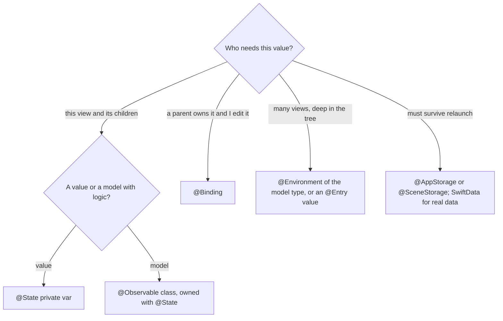

[← Learning hub](../README.md) · [Day 2 chapter](../day2-swiftui-liquid-glass-design.md)

# Cheat sheet · SwiftUI and design (iOS 27)

One page to keep open while you build. iOS 27 SDK, Xcode 27, Swift 6.4. Every symbol is listed with its iOS version at the bottom.

## Core rules

- `body` is a cheap, pure description. SwiftUI re-runs it often. No side effects, no heavy work.
- Identity is lifetime. Same identity → state kept, changes animate. New identity → state reset. `if/else` branches are different identities; `.id(x)` resets when `x` changes.
- One owner per value. Everyone else borrows (`@Binding`, `@Bindable`) or reads (`@Environment`).
- `@Observable` tracks what each `body` *reads*. A view redraws only when a property it read changes.
- Layout: parent proposes → child chooses → parent places. Proposal `.zero` asks for minimum, `.infinity` for maximum, `.unspecified` for ideal.
- Navigation is data: a path array, a tab selection, an optional sheet item.
- Liquid Glass is for the functional layer (bars, controls). Never for content.

## State: which tool?



| Situation | Use | Notes |
|---|---|---|
| Local UI value (sheet open, draft text, selection) | `@State private var x = …` | Keep `private`. Xcode 27 builds it with the `State()` macro. |
| Own a model object | `@State private var model = Model()` | With Xcode 27, a class is created and stored once. |
| Edit a value owned above | `@Binding var x: T` | Pass `$x` from the owner. |
| Model class | `@MainActor @Observable final class Model` | Tracks every stored `var`. Use `@ObservationIgnored` to opt a property out. |
| Pass a model to a child | `let model: Model` (plain property) | No wrapper needed; reads are tracked. |
| Bindings into a model | `@Bindable var model: Model`, or `@Bindable var model = model` inside `body` | Gives `$model.title`. |
| Share a model app-wide | `.environment(model)` on an ancestor, `@Environment(Model.self) private var model` to read | Crashes if missing. Use `Model?` to make it optional. |
| Custom environment value | `extension EnvironmentValues { @Entry var compact = false }`, read with `@Environment(\.compact)` | Set with `.environment(\.compact, true)`. |
| System settings | `@Environment(\.dynamicTypeSize)`, `\.colorScheme`, `\.colorSchemeContrast`, `\.accessibilityReduceMotion`, `\.accessibilityReduceTransparency`, `\.horizontalSizeClass` | Read-only inputs; views update when they change. |
| Actions from the system | `@Environment(\.dismiss)`, `\.openURL` | Call like functions: `dismiss()`. |
| Small preferences | `@AppStorage("key")` | UserDefaults-backed. Not for secrets or big data. |
| Per-scene UI restoration | `@SceneStorage("key")` | Tab, scroll target, draft. |
| Keyboard focus | `@FocusState` + `.focused(_:equals:)` | |
| Values during a gesture | `@GestureState` + `.updating(_:body:)` | Resets when the gesture ends. |
| Sizes that scale with text | `@ScaledMetric(relativeTo: .body) var size = 24` | For padding, icon frames. |
| Matched animations and glass morphs | `@Namespace private var ns` | Share one namespace between source and destination. |

**Async work in views**

| Need | Use |
|---|---|
| Load when a view appears, cancel when it disappears | `.task { await model.load() }` |
| Reload when an input changes | `.task(id: query) { … }` (cancels and restarts) |
| React to a value change synchronously | `.onChange(of: value, initial: false) { old, new in … }` |
| Pull to refresh | `.refreshable { … }` |

## Layout

| Tool | Use when |
|---|---|
| `HStack`, `VStack`, `ZStack` | Small, fixed sets of views |
| `LazyVStack`, `LazyHStack`, `LazyVGrid` | Long content inside a `ScrollView`; builds rows on demand |
| `Grid` + `GridRow`, `.gridCellColumns(_:)`, `.gridColumnAlignment(_:)` | Table-like alignment across rows |
| `ViewThatFits { A(); B() }` | Pick the first child that fits (row, else stack) |
| `AnyLayout(HStackLayout())` ↔ `AnyLayout(VStackLayout())` | Switch arrangement and keep children's identity |
| `.containerRelativeFrame(.horizontal, count: 3, span: 2, spacing: 8)` | Size relative to screen, scroll view, tab, or column |
| `Layout` protocol | Your own container: `sizeThatFits(proposal:subviews:cache:)` + `placeSubviews(in:proposal:subviews:cache:)` |
| `GeometryReader`, `.onGeometryChange(for:of:action:)` | Read a size or frame. Prefer `onGeometryChange` so the reader doesn't take all space |
| `.frame(maxWidth: .infinity, alignment: .leading)` | Make a view flexible and align it |
| `.layoutPriority(1)` | Let one child claim space first |
| `.fixedSize()` | Use ideal size, ignore the proposal |
| `.border(.red)` | Debug: see the real frame |

**Modifier order matters.** Each modifier wraps the view. `.padding().background(.blue)` colors the padding; `.background(.blue).padding()` doesn't.

**Safe areas**

| API | Effect |
|---|---|
| (default) | Content stays inside; backgrounds extend under bars |
| `.ignoresSafeArea(_:edges:)` | Extend a view under bars or hardware |
| `.safeAreaInset(edge: .bottom) { … }` | Add your own inset content; scroll content avoids it |
| `.safeAreaBar(edge: .bottom) { … }` | Custom bar that also extends scroll edge effects (Liquid Glass friendly) |
| `.safeAreaPadding(_:_:)`, `.contentMargins(_:_:for:)` | Extra insets for scroll content |
| `.background(_:ignoresSafeAreaEdges:)` | Background style, extended under edges by default |

**Adaptivity inputs:** size classes (`horizontalSizeClass`, `verticalSizeClass`), `dynamicTypeSize.isAccessibilitySize`, layout direction. Decide by size class, not by device or orientation.

**iPhone Duo and new hardware (iOS 27.1 beta, don't ship against 27.0):** `ArrangementView { primary } secondary: { secondary }` with `.arrangementViewStyle(.split)` or `.overlay`; `GeometryProxy.reservedRegions(kind:options:layoutDirectionBehavior:)` with kinds `.occlusion` (camera) and `.division` (hinge); `.onHingeChange(isEnabled:_:)` with `DeviceHinge` status `.closed`, `.partiallyOpen`, `.fullyOpen`; `toolbarVerticalEdge` for vertical toolbars.

## Navigation

```swift
// Stack driven by data
@State private var path: [Errand.ID] = []

NavigationStack(path: $path) {
    List(errands) { e in NavigationLink(e.title, value: e.id) }
        .navigationDestination(for: Errand.ID.self) { id in DetailView(id: id) }
}
// Deep link: path = [id]    Pop to root: path.removeAll()

// Tabs
TabView(selection: $tab) {
    Tab("Errands", systemImage: "checklist", value: AppTab.errands) { ErrandListView() }
    Tab("Plan", systemImage: "sparkles", value: AppTab.plan, role: .prominent) { PlannerView() }
    Tab("Search", systemImage: "magnifyingglass", value: AppTab.search, role: .search) { SearchView() }
}
.tabBarMinimizeBehavior(.onScrollDown)
```

| Need | API |
|---|---|
| Push screens | `NavigationStack(path:root:)`, `NavigationLink(value:label:)`, `navigationDestination(for:destination:)` |
| Mixed value types, save and restore | `NavigationPath`, its `codable` property |
| Push from optional state | `navigationDestination(item:destination:)` |
| Sidebar + detail (iPad, Mac) | `NavigationSplitView(sidebar:detail:)` or `(sidebar:content:detail:)` |
| Top-level sections | `TabView` + `Tab`; roles `.search`, `.prominent` (iOS 27) |
| Tab bar becomes sidebar on iPad | `.tabViewStyle(.sidebarAdaptable)` |
| Accessory above the tab bar | `.tabViewBottomAccessory { … }` |
| Modal | `.sheet(item:)` (preferred) or `.sheet(isPresented:)`, `.fullScreenCover(isPresented:)`, `.popover(isPresented:)` |
| Sheet heights | `.presentationDetents([.medium, .large])` |
| Side panel | `.inspector(isPresented:content:)`: a column in regular width, a sheet in compact |
| Alerts from data | `.alert(error:actions:)`, `.alert(_:item:actions:)`, `.confirmationDialog(_:isPresented:titleVisibility:actions:)` |
| Close from inside | `@Environment(\.dismiss) var dismiss` |
| Zoom transition | source: `.matchedTransitionSource(id:in:)`; destination: `.navigationTransition(.zoom(sourceID:in:))` |
| Fade a sheet in (iOS 27) | `.navigationTransition(.crossFade)` on the sheet's content |
| Titles | `.navigationTitle(_:)`, `.navigationSubtitle(_:)`, `.toolbarTitleDisplayMode(.inline)` |

## Lists, scrolling, forms

| Need | API |
|---|---|
| Rows | `List { ForEach(items) { … } }`, `Section("Title") { … }` (headers render in title case) |
| Delete, move | `.onDelete(perform:)`, `.onMove(perform:)` on `ForEach` |
| Swipe actions | `.swipeActions(edge:allowsFullSwipe:content:)`; outside `List`: `swipeActionsContainer()` (iOS 27) |
| Drag to reorder anywhere (iOS 27) | `.reorderable()` on `ForEach` + `.reorderContainer(for:isEnabled:move:)` on the container |
| Search | `.searchable(text:placement:prompt:)`; empty results: `ContentUnavailableView.search` |
| Empty state | `ContentUnavailableView(_:systemImage:description:)` |
| Context menu | `.contextMenu { … }` (match its top actions to your swipe actions) |
| Scroll position | `@State var pos = ScrollPosition()` + `.scrollPosition($pos)` |
| Paging and snapping | `.scrollTargetBehavior(.paging)` or `.viewAligned` + `.scrollTargetLayout()` |
| React to scrolling | `.onScrollGeometryChange(for:of:action:)`, `.onScrollVisibilityChange(threshold:_:)`, `.onScrollPhaseChange(_:)` |
| Scroll effects | `.scrollTransition(_:axis:transition:)` |
| Legibility under bars | `.scrollEdgeEffectStyle(.soft or .hard, for: .top)` |
| Forms | `Form { … }.formStyle(.grouped)`, `LabeledContent`, `Toggle`, `Picker`, `DatePicker`, `Stepper`, `Slider` (tick marks when you pass `step`), `TextField(_:text:axis:)` |
| Keyboard | `@FocusState`, `.focused(_:equals:)`, `.onSubmit(of:_:)`, `.submitLabel(_:)`, `.scrollDismissesKeyboard(_:)` |
| Images from the web (iOS 27 caching) | `AsyncImage`, `.asyncImageURLSession(_:)` |

## Animation, gestures, shaders

| Need | API |
|---|---|
| Animate one state change | `withAnimation(.smooth) { … }` |
| Animate when a value changes | `.animation(.snappy, value: x)` |
| Springs | `.spring(duration:bounce:blendDuration:)`, `.smooth`, `.snappy`, `.bouncy` |
| Insert and remove | `.transition(.opacity)` plus an animated change |
| Changing text and symbols | `.contentTransition(.numericText(value:))`, `.contentTransition(.symbolEffect(.replace))` |
| Multi-step | `.phaseAnimator(_:trigger:content:animation:)` |
| Timeline of values | `.keyframeAnimator(initialValue:trigger:content:keyframes:)` with `LinearKeyframe`, `SpringKeyframe` |
| Same element, two places | `.matchedGeometryEffect(id:in:properties:anchor:isSource:)` |
| Custom animatable view | `@Animatable` macro |
| Haptics | `.sensoryFeedback(.success, trigger: x)` |
| Honor Reduce Motion | `withAnimation(reduceMotion ? nil : .smooth) { … }` |
| Tap | `.onTapGesture(count:perform:)` |
| Drag, pinch, rotate | `DragGesture`, `MagnifyGesture`, `RotateGesture` with `.onChanged`, `.onEnded`, `.updating` |
| Combine or disable | `.simultaneousGesture(_:including:)`, `.gesture(_:isEnabled:)` |
| Input sources (iOS 27) | `DragGesture(minimumDistance:coordinateSpace:inputKinds:)` with `GestureInputKinds` (`.directTouch`, `.indirectTouch`, `.pencil`, `.pointer`) |

**Shaders** (a `.metal` file in your target; call with `ShaderLibrary.name(args)`; Day 6 goes deep):

| Modifier | Metal signature | Does |
|---|---|---|
| `.colorEffect(_:isEnabled:)` | `[[ stitchable ]] half4 f(float2 position, half4 color, args...)` | Change each pixel's color |
| `.layerEffect(_:maxSampleOffset:isEnabled:)` | `[[ stitchable ]] half4 f(float2 position, SwiftUI::Layer layer, args...)` | Sample nearby pixels (blur, pixelate) |
| `.distortionEffect(_:maxSampleOffset:isEnabled:)` | `[[ stitchable ]] float2 f(float2 position, args...)` | Move pixels (ripple, wave) |
| `Shader` as a fill | `[[ stitchable ]] half4 f(float2 position, args...)` | Paint a shape or text |

Arguments: `.float(x)`, `.color(c)`. Shader effects don't render UIKit-backed views.

## Liquid Glass

| API | What it does | Notes |
|---|---|---|
| (nothing) | Bars, tab bars, sheets, popovers, menus, controls adopt glass automatically | Remove your custom bar backgrounds |
| `.glassEffect()` | Regular glass in a capsule behind the view | Apply after other appearance modifiers |
| `.glassEffect(.regular, in: .rect(cornerRadius: 16))` | Glass in another shape | Match concentric corners |
| `.glassEffect(.regular.tint(.orange).interactive())` | Tinted, touch-responsive glass | Tint only the most important element |
| `Glass.clear` | Highly translucent variant | Only over photos or video; add a dimming layer over bright media |
| `Glass.identity` | No effect, same view | Toggle glass without changing identity |
| `GlassEffectContainer(spacing:)` | Groups glass for performance, blending, morphing | Larger spacing merges shapes sooner |
| `.glassEffectID(_:in:)` | Morph shapes during animated changes | IDs from one `@Namespace` |
| `.glassEffectUnion(id:namespace:)` | Several views share one glass shape | |
| `.glassEffectTransition(.matchedGeometry or .materialize)` | How glass enters and leaves | |
| `.buttonStyle(.glass)`, `.glassProminent`, `.glass(.clear)` | Glass buttons | Prefer these to hand-made glass buttons |
| `.scrollEdgeEffectStyle(_:for:)` | Blur and fade content under bars | Instead of painting bar backgrounds |
| `.backgroundExtensionEffect()` | Mirror and blur an image under sidebars and inspectors | Hero images in split views |
| `.tabBarMinimizeBehavior(.onScrollDown)` | Shrink the tab bar while scrolling | iPhone only |
| `.toolbarMinimizationBehavior(.onScrollDown, for: .navigationBar)` | Shrink the navigation bar (iOS 27) | |
| `Material` (`.ultraThin` … `.thick`) | Standard materials | For structure *inside* content |

**Don't:** put glass in the content layer, stack glass on glass, tint every control, keep custom bar backgrounds, or rely on `UIDesignRequiresCompatibility` (ignored when building for iOS 27).

## Toolbars

```swift
.toolbar {
    ToolbarItem(placement: .topBarPinnedTrailing) {
        Button("Add", systemImage: "plus") { add() }
            .buttonStyle(.glassProminent)          // the one primary action
    }
    ToolbarItemGroup(placement: .topBarTrailing) {
        Button("Share", systemImage: "square.and.arrow.up") { share() }
        Button("Flag", systemImage: "flag") { flag() }
    }
    .visibilityPriority(.high)
    ToolbarSpacer(.fixed, placement: .topBarTrailing)
    ToolbarOverflowMenu {
        Button("Archive", systemImage: "archivebox") { archive() }
    }
}
```

| Placement | Where on iPhone | Use for |
|---|---|---|
| `.automatic` | Trailing edge of the navigation bar; overflows when full | Default |
| `.topBarLeading` / `.topBarTrailing` | Leading / trailing edge of the navigation bar | Most actions |
| `.topBarPinnedTrailing` (iOS 27) | Trailing edge, stays put as others overflow | The key action |
| `.primaryAction` | Trailing edge of the navigation bar | Most frequent action (Compose) |
| `.secondaryAction` | System decides | Frequent but not required |
| `.confirmationAction` | Same place as `primaryAction` | Save, Add, Done in a modal |
| `.cancellationAction` | Leading edge | Cancel in a modal |
| `.destructiveAction` | Trailing edge | Discard in a modal |
| `.navigation` | Leading edge | Back and forward style actions |
| `.principal` | Center of the navigation bar; overrides the title | Custom title control |
| `.title`, `.largeTitle` (26), `.subtitle` (26), `.largeSubtitle` (26) | Title and subtitle areas | Custom title views; keep `.navigationTitle` for accessibility |
| `.bottomBar` | Bottom toolbar | Actions on the whole screen |
| `.status` | Center of the bottom toolbar | Information, not actions |
| `.keyboard` | Above the software keyboard | Input helpers |

| Toolbar helper | Does |
|---|---|
| `ToolbarItemGroup` | Items that share one glass background |
| `ToolbarSpacer(.fixed)` / `.flexible` | Split groups / push apart |
| `.visibilityPriority(.high or .low)` (iOS 27) | Order in which items move to overflow |
| `ToolbarOverflowMenu { … }` (iOS 27) | Items that always live in overflow |
| `.sharedBackgroundVisibility(.hidden)` | Take an item out of the shared glass background |
| `.hidden(_:)` on toolbar content (26.4) | Hide the whole item, not just its view |
| `.toolbarVisibility(_:for:)` | Show or hide a bar |
| Button roles `.confirm`, `.close`, `.cancel`, `.destructive` | Standard meaning and look; `Button(role: .close) { … }` gives the system close button |

## HIG checklist

**Hierarchy and layout**
- [ ] Most important content at top and leading edge; related items grouped; detail behind disclosure.
- [ ] Controls visibly separate from content (glass layer over content layer).
- [ ] Layout decided by size class, tested at smallest and largest sizes, in both orientations.
- [ ] Toolbar titles under about 15 characters; at most about three toolbar groups; one tinted primary action on the trailing side.

**Type**
- [ ] Only system text styles (or custom fonts that support Dynamic Type). iOS body default 17 pt, minimum 11 pt.
- [ ] No Ultralight, Thin, or Light weights for UI text.
- [ ] Works at the largest accessibility size: nothing truncates in scrolling content; rows stack.

**Color and Dark Mode**
- [ ] Semantic colors or asset colors with light, dark, and increased-contrast variants. No hard-coded RGB for UI.
- [ ] Contrast at least 4.5:1 for text up to 17 pt, 3:1 for 18 pt or bold. Aim higher (7:1) for small custom-colored text.
- [ ] Nothing communicated by color alone.
- [ ] No app-specific light/dark setting; follow the system.

**SF Symbols**
- [ ] Standard symbols for standard actions; no borders around toolbar symbols.
- [ ] Rendering mode chosen on purpose: monochrome, hierarchical, palette, or multicolor.
- [ ] Let the container choose the variant (tab bars fill, toolbars outline) unless you need a specific one.
- [ ] Symbol effects for feedback (`bounce`, `pulse`, `wiggle`, `breathe`, `replace`) instead of custom animation.

**Touch and spacing**
- [ ] Hit targets 44×44 pt (minimum 28×28 pt).
- [ ] About 12 pt padding around bezeled controls, about 24 pt around borderless ones.
- [ ] Standard spacing; no overridden control metrics.

**Motion**
- [ ] Every animation has a purpose, is brief, and can be interrupted.
- [ ] Reduce Motion removes or replaces non-essential motion.

**Accessibility**
- [ ] Every icon-only control has a label (`Button(_:systemImage:action:)` or `accessibilityLabel(_:)`).
- [ ] State is in `accessibilityValue(_:)`; kind in traits (`.isButton`, `.isHeader`, `.isToggle`, `.isSelected`).
- [ ] Rows combined with `accessibilityElement(children: .combine)`; decorative images hidden.
- [ ] Extra actions exposed with `accessibilityAction(named:_:)`; gestures have on-screen alternatives.
- [ ] Tested with VoiceOver, Voice Control, Larger Text, Bold Text, Increase Contrast, Reduce Transparency, Reduce Motion.
- [ ] UI tests call `performAccessibilityAudit()`; Xcode 27's `XCUIVoiceOverService` checks what VoiceOver says.

**App icon**
- [ ] Background plus foreground layers, composed in Icon Composer (at most four groups), exported as one file into Xcode.
- [ ] Vector layers (SVG) where possible; square, unmasked; text converted to outlines.
- [ ] No baked-in highlights, shadows, blurs, or masks; the system adds them.
- [ ] Checked in default, dark, clear, and tinted appearances.

## Accessibility modifiers

| Modifier | Purpose |
|---|---|
| `.accessibilityLabel(_:)` | What it is ("Add errand") |
| `.accessibilityValue(_:)` | Current state ("3 of 5 done") |
| `.accessibilityHint(_:)` | What happens on activation, if not obvious |
| `.accessibilityAddTraits(_:)` | Kind: `.isButton`, `.isHeader`, `.isToggle`, `.isSelected` |
| `.accessibilityElement(children: .combine)` | Merge a row into one element |
| `.accessibilityHidden(true)` | Hide decoration |
| `.accessibilityAction(named:_:)`, `.accessibilityActions { … }` | Custom actions in the VoiceOver rotor |
| `.accessibilityInputLabels(_:)` | Extra names for Voice Control |
| `.accessibilityHeading(_:)`, `.accessibilitySortPriority(_:)` | Structure and reading order |
| `.accessibilityRepresentation { … }` | Describe a custom control as a standard one |
| `.accessibilityShowsLargeContentViewer()` | Large content viewer for small bar items |
| `AccessibilityNotification.Announcement("…").post()` | Announce a change |

## UIKit interop

| Direction | API | Notes |
|---|---|---|
| UIKit view in SwiftUI | `UIViewRepresentable`: `makeUIView(context:)`, `updateUIView(_:context:)`, `makeCoordinator()` | Compare before assigning in `updateUIView` |
| UIKit view controller in SwiftUI | `UIViewControllerRepresentable` | |
| SwiftUI in UIKit | `UIHostingController(rootView:)`, `sizingOptions` | |
| SwiftUI in collection or table cells | `UIHostingConfiguration` | |
| UIKit gesture recognizers in SwiftUI | `UIGestureRecognizerRepresentable` | |
| SwiftUI scenes in a UIKit app | `UIHostingSceneDelegate` | iOS 27 apps must use the scene-based life cycle |

Still reach for UIKit when SwiftUI has no equivalent view (PencilKit's `PKCanvasView`, camera previews) or for large existing UIKit screens.

## Previews

```swift
#Preview("Accessibility size") {
    ErrandRow(errand: .sample)
        .environment(\.dynamicTypeSize, .accessibility3)
}

#Preview("Dark") {
    ErrandListView()
        .environment(ErrandBoard.preview)
        .preferredColorScheme(.dark)
}
```

`PreviewProvider` is deprecated in iOS 27. `#Preview(_:traits:arguments:body:)` renders one preview per argument. `@Previewable @State` puts state inline in a preview. Xcode 27's canvas can also override localization and Color Scheme Contrast. (`.sample` and `.preview` above are your own static fixtures.)

<details><summary>Verified APIs</summary>

Versions are the iOS "introduced" versions that `appledoc.py` reported. Some macros and modifiers are back-deployed, so they show an older version than the release that added them.

- State, State() macro — iOS 13.0 (macro used when building with Xcode 27)
- Binding — iOS 13.0; Bindable — iOS 17.0
- Observable() — iOS 17.0; ObservationIgnored() — iOS 17.0
- Environment — iOS 13.0; Environment init(_:) for Observable types — iOS 17.0; environment(_:) — iOS 17.0; environment(_:_:) — iOS 13.0
- Entry() — iOS 13.0
- EnvironmentValues dynamicTypeSize — iOS 15.0; colorScheme, colorSchemeContrast, accessibilityReduceMotion, accessibilityReduceTransparency, horizontalSizeClass, verticalSizeClass — iOS 13.0; dismiss — iOS 15.0; openURL — iOS 14.0
- AppStorage, SceneStorage — iOS 14.0; FocusState — iOS 15.0; focused(_:equals:) — iOS 15.0
- GestureState — iOS 13.0; Gesture.updating(_:body:), onChanged(_:), onEnded(_:) — iOS 13.0
- ScaledMetric — iOS 14.0; init(wrappedValue:relativeTo:) — iOS 14.0
- Namespace — iOS 14.0
- task(name:priority:file:line:_:), task(id:name:priority:file:line:_:) — iOS 15.0
- onChange(of:initial:_:) — iOS 17.0; refreshable(action:) — iOS 15.0
- HStack, VStack, ZStack — iOS 13.0; LazyVStack, LazyHStack, LazyVGrid — iOS 14.0
- Grid, GridRow, gridCellColumns(_:), gridColumnAlignment(_:) — iOS 16.0
- ViewThatFits, AnyLayout, HStackLayout, VStackLayout — iOS 16.0
- Layout, sizeThatFits(proposal:subviews:cache:), placeSubviews(in:proposal:subviews:cache:), ProposedViewSize — iOS 16.0
- containerRelativeFrame(_:alignment:), containerRelativeFrame(_:count:span:spacing:alignment:) — iOS 17.0
- GeometryReader — iOS 13.0; onGeometryChange(for:of:action:) — iOS 16.0
- frame(minWidth:idealWidth:maxWidth:minHeight:idealHeight:maxHeight:alignment:), layoutPriority(_:), fixedSize(), border(_:width:) — iOS 13.0
- ignoresSafeArea(_:edges:) — iOS 14.0; safeAreaInset(edge:alignment:spacing:content:) — iOS 15.0; safeAreaBar(edge:alignment:spacing:content:) — iOS 26.0
- safeAreaPadding(_:_:), contentMargins(_:_:for:) — iOS 17.0; background(_:ignoresSafeAreaEdges:) — iOS 15.0
- ArrangementView, arrangementViewStyle(_:), SplitArrangementViewStyle, OverlayArrangementViewStyle — iOS 27.1 beta
- ReservedRegion, GeometryProxy.reservedRegions(kind:options:layoutDirectionBehavior:) — iOS 27.1 beta
- onHingeChange(isEnabled:_:), DeviceHinge, DeviceHingeContext, toolbarVerticalEdge — iOS 27.1 beta
- NavigationStack, init(path:root:), NavigationPath, codable, NavigationLink init(value:label:), navigationDestination(for:destination:) — iOS 16.0
- navigationDestination(item:destination:) — iOS 17.0
- NavigationSplitView, init(sidebar:detail:), init(sidebar:content:detail:) — iOS 16.0
- TabView — iOS 13.0; Tab, init(_:systemImage:value:role:content:), TabRole.search, sidebarAdaptable — iOS 18.0; TabRole.prominent — iOS 27.0
- tabBarMinimizeBehavior(_:), tabViewBottomAccessory(content:) — iOS 26.0
- sheet(isPresented:onDismiss:content:), sheet(item:onDismiss:content:), popover(isPresented:attachmentAnchor:arrowEdge:content:) — iOS 13.0; fullScreenCover(isPresented:onDismiss:content:) — iOS 14.0
- presentationDetents(_:) — iOS 16.0; inspector(isPresented:content:) — iOS 17.0
- alert(error:actions:), alert(_:item:actions:) — reported iOS 15.0 (listed in June 2026 notes); confirmationDialog(_:isPresented:titleVisibility:actions:) — iOS 16.0
- matchedTransitionSource(id:in:), navigationTransition(_:), zoom(sourceID:in:) — iOS 18.0; NavigationTransition.crossFade — iOS 27.0
- navigationTitle(_:) — iOS 16.0; navigationSubtitle(_:) — iOS 26.0; toolbarTitleDisplayMode(_:) — iOS 17.0
- List, Section, Form, Toggle, Picker, DatePicker, TextField, Stepper, Slider — iOS 13.0; LabeledContent — iOS 16.0; formStyle(_:), GroupedFormStyle — iOS 16.0; TextField init(_:text:axis:) — iOS 16.0
- onDelete(perform:), onMove(perform:) — iOS 13.0; swipeActions(edge:allowsFullSwipe:content:) — iOS 15.0; swipeActionsContainer() — iOS 27.0
- reorderable(), reorderContainer(for:isEnabled:move:) — iOS 27.0
- searchable(text:placement:prompt:) — iOS 16.0; ContentUnavailableView, search — iOS 17.0
- contextMenu(menuItems:) — iOS 13.0
- ScrollPosition, scrollPosition(_:anchor:) — iOS 18.0; scrollTargetBehavior(_:), scrollTargetLayout(isEnabled:), paging, viewAligned — iOS 17.0
- onScrollGeometryChange(for:of:action:), onScrollVisibilityChange(threshold:_:), onScrollPhaseChange(_:) — iOS 18.0; scrollTransition(_:axis:transition:) — iOS 17.0
- scrollDismissesKeyboard(_:) — iOS 16.0; onSubmit(of:_:), submitLabel(_:) — iOS 15.0
- AsyncImage — iOS 15.0; asyncImageURLSession(_:) — iOS 27.0
- withAnimation(_:_:), animation(_:value:) — iOS 13.0; spring(duration:bounce:blendDuration:), smooth, snappy, bouncy — iOS 13.0 (back-deployed)
- transition(_:), Transition.opacity — iOS 17.0; contentTransition(_:) — iOS 16.0; numericText(value:) — iOS 17.0; ContentTransition.symbolEffect(_:options:) — iOS 17.0
- phaseAnimator(_:trigger:content:animation:), keyframeAnimator(initialValue:trigger:content:keyframes:), LinearKeyframe, SpringKeyframe — iOS 17.0
- matchedGeometryEffect(id:in:properties:anchor:isSource:) — iOS 14.0; Animatable() — iOS 13.0
- sensoryFeedback(_:trigger:), SensoryFeedback.success — iOS 17.0
- onTapGesture(count:perform:), DragGesture, simultaneousGesture(_:including:), gesture(_:isEnabled:) — iOS 13.0; MagnifyGesture, RotateGesture — iOS 17.0
- DragGesture init(minimumDistance:coordinateSpace:inputKinds:), GestureInputKinds — iOS 27.0
- colorEffect(_:isEnabled:), layerEffect(_:maxSampleOffset:isEnabled:), distortionEffect(_:maxSampleOffset:isEnabled:), Shader, ShaderLibrary, Shader.Argument float(_:), color(_:) — iOS 17.0
- glassEffect(_:in:), Glass (regular, clear, identity, tint(_:), interactive(_:)) — iOS 26.0
- GlassEffectContainer, glassEffectID(_:in:), glassEffectUnion(id:namespace:), glassEffectTransition(_:), GlassEffectTransition (matchedGeometry, materialize) — iOS 26.0
- PrimitiveButtonStyle glass, glass(_:), glassProminent — iOS 26.0
- scrollEdgeEffectStyle(_:for:), ScrollEdgeEffectStyle soft, hard — iOS 26.0; backgroundExtensionEffect() — iOS 26.0
- toolbarMinimizationBehavior(_:for:) — iOS 27.0
- Material, ultraThin, regular — iOS 15.0
- UIDesignRequiresCompatibility — iOS 26.0 (ignored when building for iOS 27)
- toolbar(content:), ToolbarItem, ToolbarItemGroup, ToolbarItemPlacement — iOS 14.0
- Placements automatic, principal, status, primaryAction, confirmationAction, cancellationAction, destructiveAction, navigation, topBarLeading, topBarTrailing, bottomBar — iOS 14.0; secondaryAction — iOS 16.0; keyboard — iOS 15.0; title — iOS 14.0; largeTitle, subtitle, largeSubtitle — iOS 26.0; topBarPinnedTrailing — iOS 27.0
- ToolbarSpacer, init(_:placement:), SpacerSizing.fixed — iOS 26.0
- visibilityPriority(_:), ToolbarItemVisibilityPriority — iOS 27.0; ToolbarOverflowMenu — iOS 27.0
- sharedBackgroundVisibility(_:) — iOS 26.0; ToolbarContent.hidden(_:) — iOS 26.4; toolbarVisibility(_:for:) — iOS 18.0
- ButtonRole confirm, close — iOS 26.0; cancel, destructive — iOS 15.0; Button init(role:action:) — iOS 26.0
- Image init(systemName:) — iOS 13.0; symbolRenderingMode(_:), SymbolRenderingMode, symbolVariant(_:), SymbolVariants — iOS 15.0
- symbolEffect(_:options:value:), symbolEffect(_:options:isActive:) — iOS 17.0; SymbolEffect bounce, pulse, replace — iOS 17.0; wiggle, breathe — iOS 18.0; drawOn — iOS 26.0
- font(_:), Font.TextStyle — iOS 13.0; bold(_:) — iOS 16.0
- accessibilityLabel(_:), accessibilityValue(_:), accessibilityHint(_:) — iOS 16.0; accessibilityAddTraits(_:), accessibilityHidden(_:), accessibilityInputLabels(_:), accessibilitySortPriority(_:) — iOS 14.0
- accessibilityElement(children:) — iOS 13.0; accessibilityAction(named:_:), accessibilityActions(_:) — iOS 16.0
- accessibilityHeading(_:), accessibilityRepresentation(representation:), accessibilityShowsLargeContentViewer() — iOS 15.0
- AccessibilityTraits isButton, isHeader, isSelected — iOS 13.0; isToggle — iOS 17.0
- AccessibilityNotification.Announcement — iOS 17.0
- XCUIApplication.performAccessibilityAudit(for:_:) — iOS 17.0; XCUIVoiceOverService — iOS 27.0
- UIViewRepresentable, UIViewControllerRepresentable, UIHostingController — iOS 13.0; sizingOptions — iOS 16.0; UIHostingConfiguration — iOS 16.0; UIGestureRecognizerRepresentable — iOS 18.0; UIHostingSceneDelegate — iOS 26.0
- PKCanvasView — iOS 13.0
- Preview(_:body:) — iOS 13.0; Preview(_:traits:arguments:body:) — iOS 26.0; Previewable() — iOS 17.0; PreviewProvider — deprecated 27.0
- preferredColorScheme(_:) — iOS 13.0; DynamicTypeSize.accessibility3 — iOS 15.0

</details>
