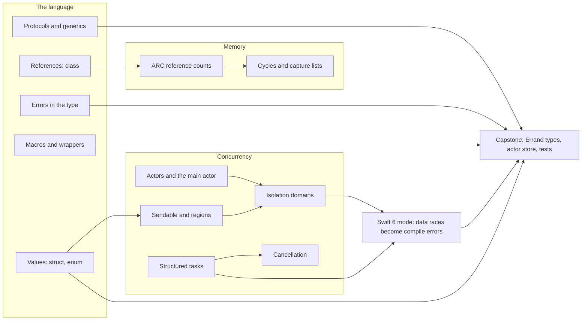
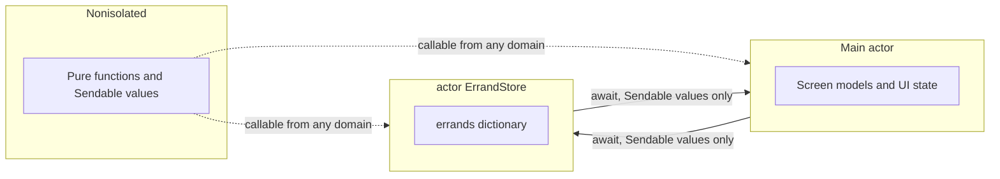
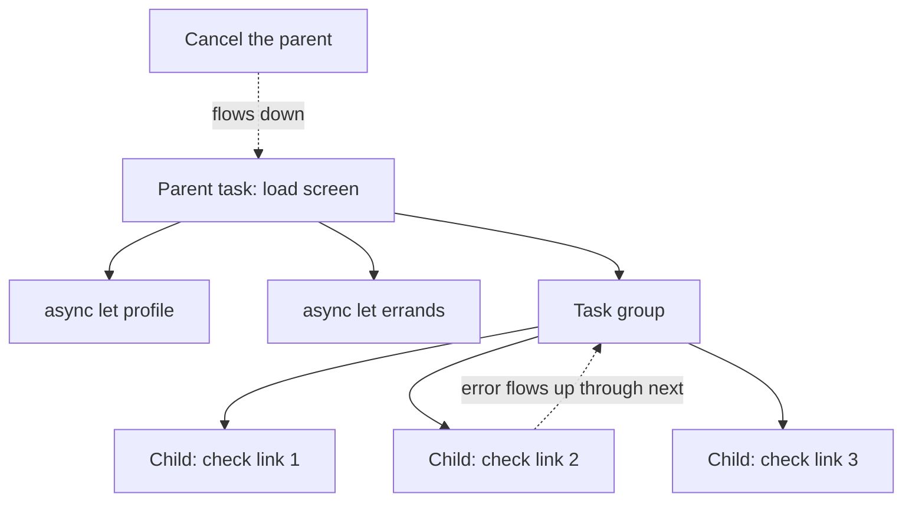

[← Learning hub](README.md)

# Day 1 · Swift 6.4 and concurrency

> By tonight you'll know how Swift models data, how it manages memory, and how the Swift 6 compiler rejects data races before your code ever runs.  **Time:** ~6–8 hours.

## Today's map

Xcode 27 ships Swift 6.4. Today has two halves: the language (values, protocols, errors, memory, compiler-generated code) and concurrency (isolation, tasks, cancellation). They meet in one place: value types are what make safe concurrency cheap.



## Mental models

### 1. Values are the default; identity is a decision

**Most of your types should be values. A class is for something that needs one shared identity. An actor is a shared thing whose mutable state is touched by more than one task.**

A value (`struct` or `enum`) is copied when you assign it or pass it. Two variables never see each other's changes. That removes a whole class of bugs where one screen quietly edits data another screen is showing. It is also what makes values safe to hand to another thread. The standard library is built this way: `Int`, `String`, `Array`, `Dictionary`, `Set` and `Optional` are all values. `Optional` is just an enum with two cases, `none` and `some(Wrapped)`. Apple's guidance in *Choosing Between Structures and Classes* is blunt: "Use structures by default."

Copying sounds slow. It isn't, because arrays, dictionaries, sets and strings use **copy-on-write**: copies share one buffer until one of them is changed. Only then does the changed copy get its own buffer. You pay for a copy only when two copies actually diverge.

| Kind | Semantics | Use it for | In Errand |
|---|---|---|---|
| `struct` | Value, copied | Data. Most model types. | `Errand`, `Step` |
| `enum` | Value, exactly one case, cases can carry data | States, outcomes, errors | `Status`, `StoreError` |
| `class` | Reference, shared identity, counted by ARC | Objects with a lifecycle, UI models that views observe, Objective-C interop | `@Observable` screen models (Day 2) |
| `actor` | Reference, isolated: one task at a time inside | Shared mutable state used from several tasks | `ErrandStore` |

Strings are values too, and they are Unicode-correct. A `String` is a collection of `Character`s. Each `Character` is an *extended grapheme cluster*: what a person sees as one letter, which may be several Unicode scalars. So `count` is not a byte count, and you can't subscript a string with an `Int`. You move through it with `String.Index`. This example is from Apple's `String` documentation:

```swift
let cafe = "Cafe\u{301} du 🌍"
cafe.count                 // 9 characters ("é" is e + combining accent)
cafe.unicodeScalars.count  // 10
cafe.utf16.count           // 11
cafe.utf8.count            // 14
```

The collection APIs you'll use daily are all on `Sequence` and `Collection`: `map`, `filter`, `sorted(by:)`, `firstIndex(where:)`, `count(where:)`, and `Dictionary(grouping:by:)`. For more (chunking, combinations, windows), Apple publishes the open-source `swift-algorithms` package. For time-based operators on async sequences (`debounce`, `merge`, `combineLatest`), there's `swift-async-algorithms`.

**Senior tell:** They model state as enums with associated values so impossible states can't be written down, and every new `class` has to justify why it needs identity.

### 2. Protocols describe capabilities; `some` keeps the type, `any` boxes it

**A protocol says what a type can do. Generics and `some` keep the concrete type, so the compiler checks and optimizes everything. `any` puts the value in a box so different types can sit side by side.**

Swift leans on protocols more than on inheritance. A class can inherit from one class, but any type can conform to many protocols. Three tools do most of the work:

- A **protocol extension** gives every conforming type a default implementation for free.
- An **associated type** lets a protocol mention a type that each conformer picks. `Identifiable.ID` and `Collection.Element` are associated types.
- **Constraints** (`where T: Hashable`, `some Collection<Int>`) narrow a generic to the types it can handle.

`some View` in SwiftUI's `var body: some View` means "one specific type that conforms to `View`, which the compiler knows but you don't have to spell." `any View` would mean "a box holding a value of some conforming type, found out at runtime." A box always uses dynamic dispatch, can cost a heap allocation (when the value is too big to store inline), and loses information such as associated types. Default to generics and `some`. Use `any` when you truly need a mixed collection or a stored property that can hold different types. Swift 6.4 tidied the syntax: an optional opaque type is now `some Rocket?` instead of `(some Rocket)?`.

The other boundary in Swift is the **module**. A module is a target: your app, a framework, or a package target. Access control works at module level:

| Keyword | Visible to |
|---|---|
| `private` | The enclosing declaration (and its extensions in the same file) |
| `fileprivate` | The same file |
| `internal` (default) | The whole module |
| `package` | Other modules in the same Swift package |
| `public` | Any module that imports yours |
| `open` | Like `public`, plus subclassing and overriding from other modules |

Tests reach `internal` code with `@testable import`. In Swift Package Manager, `Package.swift` declares targets (modules), products (what others can import) and settings such as the language mode.

**Senior tell:** They start concrete, extract a protocol only when a second conformer shows up (often a test fake), and prefer `some` until the compiler forces a box.

### 3. Failure is part of the type

**Swift puts "this might not work" in the signature, and the compiler makes the caller deal with it. Use an optional for "no value, and that's normal." Use `throws` for "it failed, and here's why."**

An optional (`String?`) is unwrapped with `if let`, `guard let`, `??` (a default) or `?.` (optional chaining). A force unwrap, `!`, crashes on `nil`. Keep it for invariants where a crash is the right answer.

A throwing function is marked `throws`, and every call to it is marked `try`, so you can see each exit point while reading. Plain `throws` means the error is `any Error`. Since Swift 6 you can write **typed throws**: `throws(ParseError)`. The caller's `catch` then receives a `ParseError` it can `switch` over exhaustively. The standard library uses this in generic code. `Sequence.map` is declared `throws(E)`, so it throws exactly what your closure throws. The Swift Evolution proposal gives the rule of thumb: plain `throws` stays the better default. Use typed throws inside a module where callers really will handle every case, or in generic code that only passes errors through.

`Result<Success, Failure>` stores an outcome as a value, to keep for later or to pass through a callback. In async code you rarely need it: `async throws` says the same thing with less ceremony.

**Senior tell:** They design error enums around what the *caller* can do ("retry", "ask the user", "give up"), not around every internal failure.

### 4. ARC counts owners; a leak is a cycle you drew

**Every class instance has a reference count. When it reaches zero, `deinit` runs and the memory is freed right away, with no garbage collector. A leak is a group of objects that own each other in a circle.**

Only reference types take part: class instances, actors, and closures, which capture the variables they use. The classic iOS cycle is an object that stores a closure, where the closure captures the object (`self`). Neither count can reach zero. A **capture list** breaks it:

- `[weak self]` doesn't add to the count and becomes `nil` when the object dies. You unwrap it with `guard let self else { return }`.
- `[unowned self]` doesn't add to the count and crashes if used after the object dies. Only use it when one lifetime is provably nested inside the other.

You often don't need `[weak self]`:

- **Non-escaping closures** (`map`, `filter`, `Mutex.withLock`) finish before the call returns.
- **`Task { }` bodies that finish.** Apple's `Task` documentation says the closure is released when the task completes, so "tasks rarely need to capture weak references."
- **Value types** have no reference count to cycle.

You still need it for closures you store on `self` (handlers, callbacks), for tasks that never end (a `while` loop, a `for await` over an endless stream), and for long-lived observers. Leaks in modern apps usually come from exactly those: a task looping forever while holding a screen model, or a delegate property that should have been `weak`.

**Senior tell:** They don't sprinkle `[weak self]` everywhere. They ask "does this closure outlive the call, and does `self` own it?" and break the cycle only then.

### 5. A lot of your Swift is written by the compiler

**Attributes that start with `@` and expressions that start with `#` often generate code at compile time: macros, property wrappers, result builders and synthesized conformances. When one misbehaves, look at what it expands to.**

| You write | What it is | What it becomes, roughly |
|---|---|---|
| `@Observable class Car` | Attached macro (Observation) | Adds an `ObservationRegistrar` (`_$observationRegistrar`) and `access`/`withMutation` helpers. Marks each stored property `@ObservationTracked`, so its getter records "someone read me" and its setter notifies readers. Adds conformance to `Observable`. |
| `@Model class Visit` | Attached macro (SwiftData) | The same observation machinery, plus backing storage for persistence (`_$backingData`, `schemaMetadata`, an `init`) and conformance to `PersistentModel`. |
| `#Preview { … }` | Freestanding declaration macro | A type that Xcode's canvas discovers and runs. Its body is a `@MainActor` closure. |
| `#expect(a == b)` | Freestanding expression macro | Code that evaluates `a` and `b` separately, so a failure prints both values and records an issue instead of crashing. |
| `@State var count = 0` | Property wrapper (`@propertyWrapper struct State`) | Hidden storage plus computed accessors. `$count` is the projected value (a binding). |
| `var body: some View { … }` | Result builder (`@resultBuilder struct ViewBuilder`) | Each line, `if` and `for` inside becomes part of one nested value. |
| `struct Visit: Codable` | Synthesized conformance | `init(from:)`, `encode(to:)` and a `CodingKeys` enum, written by the compiler. |

In Xcode, right-click a macro and choose **Expand Macro** to read the real code. You can set breakpoints in it too. Codable is the synthesized conformance you'll meet most. You customize it by writing the `CodingKeys` enum yourself:

```swift
struct Visit: Codable {
    var place: String
    var startsAt: Date
    enum CodingKeys: String, CodingKey { case place, startsAt = "starts_at" }
}

let json = Data(#"{"place":"Library","starts_at":"2026-09-26T10:00:00Z"}"#.utf8)
let decoder = JSONDecoder()
decoder.dateDecodingStrategy = .iso8601
let visit = try decoder.decode(Visit.self, from: json)
```

**Senior tell:** When a macro-based type behaves strangely, they expand the macro before they search the web.

### 6. Concurrency is about isolation, not threads

**Every piece of mutable state belongs to exactly one isolation domain: the main actor, one actor instance, or one task's local variables. Inside a domain, code runs one piece at a time. Crossing a boundary takes `await`, and only `Sendable` values, or values the compiler can prove you handed over, may cross. The Swift 6 language mode turns every violation into a compile error.**



The pieces:

- **`@MainActor`** is a global actor for UI state. Its executor is the main queue. SwiftUI's `View` protocol is `@MainActor`.
- **An `actor`** is a reference type whose stored state can only be touched from inside it. Calls from outside are `await`ed and queued.
- **Nonisolated** code has no state of its own to protect. It runs in whatever domain calls it, or on the shared concurrent thread pool.
- **`Sendable`** marks types that are safe to share across domains. Non-public structs and enums whose parts are all `Sendable` get it automatically. Actors and `@MainActor` classes are `Sendable`. Any other class must be `final` with only immutable `Sendable` stored properties, or protect its own state and declare `@unchecked Sendable`, which is a promise the compiler can't check.
- **Region-based isolation** lets you pass a *non*-`Sendable` value into another domain if the compiler can see you never touch it again. A `sending` parameter demands exactly that. The error "sending 'x' risks causing data races" means you did touch it, or could.

**`await` is a suspension point, and actors are re-entrant.** While an actor method awaits, the actor runs other callers' work. Anything you read before the `await` may be stale after it. An actor is not a lock held across `await`. If you check the state, then await, then act on what you checked, you have a race between tasks, even though no memory is corrupted.

**Approachable concurrency** is the newer set of defaults, controlled by two Xcode build settings per target:

| Setting | Build setting name | Effect |
|---|---|---|
| Default Actor Isolation = `MainActor` | `SWIFT_DEFAULT_ACTOR_ISOLATION` | Unannotated code in the module is inferred `@MainActor`. Your app starts single-threaded. |
| Approachable Concurrency = Yes | `SWIFT_APPROACHABLE_CONCURRENCY` | Turns on five upcoming features. Three are already on in the Swift 6 language mode. The two that change behavior are `NonisolatedNonsendingByDefault` (a nonisolated `async` function runs on the *caller's* actor unless you mark it `@concurrent`) and `InferIsolatedConformances` (a main-actor type's conformances become main-actor-isolated). |

Together they flip the old default. You write sequential code on the main actor and opt into parallelism explicitly, with `@concurrent` functions or actors. `nonisolated(nonsending)` spells the new behavior on a single function. Under main-actor default isolation, some declarations are left alone: actors and their members, anything you mark `nonisolated`, and types whose primary declaration conforms to a protocol that inherits `SendableMetatype` (`Sendable` does, so do `Error` and `CodingKey`). Swift packages get the same option through `.defaultIsolation(MainActor.self)`. A package without it stays nonisolated by default.

For tiny state you access synchronously, an actor can be too much. `Mutex` (from the Synchronization module) guards a value with a lock for a short, non-`await`ing critical section. `Atomic` handles counters and flags.

**Senior tell:** They decide *where each piece of state lives* first, then let the compiler list every place that crosses a boundary. They treat `@unchecked Sendable` and `nonisolated(unsafe)` as exceptions that need a comment explaining why they're safe.

### 7. Structured concurrency is a tree: cancellation flows down, results and errors flow up

**Child tasks live inside a scope and can't outlive it. Cancelling a parent cancels every child. A child's result or error comes back to the parent. Unstructured `Task { }` is the escape hatch, and you own its lifetime.**



- **`async let`** starts a fixed number of children in parallel. The parent awaits them by name.
- **Task groups** (`withTaskGroup`, `withThrowingTaskGroup`) handle a dynamic number of children. **Discarding task groups** are for side effects only: finished children are thrown away, so memory doesn't grow in long-running loops. A throwing discarding group cancels itself on the first error and rethrows it.
- **Cancellation is cooperative.** `cancel()` only sets a flag. Your code checks `Task.isCancelled` or calls `try Task.checkCancellation()`. Many async APIs, including `Task.sleep`, throw `CancellationError` when cancelled. `withTaskCancellationHandler` reacts immediately. New in Swift 6.4, `withTaskCancellationShield` protects cleanup that must finish.
- **Unstructured tasks.** `Task { }` inherits the current actor (for an actor instance, only if the closure uses `self`), priority and task-local values. `Task.detached` inherits neither the actor nor task-local values. Dropping the handle does *not* cancel the task, and a thrown error stays inside until someone awaits `.value`. `Task.immediate` (iOS 26) starts running right away in the caller's context, when the isolation matches, instead of waiting to be scheduled.
- **Values over time** are `AsyncSequence`s, consumed with `for await`. `AsyncStream` bridges callback-based code. `Observations` (iOS 26) turns reads of `@Observable` properties into a stream of changes:

```swift
@MainActor @Observable
final class ErrandListModel { var errands: [Errand] = [] }

@MainActor
func logErrandCount(_ model: ErrandListModel) async {
    for await count in Observations({ model.errands.count }) {
        print("Errands: \(count)")   // current value first, then the latest value after changes
    }
}
```

- **Time** is `Duration` (`.seconds(2)`, `.milliseconds(300)`) plus a clock. `ContinuousClock` keeps counting while the device sleeps. `SuspendingClock` pauses. `Task.sleep(for:)` uses the continuous clock by default.

**Senior tell:** They use `async let` and task groups first, create unstructured tasks only at the edges (a button tap, SwiftUI's `.task` modifier), and for every `Task { }` they can say who cancels it.

## The APIs that matter

| API | What it's for | Since | Link |
|---|---|---|---|
| **Everyday** | | | |
| `Task` | Start async work from synchronous code. The handle lets you await or cancel it. | iOS 13.0 | [doc](https://developer.apple.com/documentation/swift/task) |
| `MainActor` | The global actor for UI state | iOS 13.0 | [doc](https://developer.apple.com/documentation/swift/mainactor) |
| `Actor` (the `actor` keyword) | Protect mutable state by isolation | iOS 13.0 | [doc](https://developer.apple.com/documentation/swift/actor) |
| `Sendable` | Mark types safe to cross isolation domains | iOS 8.0 | [doc](https://developer.apple.com/documentation/swift/sendable) |
| `withThrowingTaskGroup(of:returning:isolation:body:)` | Run a dynamic number of throwing children in parallel | iOS 13.0 | [doc](https://developer.apple.com/documentation/swift/withthrowingtaskgroup(of:returning:isolation:body:)) |
| `Task.checkCancellation()` | Throw `CancellationError` if the task was cancelled | iOS 13.0 | [doc](https://developer.apple.com/documentation/swift/task/checkcancellation()) |
| `Task.sleep(for:tolerance:clock:)` | Suspend without blocking a thread | iOS 16.0 | [doc](https://developer.apple.com/documentation/swift/task/sleep(for:tolerance:clock:)) |
| `AsyncStream`, `makeStream(of:bufferingPolicy:)` | Turn callbacks or delegate events into a `for await` loop | iOS 13.0 | [doc](https://developer.apple.com/documentation/swift/asyncstream) |
| `Codable`, `JSONDecoder` | Convert between JSON and your types | iOS 8.0 | [doc](https://developer.apple.com/documentation/foundation/jsondecoder) |
| `Identifiable` | Stable identity, used by SwiftUI lists | iOS 13.0 | [doc](https://developer.apple.com/documentation/swift/identifiable) |
| `Result` | Store success or failure as a value | iOS 8.0 | [doc](https://developer.apple.com/documentation/swift/result) |
| `Observable()` macro | Make a class observable by SwiftUI and `Observations` | iOS 17.0 | [doc](https://developer.apple.com/documentation/observation/observable()) |
| `Test(_:_:)`, `expect(_:_:sourceLocation:)` | Swift Testing: declare a test, check a condition | Swift 6.0 (Xcode 16) | [doc](https://developer.apple.com/documentation/testing) |
| `Duration` | Amounts of time: `.seconds(2)` | iOS 16.0 | [doc](https://developer.apple.com/documentation/swift/duration) |
| **Intermediate** | | | |
| `withDiscardingTaskGroup(returning:isolation:body:)` | Side-effect-only children. No results pile up. | iOS 17.0 | [doc](https://developer.apple.com/documentation/swift/withdiscardingtaskgroup(returning:isolation:body:)) |
| `withTaskCancellationHandler(operation:onCancel:isolation:)` | Run code the moment a task is cancelled | iOS 13.0 | [doc](https://developer.apple.com/documentation/swift/withtaskcancellationhandler(operation:oncancel:isolation:)) |
| `withCheckedThrowingContinuation(function:_:)` | Wrap a one-shot callback API as `async` | iOS 13.0 | [doc](https://developer.apple.com/documentation/swift/withcheckedthrowingcontinuation(function:_:)-2k46m) |
| `Observations` | An async sequence of changes to `@Observable` values | iOS 26.0 | [doc](https://developer.apple.com/documentation/observation/observations) |
| `TaskLocal` | Values that flow down the task tree, such as a trace ID | iOS 13.0 | [doc](https://developer.apple.com/documentation/swift/tasklocal) |
| `Mutex` | Lock-protected state for short synchronous access | iOS 18.0 | [doc](https://developer.apple.com/documentation/synchronization/mutex) |
| `ContinuousClock`, `SuspendingClock` | Measure time and set deadlines | iOS 16.0 | [doc](https://developer.apple.com/documentation/swift/continuousclock) |
| `MainActor.assumeIsolated(_:file:line:)` | In a synchronous callback you know runs on main, use main-actor state (traps if you're wrong) | iOS 13.0 | [doc](https://developer.apple.com/documentation/swift/mainactor/assumeisolated(_:file:line:)) |
| `isolation()` (`#isolation`) | Pass the caller's isolation into a function | iOS 13.0 | [doc](https://developer.apple.com/documentation/swift/isolation()) |
| `Task.immediate(name:priority:executorPreference:operation:)` | Start a task synchronously in the current context | iOS 26.0 | [doc](https://developer.apple.com/documentation/swift/task/immediate(name:priority:executorpreference:operation:)-88o80) |
| `require(_:_:sourceLocation:)` | Unwrap an optional in a test, or stop the test | Swift 6.0 (Xcode 16) | [doc](https://developer.apple.com/documentation/testing/require(_:_:sourcelocation:)-6w9oo) |
| `confirmation(_:expectedCount:isolation:sourceLocation:_:)` | Test that an event happens a set number of times | Swift 6.0 (Xcode 16) | [doc](https://developer.apple.com/documentation/testing/confirmation(_:expectedcount:isolation:sourcelocation:_:)-5mqz2) |
| `Regex` | Type-checked regular expressions | iOS 16.0 | [doc](https://developer.apple.com/documentation/swift/regex) |
| **Advanced** | | | |
| `withTaskCancellationShield(operation:)` | Let cleanup run even in a cancelled task | iOS 27.0 | [doc](https://developer.apple.com/documentation/swift/withtaskcancellationshield(operation:)-8zlgh) |
| `Continuation`, `withContinuation(of:throwing:_:)` | A noncopyable continuation: the compiler rejects a second resume, and dropping it unresumed traps | iOS 27.0 | [doc](https://developer.apple.com/documentation/swift/continuation) |
| `withContinuousObservation(options:apply:)` | Callbacks for every `willSet`/`didSet` of observed properties | iOS 27.0 | [doc](https://developer.apple.com/documentation/observation/withcontinuousobservation(options:apply:)) |
| `Atomic` | Lock-free counters and flags | iOS 18.0 | [doc](https://developer.apple.com/documentation/synchronization/atomic) |
| `InlineArray` | Fixed-size array stored inline, with no heap allocation | iOS 26.0 | [doc](https://developer.apple.com/documentation/swift/inlinearray) |
| `UniqueArray` | Growable array of noncopyable elements, with no copy-on-write | iOS 27.0 | [doc](https://developer.apple.com/documentation/swift/uniquearray) |
| `TaskExecutor` | Choose where a task's nonisolated work runs | iOS 18.0 | [doc](https://developer.apple.com/documentation/swift/taskexecutor) |
| `CustomTestReflectable` | Control how your values appear in failed expectations | Swift 6.4 (Xcode 27) | [doc](https://developer.apple.com/documentation/testing/customtestreflectable) |

## Core patterns in code

**1. Values copy, references share.** Run this in a playground and predict each line before you look.

```swift
struct StepValue { var title: String; var done = false }

final class StepObject {
    var title: String
    var done = false
    init(title: String) { self.title = title }
}

let a = StepValue(title: "Call the library")
var b = a                     // an independent copy
b.done = true
print(a.done, b.done)         // false true

let x = StepObject(title: "Call the library")
let y = x                     // a second reference to the same object
y.done = true
print(x.done, y.done)         // true true

let list = [a, a, a]
var copy = list               // shares storage with `list` for now
copy[0].done = true           // copy-on-write: storage is duplicated here
print(list[0].done)           // false
```

- `let` on a struct freezes the whole value. `let` on a class only freezes the reference: `y.done = true` still compiles.
- The array copy is cheap until the write. That's why returning arrays from functions is normal Swift, not a performance smell.

**2. Protocols, generics, `some` and `any`.** One protocol, two conformers, and three ways to accept them.

```swift
protocol Trackable {
    associatedtype ID: Hashable
    var id: ID { get }
    var isFinished: Bool { get }
}

extension Trackable {
    var isOpen: Bool { !isFinished }        // every conformer gets this for free
}

struct Chore: Trackable { let id: Int; var isFinished: Bool }
struct Appointment: Trackable { let id: String; var isFinished: Bool }

// Generic: one concrete type per call, checked and specialized at compile time.
func openCount<T: Trackable>(_ items: [T]) -> Int {
    items.count(where: { $0.isOpen })
}

// `some`: the same thing with lighter syntax, for a single parameter.
func describe(_ item: some Trackable) -> String {
    "\(item.id): \(item.isOpen ? "open" : "done")"
}

// `any`: a box, so different conforming types can share one array.
let mixed: [any Trackable] = [Chore(id: 1, isFinished: false), Appointment(id: "dentist", isFinished: true)]
let stillOpen = mixed.filter { $0.isOpen }.count
```

- `openCount` can't take `mixed`. `[T]` means "all elements are the same `T`." That's the price of static typing, and also the point.
- Associated types are why `any Trackable` loses information: the box doesn't know which `ID` type is inside.

**3. Typed throws inside a module.** The caller gets a concrete error type and can handle every case.

```swift
enum TitleError: Error {
    case empty
    case tooLong(limit: Int)
}

func validatedTitle(_ raw: String) throws(TitleError) -> String {
    let trimmed = raw.trimmingCharacters(in: .whitespacesAndNewlines)
    guard !trimmed.isEmpty else { throw .empty }
    guard trimmed.count <= 80 else { throw .tooLong(limit: 80) }
    return trimmed
}

func messageFor(_ raw: String) -> String {
    do {
        let title = try validatedTitle(raw)
        return "Saved \"\(title)\"."
    } catch {
        switch error {                        // `error` is TitleError, not `any Error`
        case .empty: return "Give the errand a name."
        case .tooLong(let limit): return "Keep it under \(limit) characters."
        }
    }
}
```

- `throw .empty` works because the thrown type gives the context. No `TitleError.` prefix needed.
- The `do` block infers `TitleError` only because every `try` inside it calls a typed-throws function. Mix in an untyped call and `error` becomes `any Error` again.

**4. When `[weak self]` still matters.** A task that loops forever keeps whatever it captures alive, so this one captures weakly.

```swift
@MainActor
final class CountdownModel {
    private(set) var secondsLeft: Int
    private var timer: Task<Void, Never>?

    init(seconds: Int) { secondsLeft = seconds }

    func start() {
        timer = Task { [weak self] in          // inherits @MainActor from start()
            while !Task.isCancelled {
                try? await Task.sleep(for: .seconds(1))
                guard let self, secondsLeft > 0 else { return }
                secondsLeft -= 1
            }
        }
    }

    func stop() { timer?.cancel() }
}
```

- `guard let self` inside the loop holds a strong reference for one iteration only. When the model goes away, the next iteration ends the task.
- A task that runs once and finishes would not need `[weak self]`. Its closure is released on completion.
- `try?` swallows the `CancellationError` from `sleep`, and the `while` condition ends the loop. That's fine here. Elsewhere, let cancellation propagate with `try`.

**5. An actor that survives reentrancy.** Two callers asking for the same URL should share one download, not start two.

```swift
actor ThumbnailCache {
    private var cache: [URL: Data] = [:]
    private var inFlight: [URL: Task<Data, any Error>] = [:]

    func data(for url: URL) async throws -> Data {
        if let cached = cache[url] { return cached }
        if let running = inFlight[url] { return try await running.value }

        let task = Task {
            let (data, _) = try await URLSession.shared.data(from: url)
            return data
        }
        inFlight[url] = task                  // recorded before the first await
        defer { inFlight[url] = nil }

        let data = try await task.value       // suspension: other callers run here
        cache[url] = data
        return data
    }
}
```

- Everything between two `await`s runs without interruption. The check (`cache[url]`, `inFlight[url]`) and the claim (`inFlight[url] = task`) sit in one synchronous stretch, so no second caller can slip in between.
- Without `inFlight`, caller B would run during A's `await`, see an empty cache and start a second download. That's reentrancy.

**6. A task group with a concurrency limit.** At most `limit` requests in flight. The first failure cancels the rest.

```swift
nonisolated struct LinkCheck: Sendable {
    let url: URL
    let isOK: Bool
}

nonisolated enum LinkChecker {
    static func check(_ urls: [URL], limit: Int = 4) async throws -> [LinkCheck] {
        try await withThrowingTaskGroup(of: LinkCheck.self) { group in
            var queue = urls.dropFirst(limit).makeIterator()
            for url in urls.prefix(limit) {
                group.addTask { try await LinkChecker.probe(url) }
            }
            var results: [LinkCheck] = []
            while let result = try await group.next() {   // rethrows a child's error
                results.append(result)
                if let url = queue.next() {
                    group.addTask { try await LinkChecker.probe(url) }
                }
            }
            return results
        }
    }

    static func probe(_ url: URL) async throws -> LinkCheck {
        try Task.checkCancellation()
        let (_, response) = try await URLSession.shared.data(from: url)
        let status = (response as? HTTPURLResponse)?.statusCode ?? 0
        return LinkCheck(url: url, isOK: (200..<300).contains(status))
    }
}
```

- An error thrown out of the group's body cancels every remaining child. That's why `try await group.next()` is the line that makes "first failure stops everything" work.
- `nonisolated` stops these types from being inferred `@MainActor` in an app target whose default isolation is `MainActor`. With approachable concurrency, `check` itself still runs on its caller's actor, but every `probe` runs in a child task on the concurrent pool. Mark `check` `@concurrent` if the loop itself does heavy work.
- For a fixed number of calls, `async let a = f(); async let b = g(); let (x, y) = try await (a, b)` is simpler.

**7. Main actor by default, `@concurrent` for heavy work.** This is the shape most app code takes with approachable concurrency turned on. (`Errand` is the model type you'll write in today's capstone.)

```swift
@MainActor                       // inferred under default MainActor isolation
@Observable
final class SummaryModel {
    var text = ""

    func refresh(_ errands: [Errand]) async {
        text = await Summarizer.summarize(errands)   // hop off main, then back
    }
}

nonisolated enum Summarizer {
    @concurrent
    static func summarize(_ errands: [Errand]) async -> String {
        errands
            .sorted { $0.createdAt < $1.createdAt }
            .map { "\($0.title): \(Int($0.progress * 100))%" }
            .joined(separator: "\n")
    }
}
```

- Without `@concurrent`, `summarize` would run on the caller's actor (here, the main actor) because of `NonisolatedNonsendingByDefault`. Correct, but it could stutter the UI with a large input.
- The argument and result cross a boundary, so they must be `Sendable`. `[Errand]` and `String` are.

## What's new in iOS 27 (and what old tutorials get wrong)

- **Xcode 27 includes Swift 6.4** and the iOS 27 SDK ([release notes](https://developer.apple.com/documentation/xcode-release-notes/xcode-27-release-notes)). Swift.org's [Swift 6.4 release post](https://www.swift.org/blog/swift-6.4-released/) has the full language list. The items below are the ones that matter on day one.
- **Cleanup that survives cancellation.** `defer` blocks can now contain `await`, and `withTaskCancellationShield(operation:)` (iOS 27) runs a closure as if the task weren't cancelled. Use both together for "always flush, always close" cleanup.
- **Swallowed task errors now warn.** Creating a throwing `Task { try … }` without storing its result now produces a warning, because the error would otherwise disappear. Handle the error inside the task, keep the handle, or write `_ = Task { … }` when dropping it is deliberate.
- **`~Sendable`.** You can now state explicitly that a type is *not* `Sendable`. This stops automatic inference without affecting subclasses.
- **Smaller syntax fixes.** `some P?` without parentheses. Module selectors (`SwiftUI::View`) when two imported modules use the same name (these arrived a little earlier, in Swift 6.3 with Xcode 26.4). A `@diagnose(Group, as: error|warning|ignored)` attribute to control a warning group for one declaration.
- **Continuations.** The new noncopyable `Continuation` with `withContinuation(of:throwing:_:)` (iOS 27) makes "resume at most once" a compile-time rule, and traps at runtime if a continuation is dropped without being resumed. `withCheckedContinuation(function:_:)` replaces the older `isolation:` overloads, which the docs now list as deprecated.
- **Observation.** `withContinuousObservation(options:apply:)` and `withObservationTracking(options:_:onChange:)` (iOS 27) report `willSet`, `didSet` and `deinit` events. `Observations` (iOS 26) is the async-sequence form.
- **Ownership types** for performance-critical code: `UniqueArray`, `UniqueBox`, `Ref`/`MutableRef` and the `Iterable` protocol (all iOS 27). Recognize them. You won't need them this week.
- **Swift Testing and XCTest interoperate.** You can call `XCTAssert…` inside a `@Test` and `#expect` inside an `XCTestCase`. Xcode 27 adds a test-plan setting that controls how such cross-framework failures are reported. `CustomTestReflectable` customizes failure output. `swift test --repeat-until fail --maximum-repetitions 50` hunts flaky tests.
- **Debugging.** LLDB's new `language swift task tree` command prints every task the debugger knows about. Instruments adds a Swift Executors instrument (main actor, cooperative pool, custom executors) and groups tasks into Task Collections by name. Name your tasks with `Task(name:)`.
- **`#Preview` code now explicitly runs on the main actor**, so previews can call main-actor APIs without warnings.
- **What old tutorials get wrong:**
  - "Nonisolated async functions always run on a background thread." Not with approachable concurrency: they run on the caller's actor unless marked `@concurrent`.
  - "Use `Task.detached` to get off the main thread." Prefer a `@concurrent` function. Detached tasks lose the actor context and task-local values, and nothing cancels them for you.
  - "Always write `[weak self]` in `Task`." Only for tasks that can outlive their owner.
  - `DispatchQueue.main.async` inside async code, `ObservableObject`, XCTest for new tests, and `Task.sleep(nanoseconds:)` are all older patterns.

## Pitfalls you only learn by shipping

- **The UI stutters after you turn on approachable concurrency** → a nonisolated `async` helper that parses or sorts a lot now runs on its caller's actor, which is the main actor → mark it `@concurrent` or move the work into an actor.
- **"sending 'draft' risks causing data races"** → you passed a non-`Sendable` class instance to another domain (an actor call, `Task.detached`) and still use it, or could → make it a struct, make it `Sendable`, create it on the far side, or stop touching it after the hand-off.
- **Actor state is "randomly" wrong** → reentrancy: state you read before an `await` changed while you were suspended → keep check-and-update in one synchronous stretch, record in-flight work before awaiting, and re-read after awaiting.
- **Errors vanish** → `Task { try await save() }` holds the error until someone awaits `.value`, and nobody does → handle errors inside the task with `do`/`catch`, or keep the handle and await it. Swift 6.4 now warns about this.
- **A child task failed and nobody noticed** → in `withThrowingTaskGroup`, a child's error only surfaces when you call `next()` or iterate the group. Apple's docs show a group that "doesn't throw an error" because nobody pulled results → iterate the group, or use `withThrowingDiscardingTaskGroup`, which cancels and rethrows on the first error.
- **The screen closed but the work kept going** → dropping a `Task` handle does not cancel it → keep the handle and cancel it on teardown (on Day 2, SwiftUI's `.task` does this for you), and check for cancellation inside loops.
- **Memory climbs and `deinit` never runs** → a task that loops forever, or iterates an endless async sequence, captures `self` strongly → capture `[weak self]` and unwrap once per iteration, or cancel the task.
- **The app freezes under load** → a semaphore, `DispatchQueue.sync` or a lock is waiting for async work on the cooperative thread pool, which has a limited number of threads → never block inside async code. Bridge with continuations. Keep `Mutex` sections short and free of `await`.
- **"main actor-isolated conformance of 'Errand' to 'Decodable' cannot be used in nonisolated context"** → with default `MainActor` isolation, your model struct and its conformances became main-actor-isolated → mark model types `nonisolated` (the explicit fix), or move them into a package whose default isolation is nonisolated.
- **A continuation hangs or crashes** → one code path never resumes (the caller waits forever), or two paths both resume (crash) → resume exactly once on every path. `CheckedContinuation` reports misuse at runtime. iOS 27's `Continuation` rejects a double resume at compile time and traps with the creation site if it's never resumed.

## Legacy you'll still meet

| Old | New |
|---|---|
| `DispatchQueue.main.async { … }` | `@MainActor` code, or `Task { @MainActor in … }` |
| Completion handlers `(Result<T, Error>) -> Void` | `async throws -> T` |
| `DispatchGroup` | `async let`, task groups |
| Serial `DispatchQueue`, `NSLock`, `OSAllocatedUnfairLock` guarding state | `actor`, or `Mutex` |
| `DispatchSemaphore` to wait for async work | `await` (never block) |
| `ObservableObject` + `@Published` | `@Observable` |
| Combine pipelines for values over time | `AsyncSequence`, `AsyncStream`, `Observations` |
| `XCTestCase` + `XCTAssertEqual` | `@Test` + `#expect` |
| `Task.sleep(nanoseconds:)` | `Task.sleep(for: .seconds(1))` |
| `Task.detached` "to get off main" | A `@concurrent` function |

## Practice

**1. Copy-on-write by hand (45 min).** Write `struct Checklist` that stores its items in a private `final class` buffer. Before every mutation, check `isKnownUniquelyReferenced(&buffer)` and copy the buffer only if it's shared.
*Done when:* a Swift Testing test shows that changing a copy leaves the original untouched, and a second test shows no copy happens when only one value exists. Compare `ObjectIdentifier` of the buffer before and after.

**2. Leak hunt (30 min).** Make a class with a stored `onTick: () -> Void` closure that uses `self`, and a second class whose `Task` loops forever over `Task.sleep`. Add a `deinit` that prints to each.
*Done when:* both `deinit`s print after you drop the last reference, and you can explain in one sentence why a task that finishes wouldn't need `[weak self]`.

**3. A package with strict settings (45 min).** Create a Swift package `TextKit` with this manifest. Write `public func initials(of name: String) -> String` that handles "Zoë Saldaña" and "김민준", plus a parameterized test.

```swift
// swift-tools-version: 6.4
import PackageDescription

let package = Package(
    name: "TextKit",
    platforms: [.iOS(.v27), .macOS(.v27)],
    products: [.library(name: "TextKit", targets: ["TextKit"])],
    targets: [
        .target(name: "TextKit"),
        .testTarget(name: "TextKitTests", dependencies: ["TextKit"])
    ],
    swiftLanguageModes: [.v6]
)
```

*Done when:* `swift test` passes from Terminal and ⌘U passes in Xcode, and you can explain why `initials` must be `public` (and why `@testable import` would hide that mistake).

**4. Read the compiler (30 min).** In `TextKit` (nonisolated by default), paste this and build:

```swift
import Foundation

var launchCount = 0

final class Draft { var text = "" }

@MainActor final class Editor {
    var draft = Draft()
    func save() {
        Task.detached { self.draft.text += "!" }
    }
}

func upload() {
    Task { try await Task.sleep(for: .seconds(1)) }
}
```

*Done when:* you've copied each diagnostic's exact text into a note, next to the isolation boundary it's about, and fixed every one without `@unchecked Sendable` or `nonisolated(unsafe)`. Then add `.defaultIsolation(MainActor.self)` to the target's `swiftSettings` and see which diagnostics go away.

**5. Capstone, step 1: Errand's model and store (1.5 h).** Create an iOS App project named **Errand** in Xcode 27 with a Swift Testing test target. In the app target's build settings, set **Swift Language Version** to Swift 6, **Default Actor Isolation** to `MainActor` and **Approachable Concurrency** to Yes. Then add these files.

`Errand/Model/Errand.swift`:

```swift
import Foundation

nonisolated enum Status: String, Codable, Sendable, CaseIterable {
    case pending, running, waitingForApproval, done, failed

    func canMove(to next: Status) -> Bool {
        switch (self, next) {
        case (.pending, .running), (.running, .waitingForApproval),
             (.waitingForApproval, .running), (.running, .done),
             (.running, .failed), (.failed, .pending):
            return true
        default:
            return false
        }
    }
}

nonisolated struct Step: Identifiable, Hashable, Codable, Sendable {
    let id: UUID
    var title: String
    var status: Status = .pending
    var needsApproval: Bool          // true = a side effect; ask the user first

    init(title: String, needsApproval: Bool = false) {
        self.id = UUID()
        self.title = title
        self.needsApproval = needsApproval
    }
}

nonisolated struct Errand: Identifiable, Hashable, Codable, Sendable {
    let id: UUID
    var title: String
    var due: Date?
    var steps: [Step]
    let createdAt: Date

    init(title: String, due: Date? = nil, steps: [Step] = []) {
        self.id = UUID()
        self.title = title
        self.due = due
        self.steps = steps
        self.createdAt = Date()
    }

    var progress: Double {
        guard !steps.isEmpty else { return 0 }
        return Double(steps.count(where: { $0.status == .done })) / Double(steps.count)
    }
}

nonisolated enum StoreError: Error, Equatable {
    case errandNotFound(Errand.ID)
    case stepNotFound(Step.ID)
    case invalidMove(from: Status, to: Status)
}
```

`Errand/Model/ErrandStore.swift`:

```swift
import Foundation

actor ErrandStore {
    private var errands: [Errand.ID: Errand] = [:]

    var all: [Errand] {
        errands.values.sorted { $0.createdAt < $1.createdAt }
    }

    func add(_ errand: Errand) {
        errands[errand.id] = errand
    }

    func errand(withID id: Errand.ID) throws(StoreError) -> Errand {
        guard let errand = errands[id] else { throw .errandNotFound(id) }
        return errand
    }

    func move(step stepID: Step.ID, in errandID: Errand.ID, to next: Status) throws(StoreError) {
        guard var errand = errands[errandID] else { throw .errandNotFound(errandID) }
        guard let index = errand.steps.firstIndex(where: { $0.id == stepID }) else {
            throw .stepNotFound(stepID)
        }
        let current = errand.steps[index].status
        guard current.canMove(to: next) else { throw .invalidMove(from: current, to: next) }
        errand.steps[index].status = next
        errands[errandID] = errand       // write the changed copy back
    }
}
```

`ErrandTests/ErrandStoreTests.swift`:

```swift
import Foundation
import Testing
@testable import Errand

struct ErrandStoreTests {
    @Test func `Adding an errand stores it`() async {
        let store = ErrandStore()
        await store.add(Errand(title: "Renew library books", steps: [Step(title: "Log in")]))
        let all = await store.all
        #expect(all.count == 1)
        #expect(all.first?.title == "Renew library books")
    }

    @Test func `Finishing the only step completes the errand`() async throws {
        let store = ErrandStore()
        let step = Step(title: "Renew all books")
        let errand = Errand(title: "Library", steps: [step])
        await store.add(errand)
        try await store.move(step: step.id, in: errand.id, to: .running)
        try await store.move(step: step.id, in: errand.id, to: .done)
        let saved = try await store.errand(withID: errand.id)
        #expect(saved.progress == 1.0)
    }

    @Test func `Unknown errand throws`() async {
        let store = ErrandStore()
        let missing = UUID()
        await #expect(throws: StoreError.errandNotFound(missing)) {
            try await store.errand(withID: missing)
        }
    }

    @Test(arguments: Status.allCases)
    func `Nothing leaves done`(next: Status) {
        #expect(!Status.done.canMove(to: next))
    }
}
```

The module and the struct are both called `Errand`. That's legal. If you ever need to tell them apart, the module selector syntax (Swift 6.3 and later) is `Errand::Errand`.

*Done when:* ⌘U runs all tests green (the last one runs once per status). The project builds in the Swift 6 language mode with zero warnings. You can say why `Errand` is a `struct` but `ErrandStore` is an `actor`, and what `nonisolated` on the model types protects you from. Stretch: add a `@Test` for an invalid move that expects `StoreError.invalidMove(from: .pending, to: .done)`.

## Check yourself

1. You copy a struct that holds an array of 10,000 elements, then change one element in the copy. What gets copied, and when?
<details><summary>Answer</summary>

Assigning the struct copies its fields, but the array field still points to the same shared buffer. Nothing large is copied until you write through the copy. At that moment copy-on-write duplicates the array's buffer (all 10,000 elements) once, and later writes happen in place.

</details>

2. `func f(_ x: some Trackable)` versus `func f(_ x: any Trackable)`: what's the difference, and when must you use `any`?
<details><summary>Answer</summary>

`some` is a generic parameter: each call site has one concrete type that the compiler knows, so calls are statically dispatched and can be specialized. `any` is a box whose contents are only known at runtime. It always uses dynamic dispatch, can cost a heap allocation, and hides associated types. You need `any` when one variable or collection must hold values of different conforming types.

</details>

3. Why doesn't `Task { self.text = await load() }` in a main-actor model need `[weak self]`, and when would it?
<details><summary>Answer</summary>

The task finishes, and Apple documents that a task releases its closure (and so its captures) when it completes. The model stays alive until then, at most. You need `[weak self]` when the task can run indefinitely, like a loop or an endless `for await`, because then the strong capture keeps the model alive forever.

</details>

4. An actor method checks `cache[url]`, awaits a download, then writes `cache[url]`. Two callers ask for the same URL at once. What happens?
<details><summary>Answer</summary>

Both see a miss. Actors are re-entrant: while the first call is suspended at `await`, the actor runs the second call, which also finds the cache empty and starts a second download. The fix is to record the in-flight work (for example a `Task` in a dictionary) before the first `await`, and have later callers await that task.

</details>

5. After you turn on Approachable Concurrency, a function that sorts 50,000 items makes scrolling stutter. Nothing else changed. Why?
<details><summary>Answer</summary>

`NonisolatedNonsendingByDefault` makes nonisolated `async` functions run on the caller's actor. The caller is main-actor UI code, so the sort now runs on the main thread. Mark the function `@concurrent` (or move the work to an actor) so it runs on the concurrent pool.

</details>

6. In `withThrowingTaskGroup`, a child throws but your body never calls `next()` or iterates the group. What does the group do?
<details><summary>Answer</summary>

Nothing visible. The error isn't rethrown and the other children aren't cancelled. The group still waits for all children before returning. Errors surface only when you pull results. `withThrowingDiscardingTaskGroup` behaves differently: the first child error cancels the group and is rethrown.

</details>

7. Your app target uses default `MainActor` isolation. Decoding `struct Errand: Codable` inside an actor fails with an "isolated conformance" error. Why, and what are two fixes?
<details><summary>Answer</summary>

Unannotated declarations in the module, including `Errand` and its `Codable` conformance, were inferred `@MainActor`. So the conformance can only be used on the main actor. Fixes: mark the type `nonisolated`, or move model types to a module whose default isolation is nonisolated, such as a package. (Declaring `Sendable` in the type's primary declaration also opts it out of default isolation, but `nonisolated` says what you mean.)

</details>

8. When is typed throws the right choice, and when is plain `throws` better?
<details><summary>Answer</summary>

Use typed throws inside a module where callers really will handle every case (like `ErrandStore` and its UI), or in generic code that only passes a caller's errors through (like `map`). Use plain `throws` for public APIs and anything that might later fail in new ways. A fixed error type is a promise that's hard to change.

</details>

## Go deeper

- [Adopting strict concurrency in Swift 6 apps](https://developer.apple.com/documentation/swift/adoptingswift6): Apple's migration article, including module-by-module adoption.
- [Concurrency](https://developer.apple.com/documentation/swift/concurrency): the full list of tasks, groups, continuations, actors and executors.
- [Task](https://developer.apple.com/documentation/swift/task): read "Task closure lifetime" for when you don't need `[weak self]`.
- [Updating an app to use strict concurrency](https://developer.apple.com/documentation/swift/updating-an-app-to-use-strict-concurrency): sample code for WWDC24 session 10169, "Migrate your app to Swift 6".
- [Code-along: Elevating an app with Swift concurrency](https://developer.apple.com/documentation/swift/code-along-elevating-an-app-with-swift-concurrency): sample code for WWDC25 session 270.
- [Choosing Between Structures and Classes](https://developer.apple.com/documentation/swift/choosing-between-structures-and-classes)
- [Swift Testing](https://developer.apple.com/documentation/testing) and [Implementing parameterized tests](https://developer.apple.com/documentation/testing/parameterizedtesting)
- [Observation](https://developer.apple.com/documentation/observation)
- [Build settings reference](https://developer.apple.com/documentation/xcode/build-settings-reference): search for "Default Actor Isolation" and "Approachable Concurrency".
- [Xcode 27 Release Notes](https://developer.apple.com/documentation/xcode-release-notes/xcode-27-release-notes)

<details><summary>Verified APIs</summary>

Swift standard library and concurrency

- `Task` — iOS 13.0
- `Task.init(name:priority:operation:)` — iOS 13.0
- `Task.detached(name:priority:operation:)` — iOS 13.0
- `Task.immediate(name:priority:executorPreference:operation:)` — iOS 26.0
- `Task.name` (static, the current task's name) — iOS 26.0; instance `name` — iOS 27.0
- `Task.value` — iOS 13.0
- `Task.cancel()` — iOS 13.0
- `Task.isCancelled` — iOS 13.0
- `Task.checkCancellation()` — iOS 13.0
- `Task.sleep(for:tolerance:clock:)` — iOS 16.0
- `Task.sleep(nanoseconds:)` (legacy) — iOS 13.0
- `CancellationError` — iOS 13.0
- `withTaskCancellationHandler(operation:onCancel:isolation:)` — iOS 13.0
- `withTaskCancellationShield(operation:)` — iOS 27.0
- `TaskGroup` — iOS 13.0
- `TaskGroup.addTask(name:priority:operation:)` — iOS 13.0
- `TaskGroup.next(isolation:)` — iOS 13.0
- `TaskGroup.cancelAll()` — iOS 13.0
- `ThrowingTaskGroup` — iOS 13.0
- `withTaskGroup(of:returning:isolation:body:)` — iOS 13.0
- `withThrowingTaskGroup(of:returning:isolation:body:)` — iOS 13.0
- `DiscardingTaskGroup` — iOS 17.0
- `withDiscardingTaskGroup(returning:isolation:body:)` — iOS 17.0
- `withThrowingDiscardingTaskGroup(returning:isolation:body:)` — iOS 17.0
- `TaskLocal` — iOS 13.0
- `TaskExecutor` — iOS 18.0
- `Actor` — iOS 13.0
- `MainActor` — iOS 13.0
- `MainActor.assumeIsolated(_:file:line:)` — iOS 13.0
- `GlobalActor` — iOS 13.0
- `Sendable` — iOS 8.0
- `SendableMetatype` — iOS 8.0
- `isolation()` (`#isolation`) — iOS 13.0
- `AsyncSequence` — iOS 13.0
- `AsyncStream` — iOS 13.0
- `AsyncStream.makeStream(of:bufferingPolicy:)` — iOS 13.0
- `CheckedContinuation` — iOS 13.0
- `withCheckedThrowingContinuation(function:_:)` — iOS 13.0
- `withCheckedContinuation(function:_:)` — iOS 13.0
- `Continuation` — iOS 27.0
- `withContinuation(of:throwing:_:)` — iOS 27.0
- `Clock` — iOS 16.0
- `ContinuousClock` — iOS 16.0
- `SuspendingClock` — iOS 16.0
- `Duration` — iOS 16.0
- `Duration.seconds(_:)` — iOS 16.0
- `Optional` — iOS 8.0
- `Result` — iOS 8.0
- `Error` — iOS 8.0
- `Codable` — iOS 8.0
- `CodingKey` — iOS 8.0
- `Identifiable` — iOS 13.0
- `Hashable` — iOS 8.0
- `Equatable` — iOS 8.0
- `CaseIterable` — iOS 8.0
- `String` — iOS 8.0
- `Character` — iOS 8.0
- `String.unicodeScalars` — iOS 8.0
- `String.utf8` — iOS 8.0
- `String.count` — iOS 8.0
- `String.Index` — iOS 8.0
- `StringProtocol.trimmingCharacters(in:)` — iOS 8.0
- `Array` — iOS 8.0
- `Dictionary` — iOS 8.0
- `Dictionary.init(grouping:by:)` — iOS 8.0
- `Set` — iOS 8.0
- `Sequence.map(_:)` — iOS 8.0
- `Sequence.sorted(by:)` — iOS 8.0
- `Sequence.count(where:)` — iOS 8.0
- `Collection.firstIndex(where:)` — iOS 8.0
- `isKnownUniquelyReferenced(_:)` — iOS 8.0
- `Regex` — iOS 16.0
- `InlineArray` — iOS 26.0
- `UniqueArray` — iOS 27.0
- `UniqueBox` — iOS 27.0
- `Ref` — iOS 27.0
- `MutableRef` — iOS 27.0
- `Iterable` — iOS 27.0

Observation

- `Observable()` — iOS 17.0
- `Observable` — iOS 17.0
- `ObservationTracked()` — iOS 17.0
- `Observations` — iOS 26.0
- `Observations.init(_:)` — iOS 26.0
- `withContinuousObservation(options:apply:)` — iOS 27.0
- `withObservationTracking(options:_:onChange:)` — iOS 27.0

Synchronization

- `Mutex` — iOS 18.0
- `Atomic` — iOS 18.0

Swift Testing (versioned by Swift and Xcode, not iOS)

- `Test(_:_:)` — Swift 6.0, Xcode 16.0
- `Test(_:_:arguments:)` — Swift 6.0, Xcode 16.0
- `expect(_:_:sourceLocation:)` — Swift 6.0, Xcode 16.0
- `expect(throws:_:sourceLocation:performing:)` — Swift 6.0, Xcode 16.0
- `require(_:_:sourceLocation:)` — Swift 6.0, Xcode 16.0
- `confirmation(_:expectedCount:isolation:sourceLocation:_:)` — Swift 6.0, Xcode 16.0
- `CustomTestReflectable` — Swift 6.4, Xcode 27.0

Foundation, SwiftUI, SwiftData

- `JSONDecoder` — iOS 8.0
- `JSONDecoder.decode(_:from:)` — iOS 8.0
- `JSONDecoder.dateDecodingStrategy` — iOS 8.0
- `JSONDecoder.DateDecodingStrategy.iso8601` — iOS 10.0
- `URLSession.data(from:delegate:)` — iOS 15.0
- `HTTPURLResponse.statusCode` — iOS 2.0
- `UUID` — iOS 6.0
- `Date` — iOS 8.0
- `URL` — iOS 8.0
- `View` — iOS 13.0
- `View.task(name:priority:file:line:_:)` — iOS 15.0
- `ViewBuilder` — iOS 13.0
- `State` — iOS 13.0
- `Preview(_:body:)` (`#Preview`) — iOS 13.0 (as reported by the docs)
- `Model()` — iOS 17.0

PackageDescription (versioned by SwiftPM)

- `SupportedPlatform.IOSVersion.v27` — SwiftPM 6.4
- `SupportedPlatform.MacOSVersion.v27` — SwiftPM 6.4
- `SwiftSetting.defaultIsolation(_:_:)` — SwiftPM 6.2
- `SwiftLanguageMode.v6` — SwiftPM 6.0

Legacy (for recognition only)

- `ObservableObject` — iOS 13.0
- `Published` — iOS 13.0
- `OSAllocatedUnfairLock` — iOS 16.0
- `NSLock` — iOS 2.0
- `DispatchQueue`, `DispatchGroup`, `DispatchSemaphore` — listed, no iOS version shown
- `XCTestCase`, `XCTAssertEqual(_:_:_:file:line:)` — listed, no iOS version shown

Language features checked against the Swift 6.4 changelog, Swift Evolution proposals and Xcode's build settings reference rather than a symbol page: typed throws (SE-0413), region-based isolation and `sending` (SE-0414, SE-0430), `nonisolated` on types (SE-0449, Swift 6.1), default actor isolation (SE-0466, Swift 6.2), `nonisolated(nonsending)` and `@concurrent` (SE-0461, Swift 6.2), `Task { }` isolation inheritance (SE-0420), async `defer` (SE-0493), cancellation shields (SE-0504), `~Sendable` (SE-0518), `some P?` (SE-0521), `@diagnose` (SE-0522), module selectors (SE-0491, Swift 6.3).

</details>
