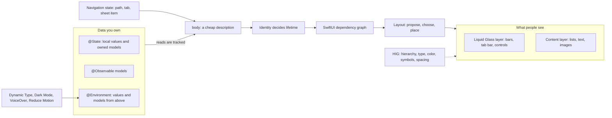
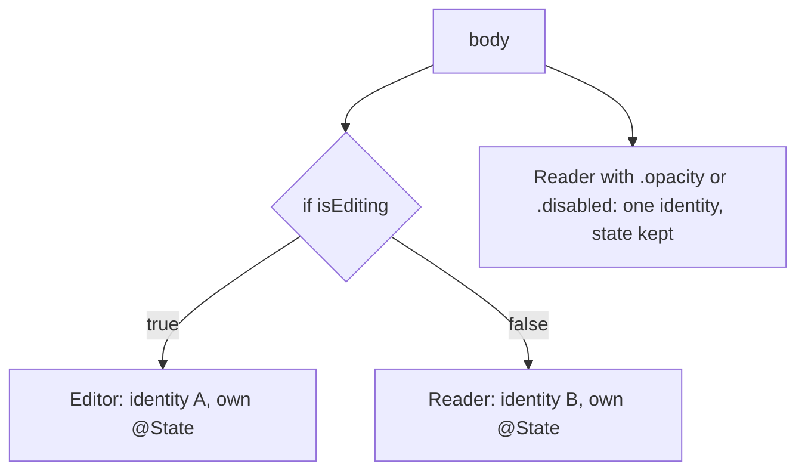
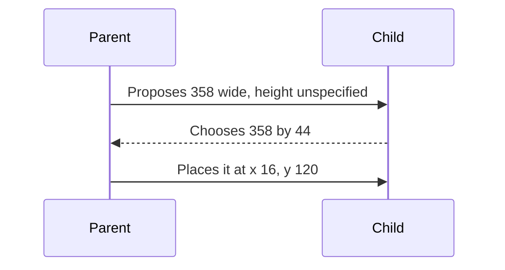
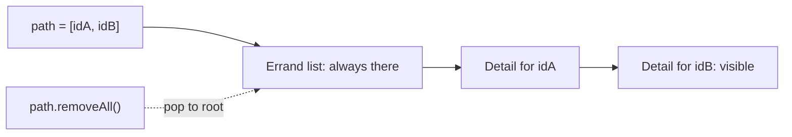
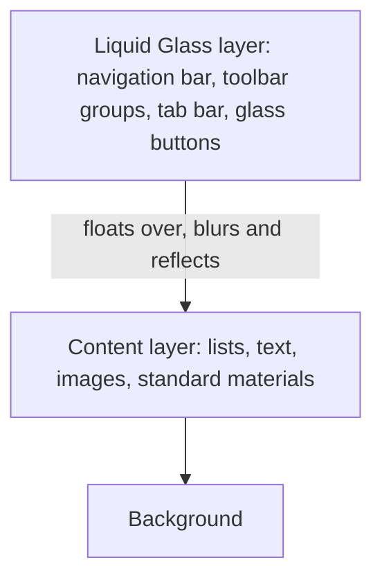

[← Learning hub](README.md)

# Day 2 · SwiftUI, Liquid Glass, and designing like Apple

> By tonight you'll know how SwiftUI decides what to redraw, where each piece of state should live, how layout and navigation really work, and what makes a screen look and behave like iOS 27 under Liquid Glass.  **Time:** ~6–8 hours.

## Today's map



## Mental models

### 1. A view is a cheap description; SwiftUI owns the real thing

**A SwiftUI `View` is a small value that describes the UI for the current data. SwiftUI keeps the real, long-lived UI and changes only what differs.**

In UIKit, a `UIView` is an object that sits on screen. You create it once and mutate it for years. In SwiftUI, a view is a struct, and `body` is a function from data to a description. SwiftUI calls `body` whenever an input it read might have changed, compares the new description with the old one, and applies the difference. Apple's performance guide puts it directly: SwiftUI "recreates views, and recalculates view bodies, frequently." Every body update must also finish before the next display frame, or the user sees a hitch.

Two rules follow. First, `init` and `body` must be cheap and free of side effects: no network calls, no sorting a big array, no creating models. Second, your struct is not where state lives. `@State` and its relatives are handles into storage that SwiftUI keeps outside your struct and ties to the view's identity (model 2).

Underneath, SwiftUI keeps a long-lived graph of inputs and the bodies that depend on them. The private framework that implements it is called AttributeGraph, and you'll see that name in crash logs. Your structs feed that graph. When one input changes, only the bodies downstream of it run again. The SwiftUI template in Instruments shows you a slice of this graph as a cause-and-effect view: which change made which body run.

**Senior tell:** they treat `body` as a hot, pure function. Read state, return views, nothing else. Anything slow moves into a model, an actor, or `.task`.

### 2. Identity is lifetime

**SwiftUI tracks every view by identity. While identity stays the same, state survives and changes can animate. When identity changes, the old view and its state are destroyed and a new one starts from scratch.**

There are two kinds of identity:

- **Structural identity** comes from a view's type and position in the tree. The two branches of an `if/else` are two different views, even when they show the same type.
- **Explicit identity** comes from IDs you give: the `id` of each element in a `ForEach`, or `.id(_:)`. Apple's docs for `id(_:)`: when the value changes, "the identity of the view — for example, its state — is reset."



Lifetime drives more than `@State`. A `.task` starts before the view appears, SwiftUI can cancel it when the view disappears, and `task(id:)` cancels and restarts it when the id changes. So "my request got cancelled" and "my text field cleared itself" are usually identity problems.

Use identity on purpose. Put `.id(errand.id)` on a detail view when you *want* its local state reset for a new errand. Avoid unstable IDs, like a `UUID()` made inside `body` or array indexes for data that reorders: rows lose state, animations jump, and lists redraw everything. Avoid `AnyView`, which hides the type information SwiftUI uses to compare trees.

**Senior tell:** when state "randomly resets," they look for an identity change before anything else.

### 3. State has one owner; everyone else borrows

**Every piece of mutable data has exactly one source of truth. A view either owns it, borrows write access with a binding, or reads it from the environment. Observation tracks what each `body` reads, not what it holds.**

| You need | Use | Who owns it |
|---|---|---|
| Local UI state: is a sheet open, draft text | `@State private var` | this view |
| Write access to a value someone else owns | `@Binding var` | an ancestor's `@State` |
| A shared model with logic | an `@Observable` class, created with `@State` in its owner | the owning view, often the `App` |
| That model, deep in the tree | `@Environment(Model.self)` | whoever called `.environment(model)` |
| A `Binding` to one property of an observable object | `@Bindable` (a property, or a local in `body`) | the object |
| A config value flowing down (flag, style) | an `@Entry` in `EnvironmentValues`, read with `@Environment(\.name)` | the ancestor that sets it |

With `@Observable`, SwiftUI records which properties each body reads while it runs. Apple's `State` docs spell out the effect: a subview updates when an observable property changes, "but only when the subview's `body` reads the property." So pass the object, let each view read what it needs, and a row that reads only `title` won't redraw when `notes` changes.

**Xcode 27 changes `@State`.** Building with Xcode 27, `@State` expands through the `State()` macro instead of the old property wrapper. When the value is a class, SwiftUI now initializes and stores it only once. Before, `@State private var model = Model()` ran `Model()` every time a parent rebuilt your view struct and threw the extra away, which is why older tutorials told you to create models lazily in `.task`. Now owning a model with `@State` is cheap and direct.

Views are main-actor code: the `View` protocol is declared `@MainActor`. So make UI models `@MainActor @Observable` classes, and keep slow or shared work in the actor you built on Day 1. The model awaits the actor and publishes results.

**Senior tell:** for any value on screen, they can point to the one line that owns it. Two views holding separate copies of the same truth is a bug that hasn't shown up yet.

### 4. Layout is a negotiation

**The parent proposes a size. The child chooses its own size. The parent places the child. That's the whole protocol.**



A proposal can be a concrete size or one of three special cases from `ProposedViewSize`: zero (the child answers with its minimum size), infinity (its maximum), or unspecified (its ideal size). Views differ in how they answer. `Text` wraps and then truncates. A non-resizable `Image` keeps its natural size. `Color` and `Spacer` take what they're offered. Stacks measure their children's flexibility and share out space; `layoutPriority(_:)` lets one child claim space first. Every modifier is itself a view in this chain, which is why `.padding().background(.blue)` and `.background(.blue).padding()` look different.

Tools, from everyday to rare:

- `HStack`, `VStack`, `ZStack`, and lazy versions inside scroll views.
- `Grid` for aligned rows and columns.
- `ViewThatFits`, which picks the first child that fits the proposal.
- `AnyLayout`, which switches between layouts, for example `HStackLayout` and `VStackLayout`, without changing the children's identity. Their state survives the switch.
- `containerRelativeFrame(_:alignment:)`, which sizes a view relative to its nearest container (the screen, a scroll view, a tab, a split-view column) minus safe-area insets.
- The `Layout` protocol: implement `sizeThatFits(proposal:subviews:cache:)` and `placeSubviews(in:proposal:subviews:cache:)` and you've written your own stack.

**Safe areas** are the parts of the screen no bar, sensor housing, or Dynamic Island covers. Content stays inside them by default; backgrounds extend under them. `ignoresSafeArea(_:edges:)` opts out, `safeAreaInset(edge:alignment:spacing:content:)` adds your own inset, and `safeAreaBar(edge:alignment:spacing:content:)` adds a custom bar that also extends scroll edge effects.

**Hardware can now reserve space in the middle of your view.** The September 2026 notes add APIs for iPhone Duo: `ReservedRegion` (kinds such as `.occlusion` for a camera and `.division` for the hinge), queried with `GeometryProxy.reservedRegions(kind:options:layoutDirectionBehavior:)`; `onHingeChange(isEnabled:_:)` with `DeviceHinge` status such as `.closed`, `.partiallyOpen`, `.fullyOpen`; and `ArrangementView`, which lays out primary and secondary content with `.split` or `.overlay` styles that adapt to size, size class, and hardware. Toolbars can also move to the vertical axis there (`toolbarVerticalEdge`). All of these are marked **iOS 27.1 beta** in the docs today, so treat them as the direction of travel, not something a 27.0 build can call.

**Senior tell:** when layout misbehaves, they ask "what did the parent propose, and what did the child choose?" and put `.border(.red)` on views to see the real frames.

### 5. Navigation is state

**Where the user is in your app is data: an array for a stack, a selection for tabs, an optional for a sheet. Change the data and the screen follows.**



- **`NavigationStack(path:root:)`** binds the stack to a collection of `Hashable` values. `NavigationLink(value:label:)` pushes a value. `navigationDestination(for:destination:)` maps a *type* of value to a screen. A deep link is `path = [id]`. Pop to root is `path.removeAll()`. For mixed types use `NavigationPath`; its `codable` property lets you save and restore the stack.
- **`NavigationSplitView`** gives sidebar, optional content, and detail columns on iPad and Mac, and collapses to a stack on iPhone.
- **`TabView` with `Tab`** holds top-level sections. `Tab(_:systemImage:value:role:content:)` takes a role: `.search` makes a search tab, and iOS 27's `.prominent` puts one tab in a separate trailing position. `.sidebarAdaptable` lets iPad turn the tab bar into a sidebar.
- **Modals are optional state too.** `sheet(item:)` shows a sheet while the item is non-nil and hands it to your content. `inspector(isPresented:content:)` shows a trailing column in a regular-width layout and adapts to a sheet in a compact one.
- **Transitions:** `navigationTransition(.zoom(sourceID:in:))` with `matchedTransitionSource(id:in:)` zooms a detail out of the tapped row. iOS 27 adds `.crossFade`, which fades a sheet in over content.

In Xcode 27, the closures these APIs take are marked `@ContentBuilder`, a type alias for `ViewBuilder` that replaces the separate builders for toolbars and commands. One builder now builds views, toolbar items, and commands.

**Senior tell:** they never navigate by flipping one Boolean per screen. Each stack has one path they can print, save, and set from a notification or an App Intent (Day 4).

### 6. Content below, Liquid Glass above

**Liquid Glass is the material of the functional layer (bars, tab bars, sidebars, controls) that floats above your content. Standard components get it for free. Custom glass is for a few important controls and never for content.**



Apple describes Liquid Glass as a material that "blurs content behind it, reflects color and light of surrounding content, and reacts to touch and pointer interactions in real time." Build with the iOS 27 SDK and bars, sheets, popovers, menus, and controls adopt it automatically. The system also adapts them to overlap, focus, and the person's settings. Most of the work is taking things out:

- **Remove custom backgrounds** from navigation bars, toolbars, tab bars, and sheets. They fight the material and the scroll edge effect. If content under a bar hurts legibility, use `scrollEdgeEffectStyle(_:for:)` instead of painting a background.
- **Don't put glass in the content layer.** The HIG says so directly. For structure inside content, use the standard materials (`.ultraThin`, `.thin`, `.regular`, `.thick`).
- **Use custom glass sparingly.** When you do, use `glassEffect(_:in:)`, which defaults to the `regular` variant in a capsule. Use `clear` only over rich media such as photos and video, and add a dimming layer if the media is bright. Use `.tint(_:)` to suggest prominence and `.interactive()` so a custom control responds to touch.
- **Group custom glass** in a `GlassEffectContainer`. It renders faster, lets nearby shapes blend, and lets shapes morph when you give them `glassEffectID(_:in:)` values from a `@Namespace` and animate a change.
- **For buttons, use the styles**, `.glass` and `.glassProminent`, instead of building glass by hand. Give color to the one primary action, on its background, not to every control.
- **Toolbars group their items automatically.** `ToolbarSpacer(.fixed)` splits groups. iOS 27 adds `visibilityPriority(_:)` to choose what stays visible as space shrinks, `ToolbarOverflowMenu` for secondary actions, the `topBarPinnedTrailing` placement, and `toolbarMinimizationBehavior(_:for:)` to shrink the navigation bar on scroll. Tab bars minimize with `tabBarMinimizeBehavior(_:)` (iPhone only).

There is no opting out anymore. The `UIDesignRequiresCompatibility` Info.plist key, which kept the old look during iOS 26, is ignored when you build for iOS 27 or later.

**Senior tell:** their first Liquid Glass commit deletes code: custom bar backgrounds, blur views, hard-coded tints.

### 7. Design with the system's meanings, not pixels

**Ask for meaning (a text style, a semantic color, a symbol, a standard control) and the system handles sizes, Dark Mode, contrast, Dynamic Type, languages, and accessibility for you. Hard-code pixels and you own all of that yourself.**

- **Typography.** Use text styles like `.body`, `.headline`, `.caption`. On iOS the default body size is 17 pt and the HIG minimum is 11 pt. Text styles scale with Dynamic Type, including the larger accessibility sizes; the HIG suggests letting people enlarge text by at least 200 percent. Prefer Regular, Medium, Semibold, or Bold over the thin weights. When text gets huge, change the layout (stack instead of row) rather than truncate. Scale your own spacing with `@ScaledMetric`.
- **Color.** Use semantic colors (primary and secondary label colors, system and grouped backgrounds) and your accent color. For custom colors, add light, dark, and increased-contrast variants in the asset catalog. Never carry meaning with color alone. The HIG's contrast floor is 4.5:1 for text up to 17 pt and 3:1 for 18 pt or bold text.
- **SF Symbols.** Thousands of icons that match San Francisco's weights and scale with text. Four rendering modes: monochrome, hierarchical, palette, multicolor. Variants like `.fill`, `.slash`, `.circle`; often the container picks for you (tab bars prefer fill, toolbars outline). Symbol effects such as bounce, pulse, wiggle, breathe, and replace give feedback without custom animation code.
- **Spacing and targets.** The default hit target on iOS is 44×44 pt, with 28×28 pt as the minimum. The HIG suggests about 12 pt of padding around bezeled controls and about 24 pt around borderless ones. Prefer the system's standard spacing to your own numbers.
- **Hierarchy.** Put the most important things at the top and leading edge. Group related items. Hide detail behind disclosure. Keep titles short (the HIG suggests under 15 characters) and toolbars to about three groups.
- **Motion.** Brief, purposeful, cancellable, and optional. Honor Reduce Motion.
- **Accessibility.** VoiceOver reads an accessibility tree built from your views. Each element has a *label* (what it is), a *value* (its state), *traits* (button, header, toggle), an optional *hint*, and *actions*. Standard controls fill these in. Icon-only buttons and custom rows need your help.
- **App icons.** Icons are now layered. You draw a background and foreground layers, compose them in Icon Composer, and the system adds highlights, refraction, and shadows. People can choose default, dark, clear, or tinted appearances. Don't bake effects or masks into your artwork.

**Senior tell:** before a screen is "done," they run it at the largest accessibility text size, in Dark Mode with Increase Contrast, and with VoiceOver on.

## The APIs that matter

| API | What it's for | Since | Link |
|---|---|---|---|
| **Everyday** | | | |
| `View` / `body` | Describe UI as a function of state | iOS 13.0 | [View](https://developer.apple.com/documentation/swiftui/view) |
| `@State` (`State()` macro in Xcode 27) | Own a local value or a model | iOS 13.0 | [State()](https://developer.apple.com/documentation/swiftui/state()) |
| `@Binding` | Borrow write access to someone else's value | iOS 13.0 | [Binding](https://developer.apple.com/documentation/swiftui/binding) |
| `@Observable` | Make a class's properties trackable by the views that read them | iOS 17.0 | [Observable()](https://developer.apple.com/documentation/observation/observable()) |
| `@Environment` | Read values or observable models from ancestors | iOS 13.0 | [Environment](https://developer.apple.com/documentation/swiftui/environment) |
| `@Bindable` | Make bindings to an observable object's properties | iOS 17.0 | [Bindable](https://developer.apple.com/documentation/swiftui/bindable) |
| `NavigationStack` | Push and pop screens driven by a path | iOS 16.0 | [NavigationStack](https://developer.apple.com/documentation/swiftui/navigationstack) |
| `navigationDestination(for:destination:)` | Map a value type to a destination screen | iOS 16.0 | [Docs](https://developer.apple.com/documentation/swiftui/view/navigationdestination(for:destination:)) |
| `List`, `ForEach`, `Section` | Scrolling rows with sections, swipe and delete | iOS 13.0 | [List](https://developer.apple.com/documentation/swiftui/list) |
| `Form`, `Toggle`, `TextField`, `Picker` | Settings-style input | iOS 13.0 | [Form](https://developer.apple.com/documentation/swiftui/form) |
| `toolbar(content:)`, `ToolbarItem` | Bar buttons that adopt Liquid Glass | iOS 14.0 | [ToolbarItem](https://developer.apple.com/documentation/swiftui/toolbaritem) |
| `sheet(item:onDismiss:content:)` | Present a modal driven by an optional item | iOS 13.0 | [Docs](https://developer.apple.com/documentation/swiftui/view/sheet(item:ondismiss:content:)) |
| `task(id:name:priority:file:line:_:)` | Async work tied to a view's lifetime | iOS 15.0 | [Docs](https://developer.apple.com/documentation/swiftui/view/task(id:name:priority:file:line:_:)) |
| `Image(systemName:)` | SF Symbols | iOS 13.0 | [Docs](https://developer.apple.com/documentation/swiftui/image/init(systemname:)) |
| `accessibilityLabel(_:)` | Name an element for VoiceOver and Voice Control | iOS 16.0 | [Docs](https://developer.apple.com/documentation/swiftui/view/accessibilitylabel(_:)) |
| `#Preview` | Live previews in Xcode's canvas | iOS 13.0 | [Preview(_:body:)](https://developer.apple.com/documentation/swiftui/preview(_:body:)) |
| **Intermediate** | | | |
| `@Entry` | Declare custom environment values in one line | iOS 13.0 | [Entry()](https://developer.apple.com/documentation/swiftui/entry()) |
| `TabView` + `Tab` | Top-level sections; `.prominent` role is iOS 27.0 | iOS 18.0 | [Tab](https://developer.apple.com/documentation/swiftui/tab) |
| `NavigationSplitView` | Sidebar and detail columns | iOS 16.0 | [NavigationSplitView](https://developer.apple.com/documentation/swiftui/navigationsplitview) |
| `Grid`, `ViewThatFits`, `AnyLayout` | Aligned grids, pick-what-fits, switch layouts and keep identity | iOS 16.0 | [ViewThatFits](https://developer.apple.com/documentation/swiftui/viewthatfits) |
| `containerRelativeFrame(_:alignment:)` | Size relative to the nearest container | iOS 17.0 | [Docs](https://developer.apple.com/documentation/swiftui/view/containerrelativeframe(_:alignment:)) |
| `safeAreaBar(edge:alignment:spacing:content:)` | Custom bar that extends scroll edge effects | iOS 26.0 | [Docs](https://developer.apple.com/documentation/swiftui/view/safeareabar(edge:alignment:spacing:content:)) |
| `ScrollPosition`, `scrollPosition(_:anchor:)` | Read and set scroll position | iOS 18.0 | [ScrollPosition](https://developer.apple.com/documentation/swiftui/scrollposition) |
| `withAnimation`, `animation(_:value:)` | Animate a state change | iOS 13.0 | [withAnimation](https://developer.apple.com/documentation/swiftui/withanimation(_:_:)) |
| `glassEffect(_:in:)` | Liquid Glass on a custom view | iOS 26.0 | [Docs](https://developer.apple.com/documentation/swiftui/view/glasseffect(_:in:)) |
| `GlassEffectContainer` | Group, blend, and morph custom glass | iOS 26.0 | [Docs](https://developer.apple.com/documentation/swiftui/glasseffectcontainer) |
| `.glass`, `.glassProminent` button styles | Glass buttons without custom code | iOS 26.0 | [glassProminent](https://developer.apple.com/documentation/swiftui/primitivebuttonstyle/glassprominent) |
| `ToolbarSpacer` | Split toolbar items into groups | iOS 26.0 | [ToolbarSpacer](https://developer.apple.com/documentation/swiftui/toolbarspacer) |
| `visibilityPriority(_:)` | Keep key toolbar items visible as space shrinks | iOS 27.0 | [Docs](https://developer.apple.com/documentation/swiftui/toolbarcontent/visibilitypriority(_:)) |
| `ToolbarOverflowMenu` | Send secondary actions straight to overflow | iOS 27.0 | [Docs](https://developer.apple.com/documentation/swiftui/toolbaroverflowmenu) |
| `toolbarMinimizationBehavior(_:for:)` | Shrink bars on scroll | iOS 27.0 | [Docs](https://developer.apple.com/documentation/swiftui/view/toolbarminimizationbehavior(_:for:)) |
| `symbolEffect(_:options:value:)` | Animated SF Symbols | iOS 17.0 | [Docs](https://developer.apple.com/documentation/swiftui/view/symboleffect(_:options:value:)) |
| `matchedTransitionSource(id:in:)` + `.zoom` | Zoom a pushed screen out of its source | iOS 18.0 | [Docs](https://developer.apple.com/documentation/swiftui/navigationtransition/zoom(sourceid:in:)) |
| **Advanced** | | | |
| `Layout` protocol | Write your own container | iOS 16.0 | [Layout](https://developer.apple.com/documentation/swiftui/layout) |
| `phaseAnimator`, `keyframeAnimator` | Multi-step and timeline animations | iOS 17.0 | [PhaseAnimator](https://developer.apple.com/documentation/swiftui/phaseanimator) |
| `matchedGeometryEffect(id:in:properties:anchor:isSource:)` | Move one element between two layouts | iOS 14.0 | [Docs](https://developer.apple.com/documentation/swiftui/view/matchedgeometryeffect(id:in:properties:anchor:issource:)) |
| `glassEffectID(_:in:)` | Morph glass shapes during transitions | iOS 26.0 | [Docs](https://developer.apple.com/documentation/swiftui/view/glasseffectid(_:in:)) |
| `colorEffect`, `layerEffect`, `distortionEffect` | Metal shaders on SwiftUI views | iOS 17.0 | [Shader](https://developer.apple.com/documentation/swiftui/shader) |
| `UIViewRepresentable`, `UIHostingController` | Mix UIKit and SwiftUI both ways | iOS 13.0 | [UIViewRepresentable](https://developer.apple.com/documentation/swiftui/uiviewrepresentable) |
| `reorderContainer(for:isEnabled:move:)` | Drag to reorder in any container | iOS 27.0 | [Docs](https://developer.apple.com/documentation/swiftui/view/reordercontainer(for:isenabled:move:)) |
| `performAccessibilityAudit(for:_:)` | Automated accessibility checks in UI tests | iOS 17.0 | [Docs](https://developer.apple.com/documentation/xcuiautomation/xcuiapplication/performaccessibilityaudit(for:_:)) |
| `XCUIVoiceOverService` | Drive VoiceOver from UI tests | iOS 27.0 | [Docs](https://developer.apple.com/documentation/xcuiautomation/xcuivoiceoverservice) |
| `ArrangementView` | Adaptive primary/secondary layout for new hardware | iOS 27.1 beta | [Docs](https://developer.apple.com/documentation/swiftui/arrangementview) |

## Core patterns in code

These patterns build the Errand screens you'll assemble in today's capstone. `Errand`, `Step`, `Status`, and the `ErrandStore` actor come from Day 1. Day 1's project sets Default Actor Isolation to `MainActor`, so the explicit `@MainActor` below is a reminder, not a requirement.

**1. One owner, many borrowers.** The app owns one UI model, puts it in the environment, and views borrow it.

```swift
import SwiftUI

@MainActor @Observable
final class ErrandBoard {
    var errands: [Errand] = []
    var filter = ""
    var lastError: (any Error)?
    private let store: ErrandStore              // the Day 1 actor

    init(store: ErrandStore) { self.store = store }
    var visible: [Errand] {
        filter.isEmpty ? errands
            : errands.filter { $0.title.localizedStandardContains(filter) }
    }

    func load() async {
        errands = await store.all               // hop to the actor, publish on main
    }
}

@main
struct ErrandApp: App {
    @State private var board = ErrandBoard(store: ErrandStore())

    var body: some Scene {
        WindowGroup {
            ErrandListView()
                .environment(board)
        }
    }
}

struct ErrandFilterField: View {
    @Environment(ErrandBoard.self) private var board

    var body: some View {
        @Bindable var board = board
        TextField("Filter errands", text: $board.filter)
    }
}
```

- With Xcode 27's `State()` macro, `ErrandBoard(...)` runs once, not on every rebuild of the `App` struct.
- `@Environment(ErrandBoard.self)` reads by type. If no ancestor called `.environment(board)`, SwiftUI stops with an error, so previews must inject one too.
- `@Bindable var board = board` inside `body` is the pattern Apple uses in its iOS 27 Wishlist sample to get `$board.filter`.

**2. Navigation as data.** The path is an array of IDs, destinations are registered by type, and the detail zooms out of its row.

```swift
struct ErrandListView: View {
    @Environment(ErrandBoard.self) private var board
    @State private var path: [Errand.ID] = []
    @State private var isAdding = false
    @Namespace private var zoom

    var body: some View {
        NavigationStack(path: $path) {
            List {
                ForEach(board.visible) { errand in
                    NavigationLink(value: errand.id) {
                        ErrandRow(errand: errand)
                    }
                    .matchedTransitionSource(id: errand.id, in: zoom)
                }
            }
            .navigationTitle("Errands")
            .navigationDestination(for: Errand.ID.self) { id in
                ErrandDetailView(errandID: id)
                    .navigationTransition(.zoom(sourceID: id, in: zoom))
            }
            .sheet(isPresented: $isAdding) {
                NewErrandSheet()
                    .presentationDetents([.medium, .large])
            }
            .task { await board.load() }
        }
    }
}
```

- `Errand.ID` is a `UUID` (Day 1), which is `Hashable` and `Codable`, so it works with `NavigationLink(value:label:)` and the path can be saved for state restoration.
- Opening an errand from a notification or an App Intent is `path = [id]`. No view needs to be "active."
- `.task` is tied to the list's lifetime: it starts before the list appears, and SwiftUI can cancel it when the list goes away. Cancellation is cooperative (Day 1), so long loops should check for it.

**3. A toolbar that adopts Liquid Glass.** Standard items become glass automatically; you decide grouping and priority.

```swift
// Attach to the List inside ErrandListView.
.toolbar {
    ToolbarItem(placement: .topBarPinnedTrailing) {
        Button("New Errand", systemImage: "plus") { isAdding = true }
            .buttonStyle(.glassProminent)
    }
    ToolbarItem(placement: .topBarTrailing) {
        EditButton()
    }
    .visibilityPriority(.high)
    ToolbarSpacer(.fixed, placement: .topBarTrailing)
    ToolbarItem(placement: .topBarTrailing) {
        Button("Filter", systemImage: "line.3.horizontal.decrease") { showsFilter.toggle() }
    }
    ToolbarOverflowMenu {
        Button("Clear Completed", systemImage: "checkmark.circle") { board.clearCompleted() }
        Button("Archive All", systemImage: "archivebox") { board.archiveAll() }
    }
}
.toolbarMinimizationBehavior(.onScrollDown, for: .navigationBar)
```

- One tinted primary action, pinned trailing; everything else stays monochrome, as the HIG asks. (`showsFilter`, `clearCompleted()`, and `archiveAll()` are your own state and model methods.)
- `Button(_:systemImage:action:)` shows only the icon in a toolbar but keeps the title as its accessibility label. VoiceOver says "New Errand, button" for free.
- `visibilityPriority(.high)` keeps Edit visible when space runs out; overflow items never compete for space.

**4. Custom glass, used sparingly.** A floating bar at the bottom of the detail screen shows progress and, when a step needs approval, morphs out an Approve button.

```swift
struct ApprovalBar: View {
    let done: Int
    let total: Int
    let pending: Step?
    let approve: (Step) -> Void
    @Namespace private var glass

    var body: some View {
        GlassEffectContainer(spacing: 20) {
            HStack(spacing: 12) {
                Label("\(done) of \(total) done", systemImage: "checklist")
                    .font(.headline)
                    .padding(.horizontal, 16)
                    .padding(.vertical, 12)
                    .glassEffect()
                    .glassEffectID("progress", in: glass)

                if let step = pending {
                    Button("Approve", systemImage: "checkmark") { approve(step) }
                        .buttonStyle(.glassProminent)
                        .glassEffectID("approve", in: glass)
                }
            }
        }
        .animation(.smooth, value: pending?.id)
    }
}
```

- This is functional-layer UI: status plus the next action. The list of steps underneath stays plain content.
- Both shapes live in one `GlassEffectContainer` with IDs from one `@Namespace`, so the button grows out of the pill instead of popping in. This follows Apple's Landmarks badge sample.
- Attach it with `.safeAreaBar(edge: .bottom) { ApprovalBar(...) }` so list content scrolls under it with a proper scroll edge effect.

**5. A row that survives Dynamic Type.** Switch from a row to a stack at accessibility sizes without losing identity.

```swift
extension Errand {
    var doneCount: Int { steps.count(where: { $0.status == .done }) }
}

extension EnvironmentValues {
    @Entry var showsStepCounts: Bool = true
}

struct ErrandRow: View {
    let errand: Errand
    @Environment(\.dynamicTypeSize) private var typeSize
    @Environment(\.showsStepCounts) private var showsStepCounts

    var body: some View {
        let stacked = typeSize.isAccessibilitySize
        let layout = stacked
            ? AnyLayout(VStackLayout(alignment: .leading, spacing: 6))
            : AnyLayout(HStackLayout(spacing: 12))

        layout {
            Label(errand.title, systemImage: "figure.walk")
                .font(.headline)
            if !stacked { Spacer(minLength: 0) }
            if showsStepCounts {
                Text("\(errand.doneCount) of \(errand.steps.count)")
                    .font(.subheadline.monospacedDigit())
                    .foregroundStyle(.secondary)
            }
        }
        .accessibilityElement(children: .combine)
    }
}
```

- `AnyLayout` changes the arrangement while the children keep their identity, so nothing resets and the change can animate.
- Text styles (`.headline`, `.subheadline`) scale with Dynamic Type. No fixed frames means no clipping at large sizes.
- `.accessibilityElement(children: .combine)` makes the row one VoiceOver stop that reads the title and the count together.
- `@Entry` declares a custom environment value in one line. A parent turns counts off with `.environment(\.showsStepCounts, false)`.

**6. An accessible step row.** Symbol, spoken state, feedback, and respect for Reduce Motion, driven by Day 1's `Status`.

```swift
extension Status {
    var display: (symbol: String, spoken: LocalizedStringResource) {
        switch self {
        case .pending: ("circle", "Not started")
        case .running: ("circle.dotted", "In progress")
        case .waitingForApproval: ("hand.raised.circle", "Waiting for approval")
        case .done: ("checkmark.circle.fill", "Done")
        case .failed: ("exclamationmark.circle", "Failed")
        }
    }
}

struct StepRow: View {
    let step: Step
    let advance: () -> Void
    @Environment(\.accessibilityReduceMotion) private var reduceMotion

    var body: some View {
        Button {
            withAnimation(reduceMotion ? nil : .snappy) { advance() }
        } label: {
            HStack(spacing: 12) {
                Image(systemName: step.status.display.symbol)
                    .foregroundStyle(step.status == .done ? Color.accentColor : Color.secondary)
                    .contentTransition(.symbolEffect(.replace))
                    .accessibilityHidden(true)
                Text(step.title)
                    .strikethrough(step.status == .done)
                    .frame(maxWidth: .infinity, alignment: .leading)
            }
            .contentShape(.rect)
        }
        .buttonStyle(.plain)
        .disabled(step.status == .done || step.status == .waitingForApproval)
        .accessibilityValue(step.status.display.spoken)
        .sensoryFeedback(.success, trigger: step.status == .done)
    }
}
```

- The symbol is hidden from VoiceOver because the value already speaks the state ("Waiting for approval"). Meaning never rides on the icon or color alone.
- `.contentTransition(.symbolEffect(.replace))` animates the symbol swap; `withAnimation(nil)` turns motion off when Reduce Motion is on.
- `.contentShape(.rect)` makes the whole row tappable. The row is disabled when tapping can't move the step: nothing leaves `.done` in Day 1's state machine, and a waiting step moves only through the Approve button.

**7. When you still need UIKit.** Wrap a UIKit view with `UIViewRepresentable`; use a coordinator for delegate callbacks.

```swift
import PencilKit
import SwiftUI

struct SketchPad: UIViewRepresentable {
    @Binding var drawing: PKDrawing

    func makeUIView(context: Context) -> PKCanvasView {
        let canvas = PKCanvasView()
        canvas.drawingPolicy = .anyInput
        canvas.delegate = context.coordinator
        return canvas
    }

    func updateUIView(_ canvas: PKCanvasView, context: Context) {
        if canvas.drawing != drawing { canvas.drawing = drawing }
    }

    func makeCoordinator() -> Coordinator { Coordinator(drawing: $drawing) }

    @MainActor final class Coordinator: NSObject, PKCanvasViewDelegate {
        let drawing: Binding<PKDrawing>
        init(drawing: Binding<PKDrawing>) { self.drawing = drawing }

        func canvasViewDrawingDidChange(_ canvasView: PKCanvasView) {
            drawing.wrappedValue = canvasView.drawing
        }
    }
}
```

- `makeUIView` runs once per identity; `updateUIView` runs whenever SwiftUI inputs change. Compare before assigning, or you'll loop.
- The other direction is `UIHostingController(rootView:)`, which puts a SwiftUI view inside a UIKit screen.
- You still reach for UIKit for views SwiftUI doesn't wrap (PencilKit canvases, camera previews), fine-grained text editing, or large existing UIKit code. iOS 27 apps built with the latest SDK must use the UIKit scene-based life cycle, or they fail to launch.

## What's new in iOS 27 (and what old tutorials get wrong)

- **`@State` is a macro when you build with Xcode 27.** A class stored in `@State` is created and stored once. Advice to defer model creation into `.task` to avoid repeated allocation is out of date.
- **One builder for everything.** `@ContentBuilder` (a type alias for `ViewBuilder`) replaces type-specific builders like `ToolbarContentBuilder` and `CommandsBuilder`. You'll see it throughout the SwiftUI signatures in the docs.
- **Toolbars got smarter about space.** `visibilityPriority(_:)`, `ToolbarOverflowMenu`, the `topBarPinnedTrailing` placement, and `toolbarMinimizationBehavior(_:for:)`. Stop hand-building "More" menus to decide what overflows.
- **Tabs:** the `.prominent` role places one tab in a separate trailing spot. If no tab is prominent, a `.search` tab may get that treatment.
- **Reordering and swipe actions leave `List`.** `reorderable()` with `reorderContainer(for:isEnabled:move:)`, and `swipeActions(edge:allowsFullSwipe:content:onPresentationChanged:)` with `swipeActionsContainer()`, work in stacks, grids, scroll views, and custom layouts.
- **Sheets can cross-fade.** `.navigationTransition(.crossFade)` on sheet content fades it in instead of sliding it up.
- **`AsyncImage` can cache.** Give it a configured session with `asyncImageURLSession(_:)` or pass a `URLRequest` with the new `init(request:scale:)` family.
- **Alerts from data.** `alert(error:actions:)` and `alert(_:item:actions:)` present from an optional error or item, like `sheet(item:)` does.
- **Gestures can filter input.** Gestures such as `DragGesture` take `GestureInputKinds` (direct touch, indirect touch, pencil, pointer).
- **No Liquid Glass opt-out.** `UIDesignRequiresCompatibility` is ignored when you build for iOS 27 or later.
- **Previews:** `PreviewProvider` is deprecated in iOS 27; use `#Preview`. Xcode 27 can show a grid of previews for `#Preview(_:traits:arguments:body:)`, preview another localization, and override Color Scheme Contrast. Code inside `#Preview` now runs on the main actor.
- **VoiceOver in UI tests.** Xcode 27 adds `XCUIVoiceOverService` to drive VoiceOver and read what it speaks.
- **Icon Composer 2.0** ships with Xcode 27 and adds a sharper rendering mode for what Apple calls the "upcoming 2027 operating systems."
- **September 2026, iOS 27.1 beta:** `ArrangementView`, reserved regions, hinge state, vertical toolbars, and `CameraCaptureAccessory` for iPhone Duo. Beta only today.
- **Deprecation markers in the current docs (27.2 beta SDK):** `NavigationView`, `tabItem(_:)`, `foregroundColor(_:)`, `cornerRadius(_:antialiased:)`, `edgesIgnoringSafeArea(_:)`, and `MagnificationGesture`.

## Pitfalls you only learn by shipping

- **A text field clears itself, or a row loses its state** → the view changed identity: an `if/else` swapped branches, or IDs were generated in `body` → give data stable IDs, and prefer modifiers like `.opacity` or `.disabled` over branches when state must survive.
- **Typing one character redraws the whole list** → many views read one broad property, or `body` does expensive filtering → split views so each reads only what it shows, cache derived data in the model, and use the Instruments SwiftUI template's cause-and-effect view to find who triggered what.
- **Your load runs twice, or gets cancelled halfway** → work lives in `.task` on a view whose identity or visibility changes → use `task(id:)` keyed on what the work depends on, and keep long work in the model or actor.
- **A preview or screen crashes as soon as it reads the model** → `@Environment(Model.self)` with no ancestor calling `.environment(model)` → inject a sample model in every `#Preview` and at every root that shows the view.
- **An empty glass capsule sits in the toolbar** → you hid the view *inside* a `ToolbarItem`, not the item → hide the whole item with `hidden(_:)` on toolbar content (iOS 26.4 and later) or leave it out of the builder.
- **Bars look muddy or text over content is hard to read** → leftover custom bar backgrounds, glass stacked on glass, or glass in the content layer → delete custom backgrounds, group custom glass in one container, use `scrollEdgeEffectStyle(_:for:)`.
- **Text truncates at large sizes** → fixed frames and rigid `HStack`s → no fixed heights, switch layouts with `AnyLayout` or `ViewThatFits` when `isAccessibilitySize` is true, and scale custom dimensions with `@ScaledMetric`.
- **VoiceOver says "button, button, button"** → icon-only buttons with no label → use `Button(_:systemImage:action:)` or add `accessibilityLabel(_:)`.
- **Custom colors vanish in Dark Mode or with Increase Contrast** → hard-coded RGB values → asset catalog colors with dark and high-contrast variants, or semantic colors.
- **A representable UIKit view flickers or loops** → `updateUIView` writes state that triggers another update → compare before assigning, and send UIKit events back through the coordinator.

## Legacy you'll still meet

| Old | New |
|---|---|
| `ObservableObject`, `@Published`, `@StateObject`, `@ObservedObject`, `@EnvironmentObject` | `@Observable` class, `@State` to own, plain property to pass, `@Environment(Type.self)` to read |
| `NavigationView`, `NavigationLink(destination:isActive:label:)` | `NavigationStack(path:)`, `NavigationLink(value:label:)`, `navigationDestination(for:destination:)` |
| `.tabItem { }` | `Tab(_:systemImage:value:role:content:)` |
| `PreviewProvider` | `#Preview` |
| `EnvironmentKey` struct plus a computed property | `@Entry` |
| `onChange(of:perform:)` | `onChange(of:initial:_:)` |
| `.foregroundColor(_:)`, `.cornerRadius(_:)`, `.edgesIgnoringSafeArea(_:)` | `.foregroundStyle(_:)`, `.clipShape(.rect(cornerRadius:))`, `.ignoresSafeArea(_:edges:)` |
| `MagnificationGesture` | `MagnifyGesture` |
| `ToolbarContentBuilder`, `CommandsBuilder` | `@ContentBuilder` |
| Custom blur views and tinted bar backgrounds | System Liquid Glass bars plus `scrollEdgeEffectStyle(_:for:)` |

## Practice

**1. Identity lab (30 min).** Build a view with a `Toggle("Details", isOn:)` and, below it, `if showDetails { CounterView() } else { CounterView() }` where `CounterView` has its own `@State var count`. Tap the counter a few times, then flip the toggle. Then replace the `if/else` with one `CounterView()` that uses `.opacity(showDetails ? 1 : 0.4)`. Finally add `.id(showDetails)`.
*Done when:* you can predict, before tapping, whether the count survives in all three versions, and explain why in one sentence each.

**2. Layout stress test (30 min).** Put `ErrandRow` (pattern 5) in a `#Preview` three times, with `.dynamicTypeSize(.xxxLarge)`, `.dynamicTypeSize(.accessibility3)`, and in Dark Mode with `.preferredColorScheme(.dark)`. Add `.border(.red)` to each child to see its frame.
*Done when:* nothing truncates or overlaps at `.accessibility3`, the row switches to a stack, and you can say which view chose its own width and which took what it was offered.

**3. Shader warm-up (20 min).** Day 6 goes deep on the GPU; today, one stitchable function. Add `Stripes.metal` to the app target:

```metal
#include <metal_stdlib>
using namespace metal;

[[ stitchable ]] half4 stripes(float2 position, half4 color, float width) {
    bool dark = fmod(position.x + position.y, width * 2.0) < width;
    return dark ? half4(color.rgb * 0.7h, color.a) : color;
}
```

Then apply it to a failed step's background: `RoundedRectangle(cornerRadius: 12).fill(.orange).colorEffect(ShaderLibrary.stripes(.float(8)))`.
*Done when:* the stripes render in the preview, and you can say what `colorEffect`, `layerEffect`, and `distortionEffect` each let a shader read and return.

**4. Glass audit (20 min).** Turn on Reduce Transparency, then Increase Contrast, then Reduce Motion (Settings > Accessibility), and look at your toolbar and `ApprovalBar`.
*Done when:* every control is still legible and findable in each setting, and there's no custom background left on any system bar.

**5. Capstone, Day 2: the Errand screens (about 1.5 h).**

Build the list and detail screens on top of Day 1's model and store:

- `ErrandApp` (replace the one Xcode's template made on Day 1) owns one `ErrandBoard` with `@State` and injects it (pattern 1). Seed the store with two sample errands on first launch so there's something to see; SwiftData replaces this on Day 3.
- `ErrandListView`: `NavigationStack(path:)`, rows from pattern 5, zoom transition, an empty state (`ContentUnavailableView`), and the toolbar from pattern 3. For delete, add a `remove(_:)` method to the Day 1 store and call it from `.onDelete` on the `ForEach`.
- `ErrandDetailView`: the steps as `StepRow`s (pattern 6) and the `ApprovalBar` (pattern 4) in a `safeAreaBar`.
- Add three methods to `ErrandBoard`, in the same file so they can reach the private `store`. The actor stays the source of truth: each method moves the step through Day 1's state machine, then reloads. A step with `needsApproval` stops at `.waitingForApproval` until the person taps Approve. That's Errand's rule, "ask before any side effect," showing up in the UI for the first time.

```swift
extension ErrandBoard {
    func errand(_ id: Errand.ID) -> Errand? { errands.first { $0.id == id } }

    func advance(_ step: Step, in errand: Errand) {
        Task {
            do {
                if step.status == .pending {
                    try await store.move(step: step.id, in: errand.id, to: .running)
                }
                let next: Status = step.needsApproval ? .waitingForApproval : .done
                try await store.move(step: step.id, in: errand.id, to: next)
            } catch { lastError = error }
            await load()
        }
    }

    func approve(_ step: Step, in errand: Errand) {
        Task {
            do {
                try await store.move(step: step.id, in: errand.id, to: .running)
                try await store.move(step: step.id, in: errand.id, to: .done)
            } catch { lastError = error }
            await load()
        }
    }
}

extension Errand {
    var nextApproval: Step? { steps.first { $0.status == .waitingForApproval } }
}
```

The detail screen puts the pieces together:

```swift
struct ErrandDetailView: View {
    let errandID: Errand.ID
    @Environment(ErrandBoard.self) private var board

    var body: some View {
        if let errand = board.errand(errandID) {
            List {
                Section("Steps") {
                    ForEach(errand.steps) { step in
                        StepRow(step: step) { board.advance(step, in: errand) }
                    }
                }
            }
            .navigationTitle(errand.title)
            .toolbarTitleDisplayMode(.inline)
            .safeAreaBar(edge: .bottom) {
                ApprovalBar(done: errand.doneCount, total: errand.steps.count,
                            pending: errand.nextApproval) { board.approve($0, in: errand) }
                    .padding(.bottom, 8)
            }
        } else {
            ContentUnavailableView("Errand Not Found", systemImage: "questionmark.folder")
        }
    }
}
```

Then add a UI test target. UI tests use XCTest with XCUIAutomation:

```swift
import XCTest

final class ErrandAccessibilityTests: XCTestCase {
    @MainActor
    func testListPassesAccessibilityAudit() throws {
        let app = XCUIApplication()
        app.launch()
        try app.performAccessibilityAudit()
    }

    @MainActor
    func testVoiceOverFindsNewErrandButton() throws {
        let app = XCUIApplication()
        app.launch()
        let voiceOver = XCUIDevice.shared.voiceOverService
        try voiceOver.enable()
        defer { try? voiceOver.disable() }

        var heard: [String] = []
        for _ in 0..<15 { heard.append(try voiceOver.moveForward().utterance) }
        XCTAssertTrue(heard.contains { $0.contains("New Errand") })
    }
}
```

*Done when:*
- Tapping a row zooms into its detail, and setting `path = [someID]` from a debug button opens that errand directly.
- The toolbar shows one tinted primary action; at a narrow width, Edit stays and the overflow menu holds the secondary actions.
- Tapping a step advances it and animates its symbol (with Reduce Motion on, it changes without animation). A step with `needsApproval` stops at "Waiting for approval", and the Approve button morphs out of the progress pill.
- At `.accessibility3`, rows stack and nothing truncates. In Dark Mode with Increase Contrast, everything stays readable.
- With VoiceOver on, each errand row and each step is a single stop that reads its title and state, and both UI tests pass.

## Check yourself

1. Why is it fine for SwiftUI to create your view structs hundreds of times, but not fine for `body` to sort a large array?
<details><summary>Answer</summary>View structs are small values; creating them is cheap, and SwiftUI keeps the real UI and state elsewhere. But `body` runs on the main actor on a hot path and must finish before the next frame. Expensive work in it causes hitches. Move it into the model or an actor and cache the result.</details>

2. A `TextField` lives inside `if isExpanded { ... }`. The user types, collapses, then expands again, and the text is gone. Why, and what are two fixes?
<details><summary>Answer</summary>The branch was removed, so that view's identity and its `@State` were destroyed. Fixes: keep the text in state owned by a view that stays on screen (pass a `Binding` down), or keep the field in the tree and hide it with a modifier such as `.opacity` so identity survives.</details>

3. A child view gets `let board: ErrandBoard` and reads only `board.errands.count`. Does it redraw when `board.filter` changes?
<details><summary>Answer</summary>No. With `@Observable`, SwiftUI tracks the properties a body actually reads. This body read `errands`, not `filter`.</details>

4. What changed about `@State` in Xcode 27, and which old habit does it make unnecessary?
<details><summary>Answer</summary>`@State` now uses the `State()` macro. A class value is initialized and stored once instead of being re-created every time the parent rebuilds the view struct. You no longer need to create models lazily in `.task` just to avoid repeated allocation.</details>

5. What are the three steps of SwiftUI layout, and what does an "unspecified" proposal ask for?
<details><summary>Answer</summary>The parent proposes a size, the child chooses its size, the parent places the child. Unspecified asks for the child's ideal size (zero asks for its minimum, infinity for its maximum).</details>

6. How do you open a specific errand's detail from a notification tap?
<details><summary>Answer</summary>Set the stack's path, for example `path = [errandID]`. The matching `navigationDestination(for: Errand.ID.self)` builds the screen. No per-screen Boolean is needed.</details>

7. Name three places you should *not* use custom Liquid Glass.
<details><summary>Answer</summary>In the content layer (cards, list rows, backgrounds); stacked on top of other glass; and as a replacement for standard bars or buttons that already adopt glass. Also avoid `clear` glass except over rich media.</details>

8. Your toolbar shows an empty glass capsule when a button is hidden. What went wrong?
<details><summary>Answer</summary>The code hid the view inside the `ToolbarItem`, so the item and its glass background stayed. Hide the whole item with `hidden(_:)` on the toolbar content, or don't include the item at all.</details>

## Go deeper

- [Applying Liquid Glass to custom views](https://developer.apple.com/documentation/swiftui/applying-liquid-glass-to-custom-views)
- [Adopting Liquid Glass](https://developer.apple.com/documentation/technologyoverviews/adopting-liquid-glass)
- [Landmarks: Building an app with Liquid Glass](https://developer.apple.com/documentation/swiftui/landmarks-building-an-app-with-liquid-glass) (sample code)
- [Wishlist: Planning travel in a SwiftUI app](https://developer.apple.com/documentation/swiftui/wishlist-planning-travel-in-a-swiftui-app) (iOS 27 sample: `@Observable`, zoom transitions)
- [Managing model data in your app](https://developer.apple.com/documentation/swiftui/managing-model-data-in-your-app)
- [Composing custom layouts with SwiftUI](https://developer.apple.com/documentation/swiftui/composing-custom-layouts-with-swiftui)
- [Understanding and improving SwiftUI performance](https://developer.apple.com/documentation/xcode/understanding-and-improving-swiftui-performance)
- [HIG: Materials](https://developer.apple.com/design/human-interface-guidelines/materials), [Typography](https://developer.apple.com/design/human-interface-guidelines/typography), [Color](https://developer.apple.com/design/human-interface-guidelines/color), [SF Symbols](https://developer.apple.com/design/human-interface-guidelines/sf-symbols), [Accessibility](https://developer.apple.com/design/human-interface-guidelines/accessibility), [Toolbars](https://developer.apple.com/design/human-interface-guidelines/toolbars)
- [HIG: App icons](https://developer.apple.com/design/human-interface-guidelines/app-icons) and [Creating your app icon using Icon Composer](https://developer.apple.com/documentation/xcode/creating-your-app-icon-using-icon-composer)
- [Xcode 27 Release Notes](https://developer.apple.com/documentation/xcode-release-notes/xcode-27-release-notes)

<details><summary>Verified APIs</summary>

Versions are the iOS "introduced" versions that `appledoc.py` reported. Some SwiftUI macros and modifiers are back-deployed, so they show an older version than the release that added them.

- View — iOS 13.0
- State (property wrapper) — iOS 13.0; State() macro — iOS 13.0 (macro form used when building with Xcode 27)
- Binding — iOS 13.0
- Bindable — iOS 17.0
- Observable() macro (Observation) — iOS 17.0
- Environment — iOS 13.0; Environment init(_:) for Observable types — iOS 17.0
- environment(_:) for Observable objects — iOS 17.0; environment(_:_:) — iOS 13.0
- Entry() — iOS 13.0
- ContentBuilder — iOS 13.0 (type alias for ViewBuilder)
- Namespace — iOS 14.0
- id(_:) — iOS 13.0
- ForEach — iOS 13.0; ForEach init(_:content:) — iOS 17.0
- AnyView — iOS 13.0
- task(id:name:priority:file:line:_:) — iOS 15.0; task(name:priority:file:line:_:) — iOS 15.0
- onChange(of:initial:_:) — iOS 17.0; onChange(of:perform:) — iOS 14.0, deprecated 17.0
- NavigationStack, init(path:root:) — iOS 16.0
- NavigationPath, codable — iOS 16.0
- NavigationLink init(value:label:) — iOS 16.0
- navigationDestination(for:destination:) — iOS 16.0
- NavigationSplitView — iOS 16.0
- TabView — iOS 13.0; Tab — iOS 18.0; Tab init(_:systemImage:value:role:content:) — iOS 18.0
- TabRole.search — iOS 18.0; TabRole.prominent — iOS 27.0
- sidebarAdaptable — iOS 18.0
- tabBarMinimizeBehavior(_:) — iOS 26.0
- sheet(isPresented:onDismiss:content:), sheet(item:onDismiss:content:) — iOS 13.0
- presentationDetents(_:) — iOS 16.0
- inspector(isPresented:content:) — iOS 17.0
- navigationTransition(_:) — iOS 18.0; matchedTransitionSource(id:in:) — iOS 18.0; zoom(sourceID:in:) — iOS 18.0
- NavigationTransition.crossFade — iOS 27.0
- navigationTitle(_:) — iOS 16.0; toolbarTitleDisplayMode(_:) — iOS 17.0
- List — iOS 13.0; Section init(_:content:) — iOS 15.0
- onDelete(perform:) (DynamicViewContent) — iOS 13.0
- reorderable() — iOS 27.0; reorderContainer(for:isEnabled:move:) — iOS 27.0
- swipeActions(edge:allowsFullSwipe:content:onPresentationChanged:), swipeActionsContainer() — iOS 27.0
- Form — iOS 13.0; Toggle — iOS 13.0; TextField — iOS 13.0; Picker — iOS 13.0
- EditButton — iOS 13.0
- ContentUnavailableView init(_:systemImage:description:) — iOS 17.0
- toolbar(content:) — iOS 14.0; ToolbarItem, init(placement:content:) — iOS 14.0
- ToolbarItemPlacement.topBarTrailing — iOS 14.0; topBarPinnedTrailing — iOS 27.0
- ToolbarSpacer — iOS 26.0; init(_:placement:) — iOS 26.0; SpacerSizing.fixed — iOS 26.0
- ToolbarContent.visibilityPriority(_:) — iOS 27.0; ToolbarItemVisibilityPriority — iOS 27.0
- ToolbarOverflowMenu — iOS 27.0
- toolbarMinimizationBehavior(_:for:) — iOS 27.0; ToolbarMinimizationBehavior.onScrollDown — iOS 27.0
- ToolbarContent.hidden(_:) — iOS 26.4
- glassEffect(_:in:) — iOS 26.0
- Glass, regular, clear, identity, tint(_:), interactive(_:) — iOS 26.0
- GlassEffectContainer, init(spacing:content:) — iOS 26.0
- glassEffectID(_:in:) — iOS 26.0; glassEffectUnion(id:namespace:) — iOS 26.0; glassEffectTransition(_:) — iOS 26.0
- PrimitiveButtonStyle.glass, glass(_:), glassProminent — iOS 26.0
- scrollEdgeEffectStyle(_:for:) — iOS 26.0
- backgroundExtensionEffect() — iOS 26.0
- safeAreaBar(edge:alignment:spacing:content:) — iOS 26.0
- safeAreaInset(edge:alignment:spacing:content:) — iOS 15.0
- ignoresSafeArea(_:edges:) — iOS 14.0
- Material — iOS 15.0
- HStack, VStack, ZStack — iOS 13.0; LazyVStack — iOS 14.0
- Grid, GridRow — iOS 16.0
- ViewThatFits — iOS 16.0
- AnyLayout, HStackLayout, VStackLayout — iOS 16.0
- Layout, sizeThatFits(proposal:subviews:cache:), placeSubviews(in:proposal:subviews:cache:) — iOS 16.0
- ProposedViewSize (zero, infinity, unspecified) — iOS 16.0
- containerRelativeFrame(_:alignment:) — iOS 17.0
- layoutPriority(_:) — iOS 13.0; border(_:width:) — iOS 13.0
- ScrollPosition, scrollPosition(_:anchor:) — iOS 18.0
- withAnimation(_:_:) — iOS 13.0; animation(_:value:) — iOS 13.0; Animation.smooth, .snappy — iOS 13.0 (back-deployed)
- PhaseAnimator, phaseAnimator(_:trigger:content:animation:) — iOS 17.0
- KeyframeAnimator, keyframeAnimator(initialValue:trigger:content:keyframes:) — iOS 17.0
- matchedGeometryEffect(id:in:properties:anchor:isSource:) — iOS 14.0
- DragGesture init(minimumDistance:coordinateSpace:inputKinds:) — iOS 27.0; GestureInputKinds — iOS 27.0
- MagnifyGesture — iOS 17.0; MagnificationGesture — deprecated 27.2 (beta docs)
- colorEffect(_:isEnabled:), layerEffect(_:maxSampleOffset:isEnabled:), distortionEffect(_:maxSampleOffset:isEnabled:) — iOS 17.0
- Shader, ShaderLibrary, Shader.Argument.float(_:) — iOS 17.0
- Image init(systemName:) — iOS 13.0
- symbolEffect(_:options:value:) — iOS 17.0; ContentTransition.symbolEffect(_:options:) — iOS 17.0
- SymbolEffect.replace, .bounce, .pulse — iOS 17.0; .wiggle, .breathe — iOS 18.0; .drawOn — iOS 26.0
- symbolRenderingMode(_:) — iOS 15.0; symbolVariant(_:) — iOS 15.0
- font(_:) — iOS 13.0; Font.monospacedDigit() — iOS 13.0
- foregroundStyle(_:) — iOS 15.0; Color.accentColor, Color.secondary — iOS 13.0
- strikethrough(_:pattern:color:) — iOS 16.0; contentShape(_:eoFill:) — iOS 13.0; Shape.rect — iOS 13.0
- imageScale(_:) — iOS 13.0
- sensoryFeedback(_:trigger:) — iOS 17.0; SensoryFeedback.success — iOS 17.0
- dynamicTypeSize (environment) — iOS 15.0; DynamicTypeSize.isAccessibilitySize — iOS 15.0; dynamicTypeSize(_:) — iOS 15.0
- ScaledMetric — iOS 14.0
- accessibilityReduceMotion — iOS 13.0; accessibilityReduceTransparency — iOS 13.0
- accessibilityLabel(_:), accessibilityValue(_:) — iOS 16.0
- accessibilityAddTraits(_:) — iOS 14.0; AccessibilityTraits.isToggle — iOS 17.0
- accessibilityElement(children:) — iOS 13.0; accessibilityHidden(_:) — iOS 14.0
- preferredColorScheme(_:) — iOS 13.0
- disabled(_:) — iOS 13.0; LocalizedStringResource (Foundation) — iOS 16.0; Sequence.count(where:) (Swift) — reported iOS 8.0
- Preview(_:body:) — iOS 13.0; Preview(_:traits:arguments:body:) — iOS 26.0; PreviewProvider — deprecated 27.0
- UIViewRepresentable, makeUIView(context:), updateUIView(_:context:), makeCoordinator() — iOS 13.0
- UIHostingController, init(rootView:) — iOS 13.0
- PKCanvasView, drawing, delegate — iOS 13.0; drawingPolicy — iOS 14.0; PKDrawing — iOS 13.0
- PKCanvasViewDelegate.canvasViewDrawingDidChange(_:) — iOS 13.0
- asyncImageURLSession(_:) — iOS 27.0; AsyncImage init(request:scale:) — iOS 27.0
- alert(error:actions:), alert(_:item:actions:) — reported iOS 15.0 (listed in the June 2026 notes)
- UIDesignRequiresCompatibility — iOS 26.0, ignored when building for iOS 27
- XCUIApplication.performAccessibilityAudit(for:_:) — iOS 17.0
- XCUIVoiceOverService, enable(), disable(), moveForward(), Output.utterance — iOS 27.0; XCUIDevice.voiceOverService — iOS 27.0
- ArrangementView, arrangementViewStyle(_:) — iOS 27.1 beta
- ReservedRegion, GeometryProxy.reservedRegions(kind:options:layoutDirectionBehavior:) — iOS 27.1 beta
- onHingeChange(isEnabled:_:), DeviceHinge, DeviceHingeContext — iOS 27.1 beta
- toolbarVerticalEdge, CameraCaptureAccessory — iOS 27.1 beta
- NavigationView, tabItem(_:), foregroundColor(_:), cornerRadius(_:antialiased:), edgesIgnoringSafeArea(_:) — deprecated 27.2 (beta docs)

</details>
