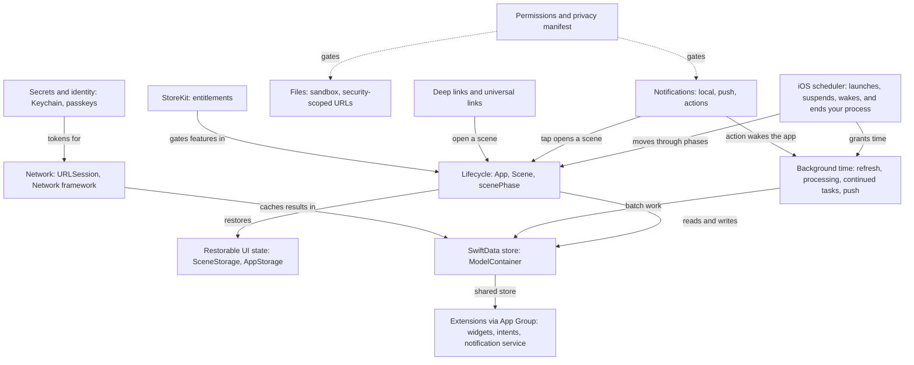
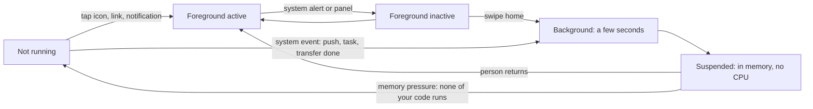

[← Learning hub](README.md)

# Day 3 · Data, networking, lifecycle, and living inside the OS

> By tonight you'll know where each piece of your app's data belongs, when iOS lets your code run, and how to ask the system for time, attention, permission, and money without getting killed or rejected.  **Time:** ~6–8 hours.

## Today's map

Yesterday you built screens. Today you learn the house rules. On iOS your app is a tenant: the system decides when it runs, how long it runs, what it can touch, and when it disappears. Everything in this chapter follows from that.



## Mental models

### 1. Your process is a guest, and iOS can end it without warning

**The system owns your process's lifetime. You are told about some transitions, and never about the last one.**

A SwiftUI app declares scenes. A `WindowGroup` is a template for windows; on iPad a person can open several instances of it. Each scene moves between three phases: `.active` (in front and interactive), `.inactive` (in the foreground but should pause, for example behind a system alert), and `.background` (not visible). Read `@Environment(\.scenePhase)` inside a view and you get that scene's phase. Read it inside your `App` and you get an aggregate: active if any scene is active. Apple's documentation is blunt about the app-level `.background` phase: expect the app to terminate soon after.

Here is the part tutorials skip. After a short time in the background, iOS **suspends** your app: it stays in memory but gets no CPU. When the system needs memory, it removes suspended apps, and none of your code runs. For apps that support background execution, Apple documents `applicationWillTerminate(_:)` as generally not called; it may fire when the app is running in the background (not suspended) and the system ends it. So "save on quit" is not a strategy. Save when data changes, and quiet down when a scene leaves `.active`. SwiftData's main context does the first part for you: it autosaves.



People expect to come back to where they left off, even after the system ended the app. `@SceneStorage` gives each window a small, system-restored store for things like the selected errand or tab. Apple's docs set its limits: keep values small (no model data), never store sensitive data in it, and expect it to vanish when the scene is explicitly destroyed. `@AppStorage` is different: it's app-wide and backed by `UserDefaults`, so it's for preferences, not per-window state.

Your app gets opened in many ways: the icon, a notification tap, a custom URL scheme, a universal link, Siri or a widget. In SwiftUI, `onOpenURL(perform:)` receives both custom-scheme URLs and universal links (SwiftUI hands universal links to you as a URL, not as an `NSUserActivity`). Handoff and other activities arrive through `onContinueUserActivity(_:perform:)`. Treat every incoming URL as untrusted input: Apple warns that URL schemes are an attack vector and strongly recommends universal links over custom schemes.

One iOS 27 change matters if you inherit UIKit code: apps built with the iOS 27 SDK must use the scene-based life cycle or they fail to launch. A SwiftUI `App` already is scene-based.

**Senior tell:** They treat every move out of `.active` as possibly the last code that will ever run for this process, and they never write "save on terminate."

### 2. Put each byte where its sensitivity and size say it belongs

**Storage choice is a security and backup decision first, and a convenience decision second.**

| What | Where | Why |
|---|---|---|
| Per-window UI state (selected errand, open tab) | `@SceneStorage` | Restored per scene by the system; small; not for secrets |
| Small preferences ("reminders on") | `@AppStorage` / `UserDefaults` | Stored unencrypted on disk; device-only; thread-safe |
| Preferences that should follow the person to other devices | `NSUbiquitousKeyValueStore` | `UserDefaults` doesn't sync between devices |
| User content you query (errands, steps) | SwiftData | Object graph, queries, migrations, optional CloudKit sync |
| Documents and large blobs (receipts, photos) | Files in Application Support or Documents, or `@Attribute(.externalStorage)` | Keep big data out of rows |
| Anything you can re-download | Caches directory | Apple calls these "discardable cache files" |
| Secrets (API tokens, refresh tokens) | Keychain | Encrypted; you choose when it's readable |

`UserDefaults` deserves a warning. Apple's docs say it stores data unencrypted and tell you to put personal or sensitive information in the Keychain instead. It's also a **required-reason API**: every app that touches it, including through `@AppStorage`, must declare why in its privacy manifest (more in model 5).

**Files.** Your app lives in a sandbox. Use `URL.applicationSupportDirectory` for app-managed files, `URL.documentsDirectory` for files the person creates, and `URL.cachesDirectory` for anything you can rebuild. Files outside the sandbox come to you through the system: `fileImporter(isPresented:allowedContentTypes:allowsMultipleSelection:onCompletion:)` returns **security-scoped URLs**. You must call `startAccessingSecurityScopedResource()` before reading, `stopAccessingSecurityScopedResource()` after, and save `bookmarkData(options:includingResourceValuesForKeys:relativeTo:)` (not the path) if you need the file again next launch. Resolve it with `URL(resolvingBookmarkData:options:relativeTo:bookmarkDataIsStale:)`, and save a fresh bookmark when it reports stale. For writes that must stay private while the phone is locked, pass a file-protection option such as `.completeFileProtection` when writing data. Document-based apps got a new model in iOS 27: `ReadableDocument` and `WritableDocument` read directly from a file URL. Apple's reference marks the older `FileDocument` and `ReferenceFileDocument` deprecated as of iOS 27.2, a point release still in beta; on 27.0 they aren't deprecated yet, but new document apps should start with the URL-based protocols.

**Secrets and identity.** The Keychain (`SecItemAdd`, `SecItemCopyMatching`, `SecItemUpdate`, `SecItemDelete`) stores small secrets. Its most important attribute is `kSecAttrAccessible`. The default is `kSecAttrAccessibleWhenUnlocked`, which means a background task can't read the item while the phone is locked. Apple recommends `kSecAttrAccessibleAfterFirstUnlock` for items that background work needs. For sign-in, prefer **passkeys**: create an `ASAuthorizationPlatformPublicKeyCredentialProvider(relyingPartyIdentifier:)`, ask it for a registration or assertion request with a server-issued challenge, and run it with SwiftUI's `@Environment(\.authorizationController)` and its async `performRequest(_:)`. The result comes back as an `ASAuthorizationResult` case such as `.passkeyRegistration` or `.passkeyAssertion`; your server verifies it. Passkeys need the Associated Domains entitlement with a `webcredentials` entry. iOS 26 added account creation with passkeys (`ASAuthorizationAccountCreationProvider`), and iOS 26.2 added `ASCredentialDataManager` to tell password managers when credentials change. For Sign in with Apple, use `SignInWithAppleButton` and check `credentialState(forUserID:)` at launch, because people can revoke it from Settings.

**Senior tell:** For every stored value they can answer three questions: is it in backups, does it follow the person to a new device, and can background code read it while the phone is locked?

### 3. SwiftData: one container, one context per actor, identifiers across the gap

**The container is the database. A context is a scratchpad owned by one actor. Models never leave their context; identifiers do.**

A `ModelContainer` holds the schema and the store configuration. It's `Sendable`, you create it once, and the app, widgets, and extensions can all open the same store through an App Group (`ModelConfiguration(groupContainer:)`). A `ModelContext` tracks inserted, changed, and deleted models in memory until you save. The container's `mainContext` is bound to the main actor, and SwiftData turns on `autosaveEnabled` for it. Every other context, including the one inside a `@ModelActor`, starts with autosave **off**, so background code must call `save()` itself.

Model objects belong to the context that fetched them. To hand work to another actor, pass the model's `persistentModelID` (a `PersistentIdentifier`, which is `Sendable`) and fetch it again on the other side. Errand goes one step further: only the store actor writes records, and it hands everything outside Day 1's `Sendable` value snapshots. Read-only screens can still use `@Query` on the main context. Apple documents `@Query` as keeping its results "in sync with the underlying data," but not when saves from another context, such as the store actor's, show up in a view, so test that path on a device instead of assuming it. New in iOS 27: `@Query` can return `SectionedResults` grouped by a string key path, and `ResultsObserver` gives you live, `Observable` results outside a view. Unlike `@Query`, Apple explicitly documents it as reacting to changes from the same context, other contexts in the container, and other processes or CloudKit. `HistoryObserver` (also iOS 27) watches for changes written elsewhere and bumps an `eventCounter`, which is your cue to read persistent history.

Extensions are other processes. A widget, an App Intents extension, or a notification service extension shares nothing with your app except what you put in the App Group: the SwiftData store, a `UserDefaults(suiteName:)` suite, files under `containerURL(forSecurityApplicationGroupIdentifier:)`, and Keychain items with a shared `kSecAttrAccessGroup`. After the app writes something a widget shows, call `WidgetCenter.shared.reloadTimelines(ofKind:)`; when an extension writes, `HistoryObserver` tells the app. An extension can schedule a background task, but only the main app can register it, and an extension that needs a moment to finish uses `ProcessInfo.performExpiringActivity(withReason:using:)`.

Schemas change, and people's data doesn't reset when you ship an update. Wrap every shipped schema in a `VersionedSchema`, list the versions in a `SchemaMigrationPlan`, and describe each hop as a lightweight or custom `MigrationStage`. If you'll sync with CloudKit, design for its limits from the first version: Apple's docs say CloudKit can't enforce unique constraints, requires all relationships to be optional, can't support the `.deny` delete rule, and treats the production schema as additive only.

**Senior tell:** They wrap the first schema in a `VersionedSchema` before the first TestFlight build, because the first shipped schema is the one every future migration starts from.

### 4. Background time is a request the system may grant, not a thread you own

**You don't run in the background. You ask, the system decides, and it can take the time back.**

| Mechanism | Who starts it | Time you get | Use it for |
|---|---|---|---|
| `beginBackgroundTask(withName:expirationHandler:)` | Your code, before leaving the foreground | A limited amount; check `backgroundTimeRemaining` | Finishing a save or a send |
| `BGAppRefreshTask` (SwiftUI: `.backgroundTask(.appRefresh(_:))`) | The system, when it thinks it's useful | Up to 30 seconds | Refreshing content |
| `BGProcessingTask` (SwiftUI, iOS 27: `.backgroundTask(.processingTask(_:))`) | The system, can require power or network | Minutes | Maintenance, rebuilding indexes |
| `BGContinuedProcessingTask` (iOS 26) | A person's tap, in the foreground | Minutes or more, while it shows progress and isn't cancelled | Exports, batch jobs |
| Background `URLSession` | Your code; transfers run in another process | Until the transfer ends | Large downloads and uploads |
| Background push (`content-available`) | Your server | About 30 seconds per wake | "New data is available" |
| `LongRunningIntent` (iOS 27) | Siri, Shortcuts, widgets | Extended, while you report progress | Long App Intents (Day 4) |

Requests are one-shot and scarce. Only one refresh request and ten processing requests can be pending at a time, and a new submission with the same identifier replaces the old one. In iOS 27, `BGTaskScheduler.submit(_:)` is deprecated; use `submitTaskRequest(_:)`, which is async, and don't call it from the main thread. Every identifier you use must be listed in `BGTaskSchedulerPermittedIdentifiers` in Info.plist, and app refresh and processing tasks need the matching Background Modes.

`BGContinuedProcessingTask` is the one agentic apps care about most. It starts in the foreground from a person's action. If they leave the app, the system keeps the job alive and shows its title, subtitle, and progress in a Live Activity, where they can cancel it. Report progress honestly: when resources get tight, the system ends tasks that show little progress first. If the person swipes your app away in the app switcher, the task is cancelled and your app gets no signal. GPU use in the background needs the Background GPU Access entitlement; iOS 27 adds a Background Inference entitlement, which the system requires for any Neural Engine use while your app is in the background.

Background pushes are hints, not a channel. Apple says to send no more than two or three per hour, the system may hold them and keep only the newest, and it discards held ones if the person force-quits the app. Energy sits behind all of this. In Low Power Mode the system pauses discretionary and background activity; check `ProcessInfo.processInfo.isLowPowerModeEnabled`, and at a `.serious` or `.critical` `thermalState` cut optional work. Both can change while you run: observe `thermalStateDidChangeNotification` and `NSProcessInfoPowerStateDidChange` through `NotificationCenter.default.notifications(named:)`.

**Senior tell:** They design background work as resumable batches with checkpoints and honest progress, so being killed halfway loses one item, not the whole job.

### 5. Permission is a moment in the person's story, and "limited" is a normal answer

**Ask when the value is obvious, design for "no" and "some," and declare what you touch.**

Every protected resource needs a purpose string in Info.plist (`NSContactsUsageDescription`, `NSLocationWhenInUseUsageDescription`, and so on). Without one, access fails and the app may crash. The system shows its prompt once; later calls return the stored answer. So timing matters. Apple's own example for notifications is a task app that asks right after the person schedules their first task, not at first launch. For notifications you can also ask for `.provisional` authorization: notifications arrive quietly in Notification Center, and the person decides later whether to keep them.

Partial access is common and you should expect it. Photos has a limited library (`PHAuthorizationStatus.limited`), Contacts has limited access (`CNAuthorizationStatus.limited`, iOS 18) with `ContactAccessButton` to add people one at a time, and location has When In Use, Always, Allow Once, and reduced accuracy. `CLServiceSession` (iOS 18) lets you declare what a workflow needs, and Core Location re-asks when temporary authorization lapses. Pickers avoid the question entirely: `PhotosPicker` runs in a system view and gives you only the photos the person picks.

Privacy has a paperwork side too. A `PrivacyInfo.xcprivacy` file declares the data you collect and your reasons for using **required-reason APIs**: `UserDefaults`, file timestamps, system boot time, disk space, and active keyboards. For `UserDefaults` the usual reason is `CA92.1` (data only your app reads), or `1C8F.1` for an App Group suite. Since May 1, 2024, App Store Connect doesn't accept apps that use these APIs without declaring a reason.

**Senior tell:** Every permission-gated feature gets a designed "denied" and "limited" state before anyone polishes the "granted" one.

### 6. The network is a maybe, so let the system wait with you

**Connectivity changes under you. Requests should wait patiently, fail clearly, and never be gated on a guess.**

Checking reachability before a request is a race: the answer can change a moment later. Instead, set `waitsForConnectivity = true` on the session configuration. When there's no route, the session waits for one instead of failing at once. Then set `timeoutIntervalForResource` to something you can live with, because the default is seven days. `URLSession` throws for transport errors only. An HTTP 404 or 500 comes back as a normal response, so check `statusCode` yourself. Create one session per configuration and reuse it; Apple warns against creating more sessions than you need.

`NWPathMonitor` is an `AsyncSequence` of `NWPath` values. Use it for hints in the UI (an offline banner, pausing prefetch), not as a gate. `isExpensive` means cellular or a hotspot, `isConstrained` means Low Data Mode, and iOS 26 added `isUltraConstrained` and `linkQuality`. For prefetching and other optional traffic, Apple suggests a session with `allowsConstrainedNetworkAccess` and `allowsExpensiveNetworkAccess` set to `false` plus `waitsForConnectivity`, so tasks wait for a better network instead of spending the person's data.

Background `URLSession` transfers run in a separate system process, so they survive your app being suspended or ended. That comes with rules: HTTP and HTTPS only, uploads only from files, redirects always followed, a delegate is required, and relaunch delays grow each time the system wakes you for a new transfer. If the app was ended, recreate the session with the same identifier at launch so the system can reconnect it. `sessionSendsLaunchEvents` (on by default) is what wakes the app when transfers finish, and `isDiscretionary` lets the system wait for good conditions such as Wi-Fi and power. For protocols other than HTTP (TCP, UDP, QUIC, Bonjour), use the Network framework; iOS 26 added Swift-first `NetworkConnection`, `NetworkListener`, and `NetworkBrowser`. Local-network access needs `NSLocalNetworkUsageDescription`.

**Senior tell:** They never ask "are we online?" before a request. They ask "what does the person see while we wait, and when do we give up?"

### 7. The App Store owns the truth about money; your app keeps a cache

**Entitlements come from StoreKit on every launch. A `Bool` in `UserDefaults` is a cache, never the source.**

StoreKit 2 models purchases as signed transactions. `Product.products(for:)` loads what you sell. In SwiftUI, purchase through the `purchase` environment action (`PurchaseAction`) or let StoreKit views do it: `SubscriptionStoreView`, `StoreView`, `ProductView`. StoreKit verifies each transaction's signature and hands you a `VerificationResult` that is either `.verified` or `.unverified`.

What the person is entitled to right now is `Transaction.currentEntitlements`. Changes that happen outside your purchase flow arrive on `Transaction.updates`: Ask to Buy approvals, offer-code redemptions, purchases made in the App Store, and purchases made on another device. Apple's docs say to start listening to `updates` as soon as the app launches, because unfinished transactions are delivered there once, right after launch. Call `finish()` after you've delivered what was bought. Reinstalls and new devices need no "restore" step: transactions are available at first launch. Keep `AppStore.sync()` behind a Restore Purchases button, because it shows an App Store sign-in prompt.

**Senior tell:** They can delete the app's data, relaunch offline-then-online, and watch Pro features come back without a server of their own.

## The APIs that matter

| API | What it's for | Since | Link |
|---|---|---|---|
| **Everyday** | | | |
| `App`, `WindowGroup` | Declare the app and its window scenes | iOS 14 | [App](https://developer.apple.com/documentation/swiftui/app) |
| `ScenePhase`, `scenePhase` | React to active, inactive, background | iOS 14 | [ScenePhase](https://developer.apple.com/documentation/swiftui/scenephase) |
| `SceneStorage` | Per-window state the system restores | iOS 14 | [SceneStorage](https://developer.apple.com/documentation/swiftui/scenestorage) |
| `AppStorage` | App-wide preference backed by `UserDefaults` | iOS 14 | [AppStorage](https://developer.apple.com/documentation/swiftui/appstorage) |
| `Model()` | Make a class persistent and observable | iOS 17 | [Model()](https://developer.apple.com/documentation/swiftdata/model()) |
| `ModelContainer`, `ModelContext` | The store, and a scratchpad to change it | iOS 17 | [ModelContainer](https://developer.apple.com/documentation/swiftdata/modelcontainer) |
| `Query()` | Live fetch results in a view | iOS 17 | [Query()](https://developer.apple.com/documentation/swiftdata/query()) |
| `URLSession.data(for:delegate:)` | Async HTTP request | iOS 15 | [data(for:delegate:)](https://developer.apple.com/documentation/foundation/urlsession/data(for:delegate:)) |
| `JSONDecoder` | Decode `Codable` types from JSON | iOS 8 | [JSONDecoder](https://developer.apple.com/documentation/foundation/jsondecoder) |
| `UNUserNotificationCenter` | Ask permission, schedule, handle notifications | iOS 10 | [UNUserNotificationCenter](https://developer.apple.com/documentation/usernotifications/unusernotificationcenter) |
| `onOpenURL(perform:)` | Receive custom-scheme and universal links | iOS 14 | [onOpenURL](https://developer.apple.com/documentation/swiftui/view/onopenurl(perform:)) |
| `Transaction.currentEntitlements` | What the person owns right now | iOS 15 | [currentEntitlements](https://developer.apple.com/documentation/storekit/transaction/currententitlements) |
| **Intermediate** | | | |
| `ModelActor()` | A background actor with its own context | iOS 17 | [ModelActor()](https://developer.apple.com/documentation/swiftdata/modelactor()) |
| `VersionedSchema`, `SchemaMigrationPlan` | Versioned schemas and migrations | iOS 17 | [SchemaMigrationPlan](https://developer.apple.com/documentation/swiftdata/schemamigrationplan) |
| `Index(_:)`, `Unique(_:)` | Indexes and compound unique constraints | iOS 18 | [Unique(_:)](https://developer.apple.com/documentation/swiftdata/unique(_:)) |
| `ModelConfiguration` | App Group location, CloudKit on or off | iOS 17 | [ModelConfiguration](https://developer.apple.com/documentation/swiftdata/modelconfiguration) |
| `backgroundTask(_:action:)` | SwiftUI handler for app refresh, URL sessions, and (iOS 27) processing tasks | iOS 16 | [backgroundTask](https://developer.apple.com/documentation/swiftui/scene/backgroundtask(_:action:)) |
| `BGTaskScheduler.submitTaskRequest(_:)` | Submit background work (replaces `submit(_:)`) | iOS 27 | [submitTaskRequest](https://developer.apple.com/documentation/backgroundtasks/bgtaskscheduler/submittaskrequest(_:completionhandler:)) |
| `BGAppRefreshTaskRequest`, `BGProcessingTaskRequest` | Ask for a refresh or a maintenance window | iOS 13 | [BGProcessingTaskRequest](https://developer.apple.com/documentation/backgroundtasks/bgprocessingtaskrequest) |
| `UNNotificationCategory`, `UNNotificationAction` | Buttons on notifications | iOS 10 (icons iOS 15) | [UNNotificationAction](https://developer.apple.com/documentation/usernotifications/unnotificationaction) |
| `UNNotificationInterruptionLevel` | Passive, active, time sensitive, critical | iOS 15 | [Interruption level](https://developer.apple.com/documentation/usernotifications/unnotificationinterruptionlevel) |
| `SecItemCopyMatching(_:_:)` and siblings | Keychain reads and writes | iOS 2 | [SecItemCopyMatching](https://developer.apple.com/documentation/security/secitemcopymatching(_:_:)) |
| `AuthorizationController` | Run passkey and Sign in with Apple requests from SwiftUI | iOS 16.4 | [AuthorizationController](https://developer.apple.com/documentation/authenticationservices/authorizationcontroller) |
| `SignInWithAppleButton` | The standard Sign in with Apple button | iOS 14 | [SignInWithAppleButton](https://developer.apple.com/documentation/authenticationservices/signinwithapplebutton) |
| `SubscriptionStoreView` | A complete subscription paywall | iOS 17 | [SubscriptionStoreView](https://developer.apple.com/documentation/storekit/subscriptionstoreview) |
| `startAccessingSecurityScopedResource()` | Open files the person picked outside the sandbox | iOS 8 | [startAccessing…](https://developer.apple.com/documentation/foundation/url/startaccessingsecurityscopedresource()) |
| **Advanced** | | | |
| `BGContinuedProcessingTask` | User-started job that continues in the background | iOS 26 | [BGContinuedProcessingTask](https://developer.apple.com/documentation/backgroundtasks/bgcontinuedprocessingtask) |
| `SectionedResults`, `ResultsSection` | Sectioned `@Query` results | iOS 27 | [SectionedResults](https://developer.apple.com/documentation/swiftdata/sectionedresults) |
| `ResultsObserver` | Live query results outside views | iOS 27 | [ResultsObserver](https://developer.apple.com/documentation/swiftdata/resultsobserver) |
| `HistoryObserver` | Notice changes made by other processes | iOS 27 | [HistoryObserver](https://developer.apple.com/documentation/swiftdata/historyobserver) |
| `Schema.Attribute.Option.codable` | Store any `Codable` type as an attribute | iOS 27 | [codable](https://developer.apple.com/documentation/swiftdata/schema/attribute/option/codable) |
| `URLSessionConfiguration.background(withIdentifier:)` | Out-of-process transfers | iOS 8 | [background(withIdentifier:)](https://developer.apple.com/documentation/foundation/urlsessionconfiguration/background(withidentifier:)) |
| `UNNotificationServiceExtension` | Change a push's content before it's shown | iOS 10 | [Service extension](https://developer.apple.com/documentation/usernotifications/unnotificationserviceextension) |
| `NWPathMonitor` | Watch network path changes | iOS 12 | [NWPathMonitor](https://developer.apple.com/documentation/network/nwpathmonitor) |
| `NetworkConnection` | Swift-first TCP, UDP, QUIC connections | iOS 26 | [NetworkConnection](https://developer.apple.com/documentation/network/networkconnection) |
| `ASAuthorizationPlatformPublicKeyCredentialProvider` | Passkey registration and sign-in | iOS 15 | [Provider](https://developer.apple.com/documentation/authenticationservices/asauthorizationplatformpublickeycredentialprovider) |
| `CKSyncEngine` | Custom CloudKit sync when SwiftData's isn't enough | iOS 17 | [CKSyncEngine](https://developer.apple.com/documentation/cloudkit/cksyncengine-5sie5) |
| `ProcessInfo.thermalState`, `isLowPowerModeEnabled` | Back off under heat or Low Power Mode | iOS 11, iOS 9 | [thermalState](https://developer.apple.com/documentation/foundation/processinfo/thermalstate-swift.property) |
| `ReadableDocument`, `WritableDocument` | URL-based document apps | iOS 27 | [ReadableDocument](https://developer.apple.com/documentation/swiftui/readabledocument) |
| `MetricManager` | MetricKit reports as async sequences | iOS 27 | [MetricManager](https://developer.apple.com/documentation/metrickit/metricmanager) |

## Core patterns in code

The snippets extend the Errand project from Days 1 and 2. That project sets **Default Actor Isolation** to `MainActor`, so every type that runs off the main actor says `nonisolated`, just like Day 1's `Errand`, `Step` and `Status`. That includes the `@Model` records, because the store actor reads and writes them off the main actor. (SE-0466 names the `@Model` macro's key paths as a known friction point with main-actor default isolation; an explicit `nonisolated` on the class is the language's opt-out.) The architecture stays the same: `ErrandStore` is still the one writer, now backed by SwiftData. Inside the store, data lives in `@Model` *records*; outside, the store hands out Day 1's `Sendable` value snapshots, never records. Day 4 relies on that.

**1. The app's wiring: one container, one store, scene phases, and a background refresh.**

```swift
import SwiftUI
import SwiftData

@main
struct ErrandApp: App {
    @UIApplicationDelegateAdaptor(AppDelegate.self) private var appDelegate
    @Environment(\.scenePhase) private var scenePhase                 // in App: all scenes combined
    @State private var board = ErrandBoard(store: Persistence.store)   // Day 2's board, new store

    var body: some Scene {
        WindowGroup { ErrandListView().environment(board) }
            .modelContainer(Persistence.container)                     // for read-only @Query screens
            .onChange(of: scenePhase) {
                switch scenePhase {
                case .active: Task { await board.load() }             // pick up background changes
                case .background: Task { await Refresh.schedule() }   // @concurrent: runs off main
                default: break
                }
            }
            .backgroundTask(.appRefresh(Refresh.identifier)) {
                await Refresh.schedule()   // requests are one-shot: queue the next one first
                // Then re-check due dates and reschedule reminders. You have about 30 seconds.
            }
    }
}

nonisolated enum Persistence {
    static let container: ModelContainer = {
        let config = ModelConfiguration(groupContainer: .identifier("group.com.example.errand"),
                                        cloudKitDatabase: .none)       // turn sync on deliberately, later
        do {
            return try ModelContainer(for: ErrandRecord.self, StepRecord.self,
                                      migrationPlan: ErrandMigrationPlan.self, configurations: config)
        } catch { fatalError("Could not open the Errand store: \(error)") }
    }()
    static let store = ErrandStore(modelContainer: container)         // the one writer, shared by everyone
}
```

- `Persistence` holds one container and one store actor. The app, the notification delegate, and background jobs all write through the same `ErrandStore`, and a widget in the same App Group opens the same file.
- Coming back to `.active` reloads the board, because a notification action or a batch job may have changed data while the UI was away.
- SwiftUI runs this closure when the system launches the app for that identifier, so you don't call `register` for it yourself (`Refresh` is in pattern 7). You still list the identifier in `BGTaskSchedulerPermittedIdentifiers` and turn on the Background fetch mode. `Refresh.schedule()` is `@concurrent`, so it always runs off the main actor, because Apple's docs say not to submit from the main thread. A plain `nonisolated async` function would run on its caller's actor (Day 1), and so does an imported Objective-C async method like `submitTaskRequest(_:)`.

**2. Records: `@Model` classes with an index, a rename, a cascade, and an iOS 27 `Codable` attribute.**

```swift
import Foundation
import SwiftData

extension ErrandSchemaV2 {                                   // the version enums are in pattern 4
    @Model nonisolated final class ErrandRecord {
        #Index<ErrandRecord>([\.createdAt], [\.due, \.title])
        var id: UUID = UUID()
        var title: String = ""
        @Attribute(originalName: "dueDate") var due: Date?   // renamed since V1
        var createdAt: Date = Date.now
        @Attribute(.codable) var reminder: DateComponents?    // iOS 27: a Codable type you don't own
        @Relationship(deleteRule: .cascade, inverse: \StepRecord.errand)
        var steps: [StepRecord] = []

        init(id: UUID, title: String, due: Date?, createdAt: Date) {
            self.id = id; self.title = title; self.due = due; self.createdAt = createdAt
        }
    }

    @Model nonisolated final class StepRecord {
        var id: UUID = UUID()
        var title: String = ""
        var statusRaw: String = Status.pending.rawValue       // Day 1's Status, stored as its raw value
        var needsApproval: Bool = false
        var order: Int = 0                                    // store the step order explicitly
        var preparedNote: String?                             // new in V2: filled in by the batch job
        var errand: ErrandRecord?

        init(id: UUID, title: String, statusRaw: String, needsApproval: Bool, order: Int) {
            self.id = id; self.title = title; self.statusRaw = statusRaw
            self.needsApproval = needsApproval; self.order = order
        }
    }
}
```

- The records keep Day 1's IDs, so a `UUID` in a notification, a URL, or an App Intent finds the same errand everywhere.
- Every property has a default and the to-one relationship is optional, which keeps the door open for CloudKit (and rules out `#Unique`). Apple's CloudKit rule is that *all* relationships be optional, so when you turn sync on, check that the store loads with the non-optional `steps` array, or make it `[StepRecord]?`. `.cascade` deletes an errand's steps with it; the default, `.nullify`, would leave orphaned steps.
- `#Index` declares a single-column index (the store's sort) and a compound one (a "due soon" list sorted by title). `@Attribute(originalName:)` tells the migration that `due` used to be called `dueDate`.

**3. A read-only, sectioned, restorable screen.**

```swift
import SwiftUI
import SwiftData

struct StepsOverview: View {                                          // reads only; writes go through ErrandStore
    @SceneStorage("overview.showDone") private var showDone = false   // per window, restored by the system
    @Query(sort: \StepRecord.order, sectionBy: \StepRecord.statusRaw)  // iOS 27
    private var steps: SectionedResults<StepRecord, String>

    var body: some View {
        List(steps) { section in
            if showDone || section.title != Status.done.rawValue {
                Section(section.title) {                              // map raw values to labels in real UI
                    ForEach(section) { step in
                        LabeledContent(step.title, value: step.errand?.title ?? "")
                    }
                }
            }
        }
        .navigationTitle("All steps")
        .toolbar { Toggle("Show done", isOn: $showDone) }
    }
}
```

- `SectionedResults` is a collection of `ResultsSection`s. Each section has a `title` and is itself a collection of records.
- `@Query` reads through the main context in the environment (pattern 1's `.modelContainer`). Reading records directly in a view is fine; writing stays in the store, so there is one place that enforces Day 1's state machine.
- Deep links go where the navigation state lives. In Day 2's `ErrandListView`, add `.onOpenURL { url in if let id = UUID(uuidString: url.lastPathComponent) { path = [id] } }`, which handles both a custom scheme and a universal link.

**4. Versioned schemas and a migration that repairs data.**

```swift
import Foundation
import SwiftData

nonisolated enum ErrandSchemaV1: VersionedSchema {       // the first schema you ship; frozen from then on
    static var versionIdentifier: Schema.Version { Schema.Version(1, 0, 0) }
    static var models: [any PersistentModel.Type] { [ErrandRecord.self, StepRecord.self] }

    @Model nonisolated final class ErrandRecord {
        var id: UUID = UUID()
        var title: String = ""
        var dueDate: Date?
        var createdAt: Date = Date.now
        @Relationship(deleteRule: .cascade, inverse: \StepRecord.errand) var steps: [StepRecord] = []
        init() {}
    }
    @Model nonisolated final class StepRecord {
        var id: UUID = UUID()
        var title: String = ""
        var statusRaw: String = "pending"
        var needsApproval: Bool = false
        var errand: ErrandRecord?
        init() {}
    }
}

nonisolated enum ErrandSchemaV2: VersionedSchema {
    static var versionIdentifier: Schema.Version { Schema.Version(2, 0, 0) }
    static var models: [any PersistentModel.Type] { [ErrandRecord.self, StepRecord.self] }
}
typealias ErrandRecord = ErrandSchemaV2.ErrandRecord    // the rest of the app sees only the latest version
typealias StepRecord = ErrandSchemaV2.StepRecord

nonisolated enum ErrandMigrationPlan: SchemaMigrationPlan {
    static var schemas: [any VersionedSchema.Type] { [ErrandSchemaV1.self, ErrandSchemaV2.self] }
    static var stages: [MigrationStage] {
        [.custom(fromVersion: ErrandSchemaV1.self, toVersion: ErrandSchemaV2.self, willMigrate: nil,
                 didMigrate: { context in
                     let stuck = FetchDescriptor<StepRecord>(predicate: #Predicate<StepRecord> { $0.statusRaw == "running" })
                     for step in try context.fetch(stuck) { step.statusRaw = "pending" }
                     try context.save()
                 })]
    }
}
```

- V2 renames a property and adds some with defaults, the kind of change a `.lightweight` stage is for. The `.custom` stage is here for the repair in `didMigrate`, which runs after the store has the new shape: a step still marked `running` was interrupted when the process ended, so it starts over.
- Test a migration by installing a V1 build, adding data, then installing V2 over it. A fresh simulator only ever tests the latest schema.
- The typealiases keep the rest of the code version-free. Next time, copy V2 into V3 and move the aliases.

**5. Networking with a token from the Keychain.**

```swift
import Foundation
import Security

nonisolated struct PlaceHours: Decodable, Sendable { let name: String; let opensAt: Date; let closesAt: Date }

nonisolated enum PlacesAPI {
    private static let session: URLSession = {
        let config = URLSessionConfiguration.default
        config.waitsForConnectivity = true         // wait for a route instead of failing at once...
        config.timeoutIntervalForResource = 30     // ...but not for the 7-day default
        return URLSession(configuration: config)
    }()

    @concurrent static func hours(placeID: String) async throws -> PlaceHours {   // Keychain + decode off main
        let base = URL(string: "https://api.example.com/v1/places")!   // a constant, so the unwrap is safe
        var request = URLRequest(url: base.appending(components: placeID, "hours"))
        if let token = keychainToken() { request.setValue("Bearer \(token)", forHTTPHeaderField: "Authorization") }
        let (data, response) = try await session.data(for: request)
        guard let http = response as? HTTPURLResponse, (200..<300).contains(http.statusCode) else {
            throw URLError(.badServerResponse)     // HTTP errors don't throw; check the status yourself
        }
        let decoder = JSONDecoder()
        decoder.dateDecodingStrategy = .iso8601
        return try decoder.decode(PlaceHours.self, from: data)
    }

    /// Saved with kSecAttrAccessibleAfterFirstUnlock so background work can read it while locked.
    private static func keychainToken() -> String? {
        let query: [String: Any] = [kSecClass as String: kSecClassGenericPassword,
                                    kSecAttrService as String: "com.example.errand.api",
                                    kSecReturnData as String: true,
                                    kSecMatchLimit as String: kSecMatchLimitOne]
        var item: CFTypeRef?
        guard SecItemCopyMatching(query as CFDictionary, &item) == errSecSuccess,
              let data = item as? Data else { return nil }
        return String(decoding: data, as: UTF8.self)
    }
}
```

- One `static` session, reused for every call. `PlaceHours` is `nonisolated`, so its `Decodable` conformance isn't tied to the main actor (Day 1's isolated-conformance trap), and `Sendable`, so results cross actors freely.
- The thrown errors are transport problems (no route, TLS failure, timeout). Server errors are responses, so the status check is part of the pattern.
- `SecItemCopyMatching` blocks the calling thread, and Apple warns it can hang the UI if you call it on the main thread. Under approachable concurrency a plain `nonisolated async` function runs on its caller's actor, which from a view is the main actor, so `hours` is `@concurrent`: the Keychain read and the JSON decode run on the concurrent pool. When you write the token with `SecItemAdd`, set `kSecAttrAccessible` explicitly.

**6. Actionable notifications, requested in context.**

```swift
import UserNotifications

nonisolated enum Reminders {
    static let category = "ERRAND_REMINDER"
    static let markDone = "ERRAND_MARK_DONE"
    static let snooze = "ERRAND_SNOOZE"

    /// Call on every launch, before the app finishes launching.
    static func registerCategories() {
        let done = UNNotificationAction(identifier: markDone, title: "Mark next step done",
                                        icon: UNNotificationActionIcon(systemImageName: "checkmark"))
        let later = UNNotificationAction(identifier: snooze, title: "Remind me in an hour",
                                         icon: UNNotificationActionIcon(systemImageName: "clock"))
        UNUserNotificationCenter.current().setNotificationCategories(
            [UNNotificationCategory(identifier: category, actions: [done, later], intentIdentifiers: [])])
    }

    /// Call right after the person schedules their first errand, not at first launch.
    static func requestPermission() async -> Bool {
        (try? await UNUserNotificationCenter.current().requestAuthorization(options: [.alert, .sound, .badge])) ?? false
    }

    static func schedule(errandID: UUID, title: String, nextStep: String, fireDate: Date, dueDate: Date) async throws {
        let content = UNMutableNotificationContent()
        content.title = title
        content.body = "Next: \(nextStep)"
        content.categoryIdentifier = category
        content.userInfo = ["errandID": errandID.uuidString]
        content.interruptionLevel = dueDate.timeIntervalSince(fireDate) <= 3600 ? .timeSensitive : .active
        let when = Calendar.current.dateComponents([.year, .month, .day, .hour, .minute], from: fireDate)
        let request = UNNotificationRequest(identifier: "reminder-\(errandID.uuidString)", content: content,
                                            trigger: UNCalendarNotificationTrigger(dateMatching: when, repeats: false))
        try await UNUserNotificationCenter.current().add(request)
    }
}
```

- Action identifiers must be unique across all categories. When the person taps one, the identifier is the only thing that tells you which action it was.
- `.timeSensitive` can break through Focus and scheduled summaries. The HIG reserves it for events happening now or within an hour, and never for marketing. It's also a capability: add **Time Sensitive Notifications** to the app target in Signing & Capabilities before you rely on it, and expect people to be able to turn it off per app.
- The notification carries an ID, not the errand. Whoever handles the action looks the errand up again, possibly in a freshly launched process.

**7. Background work: a refresh the system schedules, and a batch job the person starts.**

```swift
import BackgroundTasks
import Foundation

nonisolated enum Refresh {
    static let identifier = "com.example.errand.refresh"          // also in BGTaskSchedulerPermittedIdentifiers
    @concurrent static func schedule() async {                    // always off the main actor
        let request = BGAppRefreshTaskRequest(identifier: identifier)
        request.earliestBeginDate = .now.addingTimeInterval(60 * 60)
        try? await BGTaskScheduler.shared.submitTaskRequest(request)   // iOS 27 replacement for submit(_:)
    }
}

nonisolated enum StepBatch {
    // Info.plist BGTaskSchedulerPermittedIdentifiers must contain "com.example.errand.steps.*"
    private static let prefix = "com.example.errand.steps"
    private struct Handle: @unchecked Sendable { let task: BGContinuedProcessingTask }   // BGTask isn't Sendable

    /// Call from a button action: this kind of task must start from a person's tap, in the foreground.
    static func start(pendingCount: Int, store: ErrandStore) {
        let identifier = "\(prefix).\(UUID().uuidString)"
        let registered = BGTaskScheduler.shared.register(forTaskWithIdentifier: identifier, using: nil) { task in
            guard let task = task as? BGContinuedProcessingTask else { return }
            let handle = Handle(task: task)
            let progress = task.progress                          // Progress is Sendable
            let work = Task {
                let finished = await store.prepareAllPending(progress: progress) { done, total in
                    handle.task.updateTitle("Preparing steps", subtitle: "\(done) of \(total) done")
                }
                handle.task.setTaskCompleted(success: finished)
            }
            task.expirationHandler = { work.cancel() }            // person cancelled it, or the system needs resources
        }
        guard registered else { return }                          // identifier not permitted in Info.plist
        Task.detached(priority: .userInitiated) {
            let request = BGContinuedProcessingTaskRequest(identifier: identifier, title: "Preparing steps",
                                                           subtitle: "\(pendingCount) waiting")
            request.strategy = .fail                              // start now or tell the person; don't queue silently
            do { try await BGTaskScheduler.shared.submitTaskRequest(request) }
            catch { /* .immediateRunIneligible: show "Busy, try again in a moment" */ }
        }
    }
}
```

- Continued tasks use Apple's wildcard scheme: Info.plist permits `prefix.*`, and each job registers and submits a unique `prefix.<suffix>`, so no identifier is registered twice. Apple requires the prefix to start with your app's bundle ID, so replace `com.example.errand` with yours. Unlike refresh and processing tasks, Apple's own example registers a continued task's handler at submission time rather than at launch.
- The system shows the title, subtitle, and `progress` in a Live Activity. `updateTitle(_:subtitle:)` keeps that text honest while the job runs.
- `Handle` is the one `@unchecked Sendable` in the chapter. `BGTask` isn't `Sendable`; the promise we make by hand is that, apart from setting the expiration handler, only the job's own `Task` touches it. The job itself runs inside `ErrandStore` (today's Practice), so the store stays the only writer.

## What's new in iOS 27 (and what old tutorials get wrong)

- **SwiftData sectioned queries.** `@Query(..., sectionBy:)` returns `SectionedResults` of `ResultsSection`s, keyed by a `String` or `String?` key path.
- **`ResultsObserver`**: live, `Observable` fetch results outside views, documented to react to other contexts, other processes, and CloudKit.
- **`HistoryObserver`**: watches remote changes for chosen model types and authors, and bumps `eventCounter` when there's new history to read.
- **`Codable` attributes.** `@Attribute(.codable)` stores any `Codable` type, including ones you don't control.
- **Background task submission changed.** `BGTaskScheduler.submit(_:)` is deprecated in iOS 27. The replacement `submitTaskRequest(_:)` is async and shouldn't be called on the main thread. (This change is in the API reference, not the update notes, so older code and tutorials use `submit`.) SwiftUI also gains `.backgroundTask(.processingTask(_:))`, so a SwiftUI app can handle `BGProcessingTask` the same way it handles app refresh.
- **Background Inference entitlement (iOS 27).** Required for any Neural Engine use while your app is in the background, whether or not you're in a continued processing task.
- **Scene life cycle is mandatory.** UIKit apps built with the iOS 27 SDK must adopt the scene-based life cycle or they fail to launch.
- **`@State` is a macro.** Built with Xcode 27, `@State` in an `App`, `Scene`, or `View` uses the `State()` macro, and a class stored in it is initialized only once, instead of every time the enclosing view value is re-created.
- **Document apps.** `ReadableDocument`, `WritableDocument`, and `URLDocumentConfiguration` read and write directly from file URLs. Apple's reference marks `FileDocument` and `ReferenceFileDocument` deprecated in iOS 27.2, which is still in beta; they're not deprecated on 27.0.
- **`AsyncImage` caching.** `asyncImageURLSession(_:)` lets `AsyncImage` load through your own session, so it can use your cache.
- **`LongRunningIntent`** gives App Intents extended background time while they report progress (Day 4).
- **MetricKit's `MetricManager`** delivers metric and diagnostic reports as async sequences and replaces `MXMetricManager` (which Apple's reference marks deprecated in the iOS 27.2 beta).
- **Notifications**: `UNMutableNotificationContent` gains `appEntityIdentifiers` (`[EntityIdentifier]`). So far Apple documents only its declaration.
- **Landed in iOS 26.x, missing from most tutorials:** `BGContinuedProcessingTask` (26.0), Swift-first `NetworkConnection` and `NWPath.isUltraConstrained` (26.0), passkey account creation (26.0), `ASCredentialDataManager` replacing the deprecated `ASCredentialUpdater` (26.2), and monthly subscriptions with a 12-month commitment (`Product.SubscriptionInfo.BillingPlanType`, 26.4).
- **What old tutorials get wrong:** checking reachability before every request; asking for notification permission at first launch; treating `@AppStorage` as free (it's a required-reason API); using `beginBackgroundTask` for long user-started jobs; storing "isPro" in `UserDefaults` as the truth; and `ObservableObject` view models wrapped around Core Data.

## Pitfalls you only learn by shipping

- **Notification buttons do nothing after a cold start** → the notification center's `delegate` was set after launch finished, or it was deallocated (the property is `weak`) → set it in `application(_:didFinishLaunchingWithOptions:)` and keep a strong reference to the delegate object.
- **Your background task never runs, or the app dies at launch** → the identifier isn't in `BGTaskSchedulerPermittedIdentifiers` (`register` returns `false`), the Background Mode is off, or you registered the same identifier twice (the system kills the app) → register each identifier once and check the return value.
- **The batch job dies at 40 percent** → the person swiped the app away (the task is cancelled with no signal), or progress stalled and the system ended low-progress tasks first → save after every item, update `progress` per item, and make the job resumable.
- **Silent pushes "sometimes don't arrive"** → they're low priority, throttled past two or three an hour, collapsed to the newest, and discarded after a force-quit → treat a push as a hint and fetch the real state on the next launch or foreground.
- **The background refresh can't read the auth token** → the Keychain item used the default `kSecAttrAccessibleWhenUnlocked` and the phone was locked → write items that background code needs with `kSecAttrAccessibleAfterFirstUnlock`.
- **App Store Connect emails you about "required reason API"** → `UserDefaults`, often through `@AppStorage` or an SDK, isn't declared → add `NSPrivacyAccessedAPICategoryUserDefaults` with `CA92.1` (or `1C8F.1` for App Group suites) to `PrivacyInfo.xcprivacy`, and make sure each SDK ships its own manifest.
- **You added iCloud for one feature and SwiftData started syncing, or sync works in development but not in the App Store build** → `cloudKitDatabase` defaults to `.automatic`, which syncs with the first container in your entitlements; the development schema was never promoted to production → pass `.none` until you mean to sync, keep the schema CloudKit-shaped (no unique constraints, optional relationships, no `.deny`), and promote before release, remembering that production is additive only.
- **The widget shows nothing** → the extension opened a different store (not in the App Group), or a view had no container attached, so the environment's default context isn't connected to your store and queries come back empty → use the same `ModelConfiguration(groupContainer:)` in every target and call `WidgetCenter.shared.reloadTimelines(ofKind:)` after the app saves.
- **A universal link opens Safari instead of the app** → a tap on a link to the same domain inside Safari stays in Safari by design; your own app opened the link with `openURL`; or the association file hasn't reached devices yet (Apple's CDN fetches it within 24 hours, and devices check about once a week) → test from Notes or Messages, and use an associated-domains alternate mode while developing.
- **Ask to Buy approvals or offer-code redemptions go missing, or the compiler says `Transaction` is ambiguous** → no `Transaction.updates` listener from launch; SwiftUI also has a `Transaction` type → start the listener at launch, finish transactions after delivery, and write `StoreKit.Transaction`.

## Legacy you'll still meet

| Old | New |
|---|---|
| `NSPersistentContainer` + `@FetchRequest` + `ObservableObject` | `ModelContainer` + `@Query`; `@Model` classes are already observable |
| Window set up in the app delegate, no scenes | SwiftUI `App` or UIKit scene life cycle (required for iOS 27 SDK builds) |
| `setMinimumBackgroundFetchInterval(_:)`, `application(_:performFetchWithCompletionHandler:)` (deprecated iOS 13) | `BGAppRefreshTask` or `.backgroundTask(.appRefresh(_:))` |
| `BGTaskScheduler.submit(_:)` (deprecated iOS 27) | `submitTaskRequest(_:)` |
| Long `beginBackgroundTask` loops for user jobs | `BGContinuedProcessingTask` |
| `SCNetworkReachability` and "Reachability" wrappers | Make the request with `waitsForConnectivity`; `NWPathMonitor` for UI hints |
| `dataTask(with:completionHandler:)` | `data(for:delegate:)` |
| `UILocalNotification` (deprecated iOS 10) | `UNUserNotificationCenter` |
| `SKPaymentQueue`, `SKProduct`, receipt parsing (deprecated iOS 18) | `Product`, `Transaction`, StoreKit views |
| `FileDocument`, `ReferenceFileDocument` (deprecated in the iOS 27.2 beta) | `ReadableDocument`, `WritableDocument` |
| `ASCredentialUpdater` (deprecated 26.2) | `ASCredentialDataManager` |
| `MXMetricManager` and its subscriber (deprecated in the iOS 27.2 beta) | `MetricManager` (iOS 27) |

## Practice

1. **Watch the life cycle.** Log every `scenePhase` change from a view and from the `App`. Make Day 2's list restore the open errand: keep the last ID from `path` in `@SceneStorage` and rebuild `path` from it on appear. Open two windows on an iPad simulator, background the app, then stop it from Xcode while it's suspended and relaunch it.
   *Done when:* you can explain why the view-level and app-level logs differ, and each window reopens its own errand after relaunch, but not after you remove that window from the app switcher.

2. **Audit Errand's storage.** Make a table with every value Errand stores today: model data, preferences, UI state, the API token, cached place hours. Put each in the right tier from mental model 2, and add a `PrivacyInfo.xcprivacy` that declares your `UserDefaults` use.
   *Done when:* nothing sensitive is in `UserDefaults` or `@SceneStorage`, the token is in the Keychain with `kSecAttrAccessibleAfterFirstUnlock`, and the privacy manifest lists `NSPrivacyAccessedAPICategoryUserDefaults` with `CA92.1`.

3. **Entitlements that survive a reinstall.** Add a StoreKit configuration file with a monthly and a yearly "Errand Pro" subscription. Start this object at launch, gate one feature on `hasPro`, and show `SubscriptionStoreView(groupID:)` with `.storeButton(.visible, for: .restorePurchases)` as the paywall.

   ```swift
   import StoreKit
   import Observation

   @MainActor @Observable
   final class Entitlements {
       private(set) var hasPro = false
       private var listener: Task<Void, Never>?
       private let proIDs: Set<String> = ["com.example.errand.pro.monthly", "com.example.errand.pro.yearly"]

       /// Start at launch: unfinished transactions arrive on `updates` once, right after launch.
       func start() {
           listener = Task {
               for await result in StoreKit.Transaction.updates {
                   await refresh()
                   if case .verified(let transaction) = result { await transaction.finish() }
               }
           }
           Task { await refresh() }
       }

       func refresh() async {
           var active = false
           for await result in StoreKit.Transaction.currentEntitlements {
               if case .verified(let transaction) = result, proIDs.contains(transaction.productID),
                  transaction.revocationDate == nil { active = true }
           }
           hasPro = active
       }
   }
   ```
   *Done when:* buying in the simulator turns the feature on, refunding it in Xcode's transaction manager turns it off within a relaunch, and deleting and reinstalling the app restores Pro without tapping Restore.

4. **Make the network honest.** Call `PlacesAPI.hours(placeID:)` from an errand's detail screen. Show a waiting state while the session waits for connectivity, an error state for server errors, and a small offline banner driven by `NWPathMonitor`.
   *Done when:* in Airplane Mode the screen shows "Waiting for network" instead of an instant error, turning Airplane Mode off completes the request without a retry button, and a 500 from the server shows a different message than no network.

5. **Capstone step: Errand remembers, reminds, and works while you're away** (about 1.5 hours).
   - Add the records, schemas, and migration plan (patterns 2 and 4) and `Persistence` (pattern 1). Turn on App Groups with `group.com.example.errand`.
   - Rewrite Day 1's `ErrandStore` as a `@ModelActor` with the same method signatures, so Day 2's `ErrandBoard` compiles unchanged. It maps records to snapshots at the boundary. Write `add(_:)` yourself (insert an `ErrandRecord` with one `StepRecord` per step, `order` set, then save), `errand(withID:)` as a fetch by `id` that returns a snapshot, and Day 2's `remove(_:)` as fetch, delete, save (the cascade removes the steps). In Day 1's tests, build the store with a container that uses `ModelConfiguration(isStoredInMemoryOnly: true)`.
   - When the person saves their first errand, call `Reminders.requestPermission()`. Then, from the board, after each `store.add(_:)`, schedule a reminder two hours before the due date with `Reminders.schedule(...)`.
   - Handle the notification actions with the app delegate and router below.
   - Add a "Prepare all steps" button that calls `StepBatch.start(pendingCount:store:)` with `Persistence.store` (pattern 7).

   ```swift
   import Foundation

   nonisolated extension ErrandRecord {
       var snapshot: Errand {
           Errand(id: id, title: title, due: due, createdAt: createdAt,
                  steps: steps.sorted { $0.order < $1.order }.map(\.snapshot))
       }
   }

   nonisolated extension StepRecord {
       var snapshot: Step {
           Step(id: id, title: title, status: Status(rawValue: statusRaw) ?? .pending, needsApproval: needsApproval)
       }
   }

   nonisolated extension Errand {             // Day 1's init makes new IDs; this one keeps stored ones
       init(id: UUID, title: String, due: Date?, createdAt: Date, steps: [Step]) {
           self.id = id; self.title = title; self.due = due; self.createdAt = createdAt; self.steps = steps
       }
   }

   nonisolated extension Step {
       init(id: UUID, title: String, status: Status, needsApproval: Bool) {
           self.id = id; self.title = title; self.status = status; self.needsApproval = needsApproval
       }
   }
   ```

   ```swift
   import Foundation
   import SwiftData

   @ModelActor
   actor ErrandStore {                                    // Day 1's API, now backed by SwiftData
       var all: [Errand] {
           let byDate = FetchDescriptor<ErrandRecord>(sortBy: [SortDescriptor(\ErrandRecord.createdAt)])
           return ((try? modelContext.fetch(byDate)) ?? []).map(\.snapshot)
       }

       func move(step stepID: Step.ID, in errandID: Errand.ID, to next: Status) throws(StoreError) {
           var byID = FetchDescriptor<StepRecord>(predicate: #Predicate<StepRecord> { $0.id == stepID })
           byID.fetchLimit = 1
           guard let record = try? modelContext.fetch(byID).first else { throw .stepNotFound(stepID) }
           guard record.errand?.id == errandID else { throw .errandNotFound(errandID) }
           let current = Status(rawValue: record.statusRaw) ?? .pending
           guard current.canMove(to: next) else { throw .invalidMove(from: current, to: next) }
           record.statusRaw = next.rawValue
           try? modelContext.save()                       // this context doesn't autosave
       }

       /// The notification's "Mark next step done". A step that needs approval is never completed here.
       func completeNextStep(of errandID: Errand.ID) {
           let pending = Status.pending.rawValue
           var next = FetchDescriptor<StepRecord>(
               predicate: #Predicate<StepRecord> { $0.errand?.id == errandID && $0.statusRaw == pending },
               sortBy: [SortDescriptor(\StepRecord.order)])
           next.fetchLimit = 1
           guard let step = try? modelContext.fetch(next).first, !step.needsApproval else { return }
           try? move(step: step.id, in: errandID, to: .running)   // Day 1's state machine still decides
           try? move(step: step.id, in: errandID, to: .done)
       }
   }
   ```

   ```swift
   import Foundation
   import SwiftData

   extension ErrandStore {
       /// Today's batch job. Returns false if cancelled.
       func prepareAllPending(progress: Progress, report: @Sendable (Int, Int) -> Void) async -> Bool {
           let pending = Status.pending.rawValue
           let todo = FetchDescriptor<StepRecord>(
               predicate: #Predicate<StepRecord> { $0.statusRaw == pending && $0.preparedNote == nil },
               sortBy: [SortDescriptor(\StepRecord.order)])
           guard let steps = try? modelContext.fetch(todo) else { return false }
           progress.totalUnitCount = Int64(steps.count)
           for (index, step) in steps.enumerated() {
               if Task.isCancelled { return false }
               try? await Task.sleep(for: .milliseconds(500))   // stand-in for real work; Day 5 plugs in the planner
               step.preparedNote = "Checked \(Date.now.formatted(date: .omitted, time: .shortened))"
               try? modelContext.save()                         // save per item: a swipe-away gives no warning
               progress.completedUnitCount = Int64(index + 1)
               report(index + 1, steps.count)
           }
           return true
       }
   }
   ```

   ```swift
   import UIKit
   import UserNotifications

   final class AppDelegate: NSObject, UIApplicationDelegate {
       private let router = NotificationRouter(store: Persistence.store)    // the delegate property is weak

       func application(_ application: UIApplication,
                        didFinishLaunchingWithOptions launchOptions: [UIApplication.LaunchOptionsKey: Any]? = nil) -> Bool {
           UNUserNotificationCenter.current().delegate = router              // before launch finishes
           Reminders.registerCategories()
           return true
       }
   }

   nonisolated final class NotificationRouter: NSObject, UNUserNotificationCenterDelegate {
       private let store: ErrandStore
       init(store: ErrandStore) { self.store = store }

       func userNotificationCenter(_ center: UNUserNotificationCenter,
                                   didReceive response: UNNotificationResponse) async {
           let original = response.notification.request
           guard let raw = original.content.userInfo["errandID"] as? String,
                 let errandID = UUID(uuidString: raw) else { return }
           switch response.actionIdentifier {
           case Reminders.markDone:
               await store.completeNextStep(of: errandID)
           case Reminders.snooze:
               let again = UNNotificationRequest(identifier: original.identifier, content: original.content,
                                                 trigger: UNTimeIntervalNotificationTrigger(timeInterval: 3600, repeats: false))
               try? await center.add(again)
           default:
               break                                   // a plain tap opens the app; route it like a deep link
           }
       }

       func userNotificationCenter(_ center: UNUserNotificationCenter,
                                   willPresent notification: UNNotification) async -> UNNotificationPresentationOptions {
           [.banner, .list, .sound]
       }
   }
   ```
   *Done when:* errands survive a relaunch; a reminder with both actions arrives on a locked device; "Mark next step done" completes a harmless step without opening the app, even after you stopped the app from Xcode first, and leaves a step that needs approval alone; "Prepare all steps" keeps running with a system progress Live Activity after you go to the Home Screen, and cancelling it from the Live Activity stops it with the finished steps saved; returning to the app shows every change, because the board reloads on `.active`.

## Check yourself

1. Your app saves its state when `scenePhase` becomes `.background`, yet some people still lose their last edit. Why, and what's the fix?
   <details><summary>Answer</summary>Saving at one transition is a single point of failure. It misses crashes; on iPad the app-level phase stays `.active` while one window closes; and a slow save can be cut off when the app is suspended. Save when data changes (the main context autosaves), treat leaving `.active` as the last point to flush anything pending, and wrap any unavoidable final work in `beginBackgroundTask(withName:expirationHandler:)`.</details>

2. Where should Errand keep: the API refresh token, "has seen onboarding," the selected errand in each iPad window, 3,000 errands, and a downloaded PDF receipt?
   <details><summary>Answer</summary>Keychain (with an accessibility class background code can use); `@AppStorage`/`UserDefaults`; `@SceneStorage`; SwiftData; a file in Application Support or Documents (or an `.externalStorage` attribute), not a regular row.</details>

3. Why pass a `PersistentIdentifier` to a `@ModelActor` instead of the model object?
   <details><summary>Answer</summary>A model belongs to the context that fetched it, and each context belongs to one actor. The identifier is `Sendable`, so it crosses actors safely, and the other actor fetches its own copy from its own context.</details>

4. A reminder's "Mark next step done" button works while the app is open but does nothing when the app wasn't running. What's the likely bug?
   <details><summary>Answer</summary>The notification center's delegate is set too late (after launch finished, for example in a view's `onAppear`), or the delegate object was released because `delegate` is weak. Set it in `application(_:didFinishLaunchingWithOptions:)` and hold it strongly.</details>

5. Could you use `BGContinuedProcessingTask` for a nightly sync? What would you use instead?
   <details><summary>Answer</summary>No. It must be submitted from the foreground in response to a person's action. Nightly work belongs in a `BGProcessingTask` (possibly requiring power and network), or on a server that sends a background push.</details>

6. A person force-quits Errand. What happens to the next background push you send, and what does that mean for your design?
   <details><summary>Answer</summary>The system discards held background notifications for an app that was force-quit, and it throttles them anyway. Pushes are hints; the app must fetch the true state when it next launches or comes to the foreground.</details>

7. Someone buys Errand Pro on their iPad. How does their iPhone find out, and what should you not do?
   <details><summary>Answer</summary>The transaction arrives on `Transaction.updates` while the iPhone app runs, and `Transaction.currentEntitlements` reflects it at every launch. Don't trust a stored `Bool`, and don't call `AppStore.sync()` automatically; it prompts for App Store sign-in.</details>

8. You add the iCloud capability so Errand can use `NSUbiquitousKeyValueStore`. What might happen to your SwiftData store, and how do you prevent it?
   <details><summary>Answer</summary>`ModelConfiguration.cloudKitDatabase` defaults to `.automatic`, so SwiftData tries to sync with the first CloudKit container in your entitlements, and CloudKit can't honor features like unique constraints. Pass `.none` until the schema is ready for CloudKit and you decide to sync.</details>

## Go deeper

- [Performing long-running tasks on iOS and iPadOS](https://developer.apple.com/documentation/backgroundtasks/performing-long-running-tasks-on-ios-and-ipados)
- [Choosing Background Strategies for Your App](https://developer.apple.com/documentation/backgroundtasks/choosing-background-strategies-for-your-app)
- [Syncing model data across a person's devices](https://developer.apple.com/documentation/swiftdata/syncing-model-data-across-a-persons-devices)
- [Adopting inheritance in SwiftData](https://developer.apple.com/documentation/swiftdata/adopting-inheritance-in-swiftdata)
- [Declaring your actionable notification types](https://developer.apple.com/documentation/usernotifications/declaring-your-actionable-notification-types)
- [Asking permission to use notifications](https://developer.apple.com/documentation/usernotifications/asking-permission-to-use-notifications)
- [HIG: Managing notifications](https://developer.apple.com/design/human-interface-guidelines/managing-notifications)
- [Describing use of required reason API](https://developer.apple.com/documentation/bundleresources/describing-use-of-required-reason-api)
- [Downloading files in the background](https://developer.apple.com/documentation/foundation/downloading-files-in-the-background)
- [Supporting associated domains](https://developer.apple.com/documentation/xcode/supporting-associated-domains)

<details><summary>Verified APIs</summary>

App — iOS 14.0<br>
Scene — iOS 14.0<br>
WindowGroup — iOS 14.0<br>
ScenePhase / EnvironmentValues.scenePhase — iOS 14.0<br>
SceneStorage — iOS 14.0<br>
AppStorage — iOS 14.0<br>
UIApplicationDelegateAdaptor — iOS 14.0<br>
Scene.onChange(of:initial:_:) — iOS 17.0<br>
LabeledContent.init(_:value:) — iOS 16.0<br>
Scene.backgroundTask(_:action:) — iOS 16.0<br>
BackgroundTask.appRefresh(_:) — iOS 16.0<br>
BackgroundTask.processingTask(_:) — iOS 27.0<br>
View.onOpenURL(perform:) — iOS 14.0<br>
View.onContinueUserActivity(_:perform:) — iOS 14.0<br>
State() macro — iOS 13.0 (macro form when building with Xcode 27)<br>
Scene.modelContainer(_:) — iOS 17.0<br>
Model() — iOS 17.0<br>
Attribute(_:originalName:hashModifier:) — iOS 17.0<br>
Schema.Attribute.Option.codable — iOS 27.0<br>
Schema.Attribute.Option.externalStorage — iOS 17.0<br>
Relationship(_:deleteRule:minimumModelCount:maximumModelCount:originalName:inverse:hashModifier:) — iOS 17.0<br>
Schema.Relationship.DeleteRule (cascade, nullify, deny, noAction) — iOS 17.0<br>
Index(_:) — iOS 18.0<br>
Unique(_:) — iOS 18.0<br>
ModelContainer, init(for:migrationPlan:configurations:) — iOS 17.0<br>
ModelContainer.mainContext — iOS 17.0<br>
ModelConfiguration, init(_:schema:isStoredInMemoryOnly:allowsSave:groupContainer:cloudKitDatabase:) — iOS 17.0<br>
ModelConfiguration.GroupContainer.identifier(_:) — iOS 17.0<br>
ModelConfiguration.CloudKitDatabase (automatic, private(_:), none) — iOS 17.0<br>
ModelContext, fetch(_:), save(), autosaveEnabled — iOS 17.0<br>
ModelConfiguration.init(isStoredInMemoryOnly:) — iOS 17.0<br>
ModelActor() macro — iOS 17.0<br>
PersistentIdentifier — iOS 16.0 (as reported)<br>
FetchDescriptor, init(predicate:sortBy:), fetchLimit — iOS 17.0<br>
Predicate(_:) macro — iOS 17.0<br>
Query() — iOS 17.0<br>
Query(filter:sort:order:transaction:sectionBy:) — iOS 27.0<br>
SectionedResults — iOS 27.0<br>
ResultsSection — iOS 27.0<br>
ResultsObserver, init(filterBy:sortBy:modelContext:isolation:) — iOS 27.0<br>
HistoryObserver, init(historyTokens:observedModels:authors:modelContainer:isolation:), eventCounter — iOS 27.0<br>
VersionedSchema — iOS 17.0<br>
SchemaMigrationPlan — iOS 17.0<br>
MigrationStage.lightweight / .custom — iOS 17.0<br>
Schema.Version, init(_:_:_:) — iOS 17.0<br>
CKSyncEngine — iOS 17.0<br>
NSUbiquitousKeyValueStore — iOS 5.0<br>
UserDefaults — iOS 2.0; init(suiteName:) — iOS 7.0<br>
FileManager.containerURL(forSecurityApplicationGroupIdentifier:) — iOS 7.0<br>
URL.documentsDirectory / applicationSupportDirectory / cachesDirectory — iOS 16.0<br>
URL.startAccessingSecurityScopedResource() / stopAccessingSecurityScopedResource() — iOS 8.0<br>
URL.bookmarkData(options:includingResourceValuesForKeys:relativeTo:) — iOS 8.0<br>
URL.init(resolvingBookmarkData:options:relativeTo:bookmarkDataIsStale:) — iOS 8.0<br>
View.fileImporter(isPresented:allowedContentTypes:allowsMultipleSelection:onCompletion:) — iOS 14.0<br>
NSData.WritingOptions.completeFileProtection — iOS 4.0<br>
ReadableDocument / WritableDocument / URLDocumentConfiguration — iOS 27.0<br>
FileDocument / ReferenceFileDocument — iOS 14.0, deprecated 27.2 (beta)<br>
SecItemAdd / SecItemCopyMatching / SecItemUpdate / SecItemDelete — iOS 2.0<br>
kSecClassGenericPassword, kSecAttrService, kSecAttrAccount, kSecReturnData, kSecMatchLimitOne — iOS 2.0<br>
kSecAttrAccessible, kSecAttrAccessibleWhenUnlocked, kSecAttrAccessibleAfterFirstUnlock — iOS 4.0<br>
kSecAttrAccessGroup — iOS 3.0<br>
AuthorizationController, performRequest(_:) — iOS 16.4<br>
EnvironmentValues.authorizationController — iOS 16.4<br>
ASAuthorizationResult (passkeyRegistration, passkeyAssertion) — iOS 16.4; passkeyAccountCreation — iOS 26.0<br>
ASAuthorizationPlatformPublicKeyCredentialProvider, createCredentialRegistrationRequest(challenge:name:userID:), createCredentialAssertionRequest(challenge:) — iOS 15.0<br>
ASAuthorizationAccountCreationProvider — iOS 26.0<br>
ASCredentialDataManager — iOS 26.2<br>
ASCredentialUpdater — iOS 26.0, deprecated 26.2<br>
SignInWithAppleButton — iOS 14.0<br>
ASAuthorizationAppleIDProvider.credentialState(forUserID:) (async form of getCredentialState(forUserID:completion:)) — iOS 13.0<br>
URLSession.data(for:delegate:) — iOS 15.0<br>
URLSessionConfiguration.background(withIdentifier:) — iOS 8.0<br>
URLSessionConfiguration.waitsForConnectivity — iOS 11.0<br>
URLSessionConfiguration.timeoutIntervalForResource — iOS 7.0<br>
URLSessionConfiguration.allowsConstrainedNetworkAccess / allowsExpensiveNetworkAccess — iOS 13.0<br>
URLSessionConfiguration.isDiscretionary / sessionSendsLaunchEvents — iOS 7.0<br>
URL.appending(components:directoryHint:) — iOS 16.0<br>
URLRequest.setValue(_:forHTTPHeaderField:) — iOS 8.0<br>
HTTPURLResponse.statusCode — iOS 2.0<br>
URLError.Code.badServerResponse — iOS 8.0<br>
JSONDecoder — iOS 8.0; DateDecodingStrategy.iso8601 — iOS 10.0<br>
NWPathMonitor — iOS 12.0 (AsyncSequence iterator iOS 17.0)<br>
NWPath.isExpensive — iOS 12.0; isConstrained — iOS 13.0; isUltraConstrained / linkQuality — iOS 26.0<br>
NetworkConnection — iOS 26.0<br>
View.asyncImageURLSession(_:) — iOS 27.0<br>
BGTaskScheduler, register(forTaskWithIdentifier:using:launchHandler:) — iOS 13.0<br>
BGTaskScheduler.submit(_:) — iOS 13.0, deprecated 27.0<br>
BGTaskScheduler.submitTaskRequest(_:) async throws — iOS 27.0 (documented on submitTaskRequest(_:completionHandler:))<br>
BGTaskScheduler.supportedResources — iOS 26.0<br>
BGTaskScheduler.Error.Code.immediateRunIneligible — iOS 13.0<br>
BGAppRefreshTaskRequest / BGProcessingTaskRequest / BGTaskRequest.earliestBeginDate — iOS 13.0<br>
BGTask.setTaskCompleted(success:) / expirationHandler — iOS 13.0<br>
BGContinuedProcessingTask, updateTitle(_:subtitle:) — iOS 26.0<br>
BGContinuedProcessingTaskRequest, init(identifier:title:subtitle:), strategy — iOS 26.0<br>
Background GPU Access entitlement — iOS 26.0<br>
Background Inference entitlement — iOS 27.0<br>
UIApplication.beginBackgroundTask(withName:expirationHandler:) — iOS 7.0<br>
ProcessInfo.performExpiringActivity(withReason:using:) — iOS 8.2<br>
NSProcessInfoPowerStateDidChange — iOS 9.0<br>
UIApplicationDelegate.applicationWillTerminate(_:) — iOS 2.0<br>
Progress (Sendable) — iOS 7.0<br>
LongRunningIntent — iOS 27.0<br>
UNUserNotificationCenter, current(), add(_:), setNotificationCategories(_:), requestAuthorization(options:), notificationSettings() — iOS 10.0<br>
UNAuthorizationOptions alert / sound / badge — iOS 10.0; provisional — iOS 12.0<br>
UNNotificationAction.init(identifier:title:options:icon:) — iOS 15.0<br>
UNNotificationActionIcon.init(systemImageName:) — iOS 15.0<br>
UNNotificationCategory.init(identifier:actions:intentIdentifiers:options:) — iOS 10.0<br>
UNNotificationRequest.init(identifier:content:trigger:) — iOS 10.0<br>
UNCalendarNotificationTrigger.init(dateMatching:repeats:) — iOS 10.0<br>
UNTimeIntervalNotificationTrigger.init(timeInterval:repeats:) — iOS 10.0<br>
UNMutableNotificationContent.interruptionLevel — iOS 15.0<br>
UNNotificationInterruptionLevel (timeSensitive) — iOS 15.0; Time Sensitive Notifications capability<br>
UNMutableNotificationContent.appEntityIdentifiers — iOS 27.0<br>
EntityIdentifier (App Intents) — iOS 16.0<br>
UNUserNotificationCenterDelegate userNotificationCenter(_:didReceive:) async / userNotificationCenter(_:willPresent:) async — iOS 10.0<br>
UNNotificationPresentationOptions.banner / .list — iOS 14.0<br>
UNNotificationServiceExtension, didReceive(_:withContentHandler:) — iOS 10.0<br>
PHAuthorizationStatus.limited — iOS 14.0<br>
PhotosPicker — iOS 16.0<br>
CNAuthorizationStatus.limited — iOS 18.0<br>
ContactAccessButton — iOS 18.0<br>
CLServiceSession — iOS 18.0<br>
NSPrivacyAccessedAPITypes — iOS 17.0<br>
Product.products(for:) — iOS 15.0<br>
PurchaseAction / EnvironmentValues.purchase — iOS 17.0<br>
Transaction.updates / currentEntitlements / finish() / productID / revocationDate — iOS 15.0<br>
VerificationResult — iOS 15.0<br>
AppStore.sync() — iOS 15.0<br>
SubscriptionStoreView, init(groupID:visibleRelationships:) — iOS 17.0<br>
View.storeButton(_:for:) — iOS 17.0<br>
Product.SubscriptionInfo.BillingPlanType — iOS 26.4<br>
WidgetCenter.reloadTimelines(ofKind:) — iOS 14.0<br>
ProcessInfo.thermalState / ThermalState / thermalStateDidChangeNotification — iOS 11.0<br>
ProcessInfo.isLowPowerModeEnabled — iOS 9.0<br>
NotificationCenter.notifications(named:object:) — iOS 15.0<br>
MetricManager — iOS 27.0<br>
MXMetricManager — iOS 13.0, deprecated 27.2 (beta)<br>
</details>
