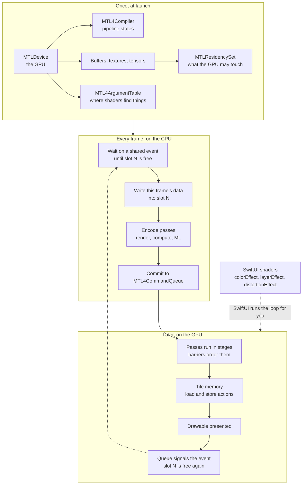
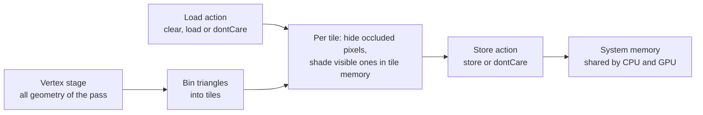

[← Learning hub](README.md)

# Day 6 · Metal 4: how the GPU really works

> By tonight you'll understand why the GPU runs a frame behind your code, why Apple GPUs care so much about memory traffic, what Metal 4 makes *your* job (residency, bindings, ordering), and how to go from a SwiftUI shader to your own Metal 4 render pass.  **Time:** ~6–8 hours.

Most iOS developers never write a line of Metal, and that's fine. SwiftUI, Core Animation, Core Image and RealityKit all run on Metal for you. But a senior knows how the machine underneath works. That's how they know why a blur is expensive, why the first appearance of a screen hitches, and why a shader that looks right in the Simulator flickers on a phone. Today builds that model, and then you use it: one small, real Metal 4 renderer and one SwiftUI shader, for Errand's progress ring.

## Today's map



## Mental models

### 1. The CPU writes instructions; the GPU runs them later

**Your Swift code never draws anything. It records commands that the GPU runs later, asynchronously.**

When you call `drawPrimitives(...)`, nothing is drawn. You're appending a command to a *command buffer*, a recording. When you commit the command buffer to a *command queue*, the GPU picks it up and runs it while your CPU code has already moved on, often to the next frame. The two processors are like a restaurant's front and back of house: the waiter (CPU) writes orders, the kitchen (GPU) cooks them, and neither waits for the other unless you make them.

This one fact explains most Metal bugs. If the CPU writes to a buffer the GPU is still reading, you get flicker. If the CPU reads a result "right after" committing, it reads stale data. If you free an object the GPU still needs, it faults. Metal's whole API (command buffers, events, barriers) exists to describe *when* things happen on two clocks.

**Senior tell:** for every piece of GPU data they ask "which frame is this for, and who's allowed to touch it right now?"

### 2. A frame is a three-slot conveyor belt

**Keep three frames in flight, and give each one its own copy of anything the CPU writes.**

Apple's Metal 4 "Hello Triangle" sample describes the steady state like this: one frame is on the display, the GPU is rendering the next, and the CPU is encoding the one after that.

| Time → | t1 | t2 | t3 | t4 |
|---|---|---|---|---|
| Display shows | – | frame 1 | frame 2 | frame 3 |
| GPU renders | frame 1 | frame 2 | frame 3 | frame 4 |
| CPU encodes | frame 2 | frame 3 | frame 4 | frame 5 |

So any resource the CPU writes every frame (uniforms, vertex data, and in Metal 4 the *command allocator* that stores encoded commands) needs three copies, used in rotation. Before reusing slot N, the CPU waits until the GPU has finished the frame that last used it. Metal 4's sample does this with an `MTLSharedEvent`: the queue signals the frame number when the GPU finishes, and the CPU calls `wait(untilSignaledValue:timeoutMS:)` before reusing the slot.

Why three and not two or ten? Two leaves the CPU idle whenever the GPU runs long. More than three adds a frame of latency between a touch and the pixels that respond to it, and costs memory. Three is the usual compromise.

**Senior tell:** they list every per-frame resource and check that each has exactly `framesInFlight` copies and a wait before reuse.

### 3. Apple GPUs render in tiles, and memory traffic is the real cost

**On Apple GPUs, the cheapest byte is the one that never leaves the chip.**

Apple silicon GPUs are *tile-based deferred renderers* (TBDR). The GPU splits the render target into small tiles, first works out all the geometry that touches each tile, removes hidden surfaces, and only then runs fragment shaders for visible pixels. Those pixels live in *tile memory*, a small, fast store on the GPU. Apple's TBDR article says tile memory has many times the bandwidth and many times lower latency than device memory, and uses significantly less energy.



Three practical rules fall out of this:

- **Load and store actions are bandwidth decisions.** `MTLLoadAction.load` copies the old image from memory into tile memory at the start of a pass; `.clear` just fills tiles with a color; `.dontCare` does nothing. `MTLStoreAction.store` writes the tile back; `.dontCare` throws it away. Loading or storing what you don't need is pure wasted bandwidth.
- **Memoryless textures are free.** A depth buffer or multisample buffer you never read after the pass can use `MTLStorageMode.memoryless`: it exists only in tile memory, and never gets system memory at all. On an `MTKView`, that's one line: `view.depthStencilStorageMode = .memoryless`.
- **Unified memory means no copies, not no synchronization.** Apple GPUs have a unified memory model: CPU and GPU share system memory. A `.shared` buffer written by the CPU is visible to the GPU without an upload. But "same memory" doesn't mean "safe at the same time". Model 2 still applies.

**Senior tell:** the first question about a slow pass is "what does it load and store, and at what resolution?", not "how many triangles?"

### 4. Pipelines are compiled programs with the state baked in

**A pipeline state object is your shaders *plus* fixed decisions, compiled into GPU machine code ahead of time.**

A render pipeline state bundles a vertex function, a fragment function, the pixel format of each output, blending and more. The GPU driver compiles all of that into one executable. That's expensive, and Apple's compilation guide warns it can take an unpredictable amount of time. It's why "the first time this screen appears, it hitches" is a classic Metal bug. Changing a baked-in property (like the output pixel format) means a different pipeline.

Metal 4 gives compilation its own object, `MTL4Compiler`, so you decide *when* and *at what priority* compilation runs. Apple's compilation guide suggests synchronous calls for prototypes and asynchronous ones for larger apps, and describes three ways to compile less: *unspecialized* pipelines you specialize later without recompiling the shader body, *color attachment mapping* so one pipeline works with differently laid-out render passes, and *harvesting* compiled pipelines into archives you ship with the app. Function constants (`MTLFunctionConstantValues`) still let one shader source produce specialized variants.

**Senior tell:** there is no pipeline creation anywhere in their draw loop, and they can say which pipelines are compiled at launch and which are compiled lazily.

### 5. In Metal 4, you are the driver

**Metal 4 stops guessing. You declare what's resident, where shaders find resources, and what must finish before what.**

Earlier Metal did a lot of bookkeeping for you. It tracked which passes wrote which textures and inserted waits (hazard tracking), made resources resident when you bound them, and kept them alive while command buffers used them. That bookkeeping costs CPU time on every call. Metal 4, which Apple also designed to make porting from DirectX and Vulkan easier, moves it to you:

| Concern | Before Metal 4 | Metal 4 |
|---|---|---|
| Is the resource in GPU-accessible memory? | Implicit when bound, or `useResource` | You add it to an `MTLResidencySet` and attach the set to the queue or command buffer |
| Where does the shader find buffer 0? | `setVertexBuffer`, `setFragmentTexture` on each encoder | An `MTL4ArgumentTable` you fill once and reuse |
| Does pass B wait for pass A's writes? | Automatic for tracked resources | "The framework considers all resources untracked." You add barriers, fences or events |
| Is the resource kept alive? | Command buffers retained it | `MTL4CommandBuffer` doesn't retain resources. You keep references until the GPU is done |

The reward is lower CPU overhead and more predictable frames. The price is that a forgotten residency entry or barrier doesn't produce a compile error. It produces a black screen, a GPU fault, or a flicker that only shows on some devices.

**Senior tell:** when a Metal 4 frame looks wrong, they check in this order: validation errors, residency, barriers, lifetimes.

### 6. The GPU timeline now includes machine learning

**In Metal 4, a model can run between your compute pass and your render pass without the CPU in the middle.**

Before Metal 4, using a Core ML model inside a rendering loop usually meant: GPU renders, CPU waits, CPU runs the model, CPU hands the result back, GPU continues. Each round trip could easily cost a frame. Metal 4 adds a *machine learning pass*. You convert a Core ML model into a Metal package with the `metal-package-builder` tool in Xcode, compile it into an `MTL4MachineLearningPipelineState`, and encode it with an `MTL4MachineLearningCommandEncoder` in the same command buffer as your other work. Inputs and outputs are `MTLTensor`s, a new resource type for multidimensional arrays. The system chooses whether each model runs on the GPU or the Neural Engine. When it picks the Neural Engine, the GPU is free to run other work at the same time.

Metal Shading Language (MSL) 4 also has tensor types and operations (matrix multiply, convolution, reduction) you can call inline from any shader stage. On iOS 27, the new Core AI framework can also encode inference onto a Metal command queue you provide, through `ComputeStream(commandQueue:)`. Day 5 covers Core AI itself.

**Senior tell:** they keep data on the GPU from capture to display, and treat every CPU readback inside a frame as a bug to justify.

### 7. Choose the highest layer that can do the job

**Start with SwiftUI shaders; go down a layer only when you need something the layer above can't give you.**

| You need | Use | Why |
|---|---|---|
| A per-pixel effect on a SwiftUI view: tint, ripple, wave, custom fill | SwiftUI shaders (`[[stitchable]]` + `colorEffect`, `layerEffect`, `distortionEffect`, or `Shader` as a `ShapeStyle`) | SwiftUI owns the render loop, layout, animation and accessibility. You write one MSL function |
| Filters on photos or video frames, chained | Core Image | Many built-in filters you chain, plus custom kernels |
| 3D content, AR, physics, spatial scenes | RealityKit | Scene graph, materials, lighting, and anchoring are done for you |
| Your own geometry, several passes, compute, full control of the frame | Metal in an `MTKView` or `CAMetalLayer` | You own the frame loop |
| Standard GPU math (image kernels, matrix ops) without writing it | Metal Performance Shaders, MPS Graph | Tuned per GPU family |

Metal 4 is how you go *deep*, not how you start. Many shipping apps never need more than SwiftUI shaders.

**Senior tell:** before writing a renderer, they prototype the look as a `[[stitchable]]` function, and only port to Metal when a real constraint forces it.

## The APIs that matter

| API | What it's for | Since | Link |
|---|---|---|---|
| **Everyday** | | | |
| `Shader`, `ShaderLibrary` | Reference an MSL `[[stitchable]]` function from SwiftUI, with arguments | iOS 17.0 | [docs](https://developer.apple.com/documentation/swiftui/shader) |
| `colorEffect(_:isEnabled:)` | Per-pixel color change on a view | iOS 17.0 | [docs](https://developer.apple.com/documentation/swiftui/view/coloreffect(_:isenabled:)) |
| `layerEffect(_:maxSampleOffset:isEnabled:)` | Sample the view's rasterized layer (blur, pixelate, ripple) | iOS 17.0 | [docs](https://developer.apple.com/documentation/swiftui/view/layereffect(_:maxsampleoffset:isenabled:)) |
| `distortionEffect(_:maxSampleOffset:isEnabled:)` | Move pixels (waves, bulges) | iOS 17.0 | [docs](https://developer.apple.com/documentation/swiftui/view/distortioneffect(_:maxsampleoffset:isenabled:)) |
| `Shader.compile(as:)` | Precompile a SwiftUI shader so first use doesn't stall | iOS 18.0 | [docs](https://developer.apple.com/documentation/swiftui/shader/compile(as:)) |
| `TimelineView` + `.animation(minimumInterval:paused:)` | Redraw every frame to feed time into a shader | iOS 15.0 | [docs](https://developer.apple.com/documentation/swiftui/timelineview) |
| `MTKView`, `MTKViewDelegate` | A view that owns drawables and calls `draw(in:)` each frame | iOS 9.0 | [docs](https://developer.apple.com/documentation/metalkit/mtkview) |
| `MTKView.currentMTL4RenderPassDescriptor` | A ready-made Metal 4 render pass for the current drawable | iOS 26.0 | [docs](https://developer.apple.com/documentation/metalkit/mtkview/currentmtl4renderpassdescriptor) |
| `MTLCreateSystemDefaultDevice()` | Get the GPU | iOS 8.0 | [docs](https://developer.apple.com/documentation/metal/mtlcreatesystemdefaultdevice()) |
| `supportsFamily(_:)` with `MTLGPUFamily.metal4` | Check Metal 4 support at runtime | iOS 13.0 / 26.0 | [docs](https://developer.apple.com/documentation/metal/mtlgpufamily/metal4) |
| **Intermediate** | | | |
| `MTL4CommandQueue` | Submit command buffers, wait for and signal drawables and events | iOS 26.0 | [docs](https://developer.apple.com/documentation/metal/mtl4commandqueue) |
| `MTL4CommandBuffer` | A reusable recording of GPU work; made by the device, not the queue | iOS 26.0 | [docs](https://developer.apple.com/documentation/metal/mtl4commandbuffer) |
| `MTL4CommandAllocator` | Memory for encoded commands; one per frame in flight | iOS 26.0 | [docs](https://developer.apple.com/documentation/metal/mtl4commandallocator) |
| `MTL4RenderCommandEncoder` | Encode a render pass | iOS 26.0 | [docs](https://developer.apple.com/documentation/metal/mtl4rendercommandencoder) |
| `MTL4ComputeCommandEncoder` | Compute dispatches, copies (blits) and acceleration-structure builds in one encoder | iOS 26.0 | [docs](https://developer.apple.com/documentation/metal/mtl4computecommandencoder) |
| `MTL4ArgumentTable` | Resource bindings (addresses, textures, samplers) shared across encoders | iOS 26.0 | [docs](https://developer.apple.com/documentation/metal/mtl4argumenttable) |
| `MTLResidencySet` | Declare which allocations the GPU may access | iOS 18.0 | [docs](https://developer.apple.com/documentation/metal/mtlresidencyset) |
| `MTLSharedEvent` | CPU–GPU synchronization; frame pacing | iOS 12.0 | [docs](https://developer.apple.com/documentation/metal/mtlsharedevent) |
| `MTL4Compiler` | Compile libraries and pipeline states, sync or async | iOS 26.0 | [docs](https://developer.apple.com/documentation/metal/mtl4compiler) |
| `MTL4RenderPipelineDescriptor`, `MTL4LibraryFunctionDescriptor` | Describe what to compile | iOS 26.0 | [docs](https://developer.apple.com/documentation/metal/mtl4renderpipelinedescriptor) |
| `CAMetalLayer` | The Core Animation layer behind every Metal view | iOS 8.0 | [docs](https://developer.apple.com/documentation/quartzcore/cametallayer) |
| `MTLCaptureManager` | Trigger a GPU frame capture from code | iOS 11.0 | [docs](https://developer.apple.com/documentation/metal/mtlcapturemanager) |
| **Advanced** | | | |
| `barrier(afterQueueStages:beforeStages:visibilityOptions:)` | Consumer barrier: this and later passes wait for earlier stages | iOS 26.0 | [docs](https://developer.apple.com/documentation/metal/mtl4commandencoder/barrier(afterqueuestages:beforestages:visibilityoptions:)) |
| `MTLFence`, `updateFence(_:afterEncoderStages:)` | Order two specific passes | iOS 10.0 / 26.0 | [docs](https://developer.apple.com/documentation/metal/mtlfence) |
| `MTL4MachineLearningCommandEncoder` | Run a Core ML model as a pass on the GPU timeline | iOS 26.0 | [docs](https://developer.apple.com/documentation/metal/mtl4machinelearningcommandencoder) |
| `MTLTensor` | Multidimensional ML data as a Metal resource | iOS 26.0 | [docs](https://developer.apple.com/documentation/metal/mtltensor) |
| `makeRenderPipelineStateBySpecialization(descriptor:pipeline:)` | Finish an unspecialized pipeline without recompiling it | iOS 26.0 | [docs](https://developer.apple.com/documentation/metal/mtl4compiler/makerenderpipelinestatebyspecialization(descriptor:pipeline:)-2636j) |
| `MTL4Archive`, `MTL4PipelineDataSetSerializer` | Ship precompiled pipelines; harvest what you compile | iOS 26.0 | [docs](https://developer.apple.com/documentation/metal/mtl4archive) |
| `MTLTextureViewPool` | Cheap texture views with contiguous resource IDs | iOS 26.0 | [docs](https://developer.apple.com/documentation/metal/mtltextureviewpool) |
| `MTL4FXSpatialScaler`, `MTL4FXTemporalScaler` | MetalFX upscaling encoded into Metal 4 command buffers | iOS 26.0 | [docs](https://developer.apple.com/documentation/metalfx) |
| `MTL4FXFrameInterpolator` | MetalFX frame interpolation: generate an extra frame between two | iOS 26.0 | [docs](https://developer.apple.com/documentation/metalfx/mtl4fxframeinterpolator) |
| `MTL4PrimitiveAccelerationStructureDescriptor` | Describe geometry for ray-tracing acceleration structures | iOS 26.0 | [docs](https://developer.apple.com/documentation/metal/mtl4primitiveaccelerationstructuredescriptor) |
| `MTLLogState` | Capture `os_log` messages printed by shaders | iOS 18.0 | [docs](https://developer.apple.com/documentation/metal/mtllogstate) |
| `CAMetalLayer.wantsExtendedDynamicRangeContent` | Opt a layer into HDR (EDR) values above 1.0 | iOS 16.0 | [docs](https://developer.apple.com/documentation/quartzcore/cametallayer/wantsextendeddynamicrangecontent) |

## Core patterns in code

The code below builds Errand's progress ring twice: first as a SwiftUI shader, then as a Metal 4 render pass. The last block shows how compute, machine learning and rendering chain on one GPU timeline.

**1. A `[[stitchable]]` MSL function that draws the ring.** Put it in any `.metal` file in the app target; Xcode compiles it into the default library.

```metal
#include <metal_stdlib>
using namespace metal;

// A ShapeStyle shader: SwiftUI calls it once per pixel of the shape it fills.
// `position` is in points, in the shape's coordinate space (y points down).
[[ stitchable ]] half4 errandRing(float2 position, float4 bounds,
                                  float progress, float time, half4 tint) {
    float2 p = position - (bounds.xy + bounds.zw * 0.5);      // from the center
    float radius = min(bounds.z, bounds.w) * 0.5;
    float halfWidth = radius * 0.09;

    // 1 inside the ring's band, 0 outside, with a one-point soft edge.
    float d = abs(length(p) - (radius - halfWidth));
    float band = 1.0 - smoothstep(halfWidth - 1.0, halfWidth, d);

    // How far around the ring this pixel is: 0 at 12 o'clock, clockwise to 1.
    float turn = fract(atan2(p.x, -p.y) / (2.0 * M_PI_F) + 1.0);
    float filled = step(turn, progress);

    // A soft highlight that travels along the filled arc.
    float glow = 0.85 + 0.15 * sin(turn * 12.0 - time * 3.0);

    half3 track = half3(0.55h);
    half3 rgb = mix(track, tint.rgb * half(glow), half3(half(filled)));
    half alpha = half(band) * (0.25h + 0.75h * half(filled));
    return half4(rgb * alpha, alpha);                           // premultiplied
}
```

- The signature is the contract. A `ShapeStyle` shader takes `float2 position` first and returns premultiplied `half4`. `colorEffect` adds a `half4 color` parameter, `layerEffect` takes a `SwiftUI::Layer` (from `<SwiftUI/SwiftUI.h>`), and `distortionEffect` returns a `float2` source position.
- The ring is a *signed distance* test: each pixel asks "how far am I from the ring's centerline?" There's no geometry at all, which is why the same math ports straight to a Metal fragment shader later.
- `half` is 16-bit float. Use it for colors; it's cheaper on Apple GPUs. Keep positions in `float`.

**2. The SwiftUI view that drives it.** SwiftUI calls the shader; you supply arguments and time.

```swift
import SwiftUI

struct ErrandProgressRing: View, Animatable {
    var progress: Double                                   // 0...1
    var tint: Color = .accentColor
    @Environment(\.accessibilityReduceMotion) private var reduceMotion

    // Animatable isn't main-actor isolated, but View is; hence `nonisolated`.
    nonisolated var animatableData: Double {
        get { progress }
        set { progress = newValue }
    }

    var body: some View {
        TimelineView(.animation(paused: reduceMotion)) { context in
            // Wrap time so it stays precise as a 32-bit float in the shader.
            let time = context.date.timeIntervalSinceReferenceDate
                .truncatingRemainder(dividingBy: 600)
            Rectangle().fill(ShaderLibrary.errandRing(
                .boundingRect, .float(progress), .float(reduceMotion ? 0 : time), .color(tint)))
        }
        .aspectRatio(1, contentMode: .fit)
        .accessibilityElement()
        .accessibilityLabel("Errand progress")
        .accessibilityValue("\(Int((progress * 100).rounded())) percent")
        .task {   // compile before first use instead of hitching on it
            try? await ShaderLibrary.errandRing(.boundingRect, .float(0), .float(0),
                                                .color(tint)).compile(as: .shapeStyle)
        }
    }
}
```

- `ShaderLibrary.errandRing(...)` is dynamic member lookup plus `@dynamicCallable`: the name must match the MSL function exactly, and the Swift compiler can't catch a typo.
- Conforming to `Animatable` makes `withAnimation { ring.progress = 0.8 }` interpolate the value frame by frame. Shader arguments don't animate by themselves.
- A shader is invisible to VoiceOver. The label and value make the ring an accessible element, and Reduce Motion pauses the timeline.

**3. The Metal 4 renderer's long-lived objects.** Everything here is created once. This follows Apple's "Drawing a triangle with Metal 4" sample, in Swift.

```swift
import MetalKit

@MainActor
final class RingRenderer: NSObject, MTKViewDelegate {
    static let framesInFlight = 3
    private let queue: any MTL4CommandQueue
    private let commandBuffer: any MTL4CommandBuffer        // reused every frame
    private let allocators: [any MTL4CommandAllocator]      // one per frame in flight
    private let uniforms: [any MTLBuffer]                   // one per frame in flight
    private let table: any MTL4ArgumentTable
    private let frameDone: any MTLSharedEvent
    private var pipeline: (any MTLRenderPipelineState)?
    private var frame: UInt64 = 0
    var progress: Float = 0

    init?(view: MTKView) {
        let n = Self.framesInFlight
        let tableDescriptor = MTL4ArgumentTableDescriptor()
        tableDescriptor.maxBufferBindCount = 1               // only as many slots as you use
        guard let device = view.device, device.supportsFamily(.metal4),
              let queue = device.makeMTL4CommandQueue(),
              let commandBuffer = device.makeCommandBuffer(),
              let frameDone = device.makeSharedEvent(),
              let table = try? device.makeArgumentTable(descriptor: tableDescriptor),
              let resident = try? device.makeResidencySet(descriptor: MTLResidencySetDescriptor())
        else { return nil }
        let allocators = (0..<n).compactMap { _ in device.makeCommandAllocator() }
        let uniforms = (0..<n).compactMap { _ in
            device.makeBuffer(length: MemoryLayout<RingUniforms>.stride, options: .storageModeShared) }
        guard allocators.count == n, uniforms.count == n else { return nil }

        uniforms.forEach { resident.addAllocation($0) }
        resident.commit()                                    // staged changes apply only now
        queue.addResidencySet(resident)                      // our buffers
        queue.addResidencySet(view.residencySet)             // textures MetalKit creates
        if let layer = view.layer as? CAMetalLayer { queue.addResidencySet(layer.residencySet) }

        self.queue = queue; self.commandBuffer = commandBuffer; self.table = table
        self.allocators = allocators; self.uniforms = uniforms; self.frameDone = frameDone
        super.init()
        let format = view.colorPixelFormat
        Task { [weak self] in                                // compile off the main thread
            self?.pipeline = try? await RingRenderer.makePipeline(device: device, pixelFormat: format)
        }
    }
}
```

- The command *buffer* comes from the device, not the queue, and is reused forever. The *allocators* are what need a copy per frame in flight.
- Residency is declared once, on the queue, for everything the renderer owns. Apple's `MTKView.residencySet` docs say to add both the view's set and its `CAMetalLayer`'s set, so the drawable textures are resident too.
- `init?` returns `nil` on devices without `MTLGPUFamily.metal4`. That's your signal to show the SwiftUI shader version instead.

**4. Compiling the pipeline with `MTL4Compiler`.** Pixel format is baked in, which is why the renderer passes the view's format.

```swift
enum RingError: Error { case noShaderLibrary }

extension RingRenderer {
    /// Builds the render pipeline once, off the main thread. Never call this per frame.
    nonisolated static func makePipeline(device: any MTLDevice, pixelFormat: MTLPixelFormat)
        async throws -> any MTLRenderPipelineState {
        guard let library = device.makeDefaultLibrary() else { throw RingError.noShaderLibrary }

        let vertexFunction = MTL4LibraryFunctionDescriptor()
        vertexFunction.name = "ringVertex"
        vertexFunction.library = library
        let fragmentFunction = MTL4LibraryFunctionDescriptor()
        fragmentFunction.name = "ringFragment"
        fragmentFunction.library = library

        let descriptor = MTL4RenderPipelineDescriptor()
        descriptor.label = "Errand ring"
        descriptor.vertexFunctionDescriptor = vertexFunction
        descriptor.fragmentFunctionDescriptor = fragmentFunction
        descriptor.colorAttachments[0].pixelFormat = pixelFormat   // baked into the pipeline

        let compiler = try device.makeCompiler(descriptor: MTL4CompilerDescriptor())
        return try await compiler.makeRenderPipelineState(descriptor: descriptor)
    }
}
```

- `MTL4Compiler` has synchronous and `async` versions of each factory method. Inside an `async` function, `try await` picks the asynchronous one, so the main thread keeps scrolling while the GPU code compiles.
- Functions are named by *descriptor* (`MTL4LibraryFunctionDescriptor`) rather than by fetching `MTLFunction` objects. That indirection is what lets Metal 4 specialize and harvest pipelines later.
- In a real app, create one compiler and keep it. It's `Sendable`, so it's safe to share across tasks.

**5. The frame loop.** This is the conveyor belt from mental model 2, line by line.

```swift
struct RingUniforms { var resolution: SIMD2<Float>; var progress: Float; var time: Float }  // 16 bytes, like MSL

extension RingRenderer {
    func draw(in view: MTKView) {
        guard let pipeline, let drawable = view.currentDrawable,
              let pass = view.currentMTL4RenderPassDescriptor else { return }
        let n = UInt64(Self.framesInFlight)
        // Before reusing a slot, wait until the GPU has finished the frame that last used it.
        if frame + 1 > n, !frameDone.wait(untilSignaledValue: frame + 1 - n, timeoutMS: 10) { return }
        frame += 1
        let slot = Int(frame % n)

        let size = view.drawableSize
        let time = Float(CACurrentMediaTime().truncatingRemainder(dividingBy: 600))
        uniforms[slot].contents().storeBytes(
            of: RingUniforms(resolution: [Float(size.width), Float(size.height)],
                             progress: progress, time: time), as: RingUniforms.self)
        table.setAddress(uniforms[slot].gpuAddress, index: 0)

        allocators[slot].reset()                             // safe: the GPU is done with it
        commandBuffer.beginCommandBuffer(allocator: allocators[slot])
        if let encoder = commandBuffer.makeRenderCommandEncoder(descriptor: pass) {
            encoder.label = "Errand ring"                    // shows up in the Metal debugger
            encoder.setRenderPipelineState(pipeline)
            encoder.setArgumentTable(table, stages: .fragment)
            encoder.drawPrimitives(primitiveType: .triangle, vertexStart: 0, vertexCount: 3)
            encoder.endEncoding()
        }
        commandBuffer.endCommandBuffer()

        queue.waitForDrawable(drawable)       // GPU waits until the display releases it
        queue.commit([commandBuffer])
        queue.signalDrawable(drawable)        // GPU marks rendering into it as done
        drawable.present()
        queue.signalEvent(frameDone, value: frame)          // "this frame's slot is free again"
    }

    func mtkView(_ view: MTKView, drawableSizeWillChange size: CGSize) {}
}
```

- `setArgumentTable` doesn't copy anything yet. Metal takes a *snapshot* of the table when you encode the draw, so you can point slot 0 at a different buffer next frame without disturbing this one.
- The wait-for-drawable and signal-drawable calls are *queue* operations on the GPU timeline. The CPU doesn't block on them. The only CPU wait is the shared event, and ideally it returns at once.
- The render pass descriptor from `MTKView` is built from the view's clear values, so the color attachment is cleared at the start rather than loaded, and the result is stored for the display. Those are the load and store actions from mental model 3.

**6. The shaders for the render pass.** It's the same ring math as block 1, now in a fragment function with a full-screen triangle.

```metal
#include <metal_stdlib>
using namespace metal;

struct RingUniforms { float2 resolution; float progress; float time; };   // 16 bytes
struct VertexOut { float4 position [[position]]; float2 uv; };

// One oversized triangle covers the screen, so there's no vertex buffer at all.
vertex VertexOut ringVertex(uint vid [[vertex_id]]) {
    float2 uv = float2(float((vid << 1) & 2), float(vid & 2));   // (0,0) (2,0) (0,2)
    VertexOut out;
    out.position = float4(uv * 2.0 - 1.0, 0.0, 1.0);
    out.uv = float2(uv.x, 1.0 - uv.y);                          // y down, like SwiftUI
    return out;
}

fragment half4 ringFragment(VertexOut in [[stage_in]],
                            constant RingUniforms& u [[buffer(0)]]) {
    float2 p = (in.uv - 0.5) * u.resolution;                    // pixels from the center
    float radius = min(u.resolution.x, u.resolution.y) * 0.5;
    float halfWidth = radius * 0.09;
    float band = 1.0 - smoothstep(halfWidth - 1.0, halfWidth,
                                  abs(length(p) - (radius - halfWidth)));
    float turn = fract(atan2(p.x, -p.y) / (2.0 * M_PI_F) + 1.0);
    float filled = step(turn, u.progress);
    float glow = 0.85 + 0.15 * sin(turn * 12.0 - u.time * 3.0);
    half3 rgb = mix(half3(0.55h), half3(0.2h, 0.5h, 1.0h) * half(glow), half3(half(filled)));
    half alpha = half(band) * (0.25h + 0.75h * half(filled));
    return half4(rgb * alpha, alpha);                            // premultiplied
}
```

- `[[buffer(0)]]` refers to argument table slot 0, which the Swift side filled with `setAddress(_:index:)`. Swift and MSL structs must match byte for byte. Keep them small and ordered largest-first to avoid padding surprises.
- The vertex shader makes positions from `[[vertex_id]]`. Three vertices produce one triangle bigger than the screen, and the rasterizer clips it. That's the standard way to run a fragment shader over every pixel.
- In a real project, share one header between the two shaders so the ring math lives in one place.

**7. Compute, then ML, then render, in one command buffer.** This is the Metal 4 idea of one GPU timeline: no CPU waits between steps, only barriers.

```swift
/// A camera-stylizing frame: a kernel prepares the model input, the model runs, a pass draws it.
struct StylizePasses {
    let prep: any MTLComputePipelineState             // kernel: camera texture -> input tensor
    let prepTable: any MTL4ArgumentTable              // setTexture / setResource(_:bufferIndex:)
    let model: any MTL4MachineLearningPipelineState   // compiled from a .mtlpackage
    let modelTable: any MTL4ArgumentTable             // input and output tensors
    let scratch: any MTLHeap                          // .placement heap, intermediatesHeapSize bytes
    let show: any MTLRenderPipelineState              // fragment shader reads the output tensor
    let showTable: any MTL4ArgumentTable

    func encode(into cb: any MTL4CommandBuffer, pass: MTL4RenderPassDescriptor, grid: MTLSize) {
        guard let compute = cb.makeComputeCommandEncoder() else { return }
        compute.setComputePipelineState(prep)
        compute.setArgumentTable(prepTable)
        let w = prep.threadExecutionWidth                         // the SIMD-group width
        compute.dispatchThreads(threadsPerGrid: grid, threadsPerThreadgroup:
            MTLSize(width: w, height: prep.maxTotalThreadsPerThreadgroup / w, depth: 1))
        compute.endEncoding()

        guard let ml = cb.makeMachineLearningCommandEncoder() else { return }
        ml.barrier(afterQueueStages: .dispatch, beforeStages: .machineLearning)
        ml.setPipelineState(model)
        ml.setArgumentTable(modelTable)
        ml.dispatchNetwork(intermediatesHeap: scratch)
        ml.endEncoding()

        guard let render = cb.makeRenderCommandEncoder(descriptor: pass) else { return }
        render.barrier(afterQueueStages: .machineLearning, beforeStages: .fragment)
        render.setRenderPipelineState(show)
        render.setArgumentTable(showTable, stages: .fragment)
        render.drawPrimitives(primitiveType: .triangle, vertexStart: 0, vertexCount: 3)
        render.endEncoding()
    }
}
```

- Each barrier is a *consumer* barrier placed as late as possible: "don't start my ML stage until earlier dispatch stages finish", and "don't start my fragment stage until earlier ML work finishes". Without them, the three passes may overlap and read half-written data.
- Threadgroup size is the width of a SIMD group (the threads that run in lockstep) times as many rows as fit. `dispatchThreads` lets Metal trim the edge threadgroups, so the kernel needs no bounds check.
- Tensors bind to *buffer* slots by resource ID (`setResource(tensor.gpuResourceID, bufferIndex:)`), which is how Apple's ML sample does it. Everything here (textures, tensors, heap) must also be in a residency set.

## What's new in iOS 27 (and what old tutorials get wrong)

Apple's "Updates" pages don't cover Metal, so these come from the API reference (symbols marked as introduced in iOS 27), the Metal Shading Language 4.1 specification dated June 2026, and the Xcode 27 release notes.

- **Metal Shading Language 4.1** (`MTLLanguageVersion.version4_1`). The spec lists placement `new`, an option to round float-to-float conversions toward zero (exposed as `MTLCompileOptions.floatingPointConversionRoundingMode`), `function_id` in ray intersection results, packed block-scaling types, multiplane tensors and `tensor_blockwise`, interleave and deinterleave, acquire and release memory order on barriers and atomics, and new texture reads (clamp-to-edge, integer coordinates with offsets, multi-pixel reads).
- **Multi-plane tensors for quantized models.** A tensor can now carry an auxiliary `scales` plane next to its data plane: `MTLTensorAuxiliaryPlaneDescriptor`, `MTLTensorPlaneType`, `MTLTensorBufferAttachments`, and `makeTensor(descriptor:attachments:)` to back each plane with your own buffer. New `MTLTensorDataType` cases add 8-bit and 4-bit floats (`metalFloat8e4m3`, `metalFloat8e5m2`, `metalFloat4e2m1`), an 8-bit scale type (`metalFloat8ue8m0`), and 2-bit integers. 4-bit integers arrived in iOS 26.4.
- **Compute pipeline hints.** `MTL4ComputePipelineDescriptor` gains `forwardProgressUsage` (`.automatic`, `.simdGroupParallel`, `.weak`), `contentionRelief` and `optimizeForPersistentKernel`. `MTLComputePipelineState` gains `recommendedPersistentThreadgroupsPerGrid(forThreadsPerThreadgroup:)`. These are for persistent-kernel designs and are only lightly documented so far; leave them at their defaults unless you're profiling that exact case.
- **Three-channel pixel formats** such as `rgb8Unorm`, `rgb16Float` and `rgb32Float`, and a `minLOD` on textures and texture views.
- **MetalFX** frame interpolation can correct barrel distortion (`isDistortionTextureEnabled`) and takes camera matrices and content offsets. The temporal scaler adds `isJitteredMotionVectorsEnabled` and `isOutputResolutionMotionVectorsEnabled`.
- **iOS 26.4 additions you'll use on iOS 27:** `MTKView.residencySet` (used in block 3), `MTLDeviceError`, and `MTLDevice.supportsPlacementSparse`.
- **Core AI** (new in iOS 27) can encode model inference onto your own `MTLCommandQueue` with `ComputeStream(commandQueue:)`. Day 5 covers it.
- **Xcode 27 tooling:** more Metal validation switches in the scheme's Diagnostics panel (including load and store action validation and GPU stack overflow detection), MetalFX metrics in the Metal Performance HUD, and new GPU capture options. Apple's Metal debugger docs also describe `gpudebug`, a command-line trace debugger designed so AI agents can investigate a `.gputrace` on their own.
- **SwiftUI:** Apple's sample "Composing advanced graphics effects with SwiftUI" (WWDC26 session 322) shows how to combine shader effects.

What old tutorials get wrong, now:

- They create a new command buffer from the queue every frame and call `commit()` on it. In Metal 4, the device makes one reusable `MTL4CommandBuffer`, and you commit arrays of them to the queue.
- They bind with `setVertexBuffer`/`setFragmentTexture`. Metal 4 encoders have no binding methods; you use argument tables.
- They rely on Metal to order passes. Metal 4 ignores `hazardTrackingMode` for work on an `MTL4CommandQueue`.
- They pace frames with `DispatchSemaphore(value: 3)` and `addCompletedHandler`. Metal 4's samples use `MTLSharedEvent` and queue-level `signalEvent(_:value:)`.
- They draw with `currentRenderPassDescriptor` and `MTLRenderCommandEncoder`. That's still valid Metal 3 code, but a Metal 4 renderer uses `currentMTL4RenderPassDescriptor` and `MTL4RenderCommandEncoder`, and the two families of types don't mix inside one command buffer.

## Pitfalls you only learn by shipping

- **Animated values flicker or jump** → the CPU overwrote a uniform buffer the GPU was still reading for an earlier frame → one buffer per frame in flight, and wait on the shared event before reusing a slot.
- **Black screen or GPU fault, only in Metal 4** → a resource isn't in any residency set, so the GPU can't touch it. Shader Validation reports "non-resident" accesses → add it with `addAllocation(_:)`, then call `commit()` on the set (staged changes do nothing until you do), and attach the set to the queue. Include the view's and layer's residency sets for drawables.
- **Corruption that shows only on some devices or some frames** → a missing barrier. Metal 4 treats every resource as untracked → add a consumer barrier right before the consuming stage, and run with API Validation on.
- **Random crashes after refactoring resource ownership** → `MTL4CommandBuffer` doesn't retain what it references, so a texture freed on the CPU can still be in use on the GPU → keep strong references in your per-frame slot until its shared event value arrives.
- **Allocator errors or garbage commands** → the command allocator was reset while the GPU still ran commands from it. The command buffer can be reused right after commit; the allocator can't → reset only after the event wait, as in block 5.
- **Hitch the first time a screen with an effect appears** → a pipeline or SwiftUI shader compiled on first use → compile at launch with `MTL4Compiler` (async), call `Shader.compile(as:)` in `.task`, and ship harvested archives for big apps. iOS limits background compilation threads to save energy, so start early.
- **A shader animation stutters more the longer the app runs** → you passed a large time value (for example, seconds since 2001, about 8×10⁸) as a 32-bit float. At that size a `Float` can only step in 64-second increments → wrap time (`truncatingRemainder(dividingBy:)`) before converting.
- **Battery drain from a mostly static visual** → `MTKView` redraws continuously at `preferredFramesPerSecond` → lower the rate, or set `isPaused` and `enableSetNeedsDisplay` to redraw only on change. Pause `TimelineView` when nothing moves, and always under Reduce Motion.
- **A SwiftUI shader shows a placeholder instead of the content** → the effect is on a view backed by UIKit (a map, a web view, an `MTKView`). Apple's docs warn that these may not render into the filtered layer → apply shaders only to SwiftUI-drawn content.
- **Works on a phone, fails in the Simulator (or the reverse)** → the Simulator's GPU offers roughly `MTLGPUFamily.apple2` features → gate Metal 4 with `supportsFamily(.metal4)`, keep a fallback (the SwiftUI shader), and test Metal on a real device.

## Legacy you'll still meet

| Old | New |
|---|---|
| `queue.makeCommandBuffer()` each frame, `commandBuffer.commit()` | `device.makeCommandBuffer()` once, `beginCommandBuffer(allocator:)`, `MTL4CommandQueue.commit(_:options:)` |
| `setVertexBuffer(_:offset:index:)`, `setFragmentTexture(_:index:)` | `MTL4ArgumentTable` + `setArgumentTable(_:stages:)` |
| `useResource(_:usage:)`, `useHeap(_:)` per encoder | `MTLResidencySet` on the queue or command buffer |
| Automatic hazard tracking (`MTLHazardTrackingMode.tracked`) | Barriers, fences and events you encode yourself |
| `MTLBlitCommandEncoder`, `MTLAccelerationStructureCommandEncoder` | `MTL4ComputeCommandEncoder` |
| `MTLParallelRenderCommandEncoder` | Render encoders with `MTL4RenderEncoderOptions` `.suspending` / `.resuming` |
| `device.makeRenderPipelineState(descriptor:)` | `MTL4Compiler.makeRenderPipelineState(descriptor:dynamicLinkingDescriptor:compilerTaskOptions:)` |
| `commandBuffer.present(_:)`, `addCompletedHandler(_:)`, `DispatchSemaphore` pacing | `waitForDrawable`/`signalDrawable` + `present()`, `signalEvent(_:value:)` + `MTLSharedEvent` |
| Tessellation | Mesh shaders (`drawMeshThreadgroups`) |
| OpenGL ES and GLKit (OpenGL ES deprecated since iOS 12) | Metal and MetalKit |

## Practice

1. **Read a frame like a GPU does.** Download Apple's "Drawing a triangle with Metal 4" sample, run it on an iPhone, and capture one frame with the Metal Capture button in Xcode's debug bar.
   *Done when:* you can point to the render pass, its load and store actions, the argument table's two buffer bindings, and the time the pass took on the GPU.

2. **Break it on purpose.** In your ring renderer (or the sample), (a) set `framesInFlight` to 1 and delete the event wait, (b) comment out `resident.commit()`, (c) remove the view's residency sets. Turn on API Validation and Shader Validation in the scheme's Diagnostics tab.
   *Done when:* you have seen each failure, written one sentence per failure explaining it in terms of the mental models, and put everything back.

3. **A compute kernel on a photo.** Write a grayscale kernel (Apple's "Creating threads and threadgroups" article has one), run it with an `MTL4ComputeCommandEncoder` into a second texture, then draw that texture in a render pass with a consumer barrier from `.dispatch` to `.fragment`.
   *Done when:* the grayscale image shows on screen, and in a GPU capture the Dependencies viewer shows the compute pass feeding the render pass, with your barrier highlighted as a synchronization between them.

4. **Profile, don't guess.** Profile the ring with the Game Performance template in Instruments (it includes Metal System Trace), then with the Metal Performance HUD.
   *Done when:* you can state the CPU encode time and GPU time per frame, and whether the ring is CPU-bound, GPU-bound or neither at 120 Hz.

5. **Capstone step: Errand's progress ring (about 1.5 hours).**
   Required: add `ErrandProgressRing` (blocks 1–2) to the errand detail screen and the list rows, driven by your Day 1 model's completed-steps fraction. Animate changes with `withAnimation`. Stretch: add the Metal 4 version (blocks 3–6) behind a debug toggle, hosted in SwiftUI like this:

   ```swift
   struct MetalErrandRing: UIViewRepresentable {
       var progress: Double

       final class Coordinator { var renderer: RingRenderer? }
       func makeCoordinator() -> Coordinator { Coordinator() }

       func makeUIView(context: Context) -> MTKView {
           let view = MTKView(frame: .zero, device: MTLCreateSystemDefaultDevice())
           view.colorPixelFormat = .bgra8Unorm
           view.clearColor = MTLClearColor(red: 0, green: 0, blue: 0, alpha: 0)
           view.isOpaque = false
           view.preferredFramesPerSecond = 30                 // a ring doesn't need 120 Hz
           context.coordinator.renderer = RingRenderer(view: view)
           view.delegate = context.coordinator.renderer       // MTKView holds its delegate weakly
           return view
       }

       func updateUIView(_ view: MTKView, context: Context) {
           context.coordinator.renderer?.progress = Float(progress)
       }
   }
   ```

   *Done when:* completing a step animates the ring smoothly; VoiceOver reads "Errand progress, 60 percent"; the highlight stops moving when Reduce Motion is on; and there are zero validation errors. For the stretch: both rings look the same side by side, a GPU capture shows one render pass labeled "Errand ring" with a clear load action, and on a device without Metal 4 the app shows the SwiftUI ring instead.

## Check yourself

1. You write a new rotation angle into a uniform buffer every frame, and the triangle sometimes jumps backward. What's happening, and what's the fix?
   <details><summary>Answer</summary>The CPU is writing into a buffer that the GPU is still reading for an earlier frame, because the GPU runs up to a couple of frames behind. Keep one buffer per frame in flight, rotate through them, and wait on a shared event (signaled by the queue when a frame completes) before reusing a slot.</details>

2. Why can you reuse an `MTL4CommandBuffer` immediately after committing it, but not its `MTL4CommandAllocator`?
   <details><summary>Answer</summary>The allocator holds the memory the encoded commands live in, and the GPU reads that memory while it runs the work. The command buffer object is just the encoding interface; after commit it can start a new recording with a different allocator. You reset an allocator only after the GPU has finished every command buffer that used it.</details>

3. On an Apple GPU, which is cheaper: a render pass with `.load` and `.store` on a full-screen texture, or one with `.clear` and `.dontCare`? Why?
   <details><summary>Answer</summary>`.clear` and `.dontCare`. Apple GPUs are tile-based: `.load` copies the whole old image from system memory into tile memory, and `.store` writes the whole result back. `.clear` just initializes tile memory, and `.dontCare` skips the write. Memory traffic, not arithmetic, usually dominates cost and energy.</details>

4. Your compute pass writes a texture that the next render pass samples in its fragment shader. In Metal 4, what must you add, and where?
   <details><summary>Answer</summary>A barrier, because Metal 4 treats resources as untracked. Encode a consumer barrier in the render pass, `barrier(afterQueueStages: .dispatch, beforeStages: .fragment)`, as close to the consuming work as possible. Alternatively, put a producer barrier at the end of the compute pass, or use a fence between the two passes.</details>

5. What's in a render pipeline state, and why shouldn't you create one inside `draw(in:)`?
   <details><summary>Answer</summary>Compiled vertex and fragment functions plus fixed state like color attachment pixel formats and blending. Creating it compiles GPU code, which can take many milliseconds and would stall the frame. Create pipelines ahead of time, ideally asynchronously with `MTL4Compiler`, or ship precompiled archives.</details>

6. A designer wants a shimmering highlight on a SwiftUI card. Metal 4 renderer or SwiftUI shader? What would change your answer?
   <details><summary>Answer</summary>A `[[stitchable]]` shader applied with `colorEffect` or `layerEffect`, because SwiftUI keeps layout, animation, accessibility and the frame loop. You'd move to Metal if you needed your own geometry, several dependent passes, compute or ML work feeding the image, or content the shader can't reach (such as UIKit-backed views).</details>

7. What does a Metal 4 machine learning pass buy you compared with running a Core ML model from Swift between frames?
   <details><summary>Answer</summary>The model runs on the GPU timeline inside the same command buffer as your compute and render passes, ordered by barriers, so there's no CPU wait or data round trip in the middle of the frame. Inputs and outputs are `MTLTensor`s that other passes can read directly. The system may run the model on the Neural Engine while the GPU does other work.</details>

8. Your SwiftUI ring's glow stutters after the app has been open a while, but only when you pass `Date.now.timeIntervalSinceReferenceDate`. Why?
   <details><summary>Answer</summary>The shader receives a 32-bit `float`. A value around 8×10⁸ seconds leaves too few bits for fractions, so the float can only change in large steps (64 seconds at that size). Wrap time into a small range before passing it.</details>

## Go deeper

- [Understanding the Metal 4 core API](https://developer.apple.com/documentation/metal/understanding-the-metal-4-core-api): the official tour of queues, allocators, argument tables and barriers.
- [Drawing a triangle with Metal 4](https://developer.apple.com/documentation/metal/drawing-a-triangle-with-metal-4): the sample today's renderer follows.
- [Resource synchronization](https://developer.apple.com/documentation/metal/resource-synchronization): barriers, fences and events, with worked examples for each.
- [Tailor your apps for Apple GPUs and tile-based deferred rendering](https://developer.apple.com/documentation/metal/tailor-your-apps-for-apple-gpus-and-tile-based-deferred-rendering): tile memory, imageblocks, tile shaders.
- [Using the Metal 4 compilation API](https://developer.apple.com/documentation/metal/using-the-metal-4-compilation-api): scheduling, unspecialized pipelines, harvesting.
- [Machine learning passes](https://developer.apple.com/documentation/metal/machine-learning-passes) and [Running inline ML operations in a shader with Metal 4](https://developer.apple.com/documentation/metal/running-inline-ml-operations-in-a-shader-with-metal-4).
- [Metal debugger](https://developer.apple.com/documentation/xcode/metal-debugger) and [Metal developer workflows](https://developer.apple.com/documentation/xcode/metal-developer-workflows): capture, validation, HUD, Instruments.
- [Logging shader debug messages](https://developer.apple.com/documentation/metal/logging-shader-debug-messages): `os_log` from inside a shader.
- [MetalFX](https://developer.apple.com/documentation/metalfx): upscaling and frame interpolation.
- [Metal Shading Language Specification](https://developer.apple.com/metal/Metal-Shading-Language-Specification.pdf) (PDF, version 4.1).

Cheat sheet for today: [Metal 4](cheatsheets/metal4.md).

<details><summary>Verified APIs</summary>

Checked with `scripts/appledoc.py` against Apple's documentation on 2026-09-24. Version = iOS version where Apple's docs say the symbol was introduced.

- `Shader` — iOS 17.0
- `ShaderLibrary`, `ShaderLibrary.default` — iOS 17.0
- `ShaderFunction.dynamicallyCall(withArguments:)` — iOS 17.0
- `Shader.Argument.boundingRect`, `.float(_:)`, `.color(_:)` — iOS 17.0
- `Shader.compile(as:)`, `Shader.UsageType.shapeStyle` — iOS 18.0
- `View.colorEffect(_:isEnabled:)` — iOS 17.0
- `View.layerEffect(_:maxSampleOffset:isEnabled:)` — iOS 17.0
- `View.distortionEffect(_:maxSampleOffset:isEnabled:)` — iOS 17.0
- `Shape.fill(_:style:)` — iOS 17.0
- `TimelineView`, `TimelineView.init(_:content:)` — iOS 15.0
- `TimelineSchedule.animation(minimumInterval:paused:)` — iOS 15.0
- `Animatable`, `Animatable.animatableData` — iOS 13.0
- `EnvironmentValues.accessibilityReduceMotion` — iOS 13.0
- `View.accessibilityElement(children:)` — iOS 13.0
- `View.accessibilityLabel(_:)`, `View.accessibilityValue(_:)` — iOS 16.0
- `UIViewRepresentable`, `makeUIView(context:)`, `updateUIView(_:context:)`, `makeCoordinator()` — iOS 13.0
- `MTKView`, `MTKView.init(frame:device:)`, `delegate`, `device`, `colorPixelFormat`, `clearColor`, `currentDrawable`, `drawableSize`, `preferredFramesPerSecond`, `isPaused`, `enableSetNeedsDisplay`, `depthStencilStorageMode` (iOS 16.0) — iOS 9.0
- `MTKView.currentMTL4RenderPassDescriptor` — iOS 26.0
- `MTKView.residencySet` — iOS 26.4
- `MTKViewDelegate.draw(in:)`, `mtkView(_:drawableSizeWillChange:)` — iOS 9.0
- `CAMetalLayer` — iOS 8.0
- `CAMetalLayer.residencySet` — iOS 26.0
- `CAMetalLayer.wantsExtendedDynamicRangeContent` — iOS 16.0
- `CACurrentMediaTime()` — iOS 2.0
- `MTLDrawable.present()` — iOS 8.0
- `MTLCreateSystemDefaultDevice()` — iOS 8.0
- `MTLDevice.supportsFamily(_:)` — iOS 13.0
- `MTLGPUFamily.metal4` — iOS 26.0
- `MTLDevice.makeMTL4CommandQueue()` — iOS 26.0
- `MTLDevice.makeCommandBuffer()` — iOS 26.0
- `MTLDevice.makeCommandAllocator()` — iOS 26.0
- `MTLDevice.makeArgumentTable(descriptor:)` — iOS 26.0
- `MTLDevice.makeCompiler(descriptor:)` — iOS 26.0
- `MTLDevice.makeResidencySet(descriptor:)` — iOS 18.0
- `MTLDevice.makeSharedEvent()` — iOS 12.0
- `MTLDevice.makeBuffer(length:options:)`, `makeDefaultLibrary()` — iOS 8.0
- `MTLDevice.makeTensor(descriptor:attachments:)` — iOS 27.0
- `MTLDevice.supportsPlacementSparse` — iOS 26.4
- `MTLDeviceError` — iOS 26.4
- `MTL4CommandQueue`, `commit(_:options:)`, `waitForDrawable(_:)`, `signalDrawable(_:)`, `signalEvent(_:value:)`, `addResidencySet(_:)` — iOS 26.0
- `MTL4CommandBuffer`, `beginCommandBuffer(allocator:)`, `endCommandBuffer()`, `makeRenderCommandEncoder(descriptor:options:)`, `makeComputeCommandEncoder()`, `makeMachineLearningCommandEncoder()` — iOS 26.0
- `MTL4CommandAllocator`, `reset()` — iOS 26.0
- `MTL4CommandEncoder.label`, `endEncoding()`, `barrier(afterQueueStages:beforeStages:visibilityOptions:)`, `barrier(afterStages:beforeQueueStages:visibilityOptions:)`, `barrier(afterEncoderStages:beforeEncoderStages:visibilityOptions:)`, `updateFence(_:afterEncoderStages:)`, `waitForFence(_:beforeEncoderStages:)` — iOS 26.0
- `MTL4RenderCommandEncoder`, `setRenderPipelineState(_:)`, `setArgumentTable(_:stages:)`, `drawPrimitives(primitiveType:vertexStart:vertexCount:)` — iOS 26.0
- `MTL4ComputeCommandEncoder`, `setComputePipelineState(_:)`, `setArgumentTable(_:)`, `dispatchThreads(threadsPerGrid:threadsPerThreadgroup:)` — iOS 26.0
- `MTL4MachineLearningCommandEncoder`, `setPipelineState(_:)`, `setArgumentTable(_:)`, `dispatchNetwork(intermediatesHeap:)` — iOS 26.0
- `MTL4MachineLearningPipelineState` — iOS 26.0
- `MTL4ArgumentTable`, `setAddress(_:index:)`, `setResource(_:bufferIndex:)`, `setTexture(_:index:)` — iOS 26.0
- `MTL4ArgumentTableDescriptor.maxBufferBindCount` — iOS 26.0
- `MTLResidencySet`, `addAllocation(_:)`, `commit()` — iOS 18.0
- `MTLResidencySetDescriptor` — iOS 18.0
- `MTLSharedEvent` — iOS 12.0
- `MTLSharedEvent.wait(untilSignaledValue:timeoutMS:)` — iOS 15.0
- `MTLStages` (`.dispatch`, `.machineLearning`, `.fragment`) — iOS 26.0
- `MTLRenderStages` — iOS 10.0
- `MTL4VisibilityOptions.device` — iOS 26.0
- `MTLFence` — iOS 10.0
- `MTL4Compiler`, `makeRenderPipelineState(descriptor:dynamicLinkingDescriptor:compilerTaskOptions:)` (sync and async) — iOS 26.0
- `MTL4Compiler.makeRenderPipelineStateBySpecialization(descriptor:pipeline:)` — iOS 26.0
- `MTL4CompilerDescriptor`, `MTL4RenderPipelineDescriptor`, `MTL4LibraryFunctionDescriptor`, `MTL4PipelineDescriptor.label` — iOS 26.0
- `MTL4RenderPipelineColorAttachmentDescriptor.pixelFormat` — iOS 26.0
- `MTL4Archive`, `MTL4PipelineDataSetSerializer` — iOS 26.0
- `MTLFunctionConstantValues` — iOS 10.0
- `MTLRenderPipelineState`, `MTLComputePipelineState`, `threadExecutionWidth`, `maxTotalThreadsPerThreadgroup` — iOS 8.0
- `MTLBuffer.gpuAddress` — iOS 16.0
- `MTLBuffer.contents()` — iOS 8.0
- `MTLResourceOptions.storageModeShared` — iOS 9.0
- `MTLStorageMode.memoryless` — iOS 10.0
- `MTLLoadAction.clear`, `.load`, `.dontCare`; `MTLStoreAction.store`, `.dontCare` — iOS 8.0
- `MTLPrimitiveType.triangle` — iOS 8.0
- `MTLTensor`, `MTLTensor.gpuResourceID`, `MTLTensorDescriptor` — iOS 26.0
- `MTLTensorAuxiliaryPlaneDescriptor`, `MTLTensorPlaneType`, `MTLTensorBufferAttachments` — iOS 27.0
- `MTLTensorDataType.metalFloat8e4m3`, `.metalFloat8e5m2`, `.metalFloat4e2m1`, `.metalFloat8ue8m0`, `.int2` — iOS 27.0
- `MTLTensorDataType.int4` — iOS 26.4
- `MTL4ComputePipelineDescriptor.forwardProgressUsage`, `.contentionRelief`, `.optimizeForPersistentKernel` — iOS 27.0
- `MTLComputePipelineState.recommendedPersistentThreadgroupsPerGrid(forThreadsPerThreadgroup:)` — iOS 27.0
- `MTLPixelFormat.rgb8Unorm` (and other three-channel formats) — iOS 27.0
- `MTLTexture.minLOD` — iOS 27.0
- `MTLCompileOptions.floatingPointConversionRoundingMode` — iOS 27.0
- `MTLLanguageVersion.version4_1` — iOS 27.0
- `MTLTextureViewPool` — iOS 26.0
- `MTL4PrimitiveAccelerationStructureDescriptor` — iOS 26.0
- `MTLLogState` — iOS 18.0
- `MTLCaptureManager` — iOS 11.0
- `MTL4RenderEncoderOptions` — iOS 26.0
- `MTL4FXSpatialScaler`, `MTL4FXTemporalScaler`, `MTL4FXFrameInterpolator` — iOS 26.0
- `MTLFXFrameInterpolatorDescriptor.isDistortionTextureEnabled`, `MTLFXTemporalScalerDescriptor.isJitteredMotionVectorsEnabled` — iOS 27.0
- `ComputeStream.init(commandQueue:)` (Core AI) — iOS 27.0
- Legacy, for recognition only: `MTLCommandQueue.makeCommandBuffer()` (iOS 8.0), `MTLRenderCommandEncoder.setFragmentTexture(_:index:)` (iOS 8.0), `MTLComputeCommandEncoder.useResource(_:usage:)` (iOS 11.0), `MTLDevice.makeRenderPipelineState(descriptor:)` (iOS 8.0), `MTLCommandBuffer.present(_:)` and `addCompletedHandler(_:)` (iOS 8.0), `MTLParallelRenderCommandEncoder` (iOS 8.0), OpenGL ES (deprecated iOS 12.0)

</details>
