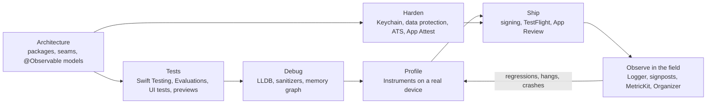
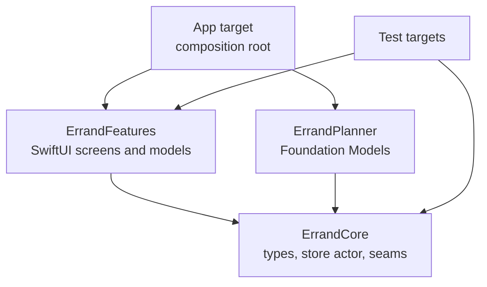
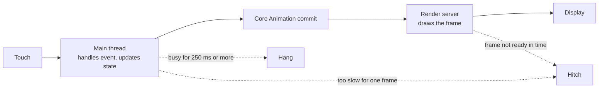
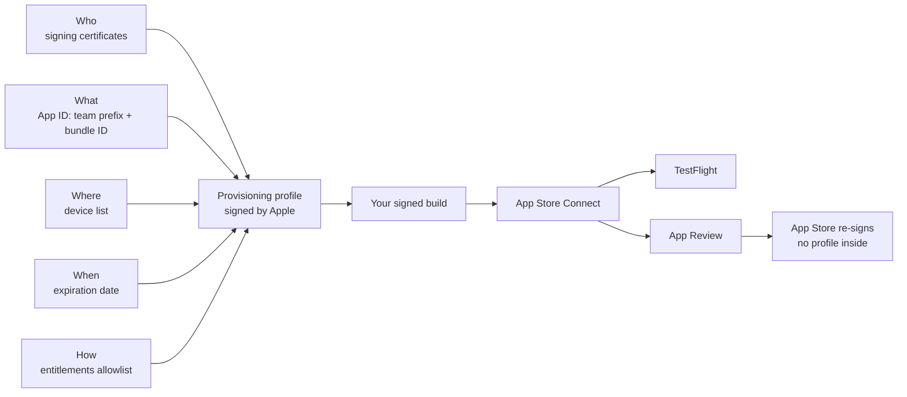

[← Learning hub](README.md)

# Day 7 · Architecture, testing, performance, and shipping
> By tonight you'll know how experienced teams structure, test, profile, watch, secure and ship an iOS 27 app, and which App Review rules catch agentic apps.  **Time:** ~6–8 hours.

## Today's map



Days 1 to 6 taught you what the platform can do. Today is about the work that separates a demo from an app people keep: code that's cheap to change, tests you trust, numbers instead of hunches, and a release process that doesn't surprise you.

## Mental models

### 1. Put seams where side effects live. Everything else is plain Swift.

**Architecture is the answer to one question: where will change hurt?**

In an iOS app, painful changes happen at the edges: the model provider, persistence, the network, permissions, the clock. Put a small protocol (a *seam*) at each edge. Keep the middle as value types, one actor for shared mutable state, and a few `@Observable` models. Views read state and send intent. They don't decide things.

Split the code into **local Swift packages**, one per feature or layer, and keep the app target as a thin *composition root*: the one place that picks real services and wires them together. Apple walks through the package part in [Organizing your code with local packages](https://developer.apple.com/documentation/xcode/organizing-your-code-with-local-packages). You get three things. The compiler enforces boundaries, because only `public` symbols cross a package. Each package builds and tests alone. And pure-logic tests can run on your Mac with `swift test`, without booting a simulator.



**Dependency injection** needs no framework. Pass services into a model's initializer. Hand the model to views with `.environment(model)` and read it with `@Environment(ErrandListModel.self)`. Use `@Entry` for small values such as feature flags. That's the whole system.

**Where logic lives.** Business rules live in plain types and `@Observable` models, because those are what tests can reach. The "no massive view" rule of thumb: if a `body` or a button action contains a `do`/`catch`, a call to a service, or data shaping beyond formatting, move it into the model.

**MVVM, TCA and friends.** An `@Observable` model *is* a view model by another name; you don't need a protocol per view model. Third-party architectures such as The Composable Architecture add a single state tree, reducers and exhaustive state tests. That helps large teams who want every change to flow one way, at the cost of a dependency and a learning curve. Either works. Three styles in one codebase don't.

**Senior tell:** they can point to every place the app touches the outside world, and each one has a protocol and a fake.

### 2. Each kind of test answers a different question.

**Swift Testing checks decisions, Evaluations measure the model, UI tests walk flows, and previews let you look.**

| Question | Tool | Speed | Runs where |
|---|---|---|---|
| Does my logic decide correctly? | Swift Testing (`@Test`, `#expect`) | Milliseconds | Mac or simulator |
| Is the model's output good enough, often enough? | Evaluations framework (iOS 27) | Seconds to minutes | Device or Mac with Apple Intelligence |
| Can a person complete the flow? | XCTest + XCUIAutomation | Seconds per test | Simulator or device |
| Does it look right in every state? | `#Preview` | Instant | Canvas |

**Swift Testing** is the default for new tests. `#expect` records a failure and keeps going. `#require` stops the test by throwing, and also unwraps optionals. `@Test(arguments:)` makes one test case per input. *Traits* add tags, time limits, conditions and serial execution. A suite is just a type, and each test gets a **fresh instance**, so `init` is your setup.

**Tests run in parallel, in one process, by default** ([parallelization](https://developer.apple.com/documentation/testing/parallelization)). Two tests that share a singleton, a `UserDefaults` key or a file can pass alone and fail together. Inject the dependency so each test gets its own. `.serialized` only runs the tests inside one suite one at a time; other suites still run alongside it. For async code, mark the test `async` and `await` the work. For events you can't await, such as callbacks, use `confirmation`: its count is checked **when its closure returns**, so the event must happen before then. `expectedCount: 0` proves something *didn't* happen. **Exit tests** (`#expect(processExitsWith:)`) check that a `precondition` stops the process, but they [don't run on iOS](https://developer.apple.com/documentation/testing/exit-testing), only on macOS, Linux, FreeBSD, OpenBSD and Windows. That's one more reason to keep core logic in a package that builds for macOS.

**Model output is not deterministic**, so don't assert exact text. Test your code with a stub, and measure the real model with the new **Evaluations** framework. An evaluation runs a dataset through your feature, scores each response and aggregates the scores. It runs as a Swift Testing test, and its report appears in the Report navigator ([Evaluating language model responses](https://developer.apple.com/documentation/evaluations/evaluating-language-model-responses)).

**UI tests still use XCTest**, driving the app from a separate process through [XCUIAutomation](https://developer.apple.com/documentation/xcuiautomation). They're slow and brittle, so keep a few for the flows that matter most, and find elements by accessibility identifier.

**Previews are a design tool.** With stub dependencies, every state is one line away: empty, error, 50 items, the largest text size. Xcode 27 adds `#Preview(arguments:)` grids and canvas switches for localization, contrast and control borders.

**Senior tell:** their app has a stub-mode launch argument, and their test target contains no `sleep`.

### 3. Debug by narrowing: stop at the right moment, ask precise questions, let tools catch whole classes of bugs.

**A `print` statement answers one question per build. The debugger answers any question, now.**

**Breakpoints** can do more than pause. Give one a condition (`request.isEmpty`) or an action that logs a value and continues, so you trace without rebuilding. Symbolic breakpoints stop in code you don't own. The Swift error and exception breakpoints stop where a failure starts, not where it lands ([Setting breakpoints](https://developer.apple.com/documentation/xcode/setting-breakpoints-to-pause-your-running-app)).

**Three LLDB commands** cover most sessions ([Stepping through code](https://developer.apple.com/documentation/xcode/stepping-through-code-and-inspecting-variables-to-isolate-bugs)):

| Command | What it does | Use it when |
|---|---|---|
| `v` (`frame variable`) | Reads values straight from memory. Runs no code. | First choice. Fast and safe, but no computed properties or calls. |
| `p` (`expression`) | Compiles and runs an expression. | You need a computed property or a function call. |
| `po` | Runs an expression and prints its object description. | You want the type's own `debugDescription`. |

Since Xcode 15, `p` and `po` are aliases for LLDB's `dwim-print`, which reads a plain variable the way `v` does and compiles code only when the expression needs it. If `p` or `po` fails on a value typed as a protocol, fall back to `v`. The `@DebugDescription` macro turns a type's description into a summary that `v` and Xcode's variables view can show without running code. Xcode 27 adds `language swift task tree`, which prints every Swift task the debugger knows about.

**The view debugger** (Debug View Hierarchy) explodes the screen into 3D layers, so you can see which view is covering or clipping another. **The memory graph** (Debug Memory Graph) shows who holds a reference to what. A retain cycle shows up as objects pointing at each other with nothing else pointing at them.

**Sanitizers** catch bug classes at runtime. Turn them on in the scheme's Diagnostics section or in a test plan ([Diagnosing memory, thread, and crash issues early](https://developer.apple.com/documentation/xcode/diagnosing-memory-thread-and-crash-issues-early)):

| Tool | Finds | Cost and limits |
|---|---|---|
| Address Sanitizer | Memory corruption: out-of-bounds access, use after free | 2–3× memory, 2–5× slower. Doesn't find leaks. |
| Thread Sanitizer | Data races, including in C, Objective-C and `unsafe` code | 5–10× memory, 2–20× slower. Simulator and macOS only, not iOS devices. |
| Main Thread Checker | Main-thread-only APIs called from other threads | About 1–2% CPU. On by default in development schemes. |
| Undefined Behavior Sanitizer | Undefined behavior in C-family code | C languages only. |

Swift 6's strict concurrency catches most races in Swift code at compile time. Thread Sanitizer still earns its place for C, Objective-C, `unsafe` code and third-party binaries.

**Senior tell:** before adding a `print`, they add a breakpoint that logs and continues.

### 4. Performance is a set of budgets: a tap, a frame, a memory ceiling.

**Nearly every performance bug is the main thread doing work it shouldn't, or memory the system takes back.**



Apple's numbers ([Understanding user interface responsiveness](https://developer.apple.com/documentation/xcode/understanding-user-interface-responsiveness), [Understanding hangs](https://developer.apple.com/documentation/xcode/understanding-hangs-in-your-app)):

- A delay under 100 ms after a tap is rarely noticeable. Most Apple tools report a **hang** when the main run loop stays busy for more than 250 ms.
- A **hitch** is motion that stutters because a frame wasn't ready for its screen refresh. The budget is one refresh interval, generally 8 to 16 ms.
- **Fix hangs first.** They're easier to understand, and fixing them removes many hitches too.

**Launch.** A *resume* wakes a process that's still in memory. A *launch* starts one, and a cold launch after eviction is the slowest. If launch takes too long, the watchdog terminates the app ([Reducing your app's launch time](https://developer.apple.com/documentation/xcode/reducing-your-app-s-launch-time)). Do the minimum before the first frame.

**Memory.** iOS counts memory in pages, typically 16 KB, and memory counts once you write to it (*dirty* memory). Exceed the device's limit and the system terminates your app. Under memory pressure it also terminates apps, most often ones in the background. That's a **jetsam** event, and its report has **no backtrace** ([jetsam event reports](https://developer.apple.com/documentation/xcode/identifying-high-memory-use-with-jetsam-event-reports)). Lower memory at suspension means fewer background kills.

**The Instruments loop:** reproduce on a device, choose Product > Profile, pick a template, narrow the time range to the bad moment, read the call tree, change one thing, record again. The CPU call tree has Flame Graph (Xcode 16) and Top Functions (Xcode 26.4) modes, and **Run Comparison** (Xcode 26.4) diffs before and after.

| Question | Instrument or template |
|---|---|
| Where does CPU time go? | Time Profiler |
| Why did the UI freeze? | Hangs, next to Time Profiler |
| Which SwiftUI views update too often, and why? | SwiftUI template (cause-and-effect graph) |
| What did the model see, and what did it cost? | Foundation Models template |
| Where does memory grow? | Allocations (Mark Generation), Leaks, Xcode's memory graph |
| Why is launch slow? | App Launch template |
| What drains the battery? | Power Profiler |
| What is the concurrency runtime doing? | Swift Concurrency, Swift Executors (new in Xcode 27) |

**Senior tell:** they profile on the oldest device they support and trust a Run Comparison over their impression.

### 5. In production you only have what you logged, what the OS measured, and the stack trace.

**You can't attach a debugger to a user's phone. Logs, signposts, MetricKit and the Organizer are your eyes.**

**`Logger`** writes to the unified logging system with a *subsystem* (usually your bundle ID) and a *category* (a feature). Interpolated strings and objects are **redacted by default** (integers, floating-point values and Booleans aren't), and you opt in per value with `privacy: .public`. Keep the default for anything a user typed.

**Signposts** mark intervals ("planning took 1.8 s") that Instruments draws on its timeline. In iOS 27, a signposter built on `MetricManager.logHandle(category:)` also feeds MetricKit, which aggregates those intervals' counts and durations from real devices. For CPU, memory and disk-write figures per interval, Apple's MetricKit article points you to `mxSignpost` instead.

**MetricKit** (around since iOS 13) gets a new API in iOS 27: `MetricManager` delivers daily `MetricReport`s and per-event `DiagnosticReport`s (crash, hang, CPU exception, disk-write exception, launch, memory exception) as async sequences. Both are `Codable`, so uploading is one `JSONEncoder` call. The new StateReporting framework attributes metrics to app states such as "planning" ([Monitoring app performance with MetricKit](https://developer.apple.com/documentation/metrickit/monitoring-app-performance-with-metrickit)). During development, choose Debug > MetricKit > Simulate MetricKit Payloads.

**Xcode Organizer** shows anonymized data from participating users' devices. Xcode 27 adds an Insights overview of regressions, a Hitches metric that replaces Scrolling, storage metrics, and **Generate Recommendations**, which opens a hang, crash, launch, battery or disk-write report in the coding assistant.

**Crash reports** arrive as hexadecimal addresses. *Symbolication* turns them into function names and line numbers. Upload symbols with your build and the Organizer does it for you ([Adding identifiable symbol names](https://developer.apple.com/documentation/xcode/adding-identifiable-symbol-names-to-a-crash-report)).

**Senior tell:** every log line answers "what would I need at 3 a.m.?", and no log line shows a user's words in public.

### 6. Secrets go in the Keychain, files get a protection class, and your server checks it's talking to your app.

**Security on iOS is mostly putting each piece of data in the right box.**

| Data | Where it goes | The choice that matters |
|---|---|---|
| Tokens, passwords, API keys issued to this user | Keychain (`SecItemAdd`, `SecItemCopyMatching`) | Accessibility: `kSecAttrAccessibleWhenUnlockedThisDeviceOnly` is readable only while unlocked and doesn't move to a new device. `kSecAttrAccessibleAfterFirstUnlock` stays readable in the background after the first unlock. |
| Files and databases | App container with a `FileProtectionType` | `.complete` can't be read while the device is locked. `.completeUntilFirstUserAuthentication`, the default for new files, can be read after the first unlock since boot. |
| Preferences | `UserDefaults` | Never secrets. It's a plain property list. |
| Network traffic | HTTPS, enforced by App Transport Security | Exceptions weaken ATS, and [some need a justification](https://developer.apple.com/documentation/security/preventing-insecure-network-connections) at App Store submission. Fix the server instead. |

**App Attest** (`DCAppAttestService`) lets your server check that a request comes from a genuine copy of your app on a real Apple device. The app generates a key in the Secure Enclave, asks Apple to attest it against a one-time challenge from your server, then signs later requests with assertions. Use it in front of anything that costs you money, such as a proxy to a cloud model. `DCDevice` gives per-device tokens for simpler fraud checks. High-risk apps can add the **Enhanced Security** capability (Xcode 26) for pointer authentication and other hardening ([Enabling enhanced security](https://developer.apple.com/documentation/xcode/enabling-enhanced-security-for-your-app)).

Agents add one rule: **untrusted text must never trigger a side effect directly.** Email, web pages and calendar invites can carry instructions. Errand's approval gate is a security control, and it deserves a test proving that "no" means nothing happens.

**Senior tell:** for every secret and every file, they can say what happens when the phone is locked, restored to a new phone, or when a script calls the API without the app.

### 7. Signing proves who and what. App Review checks that you told the truth.

**Shipping is a chain of trust followed by a human reading your metadata.**

On every Apple platform except macOS, third-party code runs only if Apple authorized it. That authorization is a **provisioning profile**, which ties together five things ([TN3125](https://developer.apple.com/documentation/technotes/tn3125-inside-code-signing-provisioning-profiles)):



Your app *claims* entitlements in its code signature, and each claim must appear in the profile's allowlist. App Store distribution profiles have no device list, and the App Store re-signs your app after checking it, so the final app contains no profile. Most signing errors are one of the five things not matching.

**The release path.** Archive, Validate, upload to App Store Connect. TestFlight takes up to 100 internal and 10,000 external testers. The first build you add to an external group goes through App Review, and builds expire for testers after 90 days ([TestFlight overview](https://developer.apple.com/help/app-store-connect/test-a-beta-version/testflight-overview/)). After approval, a **phased release** ships an update to people with automatic updates over 7 days (1%, 2%, 5%, 10%, 20%, 50%, 100%). You can pause it for up to 30 days in total, and anyone can still download it manually ([Release a version update in phases](https://developer.apple.com/help/app-store-connect/update-your-app/release-a-version-update-in-phases/)).

**Privacy has three layers, and they must agree:**

1. The **privacy nutrition label** in App Store Connect. It covers what you *and* your third-party SDKs collect. "Collect" means data leaves the device and stays accessible longer than it takes to serve the request ([App privacy details](https://developer.apple.com/app-store/app-privacy-details/)).
2. The **privacy manifest**, `PrivacyInfo.xcprivacy`, in your app and in each SDK. It lists collected data types and *required reason APIs* such as `UserDefaults`. Since May 1, 2024, App Store Connect rejects uploads that use those APIs without a declared reason ([Privacy manifest files](https://developer.apple.com/documentation/bundleresources/privacy-manifest-files)).
3. **Consent in the app** before you collect or share, as guidelines 5.1.1 and 5.1.2 require. Ask at the moment of use.

**Xcode Cloud** is Apple's CI/CD service. A workflow has start conditions, actions (build, test, analyze, archive) and post-actions such as distributing to TestFlight. Scripts in a `ci_scripts` folder run at three fixed points: after clone, before `xcodebuild`, and after `xcodebuild`.

**App Review rules that trip agentic apps** ([App Review Guidelines](https://developer.apple.com/app-store/review/guidelines/), last updated June 8, 2026):

| Rule | What it says, in short | How agent apps trip | Errand's answer |
|---|---|---|---|
| **2.1** App Completeness | Submit a final build with working URLs, a demo account (or an approved demo mode) if there's a login, and your backend switched on. Crashes and obvious bugs get rejected. | The reviewer's device has Apple Intelligence off, and the main feature looks broken. | A clear "model unavailable" state and a fallback, explained in Notes for Review. |
| **2.3** Accurate Metadata | Metadata, including privacy information, must match the app. No hidden features. Describe new features specifically in Notes for Review. | "It does your errands for you" when it only drafts steps. | Say exactly what runs on its own and what asks first. |
| **2.5.2** | The app must be self-contained. It may not download or run code that adds or changes features. | An agent that writes and runs new logic, or downloads "skills" that add features. | Model output is data: steps and arguments for tools compiled into the app. |
| **3.1.1** In-App Purchase | Digital features and content use in-app purchase. Credits bought that way can't expire. US storefront apps may link to other purchase methods (3.1.1(a)). | Selling AI credits only on the web. | If you charge for cloud use, sell it through in-app purchase, plus a US link-out if you want one. |
| **4.2** Minimum Functionality | More than a repackaged website. Apps from templates or app-generation services are rejected unless the content provider submits them (4.2.6). | A thin chat wrapper around a model API. | Siri, a Live Activity, approvals and a Metal visual: things only an app can do. |
| **4.7** | You're responsible for mini apps, chatbots and plug-ins that aren't in your binary: filtering, reporting, blocking, an index, age limits, and explicit consent in each instance before sharing data with any of them. | An in-app catalog of third-party agents or MCP connectors. | Errand has none. If you add one, each entry needs its own consent. |
| **5.1.1** | Privacy policy link in App Store Connect and in the app. Consent for collection, easy withdrawal, clear purpose strings, minimal data, in-app account deletion if you offer accounts. | Asking for calendar and contacts at launch "just in case". | Ask at the moment of need. No account. |
| **5.1.2(i)** | Don't use, send or share personal data without permission. Clearly disclose sharing with third parties, *including third-party AI*, and get explicit permission first. | Sending errand text to a cloud model with no consent screen. | Day 5's consent screen names the provider before the first call. On-device and Private Cloud Compute are Apple's own, though Apple hasn't said explicitly that they fall outside "third-party AI". |

**Senior tell:** they write the Notes for Review before code freeze, and they treat the privacy label as a spec the code must match.

## The APIs that matter

Where Apple's documentation lists a Swift or Xcode version instead of an iOS version (Swift Testing, XCUIAutomation), that's what the Since column shows.

| API | What it's for | Since | Link |
|---|---|---|---|
| **Everyday** | | | |
| `@Test`, `@Suite` | Declare tests, and group them in types | Swift 6.0 · Xcode 16 | [Test(_:_:)](https://developer.apple.com/documentation/testing/test(_:_:)) |
| `#expect` | Check a condition and keep running | Swift 6.0 | [Expectations](https://developer.apple.com/documentation/testing/expectations) |
| `#require` | Check or unwrap; stop the test on failure | Swift 6.0 | [require](https://developer.apple.com/documentation/testing/require(_:_:sourcelocation:)-6w9oo) |
| `@Test(arguments:)` | One test case per input | Swift 6.0 | [Parameterized tests](https://developer.apple.com/documentation/testing/parameterizedtesting) |
| `@Observable` | Models that hold logic and state for views | iOS 17.0 | [Observable()](https://developer.apple.com/documentation/observation/observable()) |
| `.environment(_:)`, `@Environment(Type.self)` | Inject a model into the view tree and read it | iOS 17.0 | [environment(_:)](https://developer.apple.com/documentation/swiftui/view/environment(_:)) |
| `@Entry` | Declare custom environment values | iOS 13.0 | [Entry()](https://developer.apple.com/documentation/swiftui/entry()) |
| `#Preview`, `@Previewable` | Previews with inline state | iOS 13.0, iOS 17.0 | [Previewable()](https://developer.apple.com/documentation/swiftui/previewable()) |
| `Logger` | Privacy-aware structured logging | iOS 14.0 | [Logger](https://developer.apple.com/documentation/os/logger) |
| `XCUIApplication` | Launch and drive the app in UI tests | Xcode 16.3 | [XCUIApplication](https://developer.apple.com/documentation/xcuiautomation/xcuiapplication) |
| `String(localized:)` | Localizable strings that feed String Catalogs | iOS 15.0 | [init(localized:…)](https://developer.apple.com/documentation/swift/string/init(localized:table:bundle:locale:comment:)) |
| **Intermediate** | | | |
| `confirmation(_:expectedCount:…)` | Check an event happened N times, or never | Swift 6.0 | [Testing asynchronous code](https://developer.apple.com/documentation/testing/testing-asynchronous-code) |
| `.tags(_:)`, `@Tag` | Group and filter tests across suites | Swift 6.0 | [Adding tags](https://developer.apple.com/documentation/testing/addingtags) |
| `.timeLimit(_:)` | Fail a stuck test (minute granularity) | iOS 16.0 | [timeLimit(_:)](https://developer.apple.com/documentation/testing/trait/timelimit(_:)) |
| `.enabled(if:)` | Skip a test when a capability is missing | Swift 6.0 | [enabled(if:)](https://developer.apple.com/documentation/testing/trait/enabled(if:_:sourcelocation:)) |
| `.serialized` | Run a suite's tests one at a time | Swift 6.0 | [serialized](https://developer.apple.com/documentation/testing/trait/serialized) |
| `withKnownIssue` | Mark an expected failure without hiding new ones | Swift 6.0 | [Known issues](https://developer.apple.com/documentation/testing/known-issues) |
| `performAccessibilityAudit(for:_:)` | Automated accessibility checks in a UI test | iOS 17.0 | [performAccessibilityAudit](https://developer.apple.com/documentation/xcuiautomation/xcuiapplication/performaccessibilityaudit(for:_:)) |
| `XCTApplicationLaunchMetric` | Launch-time performance test | iOS 13.0 | [XCTApplicationLaunchMetric](https://developer.apple.com/documentation/xctest/xctapplicationlaunchmetric) |
| `XCTHitchMetric` | Count hitches in a performance test | iOS 26.0 | [XCTHitchMetric](https://developer.apple.com/documentation/xctest/xcthitchmetric) |
| `OSSignposter` | Time intervals you see in Instruments | iOS 15.0 | [OSSignposter](https://developer.apple.com/documentation/os/ossignposter) |
| `MetricManager` | Field metrics and diagnostics as async sequences | iOS 27.0 | [MetricManager](https://developer.apple.com/documentation/metrickit/metricmanager) |
| `DiagnosticReport` | One crash, hang or exception, `Codable` | iOS 27.0 | [DiagnosticReport](https://developer.apple.com/documentation/metrickit/diagnosticreport) |
| `SecItemAdd`, `SecItemCopyMatching` | Store and read secrets in the Keychain | iOS 2.0 | [Keychain services](https://developer.apple.com/documentation/security/keychain-services) |
| `FileProtectionType` | Data protection class for a file | iOS 2.0 | [FileProtectionType](https://developer.apple.com/documentation/foundation/fileprotectiontype) |
| `NSAppTransportSecurity` | HTTPS policy and its exceptions | iOS 9.0 | [NSAppTransportSecurity](https://developer.apple.com/documentation/bundleresources/information-property-list/nsapptransportsecurity) |
| `NSPrivacyAccessedAPITypes` | Declare required-reason API use in the privacy manifest | iOS 17.0 | [App Privacy Configuration](https://developer.apple.com/documentation/bundleresources/app-privacy-configuration) |
| `#Preview(_:traits:arguments:body:)` | A grid of previews, one per input | iOS 26.0 | [Preview(arguments:)](https://developer.apple.com/documentation/swiftui/preview(_:traits:arguments:body:)) |
| **Advanced** | | | |
| `Evaluation`, `EvaluationTrait` | Measure an AI feature's quality inside Swift Testing | iOS 27.0 | [Evaluations](https://developer.apple.com/documentation/evaluations) |
| `XCUIVoiceOverService` | Drive VoiceOver from UI tests and read what it says | iOS 27.0 | [XCUIVoiceOverService](https://developer.apple.com/documentation/xcuiautomation/xcuivoiceoverservice) |
| `#expect(processExitsWith:)` | Exit tests for preconditions (not on iOS) | Swift 6.2 · Xcode 26 | [Exit testing](https://developer.apple.com/documentation/testing/exit-testing) |
| `Attachment` | Attach files and values to test results | Swift 6.2 · Xcode 26 | [Attachment](https://developer.apple.com/documentation/testing/attachment) |
| `MetricManager.logHandle(category:)` | Signposts that MetricKit aggregates | iOS 27.0 | [logHandle(category:)](https://developer.apple.com/documentation/metrickit/metricmanager/loghandle(category:)) |
| `MetricManager(enabledStateReportingDomains:)` | Metrics split by app state (StateReporting) | iOS 27.0 | [StateReporting](https://developer.apple.com/documentation/statereporting) |
| `DCAppAttestService` | Prove requests come from your genuine app | iOS 14.0 | [DCAppAttestService](https://developer.apple.com/documentation/devicecheck/dcappattestservice) |
| `DCDevice` | Per-device tokens for fraud checks | iOS 11.0 | [DCDevice](https://developer.apple.com/documentation/devicecheck/dcdevice) |
| `@DebugDescription` | LLDB summaries without running code in the app | iOS 8.0 | [DebugDescription()](https://developer.apple.com/documentation/swift/debugdescription()) |
| `#Playground` | Run a snippet inline and see results in the canvas | Xcode 26 | [Playground macro](https://developer.apple.com/documentation/xcode/running-code-snippets-using-the-playground-macro) |

## Core patterns in code

The names below match the capstone. If your Day 1 and Day 5 types differ, rename as you go.

**1. A package manifest with one-way dependencies.** Features and the planner both depend on the core. Neither knows about the other.

```swift
// swift-tools-version: 6.4
import PackageDescription

let package = Package(
    name: "ErrandKit",
    platforms: [.iOS(.v27), .macOS(.v27)],
    products: [
        .library(name: "ErrandCore", targets: ["ErrandCore"]),
        .library(name: "ErrandPlanner", targets: ["ErrandPlanner"]),
        .library(name: "ErrandFeatures", targets: ["ErrandFeatures"]),
    ],
    targets: [
        // Plain Swift: models, the store actor, seams. Imports only Foundation.
        .target(name: "ErrandCore"),
        // The Foundation Models planner from Day 5. Knows the core, not the UI.
        .target(name: "ErrandPlanner", dependencies: ["ErrandCore"]),
        // SwiftUI screens and their @Observable models. Knows the core, not the planner.
        .target(name: "ErrandFeatures", dependencies: ["ErrandCore"]),
        .testTarget(name: "ErrandTests", dependencies: ["ErrandCore", "ErrandFeatures"]),
        .testTarget(name: "ErrandPlannerTests", dependencies: ["ErrandPlanner"]),
    ]
)
```

- The `.macOS(.v27)` entry lets `swift test` run the core on your Mac. That needs macOS 27. On macOS Tahoe 26.6, run the same tests in the iOS Simulator from Xcode. `swift test` builds every test target for macOS, so `ErrandFeatures` must compile there too: wrap iOS-only modifiers in `#if os(iOS)`.
- `ErrandFeatures` never imports `ErrandPlanner`. Only the app target chooses the real planner, so previews and tests can never call the model by accident.
- With `swift-tools-version: 6.4`, XCTest assertions that fail inside Swift Testing tests count as real failures ("complete" interoperability mode), per [Migrating a test from XCTest](https://developer.apple.com/documentation/testing/migratingfromxctest). In Xcode, the test plan's Swift Testing and XCTest Interoperability setting decides, and its default reports them as warnings.

**2. Seams in the core: a planner protocol, a stub, and an approval gate.**

```swift
// Sources/ErrandCore/Seams.swift. No SwiftUI, no FoundationModels.
import Foundation

public struct ErrandStep: Identifiable, Hashable, Sendable {
    public let id = UUID()
    public var title: String
    public var hasSideEffect: Bool
    public init(title: String, hasSideEffect: Bool = false) {
        self.title = title
        self.hasSideEffect = hasSideEffect
    }
}

public protocol ErrandPlanning: Sendable {
    func plan(for request: String) async throws -> [ErrandStep]
}
public struct StubPlanner: ErrandPlanning {
    let titles: [String]
    public init(titles: [String]) { self.titles = titles }
    public func plan(for request: String) async throws -> [ErrandStep] {
        titles.map { ErrandStep(title: $0) }
    }
}

public struct ErrandRunner: Sendable {
    let askApproval: @Sendable (ErrandStep) async -> Bool
    let perform: @Sendable (ErrandStep) async throws -> Void
    public init(askApproval: @escaping @Sendable (ErrandStep) async -> Bool,
                perform: @escaping @Sendable (ErrandStep) async throws -> Void) {
        self.askApproval = askApproval
        self.perform = perform
    }

    @discardableResult  // false when the person says no: no side effect without a yes
    public func run(_ step: ErrandStep) async throws -> Bool {
        if step.hasSideEffect, await askApproval(step) == false { return false }
        try await perform(step)
        return true
    }
}
```

- The protocol returns your own domain type, not the `@Generable` type from Day 5. The Foundation Models planner maps its output to `[ErrandStep]`, so nothing outside `ErrandPlanner` imports FoundationModels.
- `StubPlanner` lives in the core on purpose. Tests, previews, UI tests and a review demo mode all reuse it.
- The approval rule is ten lines of plain Swift with injected closures, so you can prove it with a unit test instead of a UI test.

**3. An `@Observable` model, the composition root, and previews that reach every state.**

```swift
// Sources/ErrandFeatures/ErrandListModel.swift
import SwiftUI
import ErrandCore

@Observable @MainActor
public final class ErrandListModel {
    public private(set) var steps: [ErrandStep]
    public private(set) var errorMessage: String?
    private let planner: any ErrandPlanning
    public init(planner: any ErrandPlanning, steps: [ErrandStep] = []) {
        self.planner = planner
        self.steps = steps
    }
    public func plan(_ request: String) async {
        do {
            steps = try await planner.plan(for: request)
            errorMessage = nil
        } catch { errorMessage = error.localizedDescription }
    }
}

#Preview("Step counts", arguments: [0, 3, 12]) { count in
    NavigationStack { ErrandListView() }
        .environment(ErrandListModel(planner: StubPlanner(titles: []),
            steps: (0..<count).map { ErrandStep(title: "Step \($0 + 1)") }))
}

// App target (imports ErrandCore, ErrandFeatures, ErrandPlanner): picks real services.
@main
struct ErrandApp: App {
    @State private var model = ErrandListModel(planner: Self.makePlanner())
    var body: some Scene {
        WindowGroup { NavigationStack { ErrandListView() }.environment(model) }
    }

    private static func makePlanner() -> any ErrandPlanning {
        if ProcessInfo.processInfo.arguments.contains("-stub-planner") {
            return StubPlanner(titles: ["Find library card", "Renew online"])
        }
        return InstrumentedPlanner(base: FoundationModelsPlanner())
    }
}
```

- The view declares `@Environment(ErrandListModel.self) private var model` and calls `await model.plan(text)` from its submit action. The view has no `do`/`catch` and no service call.
- The initializer takes `steps`, so previews and tests can start in any state without running the planner.
- `#Preview(arguments:)` renders the empty, normal and long states side by side. `InstrumentedPlanner` is pattern 7.

**4. A Swift Testing suite: parameterized, tagged, and proving a negative.**

```swift
import Testing
import ErrandCore
@testable import ErrandFeatures

extension Tag { @Tag static var approval: Self }

@Suite("Approval gate", .tags(.approval))
struct ApprovalGateTests {
    @Test(arguments: ["Pay the library fine", "Book the plumber", "Email the landlord"])
    func deniedSideEffectNeverRuns(title: String) async throws {
        let step = ErrandStep(title: title, hasSideEffect: true)
        try await confirmation("side effect performed", expectedCount: 0) { performed in
            let runner = ErrandRunner(askApproval: { _ in false },
                                      perform: { _ in performed() })
            let ran = try await runner.run(step)
            #expect(ran == false)
        }
    }

    @Test func harmlessStepRunsWithoutAsking() async throws {
        let runner = ErrandRunner(
            askApproval: { _ in Issue.record("Asked for approval"); return false },
            perform: { _ in })
        let ran = try await runner.run(ErrandStep(title: "Check opening hours"))
        #expect(ran)
    }
}

@MainActor
@Suite("List model")
struct ErrandListModelTests {
    @Test func planningPublishesSteps() async throws {
        let model = ErrandListModel(planner: StubPlanner(titles: ["Find card", "Renew online"]))
        await model.plan("Renew my library books")
        let first = try #require(model.steps.first)
        #expect(first.title == "Find card")
        #expect(model.errorMessage == nil)
    }
}
```

- Each argument becomes its own test case, and in Xcode 27 each case has its own test link, so a failure names the exact input.
- `expectedCount: 0` turns "the side effect never ran" into a failing check if it ever does. `Issue.record` fails the test from inside a closure where `#expect` has nothing to check.
- The model suite is `@MainActor`, so it reads `model.steps` directly. Every line waits on the real work with `await`. No sleeps.

**5. An evaluation of the real planner, gated on model availability.**

```swift
import Testing
import Evaluations
import FoundationModels
import ErrandPlanner

struct PlanLengthEvaluation: Evaluation {
    let reasonableLength = Metric("ReasonableLength")

    let dataset = ArrayLoader(samples: [
        ModelSample(prompt: "Renew my library books before Friday", expected: 3),
        ModelSample(prompt: "Find a plumber for Saturday morning", expected: 4),
        ModelSample(prompt: "Return the blue jacket to the store", expected: 3),
    ])

    func subject(from sample: ModelSample<Int>) async throws -> ModelSubject<Int> {
        let steps = try await FoundationModelsPlanner().plan(for: sample.promptDescription)
        return ModelSubject(value: steps.count)
    }

    var evaluators: Evaluators {
        Evaluator { sample, subject in
            guard let expected = sample.expected else { return reasonableLength.ignore() }
            return abs(subject.value - expected) <= 1
                ? reasonableLength.passing() : reasonableLength.failing()
        }
    }

    func aggregateMetrics(using aggregator: inout MetricsAggregator) {
        aggregator.computeMean(of: reasonableLength)
    }
}
struct PlannerQualityTests {
    static let evaluation = PlanLengthEvaluation()

    @Test(.evaluates(Self.evaluation), .enabled(if: SystemLanguageModel.default.isAvailable))
    func plansHaveAReasonableNumberOfSteps() {
        let result = EvaluationContext.current.result
        #expect(result.aggregateValue(.mean(of: Self.evaluation.reasonableLength)) >= 0.8)
    }
}
```

- The test asserts a *rate* ("80% of plans within one step of expected"), not exact text. That's the right shape for a non-deterministic model.
- `.enabled(if:)` skips the test on machines without Apple Intelligence instead of failing CI.
- Grow the dataset from real errands, and run it again whenever you change instructions or a new OS ships. The model can change with the OS.

**6. UI tests: a stubbed flow, an accessibility audit, VoiceOver, and launch time.**

```swift
import XCTest

final class ErrandUITests: XCTestCase {
    @MainActor
    func testPlanningShowsStepsAndPassesAudit() throws {
        let app = XCUIApplication()
        app.launchArguments = ["-stub-planner"]
        app.launch()

        let field = app.textFields["errand-request"]
        field.tap()
        field.typeText("Renew my library books\n")
        XCTAssertTrue(app.staticTexts["Find library card"].waitForExistence(timeout: 5))
        try app.performAccessibilityAudit()
    }

    @MainActor
    func testVoiceOverReachesTheRequestField() throws {
        let app = XCUIApplication()
        app.launchArguments = ["-stub-planner"]
        app.launch()
        let voiceOver = XCUIDevice.shared.voiceOverService
        try voiceOver.enable()
        defer { try? voiceOver.disable() }
        let spoken = try voiceOver.moveForward().utterance
        XCTAssertFalse(spoken.isEmpty, "VoiceOver said nothing")
    }

    @MainActor
    func testLaunchPerformance() throws {
        measure(metrics: [XCTApplicationLaunchMetric()]) {
            XCUIApplication().launch()
        }
    }
}
```

- `-stub-planner` makes the flow deterministic and fast. The real model is covered by the evaluation, not here.
- The text field gets its identifier from `.accessibilityIdentifier("errand-request")` in the view. Identifiers survive copy changes and localization. Positions don't.
- `XCUIVoiceOverService` is new in iOS 27. Use it to check what VoiceOver actually says for your key controls.

**7. Observability: a logging decorator with signposts, and a MetricKit listener.**

```swift
import os
import MetricKit
import ErrandCore

struct InstrumentedPlanner: ErrandPlanning {
    let base: any ErrandPlanning
    static let logger = Logger(subsystem: "com.example.errand", category: "planner")
    static let signposter = OSSignposter(logHandle: MetricManager.logHandle(category: "planner"))
    func plan(for request: String) async throws -> [ErrandStep] {
        let interval = Self.signposter.beginInterval("plan", id: Self.signposter.makeSignpostID())
        defer { Self.signposter.endInterval("plan", interval) }
        do {
            let steps = try await base.plan(for: request)
            Self.logger.info("Planned \(steps.count, privacy: .public) steps for \(request)")
            return steps
        } catch {
            Self.logger.error("Planning failed: \(String(describing: type(of: error)), privacy: .public)")
            throw error
        }
    }
}

final class DiagnosticsReporter: Sendable {
    private let manager = MetricManager()
    private let logger = Logger(subsystem: "com.example.errand", category: "diagnostics")

    func run() async {
        for await report in manager.diagnosticReports {
            let version = report.environment.applicationVersion
            switch report.result {
            case .hang(let hang):
                logger.error("Hang of \(hang.hangDuration.formatted(), privacy: .public) in \(version, privacy: .public)")
            case .crash, .memoryException:
                let payload = try? JSONEncoder().encode(report)  // upload only with consent
                logger.fault("Diagnostic report, \(payload?.count ?? 0, privacy: .public) bytes")
            default: break  // CPU, disk-write and launch diagnostics, plus future cases
            }
        }
    }
}
```

- The decorator adds logging and timing without touching the planner or its callers. It's the same seam from pattern 2, used a second time. Signposts on a `MetricManager.logHandle(category:)` handle show up in Instruments, and MetricKit aggregates them from the field. `makeSignpostID()` keeps overlapping plans apart; the default `.exclusive` ID assumes only one interval with that name runs at a time.
- `request` is interpolated without a privacy argument, so the system redacts it. The error type is marked `.public` because it's safe and useful. The count is an integer, which is public anyway; the annotation just states the intent.
- Create one `DiagnosticsReporter` for the app's lifetime and start it from a `.task` on the root view. Apple's docs warn that two managers iterating the same sequence each get only part of the reports.

## What's new in iOS 27 (and what old tutorials get wrong)

**Xcode 27 itself**
- Xcode 27 includes Swift 6.4 and the iOS 27 SDK. It runs only on Apple silicon Macs with macOS Tahoe 26.6 or later, and debugs devices running iOS 17 or later.
- **Projects and workspaces:** faster templates for common projects, a customizable toolbar, Appearance themes per project, and a visual Markdown editor. Apple's docs also describe a JSON project file (`.xcproj`) replacing `.pbxproj` as the default in Xcode 27.2, marked beta at the time of writing, for smaller diffs and fewer merge conflicts.
- **Coding intelligence moved into the editor area**, with transcript and artifact panes. **Plan mode** produces editable Markdown plans you review and approve before the agent changes code. Agents can boot simulators, launch apps, send touches, take screenshots, and use new debugger, build-setting and entitlement tools through Xcode's MCP server. Plug-ins bundle skills, MCP servers and Agent Client Protocol configurations. An optional security layer limits which files agents can reach. Xcode 26.3 added agentic tools from OpenAI and Anthropic; Xcode 27 adds Google Gemini and Antigravity.
- **Localization by agent:** ask an agent to translate the app, and Xcode adds languages, String Catalogs and translations. A "do not translate" code comment marks a string Don't Translate.
- **Device Hub** runs your app on simulated and physical devices, mirrors physical screens, and pairs iOS 27 devices over the network.
- **Previews and playgrounds:** `#Preview(arguments:)` grids, a Resizable Canvas, and overrides for localization, contrast and control borders. `#Preview` code now runs on the main actor. `PreviewProvider` is deprecated. The `#Playground` macro (Xcode 26) runs snippets inline in the canvas.
- **Build system:** explicitly built modules (Xcode 16) improve build parallelism, error messages and debugger speed. In Xcode 27, LLDB imports them directly in projects with bridging headers, which speeds up the first `po`. Swift 6.4 makes Swift Build the default build system in SwiftPM. The old `ld64` linker is gone.

**Testing, performance and observability**
- New: the **Evaluations** framework, `XCUIVoiceOverService`, a test-plan setting for how app crashes during UI tests count, and a launch-test template that runs across orientations, localizations and appearances.
- Swift 6.4 lets XCTest and Swift Testing assertions work in each other's tests. `swift test` gains `--maximum-repetitions` and `--repeat-until`.
- Instruments adds the **Swift Executors** instrument, a richer **Foundation Models** instrument (prompts, responses, token usage), and StateReporting states in Points of Interest. Run Comparison and Top Functions arrived earlier, in Xcode 26.4. LLDB gains `language swift task tree` and its own MCP server, `lldb-mcp`.
- MetricKit's `MetricManager` replaces `MXMetricManager` and its subscriber protocol (the docs mark `MXMetricManager` deprecated as of iOS 27.2). Organizer adds Insights, Hitches, storage metrics and Generate Recommendations.

**Distribution and policy**
- Apple's Xcode Cloud page and setup docs still list Apple Developer Program membership as a requirement (it includes 25 compute hours a month), as do TestFlight and the App Store.
- On Demand Resources is deprecated in favor of Background Assets.
- The App Review Guidelines were last updated June 8, 2026. Rule 5.1.2(i) names third-party AI explicitly.

**What old tutorials get wrong**
- "Wait on `XCTestExpectation` with a timeout." For new tests, use `async` tests and `confirmation`.
- "Swift Testing replaces XCTest." Not for UI tests or `measure` performance tests.
- "Run Thread Sanitizer on your iPhone." It works only in the Simulator and on macOS.
- "Unit test the LLM's answer." Test your code with a stub, and measure the model with an evaluation.

## Pitfalls you only learn by shipping

- **Tests pass alone and fail together** → parallel tests share a singleton, a `UserDefaults` key or a file → inject the dependency so each test gets its own. Use `.serialized` only when the shared resource is truly unavoidable.
- **A `confirmation` reports 0 events, but you saw the handler fire** → the work ran in a detached `Task` and finished after the closure returned → have the code return something you can `await`, and await it inside the closure.
- **Your exit test never runs** → exit tests aren't supported in the iOS Simulator or on devices → move the logic with the `precondition` into a package and run those tests on macOS.
- **Rejected under 2.1 because "the feature doesn't work"** → the review device had Apple Intelligence off or unsupported, and the app showed an empty screen → check `SystemLanguageModel.default.availability`, show a clear fallback, and explain device requirements in Notes for Review.
- **Background work fails only when the phone is locked** → the store uses `FileProtectionType.complete`, or the token uses `kSecAttrAccessibleWhenUnlocked…` → for data you need in the background, use `.completeUntilFirstUserAuthentication` and `kSecAttrAccessibleAfterFirstUnlock`.
- **Crash reports show only hex addresses** → the build was uploaded without debug symbols → include symbols when you distribute, and keep your archives.
- **"Crashes" with no backtrace, often after the camera or a big model** → jetsam: the system reclaimed memory → read the jetsam event report, check memory at suspension in Organizer, and free caches when you move to the background.
- **App Store Connect rejects the upload over the privacy manifest** → the app or an SDK uses a required-reason API such as `UserDefaults` without a declared reason → add `PrivacyInfo.xcprivacy` with the right category and reason code, and update SDKs that ship their own.
- **A performance trace leaked user data** → Foundation Models traces store prompts and responses **unencrypted**, and Instruments warns you when recording starts → treat `.trace` files as sensitive. Don't attach them to public bug reports or commit them.
- **Logs show `<private>` exactly where you needed a value** → interpolated strings and objects are redacted by default → mark safe values (enum cases, error types, IDs you generated) `.public`. Leave anything the user typed private.

## Legacy you'll still meet

| Old | New |
|---|---|
| `XCTestCase` unit tests, `XCTAssert*` | Swift Testing: `@Test`, `#expect`, `#require` |
| `XCTestExpectation` + `wait(for:timeout:)` | `async` tests, `confirmation` |
| `PreviewProvider` | `#Preview`, `@Previewable` (`PreviewProvider` deprecated in iOS 27) |
| `ObservableObject`, `@EnvironmentObject` | `@Observable`, `.environment(_:)`, `@Environment(Type.self)` |
| `print`, `NSLog`, `os_log` | `Logger` with privacy annotations |
| `MXMetricManager`, `MXMetricManagerSubscriber` | `MetricManager` async sequences |
| `Localizable.strings`, `.stringsdict` | String Catalogs (`.xcstrings`) |
| On Demand Resources, `NSBundleResourceRequest` | Background Assets |
| Organizer Scrolling metric | Hitches metric |
| Xcode Server | Xcode Cloud |
| `.pbxproj` project file | JSON `.xcproj` (Xcode 27.2, beta) |

## Practice

**1. Carve the app into packages (45 min).** Create `ErrandKit` with the manifest from pattern 1. Move Day 1's types and store into `ErrandCore`, Day 2's screens into `ErrandFeatures`, and Day 5's planner into `ErrandPlanner`.
*Done when:* the app target contains only `ErrandApp`, `InstrumentedPlanner` and wiring, and `ErrandFeatures` builds without importing FoundationModels.

**2. Plant a hang and catch it (45 min).** In a button action, sort 500,000 random strings on the main actor. Choose Product > Profile, add Time Profiler and Hangs, tap the button, and find the hang. Move the work off the main actor (a `@concurrent` function or a separate actor), record again, and use Run Comparison.
*Done when:* the Hangs track shows nothing over 250 ms for that tap, and the comparison shows the main thread's time falling.

**3. Wire up field observability (30 min).** Add `InstrumentedPlanner` and `DiagnosticsReporter` from pattern 7. Run from Xcode, then choose Debug > MetricKit > Simulate MetricKit Payloads. In Console, filter by subsystem `com.example.errand`. In Instruments, find the `plan` signposts. Apple notes that simulated payloads arrive only while the app observes `metricReports`, so if nothing shows up, iterate that sequence too, in its own task, and log each report's `timeRange`.
*Done when:* you see a simulated diagnostic in your log and a `plan` interval in Instruments, and no log line marks the errand text `.public`.

**4. Rehearse App Review (30 min).** Write Errand's Notes for Review, privacy label answers, and consent copy. Go through the eight rules in the table above and write one line per rule on how Errand complies.
*Done when:* a friend who has never seen the app could review it from your notes, including what happens on a device without Apple Intelligence.

**5. Capstone, Day 7: test, profile, review, ship (~1.5 h).**

*a. Swift Testing suite (30 min).* In `ErrandTests`, add pattern 4's suites. Then add store tests against your Day 1 actor: adding an errand keeps its steps; completing steps in any order ends with every step done; 100 concurrent completions from a `withTaskGroup` leave the store consistent. In `ErrandPlannerTests`, add pattern 5's evaluation with at least ten real errands.
*Done when:* at least 12 test cases pass, none uses `sleep`, and the evaluation is skipped cleanly on a machine without Apple Intelligence.

*b. Instruments pass (25 min).* On a physical device, profile "plan an errand" three times with Time Profiler and Hangs. Then use the Foundation Models template. For each request, note the input and output tokens and the latency. If one request uses most of the 4,096-token window, shorten the instructions or split the task.
*Done when:* you've written down the three numbers per request, found no hang over 250 ms, and deleted the trace files, since they hold your prompts.

*c. Privacy manifest and consent review (15 min).* Add `PrivacyInfo.xcprivacy` to the app target. If you store settings in `UserDefaults`, declare it:

```xml
<?xml version="1.0" encoding="UTF-8"?>
<!DOCTYPE plist PUBLIC "-//Apple//DTD PLIST 1.0//EN" "http://www.apple.com/DTDs/PropertyList-1.0.dtd">
<plist version="1.0">
<dict>
    <key>NSPrivacyTracking</key>
    <false/>
    <key>NSPrivacyCollectedDataTypes</key>
    <array/>
    <key>NSPrivacyAccessedAPITypes</key>
    <array>
        <dict>
            <key>NSPrivacyAccessedAPIType</key>
            <string>NSPrivacyAccessedAPICategoryUserDefaults</string>
            <key>NSPrivacyAccessedAPITypeReasons</key>
            <array>
                <string>CA92.1</string>
            </array>
        </dict>
    </array>
</dict>
</plist>
```

`CA92.1` covers reading and writing defaults that only your app can access. If the app and its widget or Live Activity extension share defaults through an App Group, add `1C8F.1` too, and give each extension that calls a required-reason API its own manifest. If you added a third-party cloud fallback on Day 5, list the data types it receives under `NSPrivacyCollectedDataTypes`, and confirm the consent screen names the provider and appears before the first call.
*Done when:* the privacy report Xcode generates from your archive matches your planned privacy label, line by line.

*d. TestFlight build (20 min).* Set the version and build number. Choose Product > Archive, then Validate App, then Distribute App to App Store Connect. Create an internal testing group and fill in Test Information. Or add an Xcode Cloud workflow with a TestFlight post-action.
*Done when:* you install Errand from the TestFlight app on your own iPhone, plan an errand, approve a step, and see the Live Activity and the Metal ring.

## Check yourself

**1. You're paused at a breakpoint. When do you type `v`, `p` or `po`?**
<details><summary>Answer</summary>

Start with `v`: it reads values from memory without running code, so it's fast and has no side effects, but it can't evaluate computed properties or calls. Use `p` when you need a computed property or a function call, because it compiles and runs the expression. Use `po` when you want the object's own description. If `p` or `po` fails on a value typed as a protocol, go back to `v`.
</details>

**2. Your approval-gate test uses `confirmation(expectedCount: 0)`. What exactly does it prove, and what makes it pass wrongly?**
<details><summary>Answer</summary>

It proves the side effect didn't run *while the closure was executing*. It passes wrongly if the side effect runs later, for example inside a fire-and-forget `Task` the runner starts and doesn't await. The count is checked when the closure returns, so all the work must be awaited inside it.
</details>

**3. Why can't the exit test for `ErrandStore`'s `precondition` live in the iOS test target, and what do you do instead?**
<details><summary>Answer</summary>

Exit tests are supported on macOS, Linux, FreeBSD, OpenBSD and Windows, not in the iOS Simulator or on devices. Keep the store in a Swift package that also builds for macOS, and run those tests with `swift test` or a macOS destination.
</details>

**4. A tap takes 180 ms to respond, and scrolling a list stutters. Which is a hang, which is a hitch, and which do you fix first?**
<details><summary>Answer</summary>

The stutter is a hitch: a frame missed its refresh, and the budget is one refresh interval of about 8 to 16 ms. The 180 ms tap is noticeable, but most tools only report hangs above 250 ms, so it sits in the gray zone. Apple advises fixing hangs first, because they're easier to diagnose and fixing main-thread work often removes hitches too. Here, profile both with Time Profiler, and profile the scrolling with the SwiftUI and Animation Hitches instruments.
</details>

**5. Errand's background task can't open its store, but only when the phone is locked. Why?**
<details><summary>Answer</summary>

The file probably uses `FileProtectionType.complete`, which can't be read while the device is locked. Or a token it needs uses a `WhenUnlocked` Keychain accessibility. Use `.completeUntilFirstUserAuthentication` and `kSecAttrAccessibleAfterFirstUnlock` for data needed in the background, and keep `.complete` for data that's only used on screen.
</details>

**6. Name the five things a provisioning profile authorizes. Why does an App Store build contain no profile?**
<details><summary>Answer</summary>

Who may sign (certificates), what app (App ID), where it can run (devices), when (expiration), and how it's entitled (entitlements allowlist). The App Store checks the signing and provisioning at submission and then re-signs the app, so each device doesn't need a profile to check.
</details>

**7. You add a "smarter plans" option that sends the errand text to a third-party model API. Which guidelines apply, and what must ship with it?**
<details><summary>Answer</summary>

5.1.2(i): clearly disclose that personal data goes to a third party, including third-party AI, and get explicit permission first. That means a consent screen naming the provider before the first call. 5.1.1 requires a privacy policy covering it and an easy way to withdraw consent. The privacy label and privacy manifest must list the data you now collect. If you charge for the option, 3.1.1 applies.
</details>

**8. In iOS 27, how do you receive MetricKit crash and hang reports, and how do you see one without waiting a day?**
<details><summary>Answer</summary>

Create one long-lived `MetricManager` and iterate `diagnosticReports` (and `metricReports`) with `for await`. Each `DiagnosticReport` has a `result` you switch over: `.crash`, `.hang` and so on. During development, run from Xcode and choose Debug > MetricKit > Simulate MetricKit Payloads.
</details>

## Go deeper

- [Swift Testing](https://developer.apple.com/documentation/testing): the reference, with articles on traits, parallelization and migrating from XCTest.
- [Evaluating language model responses](https://developer.apple.com/documentation/evaluations/evaluating-language-model-responses): datasets, evaluators and model-judge scoring.
- [Understanding hangs in your app](https://developer.apple.com/documentation/xcode/understanding-hangs-in-your-app): the run loop, thresholds and tools.
- [Understanding and improving SwiftUI performance](https://developer.apple.com/documentation/xcode/understanding-and-improving-swiftui-performance): the SwiftUI instrument and its cause-and-effect graph.
- [Analyzing the runtime performance of your Foundation Models app](https://developer.apple.com/documentation/foundationmodels/analyzing-the-runtime-performance-of-your-foundation-models-app): the Foundation Models instrument.
- [Monitoring app performance with MetricKit](https://developer.apple.com/documentation/metrickit/monitoring-app-performance-with-metrickit): `MetricManager` and StateReporting.
- [Diagnosing memory, thread, and crash issues early](https://developer.apple.com/documentation/xcode/diagnosing-memory-thread-and-crash-issues-early): the sanitizers and Main Thread Checker.
- [TN3125: Inside Code Signing: Provisioning Profiles](https://developer.apple.com/documentation/technotes/tn3125-inside-code-signing-provisioning-profiles): who, what, where, when and how.
- [Privacy manifest files](https://developer.apple.com/documentation/bundleresources/privacy-manifest-files): data types and required reasons.
- [App Review Guidelines](https://developer.apple.com/app-store/review/guidelines/): read sections 2, 3.1, 4.2, 4.7 and 5.1 in full once.

## Seven-day graduation checklist

You've finished the week when you can do or explain each of these without looking anything up.

**The platform and Swift (Days 0–1)**
- [ ] Explain what a sandboxed app can reach on its own, and which doors let it out: permissions, entitlements, App Intents, extensions.
- [ ] Choose between a struct, an enum, a class and an actor for a given piece of state, and justify it.
- [ ] Explain what `Sendable` means and why the Swift 6 compiler rejects a data race before the code runs.
- [ ] Write structured concurrency with `async let` and task groups, and explain how cancellation travels down the task tree.
- [ ] Look at any function and say which actor or executor it runs on.

**SwiftUI and design (Day 2)**
- [ ] Explain how SwiftUI decides which views to update when an `@Observable` property changes.
- [ ] Decide who owns a piece of state: `@State`, a model in the environment, or persistent storage.
- [ ] Build navigation with `NavigationStack` and a typed path.
- [ ] Make a screen work with VoiceOver and the largest Dynamic Type size, and use Liquid Glass where the system expects it.

**Data and the OS (Day 3)**
- [ ] Persist data with SwiftData, and say when you'd use files, `UserDefaults` or the Keychain instead.
- [ ] Describe what your app can do when it's launched, active, in the background, suspended and terminated.
- [ ] Explain why background time is opportunistic, and design long work as a visible, user-started task.
- [ ] Ask for a permission at the moment of need and handle "no" gracefully.

**System surfaces (Day 4)**
- [ ] Expose an action and an entity through App Intents so Siri, Shortcuts and Spotlight can use them.
- [ ] Explain what belongs in a widget, a Live Activity and a Control, and the limits of each.
- [ ] Explain why your app can't call other apps' intents (only the system, through Siri and Shortcuts, orchestrates them), and what that means for an agent app.

**Apple Intelligence (Day 5)**
- [ ] Get typed output from the on-device model with `LanguageModelSession` and `@Generable`, and handle the model being unavailable.
- [ ] Explain the 4,096-token on-device context window and when to move to Private Cloud Compute's 32K.
- [ ] Give the model a tool, and put a deterministic check in front of anything with side effects.
- [ ] Say what guideline 5.1.2(i) requires before personal data reaches a third-party AI.

**The GPU (Day 6)**
- [ ] Explain the CPU and GPU timelines: the CPU encodes work, the GPU runs it later, and why that forces you to think about synchronization.
- [ ] Explain what a tile-based GPU changes about render passes and memory.
- [ ] Choose between a SwiftUI shader and a Metal render pass for a custom visual.

**Shipping (Day 7)**
- [ ] Split an app into local packages with seams, and wire them in one composition root.
- [ ] Write Swift Testing tests with arguments, traits and confirmations, with no sleeps.
- [ ] Measure an AI feature with an evaluation instead of asserting exact text.
- [ ] Find a hang in Instruments, fix it, and prove the fix with Run Comparison.
- [ ] Read a symbolicated crash report, and tell a crash from a jetsam termination.
- [ ] Add `Logger`, signposts and a `MetricManager` listener without logging anything private.
- [ ] Explain what a provisioning profile authorizes, ship a TestFlight build, and fill in the privacy label, privacy manifest and Notes for Review honestly.

<details><summary>Verified APIs</summary>

Swift Testing and XCUIAutomation pages list a Swift or Xcode version instead of an iOS version. Those are shown as reported.

- `Test(_:_:)`, `Suite(_:_:)` macros — Swift 6.0, Xcode 16.0
- `Test(_:_:arguments:)` — Swift 6.0, Xcode 16.0
- `expect(_:_:sourceLocation:)` — Swift 6.0, Xcode 16.0
- `require(_:_:sourceLocation:)` (optional unwrapping) — Swift 6.0, Xcode 16.0
- `confirmation(_:expectedCount:isolation:sourceLocation:_:)` — Swift 6.0, Xcode 16.0
- `Confirmation` (Sendable) — Swift 6.0, Xcode 16.0
- `Issue.record(_:sourceLocation:)` — Swift 6.0, Xcode 16.0
- `Tag()` macro, `Trait.tags(_:)` — Swift 6.0, Xcode 16.0
- `Trait.timeLimit(_:)` — iOS 16.0 (Swift 6.0, Xcode 16.0)
- `Trait.enabled(if:_:sourceLocation:)` — Swift 6.0, Xcode 16.0
- `Trait.serialized` — Swift 6.0, Xcode 16.0
- `withKnownIssue(_:isIntermittent:isolation:sourceLocation:_:)` — Swift 6.0, Xcode 16.0
- `expect(processExitsWith:observing:_:sourceLocation:performing:)` — Swift 6.2, Xcode 26.0 (exit tests: macOS, Linux, FreeBSD, OpenBSD, Windows)
- `Attachment` — Swift 6.2, Xcode 26.0
- `Evaluation`, `ArrayLoader`, `ModelSample`, `ModelSubject`, `Metric`, `Evaluator`, `MetricsAggregator`, `EvaluationTrait`, `EvaluationContext` — iOS 27.0 (Xcode 27.0); the `.evaluates(_:info:)` trait factory appears in Apple's Evaluations articles but has no reference page of its own
- `ModelSample.init(prompt:expected:instructions:generationSchema:expectations:)`, `ModelSample.promptDescription` — iOS 27.0
- `ModelSubject.init(value:transcript:)` — iOS 27.0
- `Metric.passing(rationale:)`, `failing(rationale:)`, `ignore(rationale:)` — iOS 27.0
- `MetricsAggregator.computeMean(of:)`, `EvaluationResult.aggregateValue(_:)`, `AggregationOperation.mean(of:)` — iOS 27.0
- `SystemLanguageModel.default`, `isAvailable`, `availability` — iOS 26.0
- `XCUIApplication` (`launch()`, `launchArguments`) — Xcode 16.3 (XCUIAutomation; no iOS version listed)
- `XCUIElement.waitForExistence(timeout:)`, `tap()`, `typeText(_:)` — Xcode 16.3
- `XCUIElementTypeQueryProvider.textFields`, `staticTexts`, `buttons`; `XCUIElementQuery.subscript(_:)` — Xcode 16.3
- `XCUIApplication.performAccessibilityAudit(for:_:)` — iOS 17.0
- `XCUIVoiceOverService` (`enable()`, `disable()`, `moveForward()`), `XCUIVoiceOverService.Output.utterance`, `XCUIDevice.voiceOverService` — iOS 27.0
- `XCUIDevice.shared` — Xcode 16.3
- `XCTestCase.measure(metrics:block:)` — iOS 13.0
- `XCTApplicationLaunchMetric` — iOS 13.0
- `XCTHitchMetric` — iOS 26.0
- `XCTestCase.runsForEachTargetApplicationUIConfiguration` — no platform version listed
- `Observable()` macro — iOS 17.0
- `View.environment(_:)` (Observable object) — iOS 17.0
- `Environment` — iOS 13.0
- `Entry()` macro — iOS 13.0
- `Preview(_:body:)` — iOS 13.0
- `Preview(_:traits:arguments:body:)` — iOS 26.0
- `Previewable()` — iOS 17.0
- `PreviewProvider` — iOS 13.0, deprecated 27.0
- `View.accessibilityIdentifier(_:)` — iOS 14.0
- `View.onSubmit(of:_:)` — iOS 15.0
- `String.init(localized:table:bundle:locale:comment:)` — iOS 15.0
- `ProcessInfo.arguments` — iOS 2.0
- `JSONEncoder.encode(_:)` — iOS 8.0
- `Measurement.formatted()` — iOS 15.0
- `Logger`, `Logger.init(subsystem:category:)`, `info(_:)`, `error(_:)`, `fault(_:)` — iOS 14.0
- `OSSignposter`, `init(logHandle:)`, `makeSignpostID()`, `beginInterval(_:id:)`, `endInterval(_:_:)` — iOS 15.0
- `mxSignpost(_:dso:log:name:signpostID:_:_:)` — iOS 13.0 (referenced)
- `MetricManager`, `init()`, `init(enabledStateReportingDomains:)`, `diagnosticReports` — iOS 27.0
- `MetricManager.metricReports` — iOS 27.0
- `MetricManager.logHandle(category:)` — iOS 27.0
- `MetricReport`, `MetricReport.timeRange`, `DiagnosticReport`, `DiagnosticReport.result`, `DiagnosticReport.environment` — iOS 27.0
- `DiagnosticReport.Environment.applicationVersion` — iOS 27.0
- `DiagnosticResult` (`.crash`, `.hang`, `.cpuException`, `.diskWriteException`, `.appLaunch`) — iOS 27.0
- `DiagnosticResult.memoryException(_:)`, `MemoryExceptionDiagnostic` — iOS 27.0
- `HangDiagnostic.hangDuration` — iOS 27.0
- `StateReporting` framework — iOS 27.0
- `MXMetricManager` — iOS 13.0, deprecated 27.2
- `SecItemAdd(_:_:)`, `SecItemCopyMatching(_:_:)` — iOS 2.0
- `kSecAttrAccessibleWhenUnlockedThisDeviceOnly`, `kSecAttrAccessibleAfterFirstUnlock` — iOS 4.0
- `FileProtectionType` — iOS 2.0
- `FileProtectionType.complete` — iOS 4.0
- `FileProtectionType.completeUnlessOpen`, `.completeUntilFirstUserAuthentication` — iOS 5.0
- `NSAppTransportSecurity` — iOS 9.0
- `DCAppAttestService`, `generateKey()`, `attestKey(_:clientDataHash:)`, `generateAssertion(_:clientDataHash:)` — iOS 14.0
- `DCDevice` — iOS 11.0
- App Privacy Configuration (`NSPrivacyTracking`, `NSPrivacyCollectedDataTypes`, `NSPrivacyAccessedAPITypes`, `NSPrivacyAccessedAPIType`, `NSPrivacyAccessedAPITypeReasons`) — iOS 17.0
- `NSPrivacyAccessedAPICategoryUserDefaults` reasons `CA92.1` (app only) and `1C8F.1` (App Group) — listed under `NSPrivacyAccessedAPIType`
- `DebugDescription()` macro — iOS 8.0
- `NSBundleResourceRequest` — iOS 9.0, deprecated 27.0
- `PackageDescription` `SupportedPlatform.IOSVersion.v27`, `MacOSVersion.v27` — SwiftPM 6.4
- `Product.library(name:type:targets:)`, `Target.target(name:dependencies:…)`, `Target.testTarget(name:dependencies:…)` — PackageDescription
- `LanguageModelSession.respond(to:generating:includeSchemaInPrompt:options:)` — iOS 26.0 (referenced, used inside your Day 5 planner)

</details>
